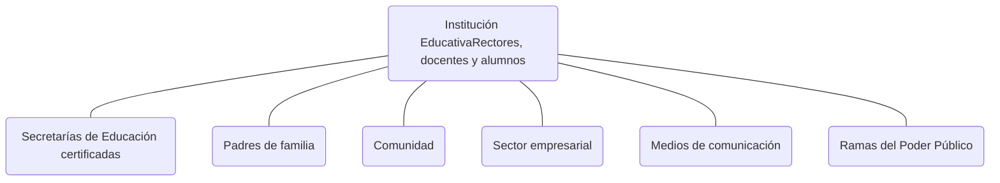

educación de calidad EL CAMINO PARA LA PROSPERIDAD logo

Ministerio de Educación Nacional República de Colombia logo
Ministerio de
Educación Nacional
República de Colombia

Presidencia República de Colombia logo
Presidencia
República de Colombia

Background pattern of stylized open books in yellow, blue, and red

# educación

# de calidad

EL CAMINO PARA LA PROSPERIDAD
# EDUCACIÓN DE CALIDAD PARA LA PROSPERIDAD

Nos hemos propuesto avanzar de la seguridad democrática a la prosperidad democrática. Sin embargo, no es posible pensar en prosperidad, si no comenzamos a hablar de educación, a actuar de manera decidida por mejorar la calidad educativa y a cerrar las brechas que impiden que esa educación de calidad sea recibida por todos los colombianos en condiciones de equidad.

Para alcanzar la prosperidad debemos emplearnos a fondo en combatir la pobreza, generando oportunidades y abriendo los espacios para que la creatividad y el talento de nuestra gente sea puesta al servicio del país y de su desarrollo humano y social. La primera de esas oportunidades debe ser la educación. En el capital humano está nuestra mayor riqueza. Nuestro deber es procurar su desarrollo y apostar por su presente con la seguridad de que allí está nuestra mayor inversión de futuro.

Es indudable que la fuerza que impulsa las locomotoras del crecimiento: infraestructura, vivienda, el agro, la minería y la innovación está en la gente y que el camino para alcanzar la prosperidad es la educación. Allí no sólo están los rieles que

nos permitirán conservar el rumbo sino los líderes que abrirán las nuevas rutas. De la formación de ese capital humano depende nuestro presente y el futuro de las próximas generaciones.

## Tres ejemplos nos ayudan a entender la complejidad del reto:

***¿Cuál es la calidad de la educación que reciben nuestros estudiantes?***

<mark>*La evaluación nos indica que tenemos que mejorar significativamente los resultados del aprendizaje.*</mark>

Nos comprometimos a trabajar por una Colombia unida, educada, justa e íntegra. Y no hay mejor lugar para empezar a trabajar en estos objetivos que las escuelas, colegios e instituciones de educación superior. Es indudable que estos espacios son el eje no sólo del sistema educativo sino de la construcción de democracia, de la formación ciudadana y del crecimiento del ser humano.

Son muchos los cambios que ha sufrido el sistema educativo en los últimos 15 años. Pero lo cierto es que el país y el mundo demandan cada vez con mayor fuerza una educación que permita desarrollar competencias para la vida y que atienda a las necesidades del contexto tanto regional como global.

Es una realidad que todavía en muchas de nuestras escuelas y colegios los proyectos educativos institucionales

educación de calidad EL CAMINO PARA LA PROSPERIDAD logo
desarrollan modelos educativos con base en prácticas pedagógicas tradicionales, basadas en la transmisión de conocimientos, su memorización por parte de los estudiantes y su repetición en las evaluaciones.

La profundidad del problema es tal que no resiste espera y ha sido develada por un sistema de evaluación, que ha venido incorporándose y adecuándose con lentitud en nuestras instituciones. Hace dos décadas no teníamos una herramienta capaz de darnos a conocer los logros en el aprendizaje de nuestros estudiantes ni mucho menos permitirnos una referencia de cómo estamos con relación a otros países en esta materia.

Gracias a las pruebas SABER, por ejemplo, sabemos que para el grado 5° y 9° hoy tenemos un alto índice de estudiantes del país ubicados en el nivel de desempeño insuficiente, lo que nos plantea un enorme reto en materia de calidad educativa.

Estos resultados nos muestran que si los resultados obteni- dos por los estudiantes en el sector oficial en los grados 5° y 9° en lenguaje son preocupantes, los de ciencias naturales son menos satisfactorios y los de matemáticas nos ponen en evidencia la dimensión del reto.

Es una alerta para todos, pero que en especial debe provocar la acción decidida de maestros, coordinadores y recto- res, quienes están llamados a comprender y transformar su trabajo. Una exigencia para las autoridades nacionales y regionales, buscando que las oportunidades de formación que desde los planes regionales y nacionales se propongan, estén más acordes con los requerimientos de los estudiantes actuales; y lo más importante, que la formación que se ofrezca esté en relación con las dificultades que encuentra un maestro diariamente en el aula.

educación de calidad EL CAMINO PARA LA PROSPERIDAD

### ¿Cómo vamos en la implementación de la política educativa para la primera infancia?

<mark>El 70% de los niños de 0 a 5 años, de población vulnerable, no tiene atención integral.</mark>

Es necesario concentrar nuestras acciones en los niños, en lo que ellos aprenden, en el potencial que pueden desarrollar, en lo grandes que pueden llegar a ser con lo que aprenden.

Actuar en educación exige comenzar por los más pequeños, por los niños menores de cinco años, edad en la cual se construye no sólo la personalidad y el carácter, sino se dan las mejores posibilidades para el aprendizaje, la exploración y el descubrimiento de las capacidades intelectuales, físicas y emocionales de los seres humanos. No podemos trabajar en calidad de la educación sino comenzamos por la raíz del árbol.

### ¿En qué estamos?

En Colombia hoy hay 4.280.363 niños menores de 5 años. De ellos el 52.43%, es decir 2.244.264 pertenecen a los niveles 1, 2 y 3 del SISBEN1.

1 Fuente DANE y Encuesta SISBEN corte noviembre de 2009.
De este total, a la fecha, sólo 537.457 niños menores de cinco años, es decir, el 23.94%, son beneficiarios de programas de atención integral liderados por el Ministerio de Educación Nacional, en alianza con el Instituto Colombiano de Bienestar Familiar. Y cuando hablamos de atención integral estamos incluyendo la atención en educación, salud, nutrición, cuidado y protección.

Esto quiere decir que en este momento 1.706.807 niños menores de cinco años no tienen acceso a una oferta integral de calidad. Esta realidad supone que las acciones que debemos implementar no sólo deben ser inmediatas sino inaplazables.

## ¿Cómo estamos asegurando la permanencia de todos nuestros estudiantes en el sistema educativo?

*Es intolerable el fracaso de los estudiantes de zonas rurales y poblaciones vulnerables que ingresan al sistema con la ilusión de culminar con éxito su estudio.*

Es cierto que durante los últimos ocho años el salto en materia de cobertura de la educación, es impresionante en todos los niveles. Sin embargo aún estamos en deuda con la población más vulnerable. Los niños más pobres en campos y ciudades; aquellos niños y jóvenes que han tenido que abandonar sus estudios por el desplazamiento y el conflicto armado; los grupos étnicos y fronterizos; y aquellos otros con discapacidad y necesidades especiales.

Lo anterior evidencia que la permanencia en el sistema continúa siendo precaria, en especial luego de la educación

media, donde un porcentaje cercano al 40% abandona el sistema antes de culminar la media. Si se toma la población de 18 años, se ve además un comportamiento diferencial por zonas, de 100 personas que ingresaron al sistema educativo, en la zona urbana el 16% ya ha desertado cuando alcanzan los 18 años de edad, mientras en la zona rural dicha cifra alcanza el 53%.

## ¿Y en educación superior?

*En educación Superior hay grandes retos de cobertura, acceso y permanencia:*

* El 68% de los bachilleres ingresan a estudios de educación superior.

* 45% de los estudiantes que ingresan, no completan sus estudios hasta graduarse.

* La cobertura en educación superior es del 37%.

## ¿Qué entendemos como una educación de calidad?

La política educativa del Gobierno de la Prosperidad, se fundamenta en la convicción de que una educación de calidad es aquella que forma mejores seres humanos, ciudadanos con valores éticos, respetuosos de lo público, que ejercen los derechos humanos, cumplen con sus deberes y conviven en paz.

educación de calidad EL CAMINO PARA LA PROSPERIDAD
Una educación que genera oportunidades legítimas de progreso y prosperidad para ellos y para el país. Una educación competitiva, pertinente, que contribuye a cerrar brechas de inequidad y en la que participa toda la sociedad.

A partir de esta definición de calidad, hemos trazado la política educativa y las principales acciones en las que debemos trabajar en este cuatrenio.

### Un esfuerzo que nos compromete a todos

Sabemos que muchos colombianos comparten este propósito. Nuestra responsabilidad es incuestionable, pero es fundamental continuar fortaleciendo alianzas con organizaciones de la sociedad civil y del sector privado en una agenda común:

Asegurar la calidad de la educación es urgente, no podemos dejar solos en la tarea a directivos, docentes, estudiantes y padres de familia. Es un esfuerzo de toda la sociedad y debe convertirse en un objetivo de país a corto, mediano y largo plazos.

El efecto de la educación está presente en nuestra vida cotidiana. Estamos llamados a generar oportunidades legítimas de vida, de progreso y de bienestar para nuestros niños y jóvenes.

Las reformas que estamos realizando en aspectos cruciales de la vida nacional son un acto pedagógico, que requieren la formación de quienes ejercerán su liderazgo.

La Ley de Tierras no será efectiva si no preparamos a nuestros jóvenes en los campos, si no les damos la oportunidad a los hijos de los desplazados de acceder a la educación.

educación de calidad EL CAMINO PARA LA PROSPERIDAD

Las reformas en materia política y el estatuto anticorrupción, no provocarán efectos en nuestra sociedad mientras no desarrollemos en nuestros niños y jóvenes la capacidad de participar democráticamente en la construcción de un mejor país.

No podemos pensar en desarrollar la minería y abrir nuestras puertas a la inversión, si no formamos el capital humano necesario.

No podemos pensar en un país que valora sus recursos naturales, si desde nuestras escuelas no enseñamos a los niños a conocer y explorar el medio ambiente, a defenderlo y protegerlo.

Es cierto que nunca serán suficientes los recursos para la educación. El gobierno nacional hará su aporte, pero se requiere que los gobiernos regionales y locales hagan lo propio y la incluyan en sus planes y programas territoriales.

Al Congreso de la República le corresponde fortalecer las leyes y distribuir de mejor manera el presupuesto, aumentando los recursos y diversificando las fuentes de financiación de la educación pública. Pero también profundizar los argumentos y las reflexiones, lo cual además de ser una acción política es también una acción pedagógica para las futuras generaciones.

La justicia, representada en cada una de las cortes y de los organismos públicos, debe ejercer su función y operar según los más altos preceptos constitucionales, para que la legalidad, el orden, el rigor y el vigor se impongan en el imaginario de nuestros estudiantes a la cultura de lo fácil, el camino corto y la impunidad.

Necesitamos que nuestros empresarios practiquen la innovación y le abran las puertas al talento y la creatividad de nuestra gente en sus empresas.
*Necesitamos trabajar de la mano con otros países para inter-cambiar saberes y experiencias y para cooperar en un asunto que se ha convertido en uno de los objetivos del milenio contra la pobreza.*

*Para alcanzar nuestras metas se requiere el desarrollo de acciones conjuntas sobre el sector educativo con aliados de otros sectores de gobierno, del sector privado desde la responsabilidad social empresarial y de las organizaciones inter-agenciales y no gubernamentales.*

*Es necesario incrementar los esfuerzos de movilización social y el trabajo con la comunidad educativa.*

*Es fundamental que todos se vinculen al proceso educativo mediante el ejercicio del control social a la administración de la educación en los niveles nacional, regional y local, demandando la rendición de cuentas y exigiendo a candidatos y autoridades la inclusión de la educación en sus planes y programas de Gobierno.*

educación de calidad EL CAMINO PARA LA PROSPERIDAD logo

educación de calidad EL CAMINO PARA LA PROSPERIDAD logo

La educación en Colombia ha alcanzado cinco grandes logros, que son la base de una educación de calidad para la prosperidad:

1 **Aumento de la cobertura en todos los niveles educativos:** más de 1.3 millones de nuevos estudiantes en educación básica y media para un total de 11.3 millones de niños y niñas en el sistema.

2 **Construcción y mejoramiento de la infraestructura del sector:** inversión de $1.2 billones en la construcción de 12.732 aulas que benefician a 649 mil niños.

3 **Consolidación del Sistema Nacional de Evaluación de la Calidad:** que evalúa a los estudiantes a través de las pruebas de estado e internacionales; a la educación Superior mediante los ECAES y el registro calificado para los programas de pregrado; y a los docentes por medio de las evaluaciones para ingreso y ascenso.
Icono 4

**4 Incremento en la conectividad con el acceso a nuevas tecnologías en las Instituciones Educativas:** 87% de la matrícula conectada (1 computador por cada 21 estudiantes).

Icono 5

**5 Modernización:** del MEN y de las 94 Secretarías de Educación de las Entidades Territoriales Certificadas. Creación e implementación de sistemas de información para articular los procesos a nivel nacional y territorial.

Sin embargo, todavía hay grandes brechas de inequidad que el país tiene que disminuir. Estas brechas se localizan en:

* Calidad
* Acceso y permanencia en el sistema
* Desigualdades regionales
* Analfabetismo
* Niños en primera infancia sin atención integral
* Cobertura y pertinencia en educación superior.

## Énfasis de la política educativa

La política educativa del Gobierno de la Prosperidad centra su acción en el mejoramiento de la calidad de la educación y hace énfasis en:

* Atención integral a la primera infancia.
* Cierre de brechas con un enfoque regional.
* Innovación y la pertinencia.
* Mejoramiento de la gestión educativa.

Logo educación de calidad

## PRIMERA INFANCIA

**¿Cómo vamos a trabajar en la atención integral a la primera infancia?**

Un millón de niños entre 0 y 5 años con atención integral.

Nos proponemos ampliar la cobertura de la atención integral entre 0 y 5 años (universo 2'250.000).

Para actuar en educación es necesario concentrar nuestras acciones en los niños, en lo que ellos aprenden, en el potencial que pueden desarrollar, en lo grandes que pueden llegar a ser con lo que aprenden.

Actuar en educación exige comenzar por los más pequeños, por los niños menores de cinco años, edad en la cual se construye no sólo la personalidad y el carácter, sino se dan las mejores posibilidades para el aprendizaje, la exploración y el descubrimiento de las capacidades intelectuales, físicas y emocionales de los seres humanos. No podemos trabajar en calidad de la educación sino comenzamos por la raíz del árbol.

## ¿Cuál es nuestra meta en la atención integral a la primera infancia?

* Atender integralmente un millón de niños menores de 5 años, incorporando al sistema educativo 523.000 niños que aún no la reciben.
# ¿Cuáles serán nuestras estrategias y acciones para cumplir esta meta?

* Implementar el modelo de gestión interinstitucional a nivel nacional y territorial.

* Construir lineamientos pedagógicos para una educación inicial diferencial y de calidad para la primera infancia.

* Construir y adecuar ambientes educativos pertinentes para la atención integral a la primera infancia.

* Formar y cualificar a los agentes educativos que trabajan en educación inicial.

## CALIDAD

## ¿Cómo vamos a mejorar la calidad educativa?

La calidad de la educación: un propósito nacional.

Mejorar la calidad de la educación, es una tarea prioritaria que debemos asumir en conjunto con todos los estamentos de la sociedad. Debemos hacer de la calidad un propósito nacional. Hacer las cosas bien toma tiempo. No nos llamemos a engaños. Asegurar la calidad de la educación nos tomará no sólo esta sino varias administraciones y generaciones. Pero posponer esta tarea puede condenarnos al atraso irremediable en todos los frentes de desarrollo del País. Nuestra intención es prender los motores.

educación de calidad EL CAMINO PARA LA PROSPERIDAD

# ¿Cuáles son nuestras metas en calidad?

* El 25% de los estudiantes evaluados en las Pruebas SABER 5° mejorará el nivel de logro, respecto al año anterior.

* El 100% de los Establecimientos de bajo logro en pruebas Saber (2009) 5° y 9° será acompañados en el desarrollo de los planes de mejoramiento.

* Reduciremos el analfabetismo en la población de más de 15 años del 6.7% al 5.7%.

* Todos los programas técnicos y tecnológicos tendrán registro calificado.

* Todos los programas de formación para el trabajo tendrán registro calificado (9.700 programas)

## ¿Cuáles serán nuestras estrategias y acciones para mejorar la calidad de la educación?

* Fortalecer el desarrollo de las competencias básicas, genéricas, específicas y ciudadanas en los niños y jóvenes.

* Consolidar el sistema nacional de evaluación de la calidad (estudiantes, docentes, programas e instituciones).

* Plan Nacional de formación docente y de directivos docentes para su actualización y fortalecimiento de competencias.
* Acompañar y fortalecer académicamente instituciones y estudiantes con bajo logro.

* Implementar programas para el uso de tiempo libre (jornada extendida, jornada complementaria).

* Crear el sistema de aseguramiento y fomento de la calidad en prestadores de primera infancia, instituciones educativas de básica y media, instituciones y programas de formación para el trabajo y fortalecer el de establecimientos privados de preescolar, básica y media.

* Consolidar el sistema de aseguramiento y fomento de la calidad en educación superior.

# CERRAR BRECHAS

**¿Cómo vamos a disminuir las brechas de inequidad?**

<mark>Oportunidades de acceso y permanencia en el sistema educativo.</mark>

Cerrar brechas de inequidad, significa generar oportunidades de acceso y permanencia en el sistema educativo, con un enfoque regional.

**¿Cuáles son nuestras metas en el cierre de las brechas con un enfoque regional?**

* Crearemos 600.000 nuevos cupos en Educación Primaria, Básica y Media.

educación de calidad EL CAMINO PARA LA PROSPERIDAD logo

* Reduciremos la deserción en Educación Básica y Media del 5.2% al 3.8%.

* Llegaremos a una cobertura del 47% y crearemos 480.000 nuevos cupos en educación superior.

**¿Cuáles serán nuestras estrategias y acciones para cerrar las brechas con un enfoque regional?**

**Ampliación de la oferta focalizada:**

* Redefinir tipologías para asignación del SGP.

* Ampliar y fortalecer la regionalización y la flexibilidad de la oferta de educación superior.

* Fomentar la oferta de formación técnica profesional y tecnológica.

* Fortalecer la financiación de la educación (SGP, Ley 30 y Regalías)

* Consolidar el sistema de aseguramiento y fomento de la calidad en educación superior.

**Incentivo de la permanencia en las regiones con mayor deserción:**

* Realizar acciones focalizadas: transporte escolar, alimentación escolar.

* Crear incentivos por disminución de deserción.
• Realizar un Acuerdo Nacional para reducir la deserción en educación superior.

• Fortalecer los procesos de articulación entre todos los niveles educativos.

• Ampliar créditos ICETEX y esquemas alternativos.

# INNOVACIÓN Y PERTINENCIA

**¿Qué nos proponemos?**

*Nuestro objetivo es educar con pertinencia para la innovación y la prosperidad.*

**¿Cuál es nuestra meta en innovación y pertinencia?**

Triplicaremos los contenidos educativos virtuales de uso público en el país (67.000 nuevos contenidos, hoy contamos con 33.000).

**¿Cuáles serán nuestras estrategias y acciones en innovación y pertinencia?**

• Crear el Sistema Nacional de Innovación Educativa (Formación de docentes innovadores y generación de contenidos educativos digitales, Proyecto con Corea)

• Articular la educación media con la superior y la educación para el trabajo.

educación de calidad EL CAMINO PARA LA PROSPERIDAD logo

• Fortalecer la investigación e innovación en la educación superior con el apoyo de Colciencias.

• Hacerle seguimiento a la pertinencia de egresados del sector (Observatorio Laboral).

• Promover la Internacionalización de la educación en todos los niveles (Movilidad de estudiantes y docentes, currículos, reconocimiento de títulos y acreditación).

• Ampliar el plan de formación docente en inglés.

# GESTIÓN EDUCATIVA

**¿Cómo vamos a fortalecer la gestión educativa?**

*La educación: modelo de gestión y administración pública.*

Nos hemos propuesto convertir al sector educativo en modelo a seguir en materia de gestión y administración pública. Si nosotros mismos no somos ejemplo de buen gobierno; si desde las Secretarías de Educación, las instituciones educativas y las instituciones de educación superior no nos convertimos en modelo de transparencia y pulcritud en el manejo de los asuntos y recursos públicos; si no practicamos una autoridad basada en el respeto, la tolerancia y la justicia, no podemos pedirle a nuestros niños y jóvenes que aprendan y practiquen estos valores.
# ¿Cuál es nuestra meta en el fortalecimiento de la gestión educativa?

# La Calidad de la Educación es un propósito nacional

Duplicaremos el número de Secretarías de Educación con certificación de calidad de al menos 3 procesos (49 nuevas Secretarías con esta certificación, hoy son 46).

## ¿Cuáles serán nuestras estrategias y acciones para fortalecer la gestión educativa?

* Fortalecer el modelo de gestión por procesos en el Ministerio de Educación y posicionarlo como entidad líder en gestión pública en Colombia y en Latinoamérica.

* Diseñar mecanismos eficaces para asignación, distribución, seguimiento y control de recursos financieros para la prestación del servicio educativo.

* Fortalecer sistemas de información del sector educativo y promover su uso.

* Promover el buen gobierno en las instituciones del sector.

* Fortalecer los mecanismos de inspección, vigilancia y control en todos los estamentos del sector.

educación de calidad EL CAMINO PARA LA PROSPERIDAD
# EDUCACIÓN PARA LA PROSPERIDAD

## Pacto Nacional por el mejoramiento de la calidad educativa

Entendemos que una educación de calidad es "aquella que forma mejores seres humanos, ciudadanos con valores éticos, respetuosos de lo público, que ejercen los derechos humanos, cumplen con sus deberes y conviven en paz. Una educación que genera oportunidades legítimas de progreso y prosperidad para ellos y para el país. Una educación competitiva, pertinente, que contribuye a cerrar brechas de inequidad y en la que participa toda la sociedad".

Nos comprometemos a trabajar desde nuestro campo de acción, a aportar lo que esté a nuestro alcance y nos corresponda, y a acompañar de manera activa y participativa el logro de este propósito nacional.

Aceptamos formar parte del grupo de entidades y organizaciones que recibirán información permanente y serán convocadas en los planes y proyectos impulsados para el desarrollo de esta política.

Y hacemos pública nuestra voluntad y decisión de formar parte de este propósito nacional del mejoramiento de la calidad de la educación.

Para constancia se firma el 10 de noviembre de 2010

### Firma

* **Nombre**:
* **Cédula**:
* **Organización o entidad**:
* **Cargo**:
* **Correo electrónico**:

educación de calidad EL CAMINO PARA LA PROSPERIDAD logo
