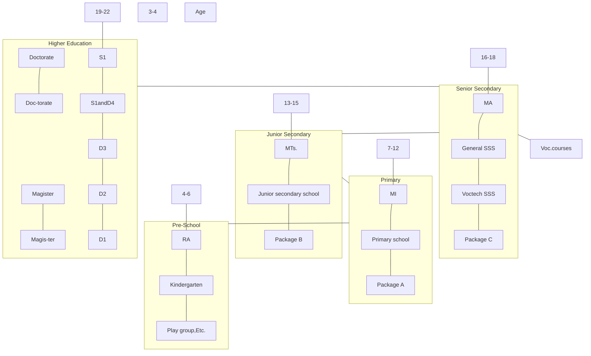
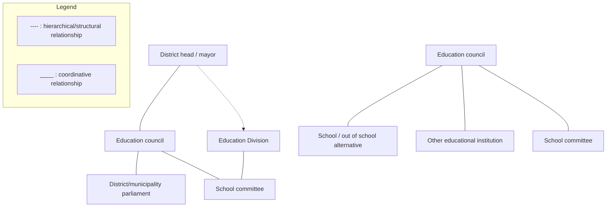

Illustration of two figures holding a book

# National Plan of Action: INDONESIA'S EDUCATION FOR ALL

2003 - 2015

NATIONAL COORDINATION FORUM
EDUCATION FOR ALL
2003

Tut Wuri Handayani logo
## Team of EFA authors

**Editors:**

Fasli Jalal, Ph.D.
Nina Sardjunani, MA
Bachrudin Musthafa, Ph.D.
Agung Purwadi, DEd
Suharti, MA

**Chapter I: General Condition of Education Sector Development in Indonesia**

Fasli Jalal, Ph.D.
Nina Sardjunani, MA
Agung Purwadi, DEd

**Chapter II: Early Child Care and Education**

Dr. Gutama
Fasli Jalal, Ph.D.

**Chapter III: Basic Education**

Indra Djati Sidi, Ph.D.
Hamid Muhammad, DEd

**Chapter IV: Literacy and ContinuingEducation**

Nina Sardjunani, MA
Ekodjatmiko Sukarso, MM, MCom., MD
Agung Purwadi, DEd.
Emmy Suparmiyatun, MPM
Suharti, MA

**Chapter V: Life Skills**

Giri Suryatmana, MSc.
Sudrajat Rasyid

**Chapter VI: Gender Equity in Education**

Nina Sardjunani, MA
Suharti, MA

**Chapter VII: Quality of Education**

Bahrul Hayat, Ph.D.

**Chapter VIII: EFA Finance**

Walter W. McMahon, PhD.
Suharti, MA
iii

## Table of Contens

Table of Contens ................................................................................................................................. iii

Chapter I.
**General Condition of Education Sector Development**
**in Indonesia ................................................................................................................................. I.1**
A. Indonesia at a glance ................................................................................................................ I.3
B. General condition of economic and human resources ........................................................ I.5
1\. Decades of transformation ................................................................................................. I.5
2\. Employment ........................................................................................................................ I.6
3\. Poverty ................................................................................................................................. I.7
4\. Impact of the Crisis ............................................................................................................ I.7
5\. Human resources condition in general ........................................................................... I.9
C. Decentralization of Public Administration
and Democratisation of Education ........................................................................................ I.10
D. Education Sector in Indonesia ................................................................................................ I.13
1\. The Education Delivery System in Indonesia and
Its Organizational Structure ............................................................................................. I.14
2\. Establishment of education council and school committee ........................................ I.16
3\. Educational service provision .......................................................................................... I.17
4\. Education Finance .............................................................................................................. I.19
Chapter II
**EARLY CHILDHOOD EDUCATION AND CARE** II. 1
A. Introduction II. 1
B. Situational Analysis of Early Childhood Services, Care, and Education II. 5

1. Dakar Target II. 5
2. Indicators II. 6
3. Early Childhood Care Services and Education Programs II. 7
4. Performance for the Year 2001 II. 16
   National Action Plan Program II. 25
   Funding Sources II. 26

Chapter III
**BASIC EDUCATION** III. 1
**I. INTRODUCTION** III. 3
A. BACKGROUND III. 3
B. GOALS III. 5
**II. PRESENT CONDITION OF BASIC EDUCATION IN INDONESIAN.**
PRESENT CONDITION OF BASIC EDUCATION IN INDONESIA III. 5
A. Increase of Education Accessibility and Provision
of More Learning Opportunities III. 5

1. Participation Rates III. 5
2. Grade-repeater Rates III. 6
3. Drop-out Rates III. 8
4. Graduation Rates III. 10
5. Continuing Rate (Rate of Students' Continuing to SMP/MTs.) III. 11
6. Completion Rate III. 14
   B. Improvement Aspects in Educational Quality III. 15
7. Index of National Exit Exam III. 15
8. Student-Teacher Ration and Student-Class Ratio III. 18
9. The ratio of Class-Classroom and Laboratory-School III. 21
10. Teacher Qualified-ness III. 23
11. Physical Condition of School Building III. 24
INDONESIA'S EDUCATION FOR ALL

C. ACCESS FOR GIRLS AND CHILDREN WITH SPECIAL NEEDS III.26

1. Educational Access for Girls III.26
2. Educational Access for Children with Special Needs III.27

III. PROGRAM FOR THE FINALIZATION OF THE 9-YEAR COMPULSORY EDUCATIONIII. PROGRAM FOR THE FINALIZATION OF THE 9-YEAR COMPULSORY EDUCATION III.28

A. Policies of Finalization of The 9-Year Compulsory Education in Indonesia III.28
B. Target III.29
C. Implementation Strategies III.31
D. Program for The Finalization of The 9-Year Compulsory Education III.32

1. Opening up more Access and Opportunities for Education III.32
2. Enhancing Education Quality and Relevance III.33
3. Improving the Efficiency of Educational Management III.34
   E. Financing Basic Education III.37

IV. MONITORING AND EVALUATION OF THE FINALIZATION OF THE 9-YEAR COMPULSORY EDUCATION PROGRAMIV. MONITORING AND EVALUATION OF THE FINALIZATION OF THE 9-YEAR COMPULSORY EDUCATION PROGRAM III.41

A. Principles of Monitoring And Evaluation III.41
B. Working Mechanism for The Implementation of Monitoring and Evaluation of the 9-Year Compulsory Education III.42

Chapter IV

**LITERACY EDUCATION IV.1**

A. Introduction IV.3
B. National Implementation in the Year 2000 IV.4

1. Current Literacy Condition IV.4
2. The Rise of Literacy Rates from Time to Time IV.5
3. Diverse Literacy Rates IV.9
4. Continuous Education for all Adults IV.15
   D. Action Plan IV.18
   Projection of Indonesia's population in 2015 IV.18
5. Targets for Illiteracy Rate Decline IV.22
6. Targets of Literacy Education IV.23
3. Targets of Equivalent Education IV.24
4. Policy IV.24
5. Strategies IV.25
6. Activities IV.27
   **E. Funding** IV.30
   a. Required funds for literacy education IV.30
   b. Required fund for adults' equivalent education IV.31

Chapter V
**LIFE SKILLS** V.1
**NATIONAL PLAN OF ACTION TEAMWORK**
**LIFE SKILLS EDUCATION** V.3
I. Introduction V.3
II. GENERAL DESCRIPTION V.4
A. Recent condition V.4
B. Problems with Indonesian human resources V.4
III. NATIONAL PLAN OF ACTION V.7
A. National policy of life skills education V.7
B. Policy strategies in life skills education V.8
C. Action Program V.10
IV. SUMMARY OF ACTION PLAN (2003 – 2005) V.20

1. General overview V.20
2. Special overview V.20
3. Stages of life skills program implementation V.21

Chapter VI
**GENDER - EQUITY EDUCATION** VI.1
**A. Introduction** VI.3
**B. National Performance in 2000** VI.4

1. Access to education VI.4
2. Quality and Relevance VI.21
3. Management VI.21
   **C. Recommendation** VI.21
vii

**D. National Plan of Action** VI.22

1. **Policies** VI.22
2. **Strategies** VI.22
3. **Targets** VI.23
4. **Priority Targets** VI.25
5. **Main Activities** VI.27

**Chapter VII**
**Quality of Education** VII.1
**A. Introduction** VII.3
**B. Indicators in use** VII.4

1. **Indicators of educational input** VII.4
2. **Indicators of educational output** VII.4
   **C. THE CONDITION OF EDUCATIONAL QUALITY** VII.5
3. **Access to textbooks** VII.5
4. **Qualification of teachers** VII.7
5. **Adequacy of school and library** VII.10
6. **Academic achievement** VII.11
   **D. Discrepancy with Dakar's input** VII.23
7. **Quality of input** VII.23
8. **Quality of output** VII.24
9. **Quality of outcome** VII.24
   **E. ACTION PLANE** VII.24

**Chapter VIII**
**Financing and Achieving Education For All Goals** VIII.1
**A. Introduction and Overview** VIII.3
**B. Significance** VIII.5
**C. Principles for Costing** VIII.7
**D. Annual Costs of EFA Primary Education Goals, 2003/4 - 2014/5** VIII.12
**E. Annual Costs of Junior Secondary 'Education for All' Goals** VIII.21
**F. Annual Costs of EFA Literacy and Continuing Education Goals** VIII.24
G. Financing Sources: Fiscal Capacity VIII.38
H. Conclusions and Recommendations VIII.43

**References 1**
General Condition of Education Sector Development in Indonesia

Chapter I

National Plan of Action: INDONESIA'S EDUCATION FOR ALL

I.3

## Chapter I. General Condition of Education Sector Development in Indonesia

### A. Indonesia at a glance

Indonesia is the largest island nation in the world. Its 17,000 islands form an archipelago that bridges the continents of Australia and Asia. The

total landmass, which includes five major islands, is 2 million square kilometres. Indonesia is the fourth most populous country in the world after China, India, and the United States. In 1999, its estimated population was 210 million, up from 179 million in 1990. The average annual rate of population growth was 2.1 percent during the 1980s, but it declined to 1.5 percent by 1999. The rate is projected to decline slightly further to 1.4 percent by 2005. In absolute terms, this means that the Indonesian population grew by around 3.2 million persons per year between 1990 and 1998, and will increase by roughly 3 million annually until 2005.

By year 2001, children below the age of five will number 22 million, or 10 percent of the population and the school-age children (5 to 14 years) will number 40 million, or 19 percent of the total population. Today, one in every five Indonesians is a teenager, and, in 2001, the number of adolescents will be 44 million. As Indonesia's population is aging, children under age 15 as a percentage of the total population have decreased from 44 percent in 1971 to 36 percent in 1990; while in 2001, children under 15 years of age will account for just 29 percent of the population.

Java and Bali are home to 60 percent of the total population, but represent only 7 percent of the total land area of the country. The Eastern islands that comprise Nusa Tenggara, Sulawesi, The Mollucas and West Papua support 21 percent of the population, but account for 69 percent of the country's land area.
General Condition of Education Sector Development in Indonesia

I.4

From 1971 to 1990 (when the latest National census was conducted), annual urban growth rates were consistently double those of the total population.

Indonesia has the largest number of Muslims as of any country. Its population is made up of 300 ethnically distinct groups who speak a multitude of local languages and practice four major religions (Islam, Christianity, Buddhism and Hinduism). Divided into 26 provinces, Indonesia derives its identity from both regionality and heterogeneity. Whether in economic, geographic, religious, cultural or ethnic terms, Indonesia has a pronounced diversity.

The country's heterogeneity was heavily influenced by centuries of trade with Indians, Chinese, Arabs and much later with Europeans, who introduced a variety of religions, languages, customs and other forms of material expression that are manifested in the country's diverse ethnic cultures. Although local languages are still used in many areas, a National language based on Malay has been the official language since the country's Independence. According to the 1990 census, 87 percent of the people are Muslim. While Islam and other formal religions are practiced, however, many groups continue their adherence to customary beliefs, tradition, and laws, known as adat. Practices relating to marriage and divorce, inheritance and land resource management are often still governed by adat law.

From roughly the seventh to the 14th century, Indonesia had a number of powerful Hindu-Buddhist kingdoms like Sriwijaya and Majapahit that exerted influence throughout Southeast Asia. Beginning in the 15th century, Islam gained dominance. The 16th century saw the arrival of Europeans, mainly Portuguese and Dutch, who competed to capture the lucrative spice trade routes. The Dutch emerged victorious and gained sovereignty over the islands known as the Dutch East Indies for 350 years, ( except for brief interludes of control by the British during Napoleonic Wars and by the Japanese during World War II) until Independence was declared in 1945.

The first two decades of post-independence under President Soekarno (known as old order) were focused on unifying the country politically. However, economic and social conditions were difficult; for most people, the life span was short, disease was prevalent and food was in short supply. In 1965 a coup by alleged communist forces was suppressed, a period of anarchy and conflict followed in which thousands of people were killed. General Soeharto took command and enforced military rule, generally known as New Order.

After being elected President by the country' provisional parliament in 1968, Soeharto embarked on efforts to strengthen and stabilize the economy. Social development programs aimed at improving food self-sufficiency and expanding education and health services, matched by long-term schemes for exploitation of natural
National Plan of Action:

INDONESIA'S EDUCATION FOR ALL

I.5

resources such as oil and minerals. This strategy led to more than two decades of much-heralded social and economic achievements.

Today, however, with the erosion of government spending for social pro- grams and widespread poverty stemming from the current economic crisis has, at least temporarily, undermined the decades of progress. Combined with grow- ing disillusionment about exploitations of the "New Order" regime, the crisis led to massive protest and rioting that forced out Soeharto from office on 21 May 1998. A reform movement and calls for a more open and democratic system by an increasingly better informed and self-confident polity led to the country's first multi - party freely contested election in nearly 40 years on 7th June 1999. A dramatic Presidential contest in the National legislature in October and elec- tion of a credible reform administration and cabinet under President Abdurrahman Wahid and Vice-President Megawati Soekarnoputri followed this election.

In 2001 the House of Representative appointed Vice President Megawati to be the President of the Republic of Indonesia to continue reforming the government.

### B. General condition of economic and human resources

#### I. Decades of transformation

Indonesia's economic achievement over the final three decades of the twentieth century is evident in the growth rates shown in Figure 1. For much of the period between the second half of the 1950s and the end of the 1960s annual growth averaged only 2% - less than the rate of increase in population. Indonesia remained a predominantly agricultural economy. The government had made some efforts to promote heavy industry behind tariff barriers within an elaborate regu- latory framework. But this had produced scant results: by the mid - 1960s manu- facturing still only accounted for 10% of GDP. At this point per capita income was less than $50 per year - placing Indonesia firmly in the ranks of the world's least developed countries.

By 1966 inflation approached 640% and the economy was deep in crisis. This also signalled a geographical shift in the economy's centre of gravity to- wards the major industrial centres. By the early 1990s the lion's share of Indonesia's modern industry, and much of its infrastructure, was to be found in Java's three metropolitan areas - Greater Jakarta, Bandung, and Greater Surabaya. Which generated around 60% of the country's non-oil and gas manufacturing revenues? Labour-intensive industry expanded rapidly in the early- 1980s, following trade liberalization in 1983 and a 28% devaluation of the rupiah. Between 1982 and 1984, earnings from the labour-intensive sector, which includes clothing, woven
Long-term real GDP growth (1951-2000)

| Year | GDP growth (%) |
|---|---|
| '50 |  |
| '52 | 6.2 |
| '54 | 6.5 |
| '56 | 3.0 |
| '58 | -3.5 |
| '60 | 6.0 |
| '62 | 1.8 |
| '64 | 3.5 |
| '66 | 2.5 |
| '68 | 11.0 |
| '70 | 7.0 |
| '72 | 9.5 |
| '74 | 7.5 |
| '76 | 7.0 |
| '78 | 8.0 |
| '80 | 9.5 |
| '82 | 2.0 |
| '84 | 6.5 |
| '86 | 6.0 |
| '88 | 5.8 |
| '90 | 9.0 |
| '92 | 7.5 |
| '94 | 8.0 |
| '96 | 7.8 |
| '98 | -13.5 |
| '00 | 4.8 |

Note: 1960-65 from 1960 weights, 1978-93 from 1983 weights and 1994-99 from 1993 weights.

Source: Woo, Glassburner and Nasution (1994) and BPS

fabrics, footwear, furniture, toys and sporting goods increased from $323 million to $826 million; and by 1992 they had reached $9,963 million. Meanwhile the traditional labour-intensive industries such as food processing that were geared largely towards local demand became steadily less important – between 1975 and 1991 they fell from 41% to 25% of total industrial output.

#### 2 Employment

Despite the shift towards manufacturing and labour-intensive industries, agriculture remained a vital source of employment. Throughout the 1980s it continued to employ over 50% of the population. As Figure 2 indicates, it was only towards the end of the 1980s, with the rise of labour-intensive manufacturing industry, that agriculture's share began to fall – from 55% in 1985 to 50% in 1990 and to 44% by the late 1990s. This means that even today around 35 million Indonesians work in agriculture, with another 17 million in trade and restaurants.

Employment by sector

| Year | Agriculture (%) | Manufacturing (%) | Other (%) |
|---|---|---|---|
| 1990 | 50 | 10 | 40 |
| 1992 | 48 | 12 | 40 |
| 1994 | 46 | 13 | 41 |
| 1996 | 44 | 14 | 42 |
| 1998 | 44 | 13 | 43 |

National Plan of Action: I.7
INDONESIA'S EDUCATION FOR ALL

#### 3. Poverty

Perhaps the most powerful indicator of Indonesia's achievement in human development is the degree of poverty reduction. The trend is shown in Figure 3. There has been some controversy about the calculation of the poverty line, notably about whether it adequately reflects non-food consumption. And in 1996 BPS changed the poverty line to take this into account. Recalculating the figure for 1996 increased the estimate of the proportion living in income poverty from 11% to 18%. Applying the same criteria to previous years would have shifted the line up by a similar amount. Even applying this correction, however, the period 1970-96 clearly produced a steep decline in poverty. This is a commendable result, but there are some qualifications. The first is that in Indonesia many people are clustered just above the poverty line, so a marginal change in the poverty criteria would push even more people into poverty. The second that this outcome was probably more a by-product of economic growth than a deliberate strategy of poverty alleviation. The third is that, by the late 1980s and early 1990s, the reduction in poverty was tapering off because growth was by then being concentrated in the more capital-intensive industries that absorbed fewer workers. What is more poverty is much severe for those who are at the very bottom end of the income/expenditure distribution and significantly below the poverty line. For example, 22.4 % of households in the lowest quintile of the expenditure distribution have children without basic education as opposed to the national figure of 12.5 %. Likewise the ratios of access of the poorest section of the population to that of the richest to adequate water sources, adequate sanitation and electricity are 0.33, 0.18 and 0.71, respectively. A broader measure of poverty that is HPI (Human Poverty Index) which is measured by access to safe water, education and health care chorus that it fell from 27.6% in 1990 to 25.2% in 1995, and kept steady at this level until 1998. Within Indonesia the HPI ranges from a high of 47.7% in the district of Jaya Wijaya in Irian Jaya, to a low of only 8.3% in North Jakarta.

#### 4. Impact of the Crisis

Despite variations in estimates by various researchers and BPS, they all indicate a rapid rise in the incidence of poverty during the crisis. BPS estimates show that the incidence of poverty rose from 19% in February 1996 to 37% in September 1998 at the height of the crisis. The increase in poverty in the urban areas was more marked than in rural areas. However, there two aspects here - inflation-induced and recession-induced (loss of job) increases in poverty. Since the BPS measure of the poverty line is consumption-based, it is sensitive to the
Relationship between rank of HDI & GDI, 1990 and 1996

| Province | GDI | HDI |
|---|---|---|
| 1 | 11 | 11 |
| 2 | 2 | 2 |
| 3 | 2 | 2 |
| 4 | 4 | 4 |
| 5 | -3 | -3 |
| 6 | -4 | -4 |
| 7 | -8 | -8 |
| 8 | -8 | -8 |
| 9 | 4 | 4 |
| 10 | 2 | 2 |
| 11 | 4 | 4 |
| 12 | 2 | 2 |
| 13 | 5 | 5 |
| 14 | 6 | 6 |
| 15 | -2 | -2 |
| 16 | 12 | 12 |
| 17 | 6 | 6 |
| 18 | -2 | -2 |
| 19 | -2 | -2 |
| 20 | 3 | 3 |
| 21 | -16 | -16 |
| 22 | -4 | -4 |
| 23 | -4 | -4 |
| 24 | 4 | 4 |
| 25 | 8 | 8 |
| 26 | 3 | 3 |

loss of purchasing power due to both inflation and recession. Once inflation was brought under control, the incidence of poverty declined to 23% in February 1999. But the incidence of poverty is likely to remain high so long as people at the bottom end do not find employment on a durable basis. The crisis also caused sharp increases in the severity of poverty. One estimate shows that between February 1996 and February 1999

the number of people falling below 65% of the poverty line increased by 73% and 63% in urban and rural areas respectively. More recent data show that the urban severity index dropped back to the pre-crisis level, although the rural severity index remained above the pre-crisis level.

Table I
Population below selected poverty lines, 1996-99

Table I shows how this translates into the actual number of people below the poverty line - and also the percentage increase for different population groups. This highlights first how the proportional increase in people below the poverty line was much greater in urban than rural areas. This table also looks at the very poorest - those living below 80% of the pov-

|  | February | Change |  |  |
|---|---|---|---|---|
|  | 1996 | 1999 |  |  |
|  | Millions | Millions | Millions | % |
| Below standard poverty line |  |  |  |  |
| Urban | 11.1 | 19.1 | +8.0 | +73% |
| Rural | 26.6 | 36.7 | +10.1 | +38% |
| Total | 37.7 | 55.8 | +18.1 | +48% |
| Below 80% of poverty line |  |  |  |  |
| Urban | 5.1 | 9.0 | +3.9 | +78% |
| Rural | 12.8 | 17.4 | +4.6 | +36% |
| Total | 17.9 | 26.3 | +8.5 | +47% |
| Below 65% of poverty line |  |  |  |  |
| Urban | 1.8 | 3.1 | +1.3 | +73% |
| Rural | 3.8 | 6.3 | +2.4 | +63% |
| Total | 5.6 | 9.4 | +3.7 | +66% |

Source: Dhanani and Islam (2000)

erty line. The proportional increase of those below 80% was roughly similar to the total figure, but it seems that those below 65% in the rural areas were hit harder - with a 63% increase in their total numbers as opposed to a 38% over all increase in rural poor. Estimates based on the mini-Susenas of December of 1998 of some robust measures of inequality such as the Gini ratio, the Theil index and the L-index show that inequality fell during the economic crisis. This finding is consistent with the trend observed during the past Latin American economic
I.9

INDONESIA'S EDUCATION FOR ALL

crises. However, more recent evidence suggests that the findings of a decline in inequality during the crisis failed to distinguish between nominal inequality and changes in the distribution of income adjusted for the differential impact of inflation on poor and non-poor households. In any case, data for mid-1999 indicates that whatever decline there has been in inequality during the crisis, it has been reversed. It is too early to offer an assessment of the long-term consequences of the crisis on such aspects as health and education as it takes time for these effects to surface. If the incidence of poverty remains high, its long-term effects on basic health and education will be quite adverse. Thus, while much of the gains in human development during the rapid growth phase remained by and large unaffected by the crisis, it cannot be guaranteed to remain so.

In response to the crisis, GOI took several steps to deal with the crisis through Social Safety Net program. The purpose of Social Safety Net program is (i) to mitigate the adverse impact of the crisis to the poor and (ii) to sustain the investment level of basic social services especially to the poor. The fundamental principle for Social Safety Net program is as follows. First, keeping children of the poor families in schools through a scholarship program for primary, junior secondary and senior secondary levels. Second, preventing the deterioration of education quality by providing block grants to primary and junior secondary at poor areas.

#### 5. Human resources condition in general

There are various indicators that may be used to show the dynamic tendency of human resources development in Indonesia. One of them is the *Human Development Index* (HDI). Analysis for HDI changes may be done through two ways. The first way is time series analysis of HDI changes of a country and second, inter-country comparison of HDI of about the similar years. Furthermore the comparison may be conducted through two ways, i.e. comparing the indices directly and to develop rank of indices of several countries.

Time-series analysis revealed that Indonesia's HDI grew significantly since 1975. HDI consistently increased from .465 to .684 in 2000. The rate of increase tend to be slower. Even though it increased, an inter-country comparison conducted shows that the growth of Indonesian HDI was not so convincing. The indices for Indonesia are relatively lower than that of the neighbouring countries. When the indices for Malaysia, Thailand and the Philippines have reached .65 in 1975, the index for Indonesia was only .47. Furthermore, when the indices for those countries have reached .75 in 1999 that of Indonesia was only .68.
I.10 General Condition of Education Sector Development in Indonesia

In an ranking system, Indonesia is also country with the lowest rank of HDI among the neighbouring countries. Indonesia was at the 109th position, while Malaysia, Thailand and the Philippines were far away above it, so as China and Vietnam.

When results of those two analyses is combined it draws an even a gloomier finding. Accompanied by Thailand and Malaysia, Indonesia was among countries with worsening rank of HDI. Rank of HDI for Indonesia decreased from 104 in 1995 to become 112 in 2002. In contrary, the rank of HDI for China and Vietnam increased to reach several points above the index for Indonesia.

One of interpretation that can be made is that Indonesian development had successfully increased the level of human quality of this country. The problem was that the speed of the growth was much slower compared to her neighbours. The signal was clear; the Indonesian position of the HDI rank was always low and even become lower in the last few years. Indonesian rank even became lower than that of Vietnam that initially was even below Indonesia position.

### C. Decentralization of Public Administration and Democratisation of Education

The regional autonomy initiative is based on the Law 22/1999 prepared by the Ministry of Home Affairs (MOHA) and the fiscal decentralization initiative is based on Law 25/1999, prepared by the Ministry of Finance (MOF).

The Law 22/1999 abolishes any hierarchical relationship between *Kabupaten/Kota* (regencies/cities), Province and Center with regards to decentralized Authorities. The Law 22/1999 broadly outlines powers and responsibilities of each government level, and the new relations between the sub-national governments and the local Legislative Assemblies (DPRD Province and District/Municipality). This Regional Autonomy initiative is accompanied by decentralization of expenditure responsibilities, finances, assets and personnel. The allocation of finance to the Autonomous Regions (Provinces and Districts) is outlined in Law 25/1999 that was prepared by the Ministry of Finance.

To further guide the enactment of the decentralization initiative, in May 2000, the Government issued Regulations (PP 25/2000) aimed at specifying responsibilities for the Central Government and the Provinces as Autonomous Regions, within the legal framework of the Law 22/1999. As provided for in the
National Plan of Action:

INDONESIA'S EDUCATION FOR ALL

I.II

Law, all non-specified responsibilities fall in the authority sphere of the *Kabupaten/Kota* governments. The Law 22/1999 also provides a "positive list" of spheres for which "*Kabupaten/Kota* must perform government authority." These include public works, health, education and culture, agriculture, communication, industry and trade, capital investment, environment, land, cooperatives and manpower affairs.

Reiterating the spirit of Law 22/1999, the Government regulation (PP 25/2000) stipulates that Central Government holds the authority in the spheres of foreign politics, defense and security, justice, monetary and fiscal, religion as well as other fields specified as policy regarding national planning and national development control at macro level, macro-economic equilibrium, state administrative system and state economy institute, empowerment of human resources, utilization of natural resources as well as strategic high technology, conservation and national standardization.

As an Autonomous Region, the Province holds the authority over cross-district/city matters, planning and control of the regional development at the macro level, training in certain fields, allocation of potential human resources, management of regional harbour, control for protection of the environment, promotion of commerce and culture/tourism, handling contagious diseases and plan pests. The Provinces can also perform authorities in those fields explicitly identified as *Kabupaten/Kota* (regency/city) responsibilities when those regencies/cities cannot perform and request the Province to take over.

In the sphere of education, more specific divisions of rights and responsibilities have also been spelled out. To illustrate, presented in what follows sets of authority are held by Central Government and those held by Provincial Government. The authority held Central Government includes:

* Setting standards for all age student achievement (i.e., competencies), setting the national curriculum and setting national examination/assessment system, as well as issuing instructions on these;

* Specifying standards for learning materials;

* Determining requirements for achievement and use of academic titles;

* Determining a grade/set of standards for educational operational costs;

* Determining requirements for admission, transfer, certification for students from all age groups; and

* Organizing and developing higher education, distance education and international schools.
I.12 General Condition of Education Sector Development in Indonesia

**In contrast, the Provincial Government will**

* Determine policy on student selection and acceptance with regards to equity issue. That is, policy regarding minority students, students from poor families and remote areas;

* Contribute to provision of main study books/educational materials for kindergarten, primary, secondary and special education;

* Assist in higher education management, except things related to curriculum, accreditation and appointment of academic staff;

* Consider the opening and closure of colleges; and

* Manage "special schools" and training centers, including teacher training institutions.

Given the specific stipulations described above, it seems fair to conclude that the "rules of the game" is now already in place, with a remaining challenge being with the preparation of capable human resources to ensure smooth enactment of the regional autonomy initiative as envisaged earlier.

Indonesia has started to decentralize its government management since 2001. The decentralization provides much more room for district and municipality government to develop education. Central and provincial government provide regulatory framework, such as curriculum, examination, and other standards to guarantee the equality of the graduates' competence. Based on those standards, districts and municipalities have their freedom to implement the process pertinent to districts and municipalities condition.

There are five governmental affairs only that left on the hand of the central government. Education is among the affairs that handed on to the district and municipality government hands. Decentralisation of education means provision of more authorities and responsibilities from the Central Ministry of Education and its regional branches to the district and municipality government. The authorities and responsibilities left on the Central Ministry of Education hands were includes matters such as (i) students' competence standard, national curriculum, and national examination, (ii) standard for basic learning materials, (iii) requirements for obtaining and using academic credentials, (iv) guidance for financing educational provision, (v) setting of academic calendar and annual effective learning hours, (vi) students' transfer, students' certification, and (vii) regulations for higher education, distance learning, and international schools.
National Plan of Action:
INDONESIA'S EDUCATION FOR ALL I.13

Educational autonomy means the change of district and municipality gov- ernment responsibility on education. The change was on the status of the dis- tricts and municipalities government from executors of the central government decisions on primary school matters to the ones that have to settle on and man- age their own directions on primary, junior secondary, and senior secondary including vocational-technical schools.

The new responsibility and authority requires capacity at district and mu- nicipality level to solve educational related problems according to the needs and on timely fashion.

Educational decentralisation at the same time entails with democratisation in education.The role and responsibility of the community on education became an integrated part of the whole process. Community participation on education are not only reflected in educational finance and provision of services but also participation in directing educational policy and strategies

### D. Education Sector in Indonesia

The National Education System of Indonesia is generally aimed at elevating the intellectual life of the Nation and developing the Indonesian people fully, i.e. as people who are devoted to God, have knowledge and skills, are in good physi- cal and spiritual health, are independent and fair, and feel responsible for their countrymen and nation. The education system is organized in three different paths, i.e. formal, non-formal and in-formal education. Formal education is orga- nized in schools through teaching and learning activities that are gradual, hierar- chical, and continuous. Non-formal education is organized outside the formal schooling through teaching and learning activities that may or may not be hierar- chical and continuous. Education within the family or to called informal educa- tion constitutes an important part of the out-of-school education and provides religious, cultural and moral values and the family's skills.

A complex array of institutions provides and delivers education in Indone- sia. It caters to approximately 45 million students at all levels. The largest player is the Ministry of National Education (MONE), which administers formal public and private schools and universities, as well as non-formal modes of education.

From the second view point, educational services in Indonesia may be clas- sified into another two classifications namely religious schools and general schools.
I.14

General Condition of Education Sector Development in Indonesia

This classification, however, does not imply that religion education is not provided at general schools. Religion education is provided for all students even at general schools. Religious schools classifications follows those of general schools. There is *madrasah ibtidaiyah (MI)* at primary school level, *madrasah tsanawiyah (MTs.)* at junior secondary school level, and *madrasah aliyah (MA)* at senior secondary school level.

#### I. The Education Delivery System in Indonesia and Its Organizational Structure

The national formal education system consists of three main levels of education, i.e. basic education, secondary education, and higher education. Pre-school education is also provided to a limited proportion of children (see Figure I.1). The school education is provided both by governmental and non-governmental agencies as well as by the community. Basic education is a general education of nine years, i.e. six years of primary and three years of junior secondary school. Basic Education is a compulsory education aimed at providing the learners with basic knowledge and skills. Junior secondary education consists of two different types of schools i.e. general junior secondary schools and vocational junior secondary schools. The goal of basic education is to develop students as individuals, members of society, citizens and members of mankind, as well as to prepare them to pursue study in secondary education.

Secondary education is available to graduates of both primary schools and MIs. The paths of secondary education include general secondary school, vocational secondary school, religious secondary school, service-related secondary school, and special secondary school. Secondary education gives priority to expanding knowledge and developing students' skills and preparing them to continue their studies to the higher level of education or the preparation of students to enter the world of work and expanding their professional attitude. The length of junior secondary education is three years. The senior secondary schools take another three years. In addition to the general secondary schools, there are also Islamic General Senior Secondary Schools called *Madrasah Aliyah (MA)*, equivalent to general Secondary Schools.

Higher education is an extension of secondary education, mainly aimed at mastering arts, humanities, sciences, technology, and research work, whereas professional education is mainly aimed at developing knowledge and practical skills for specific professions. Institutions involved in higher education are of several types: academics, polytechnics, school of higher learning, institutes, and universities. The duration of higher education is three years for diploma program (D3)
National Plan of Action:
INDONESIA'S EDUCATION FOR ALL

I.15

and four years for under graduate program (S1).After under graduate program, students can continue to master program for two years (S2) and finally to doc- torate program for additional three years (S3). Higher education includes sev- eral levels of study programs.

Pre-school education aims at stimulating physical and mental growth of chil- dren outside the family circle before entering primary education that can be held in formal school system or out-of-school education. Among the types of pre-school education available are kindergarten at the formal school and play groups and day-care centers at the out-of-school. Kindergarten is provided for children age 5 to 6 years for one to two years, while play groups and day-care centers are attended by children at least 3 year old.

Out of school system provides both the general and religious education. Out of school general education services is provided through Learning Package A at the primary school level, Learning Package B at the junior secondary school level, and Learning Package C at the senior secondary school level. Service-re- lated education and vocational education also include courses, group learning such as packet A, B, Income Generating Program, or any other option like ap- prenticeship. Out of school religious education is provided through traditional pesantren (boarding religious education). Beside that, there are various levels of vocational training courses provided.

—— : not a prerequisite for pursuing education at the upper levels

**Figure: Education structure**

Teacher training is provided through several levels. Training for primary school was upgraded recently from senior secondary level to 2-years diploma (S0) level. Training for junior secondary level was also upgraded from 3-years diploma into 4-year S1 level. Training for senior secondary school teacher is provided through the 4-year S1 level as well.

#### 2 Establishment of education council and school committee

The notion of decentralization is delegation of more authority, responsibility and major tasks from central government to local government. Furthermore it also implies delegation of authority to the community. The local government is facilitated by Education Council in providing advice for educational decision making at district and municipality level; providing financial support and concepts for educational provision; controlling the application of transparency and accountability for educational provision and finance; and acting as mediator for
executive, legislative, and community in the development and provision of education. School committee has similar task to those of education council. However school committee works at school level.

Those bodies are independent to the government which is reflected in the membership of those bodies and the absence of the hierarchical/structural relationship between them and the government (Figure I.3). Government official may become a member as far as he or she is not representing the government.

**Figure:** Relationship among Education Council, School Committee, district/municipality government, and school or its out of school alternatives

#### 3. Educational service provision

One of the main policy on education in Indonesia is to provide educational services to as much citizen as possible. This policy is operationalized as universal 9-year basic education program. It resulted on the drastic jump of the net enrolment rate of 94 percent in 2000/01. At the same time the rate for the other levels were lagged behind.

Approximately 41.5 million pupils were served in 2000/01. About 25.7 million of them were served by primary school and its equivalence, 7.6 children by junior secondary school and its equivalence, 4.9 million by senior secondary school and its equivalence, and 3.3 million in higher education sub-system. The
lion share of primary and secondary school students indicate the serious effort of the nation to equalise the opportunity at these level that started even before 1970/71.

Provision of education at primary school increased drastically between 1970/71 and 2000/01. Primary school enrolment increased almost twice with an addition of 12 million pupils. Junior secondary school enrolment increase by six fold with an addition of 6 million students. At the senior secondary level enrolment number increased by eight fold with an addition of 4 million students. Higher education enrolment increased by 16 fold with an addition of 3 million students.

**Table: Dynamics of education**

|  | 1970/71 | 1980/81 | 1990/91 | 2001/02 |
|---|---|---|---|---|
| Student |  |  |  |  |
| * Primary school | 12.821.618 | 22.551.870 | 26.348.376 | 25.850.849 |
| * Junior secondary | 1.292.230 | 3.412.116 | 5.686.118 | 7.466.458 |
| * Senior secondary | 598.110 | 1.754.496 | 3.700.667 | 5.051.640 |
| * Higher education | 206.800 | 543.175 | 1.590.593 | 2.915.291 |
| Institution |  |  |  |  |
| * Primary school | 64.040 | 105.485 | 147.066 | 148.516 |
| * Junior secondary | 6.527 | 10.956 | 20.605 | 20.842 |
| * Senior secondary | 2.668 | 4.901 | 11.490 | 12.307 |
| * Higher education | 231 | 403 | 963 | 1.944 |
| Teacher |  |  |  |  |
| * Primary school | 397.500 | 665.264 | 1.136.907 | 1.164.408 |
| * Junior secondary | 94.615 | 202.062 | 409.739 | 476.827 |
| * Senior secondary | 54.040 | 127.114 | 327.383 | 363.508 |
| * Higher education | 31.500 | 53.777 | 128.652 | 292.949 |

Source: 1970/71 s.d. 1990/91: *Limapuluh Tahun Pendidikan di Indonesia.*
2000/01: *Indonesia: Educational Statistics in Brief, 2001/02*

Those enrolment increases were made possible by addition of educational institution and teachers that also drastically increased. Primary school number increased by 2.5 times, junior secondary school by 3 times, senior secondary school by 5 times, and higher education institution by 8 times. On the other hand, primary school teacher increased by 6 times, junior secondary school teacher by 5 times, senior secondary school teacher by 6 times, and higher education lecturer by 6 times.

The proportion of private institution's share is as follows. Private share at primary school level was 7 percent, junior secondary school level was 51 percent, senior secondary school level was 37 percent. Even though the institution's share was significant, the per school pupil number was generally much lower
National Plan of Action:

I.19

INDONESIA'S EDUCATION FOR ALL

than that of the public schools. This characteristics resulted in a much smaller proportion of enrolment of private schools. Private primary school enrolment share was only 16 percent, private junior secondary school share was 37 percent, and private senior secondary school was 53 percent. For higher education, the share of higher education enrolment was 51 percent (MoNE, 2001).

#### 4 Education Finance

An important contributor to equitable development in Indonesia, as in the other 'miracle economies' of East Asia, was investment in education. This is indicated in Figure 3.3 which shows a rising development expenditures on education as a proportion of the development budget. The government engaged on a massive schools building programme: between 1973 and 1991 it more than doubled the number of primary schools. The outcome is clear in Figure 3.4. Not only did gross primary enrolment climb steeply it also outstripped that in other

Indonesia: Gini ratio of household expenditure across provinces, 1976 - 1999

| Province | 1976 | 1990 | 1993 | 1996 | 1999 |
|---|---|---|---|---|---|
| Aceh | 0.30 | 0.22 | 0.29 | 0.26 | 0.27 |
| North Sumatra | 0.28 | 0.25 | 0.30 | 0.30 | 0.27 |
| West Sumatra | 0.27 | 0.27 | 0.31 | 0.28 | 0.25 |
| Riau | 0.34 | 0.26 | 0.27 | 0.30 | 0.27 |
| Jambi | 0.29 | 0.23 | 0.24 | 0.25 | 0.26 |
| South Sumatra | 0.31 | 0.27 | 0.30 | 0.30 | 0.27 |
| Bengkulu | 0.31 | 0.26 | 0.28 | 0.27 | 0.28 |
| Lampung | 0.33 | 0.27 | 0.26 | 0.28 | 0.29 |
| Jakarta |  | 0.31 | 0.42 | 0.36 | 0.46 |
| West Java | 0.30 | 0.32 | 0.30 | 0.36 | 0.29 |
| Central Java | 0.31 | 0.29 | 0.30 | 0.29 | 0.27 |
| Yogyakarta | 0.37 | 0.35 | 0.33 | 0.38 | 0.34 |
| East Java | 0.33 | 0.30 | 0.33 | 0.31 | 0.29 |
| Bali | 0.23 | 0.30 | 0.32 | 0.31 | 0.28 |
| West Nusatenggara | 0.31 | 0.30 | 0.27 | 0.29 | 0.25 |
| East Nusatenggara | 0.38 | 0.30 | 0.25 | 0.30 | 0.28 |
| West Kalimantan | 0.32 | 0.28 | 0.30 | 0.30 | 0.27 |
| Central Kalimantan | 0.27 | 0.25 | 0.26 | 0.27 | 0.27 |
| South Kalimantan | 0.29 | 0.25 | 0.27 | 0.29 | 0.27 |
| East Kalimantan | 0.24 | 0.30 | 0.31 | 0.32 | 0.29 |
| North Sulawesi | 0.41 | 0.28 | 0.29 | 0.34 | 0.28 |
| Central Sulawesi | 0.38 | 0.27 | 0.29 | 0.30 | 0.30 |
| South Sulawesi | 0.35 | 0.30 | 0.27 | 0.32 | 0.28 |
| Southeast Sulawesi | 0.34 | 0.30 | 0.27 | 0.31 | 0.28 |
| Maluku | 0.38 | 0.27 | 0.30 | 0.27 | 0.29 |
| Irian Jaya | - | 0.33 | 0.36 | 0.39 | 0.44 |
| Indonesia | 0.35 | 0.32 | 0.34 | 0.36 | 0.33 |

countries in the region. The proportion goes above 100%, indicating that children outside the normal primary age group were enrolled in primary classes, either starting below primary age, or more likely having to repeat classes. Even so, the outcome is impressive. As a result there was a steady decline in adult illiteracy, which between 1961 and 1990 fell from 44% to 11% for men and from 69% to 17% for women (Figure 1.5a). This impressive result was possible despite a low proportion of GNP (about 2%) being de-

voted to public education. There could be two plausible explanations for this. First, 2% of a growing GNP meant a substantial amount in absolute terms. Second, the bulk of educational expenditure (over 80% at its peak in the early 1980s) was devoted to the primary education. Thus, although this period also saw a rise in secondary enrolment, from 10% to around 40%, Indonesia lagged far behind
Education and health expenditure, 1969 - 1998

| Year | Education [%] | Health [%] |
|---|---|---|
| 69/70 | 7.5 | 3.5 |
| 74/75 | 8.0 | 3.5 |
| 79/80 | 10.0 | 4.0 |
| 84/85 | 14.5 | 4.0 |
| 89/90 | 12.5 | 4.0 |
| 94/95 | 11.0 | 4.5 |

Source : Woo, Glassburner and Nasution (1994) and World Bank (1996 and 2000)

the Philippines at around 70% and Malaysia at 60%. There is also some concern about the quality of education in Indonesia. Indonesia's investment in basic education was to set the stage for the industrial diversification that began from the second half of the 1980s. However, the relative neglect of the higher education sector meant the prolongation of the low-technology phase despite the growing signs of its limitations.

Education sector development is a joint responsibility

of the government as well as parents and community in general. Parental share on educational finance is indicated by parental contribution to school that may be paid monthly or admission fee that paid once by new pupils. At poor communities, however, this contribution may not be collected at all by public schools.

Table: Government contribution at various educational levels

| Education level | Proportion of government contribution* | Per pupil government subsidy [Rp 000]** |
|---|---|---|
| * Primary school | 91 % | 221 |
| * Junior secondary | 69 % | 376 |
| * Senior secondary General | 68 % | 721 |
| * Senior secondary Voctech |  | 894 |
| * Higher education | 28 % | 1.606 |

\* Proportion toward overall education system

\*\* US$1.00 equal to Rp 2,350

Source: Indonesia: Education Finance Study, Main Report, 1997. Table 2.1 and 2.3.
I.21

Business community contribution may be materialized through several methods. One of the methods is direct grant, in financial or non-financial terms. For vocational/technical school, however, there is another method of contribution, namely, the purchase of goods and services produced by schools. This kind of contribution ranged from 1 to 8 percent of the total school expenditure (Purwadi, 1999). The highest contribution is shown by graphic design of the vocational/technical senior secondary school.

Government contribution on educational finance can also be materialized through various ways. Government contribution to public schools is much higher than that paid to private school. The contribution also varies among levels of education with a tendency that the higher the educational level, the lower the contribution. The decreasing contribution with the increase of educational level indicate the use of equity principle in educational finance. Those who are successfully pursuing education tend to be come from the higher economic class. Education at primary school received the highest government contribution that reached 91 percent. On the other hand, higher education received the smallest portion of subsidy, that merely 28 percent.

**Figure: Government expenditure on education, 1996-1998**

[Percentage from GNP]

Source: Bappenas internal document

| Country | Government expenditure (% of GNP) |
|---|---|
| Malaysia | 4.9 |
| Thailand | 4.8 |
| Republik Korea | 3.7 |
| Pilipina | 3.4 |
| Cina | 2.3 |
| Indonesia | 1.4 |

I.22

General Condition of Education Sector Development in Indonesia

Government expenditure on education is comparably lower than of its neighbouring countries. The proportion of allocated budget for education (compared with GDP) was only 1.4 percent which is the lowest compared to Malaysia and Thailand that allocated 4.9 and 4.8 percent of their GDP respectively. If it is compared with the budget allocated in China, which has much more population, education budget allocated in Indonesia is even lower. China allocated 2.3 percent of its GDP for education.

Education is always perceived as the most important sector in Indonesia's development. This even stated in the latest amendment of the Constitution. It stated that education budget should be at least 20 percent of the national budget.
Early Childhood Education and Care

Chapter II

National Plan of Action:
INDONESIA'S EDUCATION FOR ALL

II.3

## Chapter II. Early Childhood Education and Care

### A. Introduction

Early childhood is a period of development and growth for individuals that can influence their future contribution to national development. Several studies have shown that early good child-

hood nutrition, stable emotional environment, and intellectual stimulation can improve academic achievement and economic productivity later on in life. Prof. Erickson traced children's development from infancy until they became adults concluded that "*childhood provides an early picture of an adult human being. Different behaviors in adults may be detected in childhood.*" Many psychologists contend that pre-school development during age of 2 to 5 years is the most important of all the development periods. It is at this point in ones life that the foundation for complex behavior and learning potential later in life is laid.

Children are the essential capital for the development of a nation's human resources potential. Research has shown that the fastest development of the human brain takes place within the first few years of human life. By the age of 4 years, 50% of a child's intelligence has developed, and by the age of 8, 80% of their intelligence. Therefore, early childhood age can be called the "golden age" as during this stage of childhood development that most of the brain cells controlling human activities and qualities are formed. Optimal brain development can be stimulated by providing sufficient nutrition, health care, emotional support in an educational environment that stimulates creativity. Every development stage takes place only once in a lifetime, therefore developmental deprivation in the golden age means a loss for the rest of that individuals lifetime.
Early Childhood Education and Care

II.4

As a active participant of the World Summit for Children (WSC) held by the United Nations on September 30, 1990, Indonesia has committed itself to provide a better future for all of its children, which includes:

a) improving children's health and nutrition,
b) ensuring that all children receive adequate education to reach their full potential,
c) providing children with an opportunity to find their identity and
d) instill awareness of their spiritual values
e) in a secure and supportive environment within a stable family enviornment.

Optimal care and development is the vision of several intervention programs designed to guarantee children's survival, growth, protection and participation. Human resources development is the engine for sustained economic development, and an essential investment that must be made if a country has made the strategic decision to improve its relative position among other nations. Educational intervention during early childhood, is also an important component of a strong human resource development program, and has been successfully implemented in a number of developed countries. A series of program exist, but they need to be enhanced, and expanded, so that all pre-school children in Indonesia can participate and benefit and reach there full economic potential as adults. This policy is consistent with the need to improve the quality of human resources in preparation to be more competitive in the future. The number of Indonesian children that have received pre-school educational services, either from the school or from outside of the school system, remains quite low.

Out of 12.6 million children within Indonesia, from the ages of 4 to 6 years, only 1.7 million (13%) have received any pre-school educational services. This means that 10.9 million children (87%) have no received pre-school education. This condition may explain the findings of a study conducted by the Research and Development Agency of the Ministry of National Education in 1997 which showed a far higher percentage of students repeating early grades (6.6%) than at the Junior High School's level (0.5%). Children's lack of preparedness for school education could result from the lack of stimulation received in their early ages.

This study also demonstrated that, in addition to its significance on future academic achievement, early childhood education also generates a high economic return which can be measured as low future cost to society, higher work productivity and a higher level of endurance.
Realizing that an individual's future success is closely related to the development of intellectual readiness and emotional, social, spiritual, and psychomotor maturity at an early age, it is important that preschool children's welfare be a major community priority. The Indonesian government commitment to early childhood education is demonstrated by the large number of regulations on early childhood educational services. The nation and the government has amended the 1945 Constitution, Issued the 1998 Guidelines of the State's Policy (GBHN), Law number 4 of 1979 on Children's Welfare, Law number 2 of 1989 on the National Education System, and Government Regulation number 27 of 1990 on Pre-school Education.

The Indonesian government, through Presidential Decree number 36 of 1990, has also ratified the Convention on Children's Rights. One of the conventions points states that every child has the right for protection, care, and education.

The Indonesian government has taken part in various conventions such as "Millennium Development Goals", "A World Fit for Children" and "World Declaration for Children 1990", and integrated the recommendations of these meetings into it educational policy. As a member of the UNESCO, Indonesia has also endorsed to the Dakar Framework for Action – April 2000, of which one of its recommendations concerns the importance of "the expansion and improvement of overall care and education for Young Children, especially for those who are vulnerable and deprived".

### B. Situational Analysis of Early Childhood Services, Care, and Education

#### I. Dakar Target

"Expanding and improving comprehensive early childhood care and education, especially for the most vulnerable and disadvantaged children"

Early Childhood Education is an effort to provide educational services in an environment that has a positive influence on children's developmental processes (family, school, child care institution) while preparing the child for the primary education environment. Early Childhood Care (pre-school) must be a comprehensive effort that includes education, stimulation, provision of care, protection, support for children against the threats of diseases, malnutrition, abuse, neglect, and other constraints that diminish the potential of children's needs (physical, emotional, or social) from being properly fulfilled.
II.6

Early Childhood Education and Care

Comprehensive care and education expansion and improvement has the objectives of:

1. providing an extensive opportunity for young children to receive adequate care and appropriate education as part of their basic rights so that they may mature and develop properly;

2. improving the quality of care and education for young children in an effort to produce a more productive well adjusted citizen;

3. providing an opportunity to the young to be happy at home, school, and in society.

#### 2. Indicators

There are several indicators that will be used in the discussion of the various pre-school care programs. In particular we will be use the term Care Performance, and Education Performance. These indicators are calculated as described below:

a. Care Performance Indicator for young children is the proportion of all 0 – 6 year-old children receiving care service to the population of all children in this age group.

Care Performance: 0-6 children receiving services from the care program / 0-6. children population x 100

b. Educational Performance Indicator for young children is a proportion of the number of children aged 0 to 6 receiving educational services to the whole population of children in this age group.

Education Performance: 0-6 children receiving services from the education program / 0-6 children population x 100
II.7

#### 3. Early Childhood Care Services and Education Programs

##### a. Access

Growth and development during gestation, early childhood, up until the age of six years will determine in large part the degree of human health, intelligence, emotional maturity and productivity during adulthood. As a development strategy, preparing high quality human resources is of primary concern. High quality human resources development must include the physical and spiritual dimensions so as to prepare individuals to reach their full potential.

###### 1) Care Services

A program of primary care, health promotion and disease prevention needs to be implemented in a inter-sectoral manner between the Ministry of Health, Family Planning, and other related institutions to ensure access to basic health services.

**a) POSYANDU (Integrated Health Services Center)**

Health and nutrition services for children are provided both by the local government through the Community Health Center ("PUSKESMAS") and by the community through the Integrated Health Services Center ("POSYANDU").

*POSYANDU* is a program for mother and child that functions as a center providing an integrated primary health care, pediatric service for health and nutrition, especially for pregnant mothers and preschool children aged 0-5 years. *POSYANDU* is a community based activity receiving supervision and technical support from health center medical staff. *POSYANDU* activities are aimed at supporting the sustained growth and development of children. It is a monthly activity which includes growth monitoring and nutritional first aid, including the distribution of vitamins and supplementary food. Immunization, along with child and maternity health services are given by health center staff. If further medical services are needed, patients are refered to the Community Health Center (PUSKESMAS). *POSYANDU* was developed to ensure all the pediatric needs of young children, and their mothers are met.

Specifically this center is designed to achieve the following objectives:

(1) to monitor child growth and development;

(2) to provide oral rehydration;

(3) to promote breast-feeding (ASI);

(4) to administer immunization for children;
II.8

Early Childhood Education and Care

(5) to educate the mothers;

(6) to provide supplementary foods for children (PMT); and

(7) to improve family nutrition (UPGK).

The *POSYANDU* Program while basically a prevention intervention, also supports the delivery of basic primary care to improve the health and nutrition of preschool children. The *POSYANDU*'s most important programs are:

(1) Expanded Immunization Program which provides immunizations against tetanus, typhus, diphtheria, polio, hepatitis B, and measles;

(2) Diarrhea Control Program of which the purpose is to abate diarrhea by providing oral rehydration therapy, and

(3) Nutrition Program which takes the form of supervision / maintenance of child growth and development as well as nutrition education and nutritional first aid for vitamin A, and supplemental food for children and iron, along with iodine for mothers.

All these programs are part of the community's monthly activities where mothers take their children to the *POSYANDU* to receive those services from trained cadres/volunteers supported by health center staff. These activities often take place at the house of the village head, but sometimes are held in the village hall, a meeting hall, or any other place that is appropriate to the situation and characteristics of the community.

In an effort to support the development of *POSYANDU*, Padjadjaran Univer- sity in cooperation with the United Nation Children's Fund (UNICEF) and World Health Organization (WHO), has established a Collaborating Center for Prena- tal Care, Maternal and Child Health that is conducting a pilot project with the objective of integrating educational into basic health care through a program called "Taman POSYANDU" (POSYANDU Garden). As a community empowerment project, this project has been implemented with the purpose of:

(a) improving maternal and child survival in maintaining the mothers health during pregnancy;

(b) reducing the prevalence of malnutrition and micronutrient deficien- cies in mothers and young children;

(c) improving the psychosocial development of young children and pre- paring children for school.
National Plan of Action:

INDONESIA'S EDUCATION FOR ALL

II.9

In the future the *POSYANDU* is expected to be functional as an integrated health psyco-social stimulation services center for young children. It should pro- vide services on nutrition, health, and psychosocial aspects of childhood devel- opment while providing a playground for the children to meet and socialize.

The leading sector for the development of *POSYANDU* lies with the Minis- try of Home Affairs, while the technical responsibility lies with the Ministry of Health. Operational guidance is also provided by the Family Empowerment and Welfare Motivational Team (TP-PKK) of the national government down to the lowest administrative unit which is the neighborhood association (Rukun Tetangga/RT).

**b) Children Daycare Center (TPA)**

TPA or Children Daycare Center is a social welfare unit that provides care to the children of working parents. The target of Children Daycare Center (TPA) services are children from 3 months to 6 years, or until the child is mature enough to be left at home (at the age of 7 or 8). Children utilizing this service usually stay at the daycare center for 8 to 10 hours per day for 5 to 6 days a week.

The Children Daycare Center (TPA) has been established to provide chil- dren with basic social welfare services to ensure that they grow and develop in good health, meeting milestones appropriate to their developmental stage. Spe- cifically, the Children Daycare Center aims at:

(1) providing children with the opportunity to get the necessary support, care, socialization guidance, and basic education to ensure their sur- vival and growth;

(2) protecting children from abuse or other kinds of treatment that will disturb or threaten their survival, retard their growth, and distort their personality development;

(3) helping parents (family) in carrying out the eight functions of a family, especially in carrying out child welfare development function within and outside the family;

(4) helping working parents who have children under five years old feel peace of mind when undertaking their duties professional so as to pro- mote optimal achievement in their job;

(5) to educate the society, in particular parents who have no opportunity in giving guidance and care for their infants and children, on the impor- tance of social welfare services for children under five years of age.
II.10 Early Childhood Education and Care

The Children Daycare Center (TPA) provides various services. Educational services are provided in the forms of care, upbringing, education and health services. Parental support services are given in the forms of family consultation, social counseling on children's welfare particularly children's growth and development as well as pre-school education. Community services are given in the form of social counseling on the importance of children's upbringing, care, and education, infant socialization, and the role of the Children Daycare Center. In addition to these activities, as part of its community service program, TPA also provides research and job training facilities for college students and the community in general.

There are four approaches in the implementation of Children Daycare Center (TPA) programs. The Survival approach focuses on fulfilling the children's needs for survival and growth and as such provides foods and health care. The Developmental Approach focuses on developing the children's creativity and potential along with their personality development. The Preventive Approach aims at reducing the risk of an aberration of growth and personality development.

The Children Daycare Center (TPA) as it is evolving in various communities can be categorized into two different prototypes. One type develops in the lower level of the society, such as those in the local markets, hospital and social institutions, and generally functions primarily as a daycare center. The second type that has been developed in the middle to the upper class of the society serves as a daycare center plus functions as an educational institution equipped with various facilities. These are commonly found in large urban centers where the market for daycare services is in high demand.

There are four indicators for the success of the TPA program

(1) The increase in the number of children served.

(2) The increase in the number of TPAs.

(3) The increase in the number of organizations that administer TPA, and,

(4) The society's acceptance of this program as indicated by the financial support and community assistance that the program received.

Two ministries supervise the implementation of this program, i.e. the Ministry of Social Affairs and the Ministry of National Education. The Ministry of Social Affairs is responsible for the children welfare component and the Ministry of National Education is responsible for the educational component. Other ministries are authorized to establish and administer an TPA on the condition that
National Plan of Action:

INDONESIA'S EDUCATION FOR ALL

II.II

they refer to and utilize the guidelines set out by the Ministry of National Educa- tion. TPA is also commonly organized by a foundation or an NGO. Only a small number is organized by the government.

###### 2. Educational Services

**a) Parent Education Program on children under five year development (Bina Keluarga Balita – BKB)**

BKB is an activity that is carried out by the community to provide parents with the necessary knowledge and skills to monitor and promote optimal infant growth and development. BKB also serves as a means for parents and other family members to improve their understanding and ability to provide care and education to their children. The main target of BKB is families with infants and pre-school children (age 0 to 6 years).

As an organization, BKB is a group whose membership include parents who have children aged 0 to 6 years. BKB is a non government organization (NGO) whose management is carried out by its cadres from the local community. BKB cadre are usually recruited from cadre of POSYANDU. In many places BKB activi- ties have even been integrated with the POSYANDU.

The BKB program has the objectives of empowering families in providing care to their infants in order to help realize quality, competitive, and spiritually attuned human resources. Specifically, this program is aimed at:

(a) improving the knowledge, attitude and awareness of family members on the importance of providing care to infants,

(b) improving the society's knowledge, concern, and participation in pro- viding care to infants and children,

(c) improving the quality of managers, administrators, and cadres in pro- viding services to infants and children, and

(d) making an efforts to promote optimal infant growth through interac- tions between parents and children.

The direct target of BKB are parents/families who have children under five year old, but it also targets community leaders that indirectly affect childrens health and well being, such as: the BKB managers, administrators, and cadres, community and religious leaders, non government organizations (NGO), profes- sional organizations, the private sector, and the local government administra- tion.
BKB activities essentially center on providing comprehensive balanced ser- vices to promote the development of preschool children, focusing on four as- pects:

(1) health (infants' physical strength and health that affect their growth and fitness),

(2) nutrition status (the nutrition that promote young children's continu- ous development of their brain cells, and physical well being from pre- natal period until the ages of 3 to 5 years),

(3) psychosocial (mental, emotional, social, and spiritual stimulation that infants need for the development of their personality).

The parents' role in the development of children under five years old is very important. Therefore, this program iis expected to help parents have a healthy concept of themselves, preparing them to receive counseling to improve their knowledge and skills in providing appropriate care and guidance for their infant children to help them appreciate each child's unique abilities. In addition, par- ents are coached to communicate harmoniously with their children in order to apply an effective care pattern.

Another component of the BKB program is an educational/counseling pro- gram that helps parents and other family members prepare their preschool chil- dren for primary school. This program, called Family Development Program for Schooling Readiness, involves both parents and their children (aged 5 - 6), so that the children can get used to the school learning atmosphere.

Responsibilities for the BKB program lies with the Ministry of Women Em- powerment which formulates the overall policy for BKB. The operational re- sponsibility rests with the National Coordinating Body for Family Planning (BKKBN). Activities include counseling and home visit.

**b) Taman Kanak-kanak/TK (Kindergarten)**

Kindergarten is preschool education for children fromthe ages of four to six years old, prior to entering primary school (Government Regulation No. 27 of 1990). Kindergarten was established with the objective of helping to lay the foundation for the development of children's attitude, behavior, knowledge, skills, and creativity that will be needed for their subsequent educational experience, growth and development. This type of education is to prepare children for pri- mary education. Kindergarten targets children from the ages of 4 to 6 years old, and are classified two study groups according to their ages, i.e. group A for chil-
National Plan of Action:

INDONESIA'S EDUCATION FOR ALL

II.13

dren from the ages of 4 to 5 years, and group B for children from the ages of 5 to 6 years.

Kindergarten provides educational services for children aged 4 to 6 years with the objectives of:

(a) developing the childrens basic understanding of his social/cultural environment, including, civics, morality, religion, discipline, language skills, logic, creativity, emotion, socialization skills, and physical skills appropriate to their developmental stage;

(b) instilling good conduct through daily habituation,

(c) introducing children to the world around them,

(d) developing children's socialization skills,

(e) introducing children to rules and instilling in them discipline, and

(f) providing children with the opportunity to play and learn or learn and play.

Kindergarten is given the tasks of:

(a) delivery of teaching and learning activities in accordance with the existing curriculum (PKB),

(b) providing guidance and counseling to children and the parents who need them,

(c) providing children with nutritional and health services. The health services include promotive aspect such as promoting a clean life and a healthy behavior and environment, as well as prevention, such as early detection of diseases and treatment, which is conducted with the help of the local Community Health Center.

Kindergarten education is supervised by the government together with professional associations, and the community. The government is represented by the Ministry of National Education and its provincial and district/municipal offices. Professional associations are represented by the Association of Kindergarten Organizers (GOPTKI), and the Association of Indonesian Kindergarten Teachers-Indonesian Teachers Union (IGTKI-PGRI), and the community society is represented by the community "Kindergarten Committee". Currently 99.4% of kin-
Early Childhood Education and Care

II.14

dergartens are organized by the community and only 0.6% are organized by the government.

The Ministry of National Education's policy on kindergarten education covers four objectives. The first object is the improvement in the distribution and expansion of opportunities for children of kindergarten ages to attend kindergarten by building new schools for pilot public kindergartens project. Pioneering such projects as the one-roof kindergarten-primary school model, as well as pioneering alternative model rural kindergartens, such as Foster Kindergarten (TK Asuh), Nature Kindergarten (TK Alam), Praying place Kindergarten (TK tempat ibadah), Mobile Kindergarten (TK Keliling), Children of the Beach Kindergarten (TK Anak Pantai), Kindergarten in the place of work (TK di Lingkungan Kerja), Children of the Stilted House Kindergarten (TK anak Panggung), and Koranic Kindergarten (TK Al Quran)

The second objective is the improvement of the educational quality through a Professional Development System in the education and training of kindergarten teachers and supervisors, improvement of kindergarten teachers qualifications, through two-year diploma kindergarten teachers education (DII-PGTK), improvement of kindergarten/primary school supervisors' performance through specialization training for kindergarten/primary school supervisors.

The third objective is the improvement of the educational relevance by the implementation of life-skill oriented education.

The fourth objective is improvement in the efficiency and effectiveness of educational management through the development of minimum service standards for the organization of kindergarten education, implementation of Professional Development System through kindergarten clustering, application of school-based management, improvement of cooperation among the parties involved in kindergarten education, i.e. the government (the Ministry of National Education), GOPTKI, and IGTKI-PGRI, and improvement of the role of kindergarten School Committee and kindergarten School Board in the management of kindergarten, and public relations and information dissemination.

The success of kindergarten educational services are measured by the following indicators:

(a) kindergarten learning activities program (the curriculum) and its application,

(b) the pupils/participants which include Gross Participation Rate, Net Participation Rate and class attendance,
II.15

(c) workforce,

(d) infrastructure and facilities,

(e) organization,

(f) financing, which includes teacher, administrative personnel, and other educational workforce, and school performance and supervision, and

(g) community involvement, which includes the support of school committee, parents, community leaders, and businesses.

**c) Raudhatul Atfal (RA)**

RA is an Islamic kindergarten which resembles the secular community based kindergarten in many aspects. In many aspects an Islamic kindergarten can even be said to have no difference with a secular kindergarten. The major difference between the RA and the secular kindergarten (TK) is the religious atmosphere. In the RA the Islamic atmosphere is strong and becomes the spirit of the overall teaching and learning process.

As with the kindergarten, RA has been established with the objectives of helping to lay the foundation for the development of children's attitude, behavior, knowledge, skills, and creativity that will be needed for their subsequent growth and intellectual development. The RA target group is the same as that of the kindergarten, i.e. children of the ages from 4 to 6 years or until the children are ready to begin their primary education. RA is supervised and monitored by the Ministry of Religious Affairs.

**d) Playgroup**

Playgroup is a type of educational service given to children from the age of 3 until they are ready for primary education. Its activities are aimed at developing the children's potential, appropriate to their developmental stage through playing while learning and learning while playing. Playgroup targets three age groups: 3 - 4 years old, 4 - 5 years old, and 5 - 6 years old groups. The learning activities are classified into two categories, i.e. (1) those activities whose objective is to instill basic values such as moral values and good conduct, and (2) those actiovities whose objective are to develop language skills, broad and refined motor skills, sensitivity/emotion, socialization skills, and creativity across in all developmental areas.
Playgroups are generally organized by foundations or a non-governmental organization (NGO). Only a few have been organized by the government. Several of the government initiative playgroups include the Center for the Development of Learning Activities (BPKB) and Learning Activities Clubs which have been implemented in select regions. Play groups are supervised by the Ministry of Social Affairs and its regional offices along with the Ministry of National Education and its regional offices. The Ministry of Social Affairs is responsible for the development of the children's welfare components and the Ministry of National Education is responsible for the development of the educational aspects. Other Ministries may also organize playgroups on the condition that they are standardized with the regulations issued by the Ministry of National Education.

#### 4. Performance for the Year 2001

##### a. Management

Care and educational program for preschool children is a multi-sectoral program whose management involves various ministries, organizations, and institutions of the central and regional government's administration. At the central government level, the care and educational program for preschool children is the responsibility of various government offices such as the Ministry of National Education, the Ministry of Health, the National Coordinating Body for Family Planning (BKKBN), the Ministry of Social Affairs, the office of the State Ministry for Women Empowerment, the Ministry of Home Affairs, among others. At the provincial and district/municipal level this program involves various relevant offices, institution, and organizations. At the sub-district and village levels, this program involves various offices and organizations, the community at large and the program's managers and organizers.

To achieve an integrative and holistic management system of the care and education program for preschool children, the following steps need to be taken:

1. Empowerment of the Educational Committee and School Committee to improve access to and quality of the kindergarten.
2. Designing and formulating short term, mid term, and long term (e.g. 2003-2004, 2005-2009, and 2010-2015) programs, objectives, and budgets for the care and educational program for preschool children together with the relevant stakeholders.
3. Socializing local government, consumers and communities as to the various care and educational programs for preschool children by means of counseling and information dissemination.

4. Improving cooperation among the relevant Ministries, offices, and sectors, and the community in the management/implementation of the program, particularly in the supervision, coordination, monitoring, evaluation, and the future improvement of the program.

5. Empowering the participation of the community, GOPTKI, IGTKI, PGRI in order to improve the quality of and access of the services provided within the care and educational program for preschool children, and make these programs relevant to the community's needs and expectations.

6. Exploring funding resources, from the internal sources such as the government budgets (APBN and APBD), community contributions, and from overseas assistance particularly grants and loans from international bodies/organizations such as the World Bank, ADB, and UNICEF.

Tabel 2.1. The Distribution of Education and Care Service Institution Programme for Early Children, Year 2001

| No. | Province | Population Aged 0-6 Year | Service Institution | Total | Service Ratio |  |  |  |  |  |
|---|---|---|---|---|---|---|---|---|---|---|
| BKB | Posyandu | TK | RA | KB | TPA |  |  |  |  |  |
| 1 | Jabar + Banten | 5,648,080 | 60,927 | 47.536 | 4,288 | 1,221 | 20 | 142 | 114.134 | 1 : 49 |
| 2 | Jawa Timur | 3,900,814 | 58,339 | 42.965 | 12,151 | 3,924 | 546 | 43 | 117.968 | 1 : 33 |
| 3 | Jawa Tengah | 3,634,847 | 39,517 | 45.336 | 10,810 | 3,447 | 18 | 21 | 99.149 | 1 : 37 |
| 4 | Sumatra Utara | 1,683,083 | 20,563 | 15.077 | 433 | 121 | 65 | 66 | 36.325 | 1 : 46 |
| 5 | Aceh | 566,553 | 15,868 | 6.368 | 740 | 221 | 15 | 30 | 23.242 | 1 : 24 |
| 6 | Yogyakarta | 273,825 | 4,597 | 5.283 | 1,841 | 854 | 26 | 14 | 12.615 | 1 : 22 |
| 7 | Sulawesi Selatan | 1,064,517 | 2,868 | 6.680 | 1,274 | 242 | 102 | 269 | 11.435 | 1 : 93 |
| 8 | Sumatera Barat | 618,885 | 2,182 | 6.651 | 1,175 | 221 | 14 | 11 | 10.254 | 1 : 60 |
| 9 | Jakarta | 929,633 | 4,617 | 3.620 | 1,574 | 375 | 101 | 19 | 10.306 | 1 : 90 |
| 10 | Lampung | 916,436 | 2,213 | 6.981 | 1,105 | 135 | 7 | 6 | 10.447 | 1 : 88 |
| 11 | Kalimantan Timur | 351,630 | 382 | 3.903 | 417 | 30 | 41 | 3 | 4.776 | 1 : 74 |
| 12 | Sulut+Gorontalo | 347,750 | 2,977 | 3.446 | 1,236 | 20 | 12 | 1 | 12.468 | 1 : 28 |
| 13 | Bali | 369,157 | 2,511 | 4.151 | 752 | 43 | 8 | 3 | 7.468 | 1 : 49 |
| 14 | Riau | 669,552 | 2,081 | 3.955 | 836 | 45 | 24 | 967 | 7.908 | 1 : 85 |
| 15 | Jambi | 322,608 | 2,544 | 2.963 | 354 | 61 | 14 | 3 | 5.939 | 1 : 54 |
| 16 | Bengkulu | 201,598 | 3,418 | 1.772 | 229 | 33 | 13 | 4 | 5.469 | 1 : 37 |
| 17 | Kalimantan Selatan | 388,438 | 3,739 | 3.188 | 1,035 | 245 | 29 | 100 | 8.336 | 1 : 47 |
| 18 | Sulawesi Tengah | 320,756 | 1,454 | 2.830 | 704 | \* | 17 | 1 | 3.630 | 1 : 88 |
| 19 | Sumsel & Babel | 982,503 | 3,132 | 7.796 | 645 | 132 | 39 | 14 | 11.758 | 1 : 83 |
| 20 | Irian Jaya(Papua) | 360,416 | 604 | 2.704 | 317 | \* | 29 | 26 | 3.680 | 1 : 98 |

II.18

Early Childhood Education and Care

| 21 | Sulawesi Tenggara | 278,367 | 2,772 | 2.715 | 384 | 23 | 22 | 1 | 5.917 | 1:47 |
|---|---|---|---|---|---|---|---|---|---|---|
| 22 | Kalimantan Tengah | 235,447 | 1,084 | 1.914 | 456 | 54 | 7 | 4 | 3.519 | 1:67 |
| 23 | Kalimantan Barat | 527,733 | 2,221 | 3.476 | 350 | 59 | 26 | 37 | 6.169 | 1:85 |
| 24 | NTT | 660,615 | 1,479 | 6.759 | 609 | 37 | 35 | 1 | 8.920 | 1:74 |
| 25 | N T B | 564,943 | 1,188 | 4.257 | 639 | * | 9 | 3 | 6.096 | 1:93 |
| 26 | Maluku & Malut | 354,577 | 1,290 | 2.432 | 230 | 17 | 17 | * | 3.986 | 1:88 |
|  | Jumlah/Total | 26,172,763 | 244,567 | 245.758 | 44,564 | 11,560 | 1,256 | 1,789 | 553.480 | 1:47 |

Sumber/Source: BKB (BKKBN,00/01), TK dan RA (Depdiknas,01/02), Dit. PADU2001/2002.

\*) no data

Although various care and educational programs for preschool children (ages 0-6) have been on-going in Indonesia since independence, the access has been limited. By 2001, only a small number of children of the ages from 0 to 6 years have had access to these care and educational services.

In 2001, out of 26.2 million children of the ages of 0-6 within Indonesia, only 7,3 million children (28 %) had received early age educational services through the various programs. The largest contribution has been made by the Parent Education Program for children under five year /BKB (9.5 %), followed by kindergarten/TK program (6.7 %), and the Raudhatul Atfal program (1.4 %). Meanwhile, children daycare center and play groups only have a very limited coverage with 0.05% and 0.1 % respectively.

Furthermore, out of 12.2 million children of the age group of 4 to 6 years, only 2 million (16.2%) have received the services through a kindergarten (about 1.6 million or 12.9 %) or Raudhatul Atfal (about 0.4 million or 3.3%). Based on these figures, there are still 18.9 million children aged 0-6 who do not have access to early age educational services and care services. For children aged of 4-6 years, there are still 10.2 million children (83.8%) who do have not have access to early childhood educational programs. There are currently 245,758 POSYANDU that can assist with the implementation of early-age educational programs, and 148,516 primary schools which can organize the one-roof kindergarten and primary school services model. If all of these POSYANDU and primary schools can be optimally utilized to provide educational and nutritional services for preschool children, 12 million children (45% of the whole children population) can be served.

The low rate of the educational and care services for preschool children can be attributed to the limited number of organizations that provide the educational and care services to preschool children in comparison to the number of potential clients (pre-school children) who require these services. Moreover, these organizations are located in the urban areas, while many preschool children who need the services live in the rural areas.
II.19

INDONESIA'S EDUCATION FOR ALL

Almost 13% or 26.2 million of Indonesia's population of 202.8 million (National Census of 2000) are children of the ages of 0-6 and 60% of these children live in rural areas. Most of the service programs, especially the kindergarten, play group, and children daycare centers, are only available in the urban areas.

With regard to the number of the individual service programs, the largest is that of the *POSYANDU* (44.4 %), followed by BKB (44.2 %), the kindergarten (8 %), Raudhatul Atfal (2.1%), the children daycare center or TPA (0.3 %) and play group (0.2 %). Across the provinces the availability of these programs shows a great variability, with the lowest of 3,519 in Central Kalimantan to the highest of 117,968 in East Java. About 60% of the available service programs are concentrated in the three most-densely populated provinces, i.e. East Java, West Java and Banten, and Central Java. This is consistent with the number of children population that needs to be served in these provinces.

The availability of these services programs at the provincial level varies greatly. This variation is indicated by the average number of children that needs to be served by existing programs after taking into account the possibility of children receiving multiple services from different programs such as the Infants' Family Development or BKB and the *POSYANDU*.

The lowest access level exists in the province of **West Nusa Tenggara (1 service unit for every 93 children eligable)** and the highest in **Yogyakarta (1:22)**. The national average is **1:47**. This means that if all the available programs can provide educational and care services at the same time to children, then to be able to serve all the children, every program unit has to serve on average 47 children, with the range across the provinces running from 22 to 93 children. Considering the real condition on the field in which the BKB program is often integrated with the *POSYANDU* program, then the proportion is actually larger.

The limited number of institutions providing educational and care services to preschool children will seriously hinder the children's opportunity to fully utilize their education and care services. Ideally, educational and care services should be available to all children between the ages of 0 – 6 years. The utilization of vacant primary schools for preparatory classes for preschool children prior to their admission to the primary school should be prioritized to improve educational access and performance for children once they start school.

A study conducted by the Ministry of National Education in cooperation with the World Bank in 1996-1997 reported that only 55% of children under five years old in the provinces of West Sumatra, West Kalimantan, and South Sulawesi have ever received *POSYANDU* services, even though the *POSYANDU* services have covered 80% of all the villages in Indonesia. The BKB (Infants' Family De-
# II.20 Early Childhood Education and Care

velopment) program which is expected to complement the *POSYANDU* in providing the balanced services (health, nutrition, and psychosocial) have low leves of access, both in Java and outside Java. The Children Daycare Center (TPA) program has not been considered as an important necessity by local government, as single parent families are rare, and mothers involved in agricultural work have extended families, and community systems for looking after young children during seasons of long work days. The demand for this type of service is increasing as families shift from extended family to the nuclear family, and increased manufacturing activities lure rural families to urban areas.

The study also discovered a low access rate to educational services for preschool children that provide cognitive stimulation such as infant's family development or BKB program, the kindergarten, play group, and children daycare center. As a result, there is a significant gap in the children's readiness to enter the primary school between the children who come from low-income families and those who come from the higher income families. This finding is relevant to the fact that only 16% of the children in the sample of this study participated in the various pre-school education programs, and only 6% of the families claimed to have made use of the BKB program. In this study, exception is made for the *POSYANDU* program which provides basic health intervention services for the children for free.

89% of the households sampled in this study was reported to have made use of the *POSYANDU*, (It should be noted, however, that immunization estimate only 60% of the eligible households, regularly participate in the *POSYANDU*. In addition, growth monitoring at the *POSYANDU* was not found to be effective. The study also revealed a significant gap in the participation of children that come from the low income households as compared to those that come from higher income households. Furthermore, participation with kindergarten programs from those households whose income placed them in the top quartile were found to be twice as likely to attend kindergarten as from those households belonging to the lowest quartile.

Children's lack of opportunity to attend various programs for the preschool children has been found to affect their academic performance at primary school. The data available at the Research and Development Center of the Ministry of National Education (1995) show that students repeating the first grade of primary school stands at around 15% to 16%. Schools have also been do not to provide a conducive environment, especially to the first-grader children who have no previous experience in attending various service activities for preschool children, such as the kindergarten. The pioneering of the PADU model through
play groups, children daycare centers, alternative kindergartens, will become a means of helping low income children adjust during their first grade of the pri- mary school.

An effective developmental program for preschool children has to include a combination of activities, most importantly health, nutrition, and psychosocial (educational) intervention. The health and nutritional intervention will reduce the children's mortality rate, the incidence of defect and permanent disability and the need for rehabilitation as well as improve life expectancy, and quality of life. Educational intervention to preschool children will improve their physical, intellectual, and emotional development and will result in a more balanced well rounded development.

##### b. The Present Condition of Care Services

The level of care services for preschool children, especially those provided through the *POSYANDU* and the Children Daycare Center (TPA) are still very low (table 2.2). Care services for preschool children have not yet been designed as an integrative program which include education, care, support for personal development, health, and nutritional needs. The contribution of TPA as a viable force in the community is still quite limited. In general, most TPAs are currently only available in the larger urban areas.

Table 2.2 illustrates that only 9,6 million (37%) out of 26.2 million very young children (ages 0-6 years) have received care services. Most of these care services are provided by the BKB/ *POSYANDU*, the number of children who re- ceive the care services through the TPA are less than I % of the potential target. Therefore there are still about 15.4 million (about 59%) children of the ages of 0-6 who have not received care services.

The data show that, across the provinces, the proportion of children who have received the services varies significantly. The largest proportion is found in Central Java (52 %) and the lowest is found in Irian Jaya (I %), with the national average standing at 37 %. These figures may actually be higher if we take into account the fact that families of middle and upper classes have self finance their own services in care and preschool education for their children.

The low rate of care service utilization for preschool children, particularly for those who come from poor families is a direct consequence of the extended economic crisis which hit Indonesia in 1997. The crisis reduced some families purchasing power, especially. Among the age groups most affected by the dimin- ished family income are the infants. They suffer malnutrition as their parents can no longer supply them with sufficient calories, or a well balanced diet. Malnutri-
tion in infants causes irreversible damage, with iodine deficiency this can lead to faulty brain development. Failure to protect preschool children from the impacts of the economic crisis may result in these children's permanent physical and mental development retardation

**Tabel 2.2.: The Distribution of Care Service Accessibility for Young Children (aged 0-6), Year 2001**

| No. | Province | Population Aged 0-6 Year | Number Of accessibility | % accesibility |
|---|---|---|---|---|
| 1 | Jabar + Banten | 5,648,080 | 2.468.309 | 44 % |
| 2 | Jawa Timur | 3,900,814 | 1.838.736 | 47 % |
| 3 | Jawa Tengah | 3,634,847 | 1.887.453 | 52 % |
| 4 | Sumatra Utara | 1,683,083 | 471.622 | 28 % |
| 5 | Aceh | 566,553 | 101.786 | 18 % |
| 6 | Yogyakarta | 273,825 | 107.160 | 4 % |
| 7 | Sulawesi Selatan | 1,064,517 | 314.974 | 30 % |
| 8 | Sumatera Barat | 618,885 | 131.957 | 21 % |
| 9 | Jakarta | 929,633 | 61.162 | 7 % |
| 10 | Lampung | 916,436 | 293.824 | 32 % |
| 11 | Kalimantan Timur | 351,630 | 46.028 | 13 % |
| 12 | Sulut+Gorontalo | 347,750 | 154.838 | 45 % |
| 13 | B a i | 369,157 | 129.975 | 35 % |
| 14 | R i a u | 669,552 | 217.671 | 33 % |
| 15 | J a m b I | 322,608 | 144.189 | 45 % |
| 16 | Bengkulu | 201,598 | 70.285 | 35 % |
| 17 | Kalimantan Selatan | 388,438 | 155.279 | 40 % |
| 18 | Sulawesi Tengah | 320,756 | 61.857 | 19 % |
| 19 | Sumsel & Babel | 982,503 | 305.875 | 31 % |
| 20 | Irian Jaya(Papua) | 360,416 | 48.310 | 1 % |
| 21 | Sulawesi Tenggara | 278,367 | 99.073 | 36 % |
| 22 | Kalimantan Tengah | 235,447 | 79.285 | 34 % |
| 23 | Kalimantan Barat | 527,733 | 108.594 | 21 % |
| 24 | NTT | 660,615 | 181.814 | 28 % |
| 25 | N T B | 564,943 | 198.236 | 35 % |
| 26 | Maluku & Malut | 354,577 | 50.307 | 14 % |
|  | Jumlah/Total | 26,172,763 | 9.588.676 | 37 % |

*Sumber/Source: BKB (BKKBN,00/01) , Dit. PADU2001/2002.*
National Plan of Action:
INDONESIA'S EDUCATION FOR ALL II.23

##### b. The Present Condition of Educational Services

Educational services for preschool children are among the services pro- vided through the BKB, the Kindergarten (TK), Raudhatul Atfal (RA), Play Group, and the Children Daycare Centers (TPA). By the year 2001, only about 7.3 mil- lion (28 %) out of potential target of 26.2 million preschool children aged 0-6 have received educational services through these services program. In addition to this, 2.6 million preschool children (10%) have received services from the primary school. Therefore, the total number of children who have received these services are 7.3 million (28 %).

The Infant's Family Development Program (BKB) does not provide direct services to the children, but to their parents or their caretakers. This makes the determination of the number of children who have received services from this program complicated. The data from the National Coordinating Body for Family Planning (BKKBN) in 2001 shows that, there were 244,567 BKB groups with an estimated 2,526,204 children receiving its services. This is based on the assump- tion that every family taking part in the BKB program has one child receiving the BKB services.

The proportion of children who have received the educational services varies significantly across the provinces. The highest proportion was found in Yogyakarta (55 %) and the lowest proportion in the province of East Nusa Tenggara (12 %), with the national average at 28 %. If primary school is not in- cluded as a type of early age educational services, the figures will be lower yet. The quality of the services assessment must also take into account that those children who have received theses services did not always receive them on a continuous basis.

Ideally, every child should receive a continuous education both from within the family and from sources outside of the family circle. Considering that many families still are not equipped to educate and help their children grow optimally, a through-the-parent intervention program such as the BKB is necessary. Educa- tional services programs conducted outside the family such as the TPA, Play Group, the Kindergarten, Raudhatul Atfal, need to be universally available

Primary school gives the highest contribution to the educational serviceswith 2.6 million preschool children participating (10%) followed by the BKB with 2,5 million participants (9.6 %), s kindergartens with 1.7 million participants (6.7%) and the Raudhatul Atfal with 378 thousand participants (1.4 %). The TPA and the playgroup's contribution is still low, i.e. 15.3 thousand (0.05 %) and 36.6 thou- sand (0.1 %) respectively. There are still 18.8 million children aged 0-6 (72 %)
who have not received educational services from the various services available (see Table 2.3).

**Tabel 2.3.: The Distribution of Education Service Accessibility for Young Children (aged 0-6) Year 2001**

| No. | Province | Population aged 0-6 | Number of Education Service Accessibility for Young Children (aged 0-6) | Total | % Accessibility |  |  |  |  |  |
|---|---|---|---|---|---|---|---|---|---|---|
| SD | BKB | TK | RA | KB | TPA |  |  |  |  |  |
| 1 | Jabar + Banten | 5,648,080 | 498,777 | 629,333 | 159,682 | 15,798 | 480 | 1,704 | 1,305,774 | 23% |
| 2 | Jawa Timur | 3,900,814 | 338,815 | 602,600 | 560,668 | 123,891 | 19,453 | 2,584 | 1,648,011 | 42% |
| 3 | Jawa Tengah | 3,634,847 | 420,648 | 408,183 | 299,539 | 125,070 | 2,058 | 336 | 1,255,834 | 35% |
| 4 | Sumatera Utara | 1,683,083 | 171,163 | 212,401 | 35,511 | 10,814 | 400 | 3,816 | 434,105 | 26% |
| 5 | Aceh | 566,553 | 45,798 | 163,905 | 20,301 | 4,500 | 251 | 1,219 | 235,974 | 42% |
| 6 | Yogyakarta | 273,825 | 33,744 | 47,484 | 62,722 | 7,051 | 264 | 324 | 151,589 | 55% |
| 7 | Sulawesi Selatan | 1,064,517 | 91,562 | 28,633 | 52,011 | 12,359 | 2,800 | 156 | 187,521 | 18% |
| 8 | Sumatera Barat | 618,885 | 57,322 | 22,539 | 43,679 | 8,174 | 336 | 132 | 132,182 | 21% |
| 9 | DKI Jakarta | 929,633 | 121,131 | 47,690 | 95,495 | 14,744 | 2,424 | 228 | 281,712 | 30% |
| 10 | Lampung | 916,436 | 105,516 | 22,859 | 44,419 | 1,847 | 560 | 140 | 175,341 | 19% |
| 11 | Kalimantan Timur | 351,630 | 44,056 | 38,621 | 25,137 | 2,083 | 140 | 120 | 110,157 | 31% |
| 12 | Sulut + Gorontalo | 347,750 | 46,554 | 30,750 | 31,536 | 954 | 400 | 120 | 110,314 | 32% |
| 13 | Bali | 319,157 | 42,903 | 25,937 | 41,958 | 1,750 | 160 | 720 | 113,428 | 31% |
| 14 | Riau | 669,552 | 78,886 | 21,495 | 42,664 | 4,460 | 1,040 | 720 | 149,265 | 22% |
| 15 | Jambi | 322,608 | 35,881 | 26,278 | 14,167 | 2,775 | 130 | 59 | 79,290 | 25% |
| 16 | Bengkulu | 201,598 | 25,411 | 35,306 | 8,383 | 1,880 | 144 | 65 | 71,189 | 35% |
| 17 | Kalimantan Selatan | 388,438 | 45,047 | 11,197 | 42,971 | 12,640 | 1,160 | 100 | 113,115 | 29% |
| 18 | Sulawesi Tengah | 320,756 | 32,965 | 15,020 | 21,103 | 3,683 | 450 | 120 | 73,341 | 23% |
| 19 | Sumsel & Babel | 982,503 | 120,718 | 32,351 | 31,536 | 11,937 | 1,672 | 1,091 | 199,305 | 20% |
| 20 | Irian Jaya (Papua) | 360,416 | 37,472 | 6,239 | 17,134 | 3,065 | 144 | 540 | 64,594 | 18% |
| 21 | Sulawesi Tenggara | 278,367 | 34,112 | 29,624 | 13,062 | 1,893 | 750 | 120 | 79,561 | 29% |
| 22 | Kalimantan Tengah | 235,447 | 25,067 | 3,946 | 13,846 | 2,861 | 260 | 120 | 46,100 | 20% |
| 23 | Kalimantan Barat | 527,733 | 64,095 | 22,941 | 14,353 | 1,823 | 313 | 444 | 103,969 | 20% |
| 24 | NTT | 660,615 | 40,568 | 15,277 | 22,704 | 1,485 | 320 | 120 | 80,474 | 12% |
| 25 | NTB | 564,943 | 45,578 | 12,271 | 27,611 | \*) | 260 | 180 | 85,900 | 15% |
| 26 | Maluku & Malut | 354,577 | 37,473 | 13,325 | 7,530 | 557 | 280 | 30 | 59,195 | 17% |
|  | Jumlah/Total | 26,172,763 | 2,641,262 | 2,526,205 | 1,749,72 | 378,094 | 36,649 | 15,308 | 7,347,300 | 28% |

Sumber/Source: SD (Depdiknas, 00/01), TK & RA (Statistik TK 2001/2002), BKB (BKKBN, 00/01), Dit. PADU 2001/2002)
Data on gender distribution is not universally available for the purpose of analysis as sex-disaggregate data is only provided by the kindergarten and the RA. However, if we are to use the data available from these sources to estimate the gender balance of the other pre-school services units, it appears that enrollment of girls is larger than the enrollment rate of the boys. It appears that in preschool services there is good gender balance (see Table 2.4). With regard to the differences between the urban and rural areas, both for boys and girls, the data show that the level of service availability in the urban areas is better than that in the rural areas, and that gender balance favors females in both the urban and rural areas.

**Tabel 2.4.: Proporsi anak laki-laki dan perempuan di TK dan RA**

| Jenis kelamin | Kota | Desa | Kota dan Desa |
|---|---|---|---|
| Laki-laki | 14.1 % | 11.2 % | 11.7 % |
| Perempuan | 14.6 % | 11.9 % | 13.0 % |
| L + P | 14.4 % | 11.0 % | 12.4 % |

Source: Susenas 2000

### National Action Plan Program

#### a. Improving accessibility in Care and Educational Quality Services for Preschool Learners

To improve the quality of care and educational services for young learners, the following steps need to be taken:

1. intensify the socialization on the importance and strategic role of pre-school childhood education to a wide audience and related institutions;

2. improve the quality of advisors, administrators and teacher careers involved in the care and education services program for young learners based on the needs of the target group;

3. develop, review, and provide learning material, guide books, curriculum and facilities to suit the needs of preschool education programs;

4. provide technical aids, motivation and supervision to all parties involved in care and educational services;
5. provide evaluation, monitoring, feasibility studies and policy improve- ment in early childhood education;

6. develop care and education programs for preschool learners which are integrated and balanced to the entire needs of the child including nutrition, health and psychosocial aspects.

#### b. Accessibility to Care and Education for preschool children

Care for young children (0-6 years) is provided by BKB/POSYANDU, Day Care Centers. Based on national data from 2001, the number of young children (0-6 years) who received care and education were 9.588.676 or 37 %. This means 63 % did not get care and educational services. Whereas, the number of young children receiving education from SD, Bina Keluarga Balita (BKB), TK, RA, TPA amounts 16.584.087 or 63 % of the potential candidates and those who have not yet received educational services were 18,825.463 or 72 % of the target age groups.

From a national perspective, the agenda until 2015 for action includes:

1. increase the participation rate of young children aged 0-6 in care pro- grams services from 7.34 million or 37 % (year 2001) to 28.97 million or 85 % (year 2015)

2. increase the participation rate of preschool children receiving educa- tional services from 28 % (year 2001) to 75% (year 2015)

3. increase the quality and number of institutions providing care and edu- cational services for young children.

4. increase the participation and role of the community in the various programs for the care and education services for young children.

### Funding Sources

The implementation of the National Action Plans for Care and Educational Services for Young Learners require an amount of 12.705 trillion rupiah derived from:

1. Allocation from the state budget for various sectors such as;

a. Ministry of National Education to fund Kindergartens, Play groups, Child Care Centers;
INDONESIA'S EDUCATION FOR ALL

b. Ministry of Health to fund *POSYANDU*;

c. Ministry of Social Welfare to fund child welfare via play groups and child care centers;

d. National Coordinating Body for Family Planning to fund *Raudhatul Atfal*;

e. other Ministrys to contribute to their programs

2. Allocations from Regional Budgets at the province and regency/municipality levels distributed via General Allocation Fund (DAU)

3. Non-government funds from both within Indonesia as well as international bi-lateral and multilateral sources.
#### "NATIONAL ACTION PLANS": ACTIONS, TARGETS, AND FUNDS

**EARLY CHILDHOOD CARE AND EDUCATION PROGRAMS ( 2003-2015)**

| No | Programs | Unit | Unit cost | Annual target | Total target | Total cost |  |  |  |  |  |  |
|---|---|---|---|---|---|---|---|---|---|---|---|---|
| 2003-2004 | 2005-2010 | 2011-2015 | Total | 2003-2004 | 2005-2010 | 2011-2015 | Total |  |  |  |  |  |
| 1. | NUMBER OF CHILDREN AGED 0-6 |  |  | 26 172,763 (year 2000) | 27,540,274 | 29,249,664 | 31,300,931 | 31,300,931 | 1,302,588,280 | 4,420,676,540 | 4,467,704,495 | 10,190,969,315 |
|  | a. Care |  |  | 10,730,833 41,00 | 13,770,137 50,00 | 19,012,281 65,00 | 25,040,745 80,00 |  |  |  |  |  |
|  | b. Education |  |  | 7,199,990 27,51 | 8,262,082 30,00 | 14,624,832 50,00 | 23,475,698 75,00 |  |  |  |  |  |
| I | PLAY GROUP |  |  |  |  |  |  |  |  |  |  |  |
| A. | ACCESSIBILITY |  |  |  |  |  |  |  |  |  |  |  |
|  | 1. Support for the increase of PADU service accessibility | Institutio n |  |  |  |  |  |  |  |  |  |  |
|  |  |  | 25,000 |  | 567 | 1,134 | 2,835 | 4,536 | 14,175,000 | 28,350,000 | 70,875,000 | 113,400,000 |
|  | 2. Support for the provision of care and education for young children | Children |  |  |  |  |  |  |  |  |  |  |
|  |  |  | 500 |  | 11,340 | 204,120 | 453,600 | 669,060 | 5,670,000 | 102,060,000 | 226,800,000 | 334,530,000 |
| B. | QUALITY |  |  |  |  |  |  |  |  |  |  |  |
|  | 1. Development of Policy Materials |  |  |  |  |  |  |  |  |  |  |  |
|  | a. Guidelines for minimum service standards for curriculum & learning programs | Type |  |  |  |  |  |  |  |  |  |  |
|  |  |  | 50,000 |  | 4 | 4 | 4 | 12 | 200,000 | 200,000 | 200,000 | 600,000 |
|  | b. Compilation of learning materials/APE | Type |  |  |  |  |  |  |  |  |  |  |
|  |  |  | 100,000 |  | 4 | 4 | 4 | 12 | 200,000 | 200,000 | 200,000 | 600,000 |
|  | c. Developing modules for the Training of Teachers and Administrators | Modul |  |  |  |  |  |  |  |  |  |  |
|  |  |  | 150,000 |  | 2 | 2 | 2 | 6 | 2,250,000 | 300,000 | 300,000 | 2,850,000 |

| d. Developing Socialization Materials and KIE PADU (TV, video cassette, audio cassette, leaflets, and posters). |  |  |  |  |  |  |  |  |  |  |  |
|---|---|---|---|---|---|---|---|---|---|---|---|
| e. Provision and distribution of socialization materials | Set | 100.000 | 5 | 5 | 5 | 15 | 500,000 | 500,000 | 500,000 | 1,500,000 |  |
| b. Quality Improvement for Personnel |  | 250 | 3,200 | 3,200 | 3,200 | 9,600 | 800,000 | 800,000 | 800,000 | 2,400,000 |  |
| a. Training of Trainers for Teachers and Administrators | Person |  | 150 | 150 | 150 | 450 | 450,000 | 450,000 | 450,000 | 1,350,000 |  |
| b. Training for Teachers and Supervisors | Person |  | 1,134 | 2,268 | 5,670 | 9,072 | 567,000 | 1,134,000 | 2,835,000 | 4,536,000 |  |
| c. Implementation of Socialization and KIE |  |  |  |  |  |  |  |  |  |  |  |
| a. National level | Location | 500,000 | 1 | 6 | 5 | 12 | 500,000 | 3,000,000 | 2,500,000 | 6,000,000 |  |
| b. Provincial level | Location | 200,000 | 1 | 6 | 5 | 12 | 500,000 | 3,000,000 | 2,500,000 | 6,000,000 |  |
| c. Regency / municipality level | Location | 50,000 | 27 | 162 | 135 | 324 | 5,400,000 | 32,400,000 | 27,000,000 | 64,800,000 |  |
| C. ADMINISTRATION |  |  | 365 | 2,190 | 1,825 | 4,380 | 18,250,000 | 109,500,000 | 91,250,000 | 219,000,000 |  |
| 1. Monitoring and Evaluation |  |  |  |  |  |  |  |  |  |  |  |
| a. National level | Location | 100,000 | 1 | 2 | 6 | 5 | 13 | 200,000 | 600,000 | 500,000 | 1,300,000 |
| b. Provincial level | Location | 25,000 | 30 | 60 | 180 | 150 | 390 | 1,500,000 | 4,500,000 | 3,750,000 | 9,750,000 |
| c. Regency / municipality level | Location | 5,000 | 365 | 730 | 2,190 | 1,825 | 4,745 | 3,650,000 | 10,950,000 | 9,125,000 | 23,725,000 |
| TOTAL |  |  |  |  |  |  | 54,312,000 | 294,944,000 | 437,085,000 | 786,341,000 |  |

| II. CHILD CARE CENTERS |  |  |  |  |  |  |  |  |  |  |
|---|---|---|---|---|---|---|---|---|---|---|
| A. ACCESSIBILITY |  |  |  |  |  |  |  |  |  |  |
| a. Support for the increase of PADU service accessibility | Institution | 25,000 | 768 | 1,536 | 3,840 | 6,144 | 19,200,000 | 38,400,000 | 96,000,000 | 153,600,000 |
| b. Support for the provision of care and education for young children | Children | 600 |  |  | 614,400 | 906,240 | 9,216,000 | 165,888,000 | 368,640,000 | 543,744,000 |
| B. QUALITY |  |  |  |  |  |  |  |  |  |  |
| 1. Development of Policy Materials |  |  |  |  |  |  |  |  |  |  |
| a. Guidelines for minimum service standards for curriculum & learning programs | Type | 50,000 | 4 | 4 | 4 | 12 | 200,000 | 200,000 | 200,000 | 600,000 |
| b. Compilation of learning materials/APE | Type | 100,000 | 2 | 2 | 2 | 6 | 200,000 | 200,000 | 200,000 | 600,000 |
| c. Developing modules for the Training of Teachers and Administrators | Modul | 150,000 | 15 | 2 | 2 | 19 | 300,000 | 300,000 | 300,000 | 2,850,000 |
| d. Developing Socialization Materials and KIE PADU (TV, video cassette, audio cassette, leaflets, and posters). | Type | 100,000 | 5 | 5 | 5 | 15 | 500,000 | 500,000 | 500,000 | 1,500,000 |
| e. Provision and distribution of socialization materials | Set | 250 | 3,200 | 3,200 | 3,200 | 9,600 | 480,000 | 480,000 | 480,000 | 1,440,000 |
| 2. Quality Improvement for Personnel |  |  |  |  |  |  |  |  |  |  |
| a. Training of Trainers for Teachers and Administrators | Person | 3,000 | 150 | 150 | 150 | 450 | 450,000 | 450,000 | 450,000 | 1,350,000 |

| b. | Training for Teachers and Supervisors |  |  |  |  |  |  |  |  |  |  |  |
|---|---|---|---|---|---|---|---|---|---|---|---|---|
|  |  | Person | 500 |  | 1,536 | 3,072 | 7,680 | 12,288 | 768,000 | 1,536,000 | 3,840,000 | 6,144,000 |
| c. | Implementation of Socialization and KIE |  |  |  |  |  |  |  |  |  |  |  |
| a. | National level |  |  |  |  |  |  |  |  |  |  |  |
|  |  | Location | 500,000 |  | 1 | 6 | 5 | 12 | 500,000 | 3,000,000 | 2,500,000 | 6,000,000 |
| b. | Provincial level |  |  |  |  |  |  |  |  |  |  |  |
|  |  | Location | 200,000 |  | 27 | 162 | 135 | 324 | 5,400,000 | 32,400,000 | 27,000,000 | 64,800,000 |
| c. | Regency / municipality level |  |  |  |  |  |  |  |  |  |  |  |
|  |  | Location | 50,000 |  | 365 | 2,190 | 1,825 | 4,380 | 18,250,000 | 109,500,000 | 91,250,000 | 219,000,000 |
| C. | ADMINISTRATION |  |  |  |  |  |  |  |  |  |  |  |
| 1. Monitoring and Evaluation |  |  |  |  |  |  |  |  |  |  |  |  |
| a. | National level |  |  |  |  |  |  |  |  |  |  |  |
|  |  | Location | 100,000 | 1 | 2 | 6 | 5 | 13 | 200,000 | 600,000 | 500,000 | 1,300,000 |
| b. | Provincial level |  |  |  |  |  |  |  |  |  |  |  |
|  |  | Location | 25,000 | 30 | 60 | 180 | 150 | 390 | 1,500,000 | 4,500,000 | 3,750,000 | 9,750,000 |
| c. | Regency / municipality level |  |  |  |  |  |  |  |  |  |  |  |
|  |  | Location | 5,000 | 365 | 730 | 2,190 | 1,825 | 4,745 | 3,650,000 | 10,950,000 | 9,125,000 | 23,725,000 |
| TOTAL |  |  |  |  |  |  |  |  | 63,084,000 | 369,224,000 | 605,055,000 | 1,037,363,000 |
| III. | RAUDATHUL ATHFAL (RA) |  |  |  |  |  |  |  |  |  |  |  |
| A. | ACCESSIBILITY |  |  |  |  |  |  |  |  |  |  |  |
| a. | Support for the increase of PADU service accessibility | Institution |  |  |  |  |  |  |  |  |  |  |
|  |  |  | 10,000 |  |  |  |  |  |  |  |  |  |
| b. | Support for the provision of care and education for young children | Children | 250 |  | 11,560 | 730 | 365 | 12,655 |  | 7,300,000 | 3,650,000 | 10,950,000 |
| B. | QUALITY |  |  |  | 231,200 | 1,474,800 | 1,265,500 | 2,971,500 | 57,800,000 | 368,700,000 | 316,375,000 | 742,875,000 |
| 1. Development of Policy Materials |  |  |  |  |  |  |  |  |  |  |  |  |
| a | Guidelines for minimum service standards for curriculum & learning programs |  | 50,000 |  |  |  |  |  |  |  |  |  |

|  |  | Type |  |  |  |  |  |  |  |  |  |  |  |
|---|---|---|---|---|---|---|---|---|---|---|---|---|---|
| b. | Compilation of learning materials/APE |  |  |  |  |  |  |  |  |  |  |  |  |
|  |  | Type | 100,000 |  |  |  |  |  |  |  |  |  |  |
| c. | Developing modules for the Training of Teachers and Administrators |  |  |  |  |  |  |  |  |  |  |  |  |
|  |  | Modul | 150,000 |  |  |  |  |  |  |  |  |  |  |
| d. | Developing Socialization Materials and KIE PADU (TV, video cassette, audio cassette, leaflets, and posters). |  |  |  |  |  |  |  |  |  |  |  |  |
|  |  | Type | 100,000 |  |  |  |  |  |  |  |  |  |  |
| e. | Provision and distribution of socialization materials |  |  |  |  |  |  |  |  |  |  |  |  |
|  |  | Set | 150 |  |  |  |  |  |  |  |  |  |  |
| 2. Quality Improvement for Personnel |  |  |  |  |  |  |  |  |  |  |  |  |  |
| a. | Training of Trainers for Teachers and Administrators |  |  |  |  |  |  |  |  |  |  |  |  |
|  |  | Person | 3,000 |  | 150 | 150 | 150 | 450 | 450,000 | 450,000 | 450,000 | 1,350,000 |  |
| b. | Training for Teachers and Supervisors |  |  |  |  |  |  |  |  |  |  |  |  |
|  |  | Person | 350 |  | 23,120 | 1,460 | 730 | 25,310 | 8,092,000 | 511,000 | 2,555,000 | 8,858,500 |  |
| c. | Implementation of Socialization and KIE |  |  |  |  |  |  |  |  |  |  |  |  |
| a. | National level |  |  |  |  |  |  |  |  |  |  |  |  |
|  |  | Location | 250,000 |  | 1 | 6 | 5 | 12 | 250,000 | 1,500,000 | 1,250,000 | 3,000,000 |  |
| b. | Provincial level |  |  |  |  |  |  |  |  |  |  |  |  |
|  |  | Location | 50,000 |  | 27 | 162 | 135 | 324 | 1,350,000 | 8,100,000 | 6,750,000 | 16,200,000 |  |
| c. | Regency / municipality level |  |  |  |  |  |  |  |  |  |  |  |  |
|  |  | Location | 10,000 |  | 365 | 2,190 | 1,825 | 4,380 | 3,650,000 | 21,900,000 | 18,250,000 | 43,800,000 |  |
| C. | ADMINISTRATION |  |  |  |  |  |  |  |  |  |  |  |  |
| 1. Monitoring and Evaluation |  |  |  |  |  |  |  |  |  |  |  |  |  |

| a. | National level |  |  |  |  |  |  |  |  |  |  |  |
|---|---|---|---|---|---|---|---|---|---|---|---|---|
|  |  | Location | 100,000 | 1 | 2 | 6 | 5 | 13 | 200,000 | 600,000 | 500,000 | 1,300,000 |
| b. | Provincial level |  |  |  |  |  |  |  |  |  |  |  |
|  |  | Location | 25,000 | 30 | 60 | 180 | 150 | 390 | 1,500,000 | 4,500,000 | 3,750,000 | 9,750,000 |
| c. | Regency / municipality level |  |  |  |  |  |  |  |  |  |  |  |
|  |  | Location | 2,500 | 365 | 730 | 2,190 | 1,825 | 4,745 | 1,825,000 | 5,475,000 | 4,562,500 | 11,862,500 |
| TOTAL |  |  |  |  |  |  |  |  | 78,747,000 | 420,716,000 | 357,473,000 | 856,936,000 |
| IV. | KINDERGARTENS |  |  |  |  |  |  |  |  |  |  |  |
| A. | ACCESSIBILITY |  |  |  |  |  |  |  |  |  |  |  |
| 1. | Support for the increase of PADU service | Institutio |  |  |  |  |  |  |  |  |  |  |
|  | accessibility | n |  |  |  |  |  |  |  |  |  |  |
|  |  |  | 25,000 |  | 41,746 | 730 | 730 | 43,206 |  | 18,250,000 | 18,250,000 | 36,500,000 |
| 2. | Support for the provision of care and | Children |  |  |  |  |  |  |  |  |  |  |
|  | education for young children |  | 400 |  | 834,920 | 5,097,120 | 4,320,600 | 10,252,640 | 333,968,000 | 2,038,848,000 | 1,728,240,000 | 4,101,056,000 |
| B. | QUALITY |  |  |  |  |  |  |  |  |  |  |  |
| 1. Development of Policy Materials |  |  |  |  |  |  |  |  |  |  |  |  |
| a. | Guidelines for minimum service standards |  |  |  |  |  |  |  |  |  |  |  |
|  | for curriculum & learning programs |  |  |  |  |  |  |  |  |  |  |  |
|  |  | Type | 50,000 |  | 4 | 4 | 4 | 12 | 200,000 | 200,000 | 200,000 | 600,000 |
| b. | Compilation of learning materials/APE |  |  |  |  |  |  |  |  |  |  |  |
|  |  | Type | 100,000 |  | 2 | 2 | 2 | 6 | 200,000 | 200,000 | 200,000 | 600,000 |
| c. | Developing modules for the Training of |  |  |  |  |  |  |  |  |  |  |  |
|  | Teachers and Administrators |  |  |  |  |  |  |  |  |  |  |  |
|  |  | Modul | 150,000 |  | 15 | 2 | 2 | 19 | 2,250,000 | 300,000 | 300,000 | 2,850,000 |
| d. | Developing Socialization Materials and KIE |  |  |  |  |  |  |  |  |  |  |  |
|  | PADU (TV, video cassette, audio cassette, |  |  |  |  |  |  |  |  |  |  |  |
|  | leaflets, and posters). |  |  |  |  |  |  |  |  |  |  |  |
|  |  | Type | 100,000 |  | 5 | 5 | 5 | 15 | 500,000 | 500,000 | 500,000 | 1,500,000 |

| e. Provision and distribution of socialization materials | Set | 250 |  | 3,200 | 3,200 | 3,200 | 9,600 | 800,000 | 800,000 | 800,000 | 2,400,000 |
|---|---|---|---|---|---|---|---|---|---|---|---|
| 2. Quality Improvement for Personnel |  |  |  |  |  |  |  |  |  |  |  |
| a. Training of Trainers for Teachers and Administrators | Person | 3,000 |  | 150 | 150 | 150 | 450 | 450,000 | 450,000 | 450,000 | 1,350,000 |
| b. Training for Teachers and Supervisors | Person | 500 |  | 83,492 | 1,460 | 1,460 | 86,412 | 41,746,000 | 730,000 | 730,000 | 43,206,000 |
| 3. Implementation of Socialization and KIE |  |  |  |  |  |  |  |  |  |  |  |
| a. National level | Location | 500,000 |  | 1 | 6 | 5 | 12 | 500,000 | 3,000,000 | 2,500,000 | 6,000,000 |
| b. Provincial level | Location | 200,000 |  | 27 | 162 | 135 | 324 | 5,400,000 | 32,400,000 | 27,000,000 | 64,800,000 |
| c. Regency / municipality level | Location | 50,000 |  | 365 | 2,190 | 1,825 | 4,380 | 18,250,000 | 109,500,000 | 91,250,000 | 219,000,000 |
| C. ADMINISTRATION |  |  |  |  |  |  |  |  |  |  |  |
| 1. Monitoring and Evaluation |  |  |  |  |  |  |  |  |  |  |  |
| a. National level | Location | 100,000 | 1 | 2 | 6 | 5 | 13 | 200,000 | 600,000 | 500,000 | 1,300,000 |
| b. Provincial level | Location | 25,000 | 30 | 60 | 180 | 150 | 390 | 1,500,000 | 4,500,000 | 3,750,000 | 9,750,000 |
| c. Regency / municipality level | Location | 5,000 | 365 | 730 | 2,190 | 1,825 | 4,745 | 3,650,000 | 10,950,000 | 9,125,000 | 23,725,000 |
| TOTAL |  |  |  |  |  |  |  | 409,614,000 | 2,221,228,000 | 1,883,795,000 | 4,514,637,000 |
| V SUPPORT FOR FAMILY WITH INFANTS (BKB) |  |  |  |  |  |  |  |  |  |  |  |
| A. ACCESSIBILITY |  |  |  |  |  |  |  |  |  |  |  |
| 1. Coverage increase of BKB |  |  |  |  |  |  |  |  |  |  |  |
| 2001 data: |  |  |  |  |  |  |  |  |  |  |  |
| 4,863,196 for families with young children | Family |  |  | 341,824 | 341,824 | 341,824 | 341,824 | 1,025,472 |  |  |  |
| ± 51.7 % (2,526,204) | Children |  |  | 1,709,120 | 1,709,120 | 1,709,120 | 5,127,360 | 8,545,600 |  |  |  |

| 2. Developing BKB groups Year 2000: 244,567 groups Serving 2,526,204 children | Groups | 250 | 254,158 | 359,657 | 359,657 | 901,541 | 127,079,000 | 71,931,500 | 89,914,250 | 288,924,750 |  |
|---|---|---|---|---|---|---|---|---|---|---|---|
| B. QUALITY |  |  |  |  |  |  |  |  |  |  |  |
| 1. Development of BKB Informational Materials |  |  |  |  |  |  |  |  |  |  |  |
| a. Modules | Modul | 50 | 254,158 | 33,568 | 71,931 | 359,657 | 12,707,900 | 1,678,400 | 3,596,550 | 17,982,850 |  |
| b. Materials for simulation | Set | 60 | 254,158 | 33,568 | 71,931 | 359,657 | 15,249,480 | 2,014,080 | 4,315,860 | 21,579,420 |  |
| c. Child development card (KKA) (1 group = 30 the underfires) | Group | 1 | 2,625,270 | 2,872,004 | 3,715,006 | 9,312,280 | 1,270,790 | 1,538,630 | 1,798,285 | 4,607,705 |  |
| d. APE standards | Group | 600 | 254,158 | 33,568 | 71,931 | 359,657 | 152,494,800 | 20,140,800 | 43,158,600 | 215,794,200 |  |
| e. Development of APE for BKB / Iqra | Institution | 600 | 137,245 | 33,568 | 71,931 | 242,744 | 82,347,000 | 20,140,800 | 43,158,600 | 145,646,400 |  |
| f. Books on information materials | Set | 50 | 254,158 | 33,568 | 71,931 | 359,657 | 12,707,900 | 1,678,400 | 3,596,550 | 17,982,850 |  |
| 2. Other Media |  |  |  |  |  |  |  |  |  |  |  |
| a. Audio cassette | Set |  |  |  |  |  |  |  |  |  |  |
| b. Video cassette | Set |  |  |  |  |  |  |  |  |  |  |
|  |  | 60 | 254,158 | 33,568 | 71,931 | 359,657 | 15,249,480 | 2,014,080 | 4,315,860 | 21,579,420 |  |
| 3. KIE and advocacy |  |  |  |  |  |  |  |  |  |  |  |
| a. Campaign / Socialization | Package | 10,000 |  | 339 | 339 |  | 678 | 3,390,000 | 3,390,000 | 0 | 6,780,000 |
| b. 2 spot TV filter | Package | 50,000 | 10 |  | 50 | 50 | 110 | 500,000 | 2,500,000 | 2,500,000 | 5,500,000 |
| c. Poster | Package | 10 | 154,158 | 33,568 | 71,931 | 259,657 | 1,541,580 | 335,680 | 719,310 | 2,596,570 |  |
| d. Leaflet | Package | 5 | 2,625,270 | 2,972,004 | 3,715,006 | 9,312,280 | 13,126,350 | 14,860,020 | 18,575,030 | 46,561,400 |  |
| 4. Training of BKB-PADU TOT |  |  |  |  |  |  |  |  |  |  |  |
| - 1 batch = 30 participants (8 regions) |  | 50,000 | 5 |  |  | 5 | 250,000 |  |  |  |  |

| - transport, perdiem, training kits. | Batch |  |  |  |  |  |  |  |  |  |  |  |  |
|---|---|---|---|---|---|---|---|---|---|---|---|---|---|
| 5. BKB PADU training for administrators and BKB work groups | Batch |  |  | 339 | 339 |  | 678 |  |  |  |  |  |  |
| 6. BKB-PADU training for officers in Family Planning, Health, National Education = 3 officers (organized by regencies) | Batch | 15,000 |  | 212,850 | 212,850 |  | 425,700 |  |  |  |  |  |  |
| 7. BKB-PADU cadre training 1 village = 5 cadres | Batch | 10,000 |  | 354,750 | 354,750 | 354,750 | 1,064,250 |  |  |  |  |  |  |
| 8. Developing BKB-PADU curriculum | Activity | 50,000 |  | 3 | 3 | 3 | 9 |  | 150,000 | 150,000 | 150,000 | 450,000 |  |
| 9. Developing BKB-PADU training materials | Activity | 50,000 |  | 3 | 3 | 3 | 9 |  | 150,000 | 150,000 | 150,000 | 450,000 |  |
| 10. Issuing SPM BKB-PADU | Activity | 50,000 |  | 1 | 1 | 1 | 3 |  | 50,000 | 50,000 | 60,000 | 150,000 |  |
| 11. Monitoring and Evaluation | Activity / year | 20,000 |  | 3 | 3 | 3 | 9 |  | 60,000 | 60,000 | 60,000 | 180,000 |  |
| 12. Pilot projects of revitalization BKB-PADU | Package | 10,000 |  | 339 | 339 | 339 | 1,017 |  | 3,390,000 | 3,390,000 | 3,390,000 | 10,170,000 |  |
| C. ADMINISTRATION |  |  |  |  |  |  |  |  |  |  |  |  |  |
| 1. Improvement of community and NGO participation as well as BKB-PADU cross-sectoral participation | Activity | 5,000 |  | 6 (2 years x 3 activities) | 15 (2 years x 3 activities) | 15 (2 years x 3 activities) | 36 |  | 30,000 | 75,000 | 75,000 | 180,000 |  |
| 2. Incentive giving to BKB group yearly | Activity | 1,000 |  | 254,158 | 282,726 | 359,657 | 901,541 |  | 254,158,000 | 287,726,000 | 359,657,000 | 901,541,000 |  |
| 3. POKJA meetings (yearly) |  |  |  |  |  |  |  |  |  |  |  |  |  |
| - National | Activity | 5,000 |  | 4 | 4 | 4 | 12 |  | 20,000 | 20,000 | 20,000 | 60,000 |  |
| - Provincial | Activity | 2,500 |  | 6 | 6 | 6 | 18 |  | 15,000 | 15,000 | 15,000 | 45,000 |  |
| - Regency | Activity | 2,000 |  | 12 | 12 | 12 | 36 |  | 24,000 | 24,000 | 24,000 | 72,000 |  |
| 4. Partnership development with various institutions via annual BKB meetings | Activity | 10,000 |  | 2 | 2 | 2 | 6 |  | 20,000 | 20,000 | 20,000 | 60,000 |  |
| TOTAL | 695,981,280 | 433,902,390 | 579,259,895 | 1,708,893,565 |  |  |  |  |  |  |  |  |  |

| VI | POSYANDU |  |  |  |  |  |  |  |  |  |  |
|---|---|---|---|---|---|---|---|---|---|---|---|
| A. | ACCESSIBILITY |  |  |  |  |  |  |  |  |  |  |
| 1. | Improvement and revitalization of POSYANDU | Institution |  |  | 245,758 | 245,758 | 245,758 | 245,758 |  |  |  |
| 2. | Early childhood programs in POSYANDU | Freq. |  |  | 2,457,580 | 2,457,580 | 2,457,580 | 7,372,740 |  |  |  |
| 3. | Counseling programs | Freq. | 10 |  | 1,300,000 | 11,575,580 | 2,457,580 |  | 13,000,000 | 11,575,800 | 24,575,800 |
| 4. | House-visitation | Freq. | 10 |  | 650,000 | 578,790 | 1,228,790 |  | 6,500,000 | 5,787,900 | 12,287,900 |
| 5. | Exemplary food | Freq. | 10 |  | 650,000 | 578,790 | 1,228,790 |  | 6,500,000 | 5,787,900 | 12,287,900 |
| 6. | Training | Freq. | 10 |  | 780,000 | 694,548 | 1,474,548 |  | 7,800,000 | 6,945,480 | 14,745,480 |
| 7. | POSYANDU services for young children | Person |  |  |  |  |  |  |  |  |  |
| B. | QUALITY |  |  |  |  |  |  |  |  |  |  |
| 1. | Meeting of the Team for the Guidelines Development of Care Revitalization | Freq. | 10,000 |  | 5 |  |  | 5 | 50,000 |  | 50,000 |
| 2. | Multiplication | Piece | 10 |  | 10,000 |  |  | 10,000 | 100,000 |  | 100,000,000 |
| 3. | TOT Trainings for Cadre Revitalization at the level of Province/Regency/Municipality | Person | 2,500 |  | 200 | 200 |  | 400 | 500,000 | 500,000 | 1,000,000 |
| 4. | TOT Trainings for Cadre Revitalization at the level of PUSKESMAS | Person | 50 |  | 4,000 | 3,243 |  | 7,243 | 200,000 | 162,150 | 362,150 |
| 5. | Cadre Revitalization | Posyandu | 100 |  |  | 130,000 | 115,758 | 245,758 | 13,000,000 | 11,575,800 | 24,575,800 |
| C. | ADMINISTRATION |  |  |  |  |  |  |  |  |  |  |
| 1. | Village level meetings |  |  |  |  |  |  |  |  |  |  |
|  |  | Package | 100 |  |  | 40,000 | 30,950 | 70,950 | 4,000,000 | 3,095,000 | 7,095.00 |
| 2. | Incentive giving to BKB group yearly |  |  |  |  |  |  |  |  |  |  |
| a. | Weighing scale (1x2) | Piece | 50 |  |  | 260,000 | 231,516 | 491,516 | 13,000,000 | 11,575,800 | 24,575,800 |
| b. | Weighing sling (1x2) | Piece | 10 |  |  | 520,000 | 463,032 | 983,032 | 5,200,000 | 4,630,320 | 9,830,320 |

| c. Height scale (1x2) | Piece | 20 |  |  | 260,000 | 231,516 | 491,516 | 5,200,000 | 4,630,320 | 9,830,320 |  |
|---|---|---|---|---|---|---|---|---|---|---|---|
| d. Health check card for the under-fives (50x12) | Piece | 2 |  |  | 78,000,000 | 69,454,800 |  | 156,000,000 | 138,909,600 | 294,909,600 |  |
| e. Registration book (1x12) | Piece | 10 |  |  | 1,560,000 | 1,389,096 | 2,949,096 | 15,600,000 | 13,890,960 | 29,490,960 |  |
| f. Cadre guidelines (10x3) | Piece | 10 |  |  | 3,900,000 | 3,472,740 | 7,372,740 | 39,000,000 | 34,727,400 | 73,727,400 |  |
| g. Counseling media (3x3) | Set | 10 |  |  | 1,170,000 | 1,041,822 | 2,211,822 | 11,700,000 | 10,418,220 | 22,118,220 |  |
| h. Informational aid materials (3x3) | Set | 10 |  |  | 1,170,000 | 1,041,822 | 2,211,822 | 11,700,000 | 10,418,220 | 22,118,220 |  |
| i. Cadre uniforms (10x10) | Piece | 25 |  |  | 13,000,000 | 11,575,800 | 24,575,800 | 325,000,000 | 289,395,000 | 614,395,000 |  |
| j. High doze vit. A capsule | Capsule | 0 |  |  | 156,000,000 | 138,909,600 |  | 46,800,000 | 41,672,880 | 88,472,880 |  |
| TOTAL | 850,000 | 680,662,150 | 635,036,600 | 1,386,448,750 |  |  |  |  |  |  |  |
| OVERALL COST | 1,302,588,280 | 4,420,676,540 | 4,457,704,495 | 10,290,619,315 |  |  |  |  |  |  |  |

Basic Education

Chapter III
III.3

## Chapter III. Basic Education

### I. INTRODUCTION

#### A. BACKGROUND

Human resources development is one of the strategic efforts for national development. Experiences of the new emerging industrialized

countries in East Asia have indicated the necessity that there be a critical mass in the area of education for the improvement of a national development. This means that there should be an attempt to build a certain percentage of the population with a specified level of education to nationally prepare a fast national economic and social development that can only be achieved with the support from high quality human resources.

The 9-year basic education program is one of the government's efforts to create the critical mass. The program is implemented to build an Indonesian nation with, at least, basic knowledge and skills. This basic competence should enable graduates to either continue their schooling or start earning a living in the society. With the competence, people should be able to choose and utilize high-tech products, to interact and compete with others as well as with other nations. Therefore, the implementation of the 9-year basic education program is aimed not only at reaching a targeted maximum participation rate but also at improving the quality of basic education which, at present, is below the national standard.

It is expected that the 9-year basic education program could also reach disadvantaged children: children living in remote areas, children from societies lacking awareness on the importance of education, children from poor families, children from conflict areas and children with disabilities. Additionally, attention should also be given to girls because studies indicated that girls' participation rate is lower than boys'.
III.4

The 9- year education program, set up in 1994, was planned for completion by the end of 2003/2004. This was intended as preparatio for Indonesia to enter the global market: AFTA (Asia Free Trade Area) in 2003 and APEC in 2010. With the national crises the country is now facing, it seems that the plan will not mate- rialize and a number of constraints arises including:

1. The high rate of children aged 7-15 without education (3.6 millions) including the graduates of primary schools (SD/MI) who did not con- tinue to junior high schools (SLTP/MT). This makes up 26% of the over- all number of the graduates annually.

2. The very high rate of dropouts from the 9-year basic education pro- gram. In year 2000/2001, there were approximately 1,267,000 drop- outs: 929,700 from primary schools (SD/MI) and 338,000 from junior high schools (SLTP/MTs).

3. The high rate of retention among SD/MI students (1.51 millions in year 2000/2001) in comparison to the rate of retention among SLTP/MTs students which was 23.600 in the same year.

4. The low quality of basic education (both school and out-of school pro- grams) as measured from students' academic achievement -one of qual- ity indicators for education.

#### B. GOALS

A 9- year basic education program with good quality results should be final- ized, at the latest, in year 2008/2009 with detailed targets as follows:

1. Gross Participation Rate for SMP/MTs/Equivalence should reach a mini- mum of 95% with the minimal standard for quality education.

2. Gender-equity in basic education should be encouraged and should reach a 95% gross participation rate for girls in SMP/MTs/ Equivalence.

3. A well-run basic educational services to reduce SD/MI grade-repeater rates to a maximum of 1%, SMP/MTs to maximum of 1%, to increase the continuing rate from SD/MI to SMP/MTs to 99%, the graduation rate in SD/MI to a minimum of 99% and in SMP/MTs to a minimum of 97%.

4. A gradual increase of the Score of National Exit Exam, an increase to 18 in the ratio of student-teacher in SD/MI and maintaining 14.31 for
III.5

the ratio in SMP/MTs An increase to 35 for the ratio of student-class, 1 for the ratio of class-classroom. An increase to 100% for the ratio of laboratory-school and 80% of teacher having appropriate qualification. A decrease in the percentage of worn-out school buildings to a maximum of 1%.

### II. PRESENT CONDITION OF BASIC EDUCATION IN INDONESIA

The efforts of developing basic education have reached significant stages although they have not met the targeted goals. These are evidenced from various indicators describing the present condition of basic education covering the increase of education accessibility and the provision of more opportunities as well as the improvement of education quality in SD/MI and SMP/MTs

The increase of education accessibility and the provision of more opportunities are indicated by: (1) participation rates, (2) grade-repeater rates, (3) drop out rates, (4) graduation rates, (5) continuing rates, and (6) completion rates. The improvement of education quality is evidenced from the following indicators: (1) Index of National Exit Exam, (2) teacher-student ratio, (3) student-class ratio, (4) class-classroom ratio, (5) laboratory-school ratio, (6) teachers' teaching qualified-ness, (7) condition of school building.

#### A. Increase of Education Accessibility and Provision of More Learning Opportunities

##### 1. Participation Rates

###### a. Primary School Level (SD/MI)

The rate of participation indicates that the primary school education program (SD/MI) has provided a relatively big number of educational services for children aged 7-12. The level of SD/MI net_participation rate in 2000/2001 was 94,31% while the level of Gross Participation Rate has reached 113.5%. In addition around 4,3% of 12-year old have advanced to SLTP/MTs and its equivalence. This means there were about 1.33% children aged 7-12 -about 338.912 children- who got partial or no primary education, the rest got educational services in the SLTP/MTs level.

A big difference between the gross and net participation rates indicate that many children start primary schools below and above the age of seven years so that there are 12 years old children who still study in SD/MI .Another possibility
III.6 Basic Education

is the considerable number of grade repeaters in SD/MI. Data from MONE show that there are 3.433.220 new SD/MI students above seven years old.

In line with the priority of the compulsory basic education , children below 7 studying at SD/MI indicated that the school had the capacity to admit them. On the other hand, student above 12 who were still studying in SD/MI could mean 1) they lived in remote or isolated areas where SD/MI were far, (2) they did not go to school because of financial problems, (3) they lived among societies lacking awareness on the importance of education, (4) they helped earning money for their family, or (5) they lived in conflict areas. Therefore, concentrated efforts to solve this problem should take into consideratios on the four factors mentioned above and those efforts should not merely in the forms of constructing new classrooms or new school buildings.

###### b. Junior High School Level (SLTP/MTs)

Education access to the SLTP/MTs level was not as good as the SD/MI level. Out of 12,965,000 children aged 13-15 years old, only 57.44 % had access to SLTP/MTs However, in the same year all students from SD/MI to SLTA, school participation rate (APS) of 13-15 years old children reached 77.44%. This means that there were quite a number of children in that age range who did not get education, or were grade-repeaters. Just like in SD/MI, there were children who started late (above 12 years old), or were grade-repeaters that they were still in SMP/MTs above 15 years old. The data are shown in Table 2.1.

Table 2.1: Participation Rates for Age 7-15 in the past 5 years

| School | Participation Rates | 1998 | 1999 | 2000 | 2001 | 2002 |
|---|---|---|---|---|---|---|
| SD/MI | net | 94.85 | 94.44 | 94.56 | 94.31 | 94.04 |
| SD/MI | gros | 114.52 | 111.97 | 112.87 | 113.52 | 113.95 |
| SD/MI | APS | 98.37 | 98.81 | 98.98 | 98.67 | 98.53 |
| SMP/ MTs | net | 54.67 | 55.72 | 56.57 | 57.44 | 59.18 |
| SMP/ MTs | gros | 70.43 | 71.67 | 72.35 | 73.80 | 77.44 |
| SMP/ MTs | APS | 74.08 | 71.45 | 74.49 | 74.34 | 77.78 |

Source: PDIP, Balitbangdiknas 2003 and BPS 2003.

##### 2. Grade-repeater Rates

In year 2001/2002 the rate of grade-repeaters for SD was 5.40%, which was lower than the 1997/1998 rate (6.13%). Wwhereas the same rate for SLTP/MTs was considerably much lower: 0.45% for year 1, 0.42% for year 2 and 0.03% for year 3. Table 2.2 shows data of the grade-repeater rate for SD/MI and SMP/MTs for each province. The high rate of grade-repeaters, particularly in SD/MI, needs
special attention because of two reasons. First, high rates of retention would certainly affect the school completion level. Second, retention rates have an influential impact on dropout rates. Therefore, the high dropout rates in SD/MI and SLTP/MTs should be dealt with seriously by an effective utilization of alternative educational institutions so that dropout problems do not necessarily mean cutting the access to basic education for children aged 7-15 year.

**Tabel 2.2: Grade-repeater rates in SD/MI and SMP/MTs among Provinces Year 2001/2002 Province**

| Province | SD/MI | SMP |  |  |
|---|---|---|---|---|
| > 5.40% | <= 5.40% | > 0.30% | <= 0.30% |  |
| DKI Jakarta |  | 2.51 | 0.88 |  |
| West Jawa |  | 1.53 |  | 0.04 |
| Banten |  |  |  | 0.01 |
| Central Jawa | 6.77 |  |  | 0.21 |
| DI Yogyakarta |  | 2.79 |  | 0.14 |
| East Jawa |  | 4.95 |  | 0.21 |
| N Aceh Darussalam | 6.68 |  | 0.51 |  |
| North Sumatera |  | 4.95 | 0.36 |  |
| West Sumatera | 7.92 |  | 1.02 |  |
| Riau | 6.12 |  | 0.46 |  |
| Jambi | 6.62 |  | 0.65 |  |
| South Sumatera |  | 5.32 | 0.34 |  |
| Bangka Belitung |  |  |  | 0.25 |
| Bengkulu | 6.35 |  | 0.55 |  |
| Lampung |  | 4.79 |  | 0.07 |
| West Kalimantan | 10.57 |  | 0.88 |  |
| Central Kalimantan | 8.25 |  |  | 0.19 |
| South Kalimantan | 10.13 |  | 0.46 |  |
| East Kalimantan | 5.62 |  | 0.52 |  |
| North Sulawesi |  | 5.21 |  | 0.24 |
| Gorontalo | 8.52 |  |  | 0.17 |
| Central Sulawesi | 8.52 |  |  | 0.03 |
| South Sulawesi | 6.61 |  | 0.33 |  |
| South East Sulawesi | 7.36 |  | 0.33 |  |
| Maluku | 14.19 |  |  | 0.03 |
| North Maluku | 12.04 |  |  | 0.01 |
| Bali |  | 3.42 | 0.78 |  |
| West Nusa Tenggara | 6.80 |  | 0.35 |  |
| East Nusa Tenggara | 10.38 |  | 0.49 |  |
| Papua | 10.04 |  |  | 0.27 |

Sources: Statistics SD and SMP, 2002, PDIP Balitbangdiknas

Data in Table 2.2 show that the low grade-repeater rate at the national level hides the fact that the rate is very high in certain provinces. This means that
III.8 Basic Education

although the national rate is high, many provinces have high rates of grade-repeater. At the provincial level, the rate for elementary school dropouts varies ranging from a low 1.53% (West Java) to as high as 14.19% (Maluku). On the other hand, there are 19 provinces with dropout rates above the national rate (5.40%) which necessitates a concerted effort in solving the problem.

A study by IKIP Surabaya (1995) infers that repeating students are unable to follow the learning pace in their classes for reasons, among others: (a) uninteresting teaching instructions, (b) insufficient intial learning skills, (c) lack of resources on the part of both students and schools. These three factors need to be taken into consideratio in the effort to reduce the rate of grade-repeaters.

##### 3. Drop-out Rates

Nationally the SD/MI drop out rate in year 2001/2002 was 2.66%, which was lower than that of 1997/1998 (2.90%). For SMP/MTs, the grade-repeater rate in year 2001/2002 was 3.50%.

Although the percentage is small, the absolute grade-repeater rate is quite high because there are a considerable number of students in SD/MI and SMP/MTs In year 2001/2002 there were about 1.415.406 basic education student dropouts (Balitbang Depdiknas, 2002). It consisted of 1,388,153 SD/MI students and 27,253 SMP/MTs Table 2.3 shows the rate of dropouts in each province.
**Table 2.3: Rates of Dropouts in Primary Schools (SD/MI) among Prov-inces 2001/2002**

| Provinces | Primary Schools (SD/MI) | Junior High School (SMP) |  |  |
|---|---|---|---|---|
| > 2.66% | <= 2.66% | > 3.50 | <= 3.50 |  |
| DKI Jakarta |  | 1.57 |  | 1.45 |
| West Jawa |  | 2.17 |  | 2.79 |
| Banten |  | 0.91 |  | 3.66 |
| Central Jawa |  | 1.38 |  | 1.99 |
| DI Yogyakarta |  | 2.22 |  | 3.34 |
| East Jawa |  | 1.34 |  | 3.33 |
| N Aceh Darussalam | 4.21 |  | 4.95 |  |
| North Sumatera |  | 1.37 | 4.60 |  |
| West Sumatera | 3.64 |  | 4.73 |  |
| Riau | 3.56 |  |  | 3.49 |
| Jambi |  | 2.57 | 5.97 |  |
| South Sumatera | 2.81 |  | 3.95 |  |
| Bangka Belitung | 6.80 |  | 4.95 |  |
| Bengkulu | 2.90 |  | 7.79 |  |
| Lampung | 4.65 |  |  | 2.49 |
| West Kalimantan | 6.78 |  | 5.66 |  |
| Central Kalimantan | 3.11 |  | 7.22 |  |
| South Kalimantan | 3.32 |  | 5.08 |  |
| East Kalimantan |  | 2.73 | 5.68 |  |
| North Sulawesi | 3.79 |  | 5.12 |  |
| Gorontalo | 3.09 |  | 6.35 |  |
| Central Sulawesi | 5.00 |  | 7.48 |  |
| South Sulawesi | 4.46 |  |  | 3.49 |
| South East Sulawesi | 3.28 |  | 6.25 |  |
| Maluku | 6.20 |  | 9.02 |  |
| North Maluku | 5.74 |  | 8.79 |  |
| Bali |  | 2.14 |  | 1.88 |
| West Nusa Tenggara | 3.21 |  |  | 2.92 |
| East Nusa Tenggara | 5.42 |  |  | 3.43 |
| Papua | 8.23 |  | 5.58 |  |

Source: *Primary School (SD) and Junior High School (SMP) Statistics 2002, PDIP Balitbangdiknas*

At the provincial level, SD/MI dropout rates are varied from the lowest 0.91% (Banten) to the highest 8.23% (Papua). On the other hand, 9 provinces have dropout rates below the national rate (2.66%) and 21 other provinces are above the national rate.

Provincial dropout rates for SLTP/MTs are also varied. Only 12 provinces have dropout rates lower than the national rate (3.507%). Among the provinces
III.10

Basic Education

with rates below the national rate are DKI Jakarta (1.45%) and Central java (1.99%). At the same time, 18 provinces have higher dropout rates than the national rate. The highests are in Maluku (9.02%) and North Maluku (8.79%).

To ensure that SD/MI students do not drop out from schools, efforts should be made to: (a) socialize to the public the importance of children education, (b) motivate students to complete their studies and not to easily give up, (c) to support students with financial aids for their study completion, and (d) to assist students with cultural approaches so that their own culture does not become another constraint in their study.

##### 4. Graduation Rates

Graduation rates of the basic education program is measured from the proportion of graduating students and students in the final stages of their study. For SD, graduation rate is calculated from a comparison between the number of graduates and year 6 students, while in SMP is between the number of graduates and year 3 students. At the national level the graduation rate for SD/MI in year 2001/2002 was 97.01% and for SMP was 95.00%. The lowest rate was for Maluku (91.12%) and the highest was for North Sulawesi (99.08%). The lowest graduation rate for SMP/MTs was for North Maluku (83.11%) and the highest was for Maluku (98.86%) Detailed data can be seen in Table 2.4.
**Table 2.4: Rates of Graduates from Primary Schools (SD/MI) and Junior High Schools (SMP/MTs) among provinces 2001/2002**

| Provinces | Primary Schools (SD/MI) | unior High Schools (SMP) |  |  |
|---|---|---|---|---|
| >= 95% | < 95% | >= 95% | < 95% |  |
| DKI Jakarta | 98.22 |  | 96.89 |  |
| West Jawa | 96.35 |  | 97.05 |  |
| Banten | 96.45 |  | 96.68 |  |
| Central Jawa | 98.48 |  | 96.85 |  |
| DI Yogyakarta | 96.02 |  | 96.67 |  |
| East Jawa | 98.24 |  | 95.57 |  |
| Nanggroe Aceh Darussalam |  | 92.35 | 97.40 |  |
| North Sumatera | 98.42 |  | 95.14 |  |
| West Sumatera | 98.37 |  | 97.53 |  |
| Riau | 98.26 |  | 96.56 |  |
| Jambi |  | 94.78 | 95.28 |  |
| South Sumatera | 98.62 |  |  | 93.65 |
| Bangka Belitung | 97.93 |  |  | 93.83 |
| Bengkulu | 99.06 |  | 95.06 |  |
| Lampung | 98.88 |  | 96.35 |  |
| West Kalimantan | 97.55 |  |  | 92.96 |
| Central Kalimantan | 98.00 |  |  | 90.01 |
| South Kalimantan | 95.58 |  | 95.73 |  |
| East Kalimantan | 98.12 |  |  | 93.50 |
| North Sulawesi | 99.08 |  | 95.00 |  |
| Gorontalo | 99.00 |  | 95.24 |  |
| Central Sulawesi |  | 93.67 | 96.28 |  |
| South Sulawesi | 98.07 |  |  | 93.64 |
| South East Sulawesi | 99.05 |  | 95.26 |  |
| Maluku |  | 91.12 | 98.86 |  |
| North Maluku |  | 94.36 |  | 83.11 |
| Bali | 98.60 |  |  | 93.40 |
| West Nusa Tenggara | 98.48 |  | 96.78 |  |
| East Nusa Tenggara |  | 92.10 | 95.62 |  |
| Papua | 97.22 |  |  | 94.14 |

Source: Primary School (SD) and Junior High School (SMP) Statistics, 2002, PDIP Balitbangdiknas

Graduation is actually closely linked to the quality of learning because It is students' capability of learning that will determine their passing the final exam. Therefore, efforts to increase graduation rate should parallel the efforts to improve the quality of learning.

##### 5. Continuing Rate (Rate of Students' Continuing to SMP/MTs)

The number of SD/MI graduates continuing to SLTP/MTs significantly increases. In 1994/1995, the rate was 66.84% and in year 2001/2002 the rate became 70.52%. Details of each province are shown in Table 2.5.
The relatively low rate of students' continuing from SD/MI to SLTP/MTs indicates that a percentage of 29.48% SD/MI graduates has not got access to SLTP/MTs If they did not continue to any alternative educational institutions (Pesantren and Package B programs), then in 2001/2002 there would be 1.063.874 SD/MI graduates who terminated their education from the schooling system. (Balitbang Diknas, 2002).

**Table 2.5: Rates of Students Continuing to SLTP/MTs across Provinces**

| No | Lower than National Rate | Higher than National Rate |
|---|---|---|
| 1 | West Java | Jakarta |
| 2 | Central Java | Yogyakarta |
| 3 | West Sumatera | East Java |
| 4 | R i a u | Nanggroe Aceh Darrusalam |
| 5 | J a m b i | North Sumatera |
| 6 | South Sumatera | Bengkulu |
| 7 | Lampung | East Kalimantan |
| 8 | West Kalimantan | North Sulawesi |
| 9 | Central Kalimantan | South East Sulawesi |
| 10 | South Kalimantan | Maluku |
| 11 | Central Sulawesi | B a l i |
| 12 | South Sulawesi | Papua |
| 13 | West Nusa Tenggara |  |
| 14 | East Nusa Tenggara |  |
|  | (14) | (12) |

Source: *Primary School Statistics, 2001, PSP Balitbangdiknas*

Yet, on the other hand, there are 14 provinces with lower rates of students continuing to SLTP than the national rate. South Kalimantan has the lowest rate of 57.80%. It should be noted that the rates of Jakarta and Yogyakarta are above 100% as they become destinations of graduates from other provinces to continue their schooling. This might explain the lower rates of the Provinces of West Java and Central Java.

The number of SD/MI graduates continuing to SLTP/MTs significantly increases. In 1994/1995, the rate was 66.84% and in 1999/2000 it increases to 71.83%. In year 2000/2001, the rate became 74.35%.

The relatively low rate of students' continuing from SD/MI to SLTP/MTs indicates that a percentage of 25.65% SD/MI graduates has not got access to SLTP/MTs If they did not continue to any alternative educational institutions, then in 2000/2001 there would be 742,600 SD/MI graduates who terminated their education from the schooling system. (Balitbang Diknas, 2002).
III.13

**Table 2.5: Rates of Students Continuing to Junior High Schools (SMP/MTs) among Provinces 2001/2002**

| Provinces | Rates of Students |  |
|---|---|---|
| >= 70.52% | < 70.52% |  |
| DKI Jakarta | 106.63 |  |
| West Java |  | 61.31 |
| Banten |  | 52.17 |
| Central Java | 72.28 |  |
| DI Yogyakarta | 95.97 |  |
| East Java | 75.07 |  |
| Nanggroe Aceh Darussalam | 75.28 |  |
| North Sumatra | 76.44 |  |
| West Sumatra |  | 69.39 |
| Riau |  | 61.40 |
| Jambi |  | 64.11 |
| South Sumatra |  | 66.73 |
| Bangka Belitung | 72.41 |  |
| Bengkulu | 71.54 |  |
| Lampung |  | 68.62 |
| West Kalimantan |  | 63.80 |
| Central Kalimantan |  | 63.86 |
| South Kalimantan |  | 53.76 |
| East Kalimantan | 74.28 |  |
| North Sulawesi | 93.06 |  |
| Gorontalo |  | 63.00 |
| Central Sulawesi |  | 64.00 |
| South Sulawesi | 71.16 |  |
| South East Sulawesi | 76.64 |  |
| Maluku |  | 69.08 |
| North Maluku |  | 61.08 |
| Bali | 89.18 |  |
| West Nusa Tenggara |  | 59.51 |
| East Nusa Tenggara | 76.17 |  |
| Papua | 87.68 |  |

Source : Primary School Statistics (SD), 2002, PDIP Balitbangdiknas

Data in table 2.5 indicate that there are 15 provinces (50%) with higher rates of students continuing to SLTP than the national rate (70.52%). 15 other provinces have lower rates with Banten at the lowest (52.17%). It should be noted that the rate of DKI Jakarta is above 100% (106.63%) as Jakarta becomes a major destination for graduates from other provinces to continue their schooling. This might explain the lower rates of the Provinces of West Java and Banten. The same case applies to regencies/municipalities within one province.
Rate of students' continuing to SMP/MTs is related to factors including: (a) whether the SD graduates and their parents think SMP/MI important for them; (b) whether there is an SMP/MI in the area; (c) whether they can afford financing the schooling; and (d) whether there is cultural constraint in continuing their study. These four factors are instrumental in supporting the efforts to motivate students to continue their study.

##### 6. Completion Rate

The completion rate for basic education is presented in Figure 1 which illustrates students' flow in the basic education program. The flow shows the proportion of students completing a certain educational cycle. The proportion of student completing basic education implicitly indicate the degree of success of the compulsory education program. In addition, by using the data from two cycles as presented in Figure 1, we can find out the progress of the completion level of basic education in different periods. The analysis on the completion level of basic education from the two perspectives is presented as follows.

First, the flow of students entering primary schools in 1982/1983 and in 19921993 shows an improvement in the completion level of basic education. Within a 10 year period there has been an increase in the rate of study completion to 13.5%. For the cycle of 1982/1983 to 1992/1993 the rate of study completion was 32.1%. This means only 32.9% of all students starting school in a982/1983 who finished SMP -9 years later. The cycle of 1992/1993 to 2000/2001 the level of study completion increased to 45.6%.

Figure 1
Flow of Students in the Basic Education Program

| Time Interval | Primary Schools (SD/MI) | Junior High Schools (SMP/MTs) |  |  |  |  |  |
|---|---|---|---|---|---|---|---|
| I | VI | Grad. | MB | I | II | Grad. |  |
| 1982/83 - 1990/91 |  |  |  |  |  |  |  |
| 82/83 | 100% |  |  |  |  |  |  |
| 87/88 |  | 68.8 | 65.4 |  |  |  |  |
| 88/89 |  |  |  | 42.3 | 42.8 |  |  |
| 90/91 |  |  |  |  |  | 34.6 | 32.1 |
| 1992/93 - 2000/01 |  |  |  |  |  |  |  |
| 92/93 | 100% |  |  |  |  |  |  |
| 97/98 |  | 75.1 | 71.8 |  |  |  |  |
| 98/99 |  |  |  | 51.2 | 51.3 |  |  |
| 00/01 |  |  |  |  |  | 48.8 | 45.6 |

National Plan of Action:
INDONESIA'S EDUCATION FOR ALL

III.15

Second, from each flow chart it can be seen that there are students who have not finished the basic education program within the 9 years' time. Only 32,2 % from all first graders of the 1982/83 elementary schools graduated from junior high schools (SLTP/MTs) in 1990/1991. This means that the other 67.9% do not or have not completed their schooling within 9 years. The same phenomena recurred in the cycle of 1992/93 - 2000/01. Only 45.6% of the enrolled elementary school students graduated from junior high schools as scheduled. 54.4% could not finish their schooling within the 9 year scheme of the basic education program.

These are probably due to three possible causes. One, there are students who had to repeat classes so they needed more than 9 years to complete their basic education. Two, there are student dropouts, both at the primary and junior high levels, who are not accommodated in alternative education programs. Three, there are SD/MI graduates who do not continue their schooling to SLTP/MTs. These children who are not able to complete their basic education, especially those from SD/MI, have the potential to be illiterate citizens and become the future's social burden.

Nevertheless, the student flow in the cycles of 1982/83 - 1990/91 and 1992/93 reveal an improvement in the graduation level of the basic education program as evidenced in the grade-repeater rates, dropout rates and rates of graduates continuing to higher educational levels, or a combination of each. The improvements are the positive impacts from the implementation on the 9-year basic education programs. However, the significant improvement should not deny the fact that the rates of retention and dropouts are still high—especially in the elementary level (SD/MI)- and the percentage of primary school students continuing to SLTP/MTs is relatively low.

#### B. Improvement Aspects in Educational Quality

##### 1. Index of National Exit Exam

###### a. Primary School Level (SD/MI)

The indicator for the quality of education is the Index of National Exit Exam (NEM/NUAN). Based on the NEM data of 1998/1999, the national average NEM for all subject was 5.99. In a simple term, this could be formulated that on the average SD/MI students could only absorb 59.9% of the learning materials.

The level of educational quality among provinces is quite varied. Out of 24 provinces, 12 provinces (50%) had higher NEM than the national score; the other
12 provinces lower. The highest NEM (6.74) was from Yogyakarta and the lowest was from West Kalimantan (4.98).

**Table 2.6: SD/MI Indices of National Exit Exam (NEM) among Provinces 1998/1999**

| Provinces | Indices of National Index Exam |  |
|---|---|---|
| >= 5.99 | < 5.99 |  |
| DKI Jakarta | 6.65 | - |
| West Java | 6.49 | - |
| Banten | - | - |
| Central Java | 6.56 | - |
| DI Yogyakarta | 6.74 | - |
| East Java | 6.25 | - |
| Nanggroe Aceh Darussalam | 6.71 | - |
| North Sumatra | - | 5.67 |
| West Sumatra | - | 5.46 |
| Riau | - | 5.31 |
| Jambi | 6.59 | - |
| South Sumatra | - | 5.93 |
| Bangka Belitung | - | - |
| Bengkulu | 5.95 | - |
| Lampung | - | 5.39 |
| West Kalimantan | - | 4.98 |
| Central Kalimantan | - | 5.29 |
| South Kalimantan | - | 5.92 |
| East Kalimantan | - | 5.92 |
| North Sulawesi | 6.36 | - |
| Gorontalo | - | - |
| Central Sulawesi | - | - |
| South Sulawesi | 6.09 | - |
| South East Sulawesi | - | 5.95 |
| Maluku | - | - |
| North Maluku | - | - |
| Bali | 6.06 | - |
| West Nusa Tenggara | 6.50 | - |
| East Nusa Tenggara | - | 5.91 |
| Papua | - | 5.16 |

Source: *Directorate of Primary Schools (TK/SD), 1999, Department of National Education (Depdiknas)*
###### b. Junior High School Level (SLTP/MTs)

Data from the 12002/2003 SLTP Score of National Exit Exam (NUAN) indicates that the mean for NUAN of all subjects was quite high, 5.93. From the level of NUAN achievement, it can be inferred that on the average, graduates from SLTP/MTs absorb only 59.3% of all the materials they supposedly master.

**Table 2.7: SLTP/MTs Scores of National Exit Exam (NUAN) across Provinces 2002/2003**

| Provinces | Scores of National Index Exam |  |
|---|---|---|
| >= 5.93 | < 5.93 |  |
| DKI Jakarta | 6.22 |  |
| West Java |  | 5.96 |
| Banten |  | 5.93 |
| Central Java |  | 5.93 |
| DI Yogyakarta | 6.41 |  |
| East Java | 6.31 |  |
| Nanggroe Aceh Darussalam |  | 5.41 |
| North Sumatra |  | 5.76 |
| West Sumatra | 6.24 |  |
| Riau |  | 5.11 |
| Jambi |  | 5.78 |
| South Sumatra |  | 5.73 |
| Bangka Belitung |  | 5.93 |
| Bengkulu | - | - |
| Lampung |  | 5.74 |
| West Kalimantan |  | 5.56 |
| Central Kalimantan |  | 5.51 |
| South Kalimantan |  | 5.56 |
| East Kalimantan |  | 5.76 |
| North Sulawesi |  | 5.53 |
| Gorontalo |  | 5.53 |
| Central Sulawesi |  | 5.74 |
| South Sulawesi | 6.30 |  |
| South East Sulawesi |  | 5.80 |
| Maluku |  | 4.23 |
| North Maluku | 6.00 |  |
| Bali | 6.18 |  |
| West Nusa Tenggara | - |  |
| East Nusa Tenggara |  | 5.46 |
| Papua | - | - |

Source : Examination system center, September 2003, Depdiknas
III.18 Basic Education

The level of SLTP/MTs education quality varies among provinces. Out of 27 provinces, only seven (25.93%) had a NUAN average higher than the national NUAN. Twenty provinces had NUAN scores lower than the average national NUAN. The highest NUAN getter of 5.54 Yogyakarta and the lowest is Maluku (4.3). The nationally low mean of NUAN indicates the necessity to place a higher priority on the efforts of improving educational quality at the SLTP/MTs level. This low achievement in the twenty provinces means that a concerted effort is necessary for the in provem ent ofeducatonalquality in the 18 provinces with NUAN lower than the national NUAN.

The SLTP/MTs national exam results can be categorized into (a) *very good* for NUAN>7.5, (b) *good* for NUAN between 6.5 - 7.5, (c) *average* for NEM 5.5 - <6.5, (d) *poor* for NUAN 4.5 - <5.5, (e) *very poor* for NUAN below 4.5. Data from year 2000/2001 shows that only 0.03% (6 SLTP/MTs) can be categorized as *very good*; 2.14% (380 schools) fall into *good*; 21.95% (3882 schools) *average*:: 68,37% (12,089 schools) *poor*. The rest or 7.84% falls into the category *very poor*.

If NUAN in the average category is considered as reflecting the results of quality education, then access to education in year 2000/2001 was very limited. Only 24.12% from all existing junior high schools fall into the average category and above. This means any effort for the improvement of quality education should be focused on the 75.88% which leaves 2.17% as a reflection of the available access to quality education.

##### 2. Student-Teacher Ratio and Student-Class Ratio

Student-teacher ratio represents a quality indicator of educational input which can determine the quality of educational processes. In the Indonesian con- text, using 40 students per class as a basis, the ideal student-teacher ratio is 1:26. The real existing condition in Indonesian schools can be seen in table 2.8, which, in general indicates that the ratio is adequate. One issue remains, however, that there is a maldistribution of teachers across school in different provinces. One trend prevails that there are more teachers than needed in cities, while remote areas do not have enough number of teachers. One explanation to this unfortu- nate trend is teacher transfer from rural areas to cities.

Ratio between numbers of students and classrooms is also out of propor- tion. If 1:40 ratio (meaning one classroom for 40 students) is used as a basis, the table 2.8 shows that classrooms in all provinces are under-occupied. In certain areas, the 7-12 year age group is decreasing in such a way that some elementary schools in those areas have been merged (or combined) to ensure a better bal- ance.
At the junior secondary (SMP) level, the ratio between students and teachers is relatively small (16:1 on the national average). This is understandable given the fact that teachers at this middle-school level are subject-matter teachers, which means that the provision of teachers are determined based on the number of subject matters being taught at this level of schooling. The national average of students-classroom ratio for middle school is presently 1:39 (i.e., one classroom has 39 students). Detailed data across provinces is presented in table 2.9.

**Table 2.8: Ratio of Students-Teachers And Students-Class in Primary Schools (SD/MI) among Provinces**

| Provinces | Students/Teachers | Students/Class |  |  |
|---|---|---|---|---|
| <= 22 | > 22 | <= 26 | > 26 |  |
| DKI Jakarta |  | 24 |  | 33 |
| West Java |  | 29 |  | 30 |
| Banten |  | 33 |  | 32 |
| Central Java | 22 |  |  | 27 |
| DI Yogyakarta | 16 |  | 21 |  |
| East Java | 20 |  | 24 |  |
| N Aceh Darussalam |  | 23 |  | 27 |
| North Sumatra | 22 |  |  | 27 |
| West Sumatra | 21 |  | 23 |  |
| Riau |  | 23 |  | 27 |
| Jambi | 20 |  | 23 |  |
| South Sumatra | 21 |  | 26 |  |
| Bangka Belitung | 20 |  | 23 |  |
| Bengkulu | 21 |  | 26 |  |
| Lampung | 22 |  |  | 30 |
| West Kalimantan |  | 23 | 26 |  |
| Central Kalimantan | 15 |  | 19 |  |
| South Kalimantan | 17 |  | 21 |  |
| East Kalimantan | 20 |  | 25 |  |
| North Sulawesi | 12 |  | 17 |  |
| Gorontalo | 21 |  |  | 27 |
| Central Sulawesi | 21 |  | 23 |  |
| South Sulawesi | 21 |  | 24 |  |
| South East Sulawesi |  | 23 | 24 |  |
| Maluku | 22 |  | 18 |  |
| North Maluku |  | 23 | 21 |  |
| Bali | 17 |  | 21 |  |
| West Nusa Tenggara |  | 26 |  | 29 |
| East Nusa Tenggara | 20 |  | 25 |  |
| Papua | 20 |  | 22 |  |

Sources: Primary School Statistics, 2002, PDIP Balitbangdiknas
**Table 2.9: Ratio of Students-Teachers and Students-Class in Junior High School (SMP) among Provinces**

| Provinces | Students/Teachers | Students/Class |  |  |
|---|---|---|---|---|
| <= 16 | > 16 | <= 39 | > 39 |  |
| DKI Jakarta | 15 |  | 38 |  |
| West Java |  | 19 |  | 43 |
| Banten |  | 18 |  | 42 |
| Central Java |  | 18 |  | 41 |
| DI Yogyakarta | 11 |  |  | 43 |
| East Java | 15 |  |  | 41 |
| N Aceh Darussalam | 14 |  | 36 |  |
| North Sumatra | 16 |  |  | 41 |
| West Sumatra | 14 |  | 38 |  |
| Riau | 15 |  | 38 |  |
| Jambi | 14 |  |  | 39 |
| South Sumatra |  | 17 |  | 39 |
| Bangka Belitung | 16 |  | 35 |  |
| Bengkulu | 16 |  | 35 |  |
| Lampung | 14 |  |  | 40 |
| West Kalimantan | 15 |  | 38 |  |
| Central Kalimantan | 12 |  | 35 |  |
| South Kalimantan | 12 |  | 33 |  |
| East Kalimantan | 15 |  | 37 |  |
| North Sulawesi | 12 |  | 30 |  |
| Gorontalo | 13 |  | 37 |  |
| Central Sulawesi | 13 |  | 37 |  |
| South Sulawesi | 14 |  | 37 |  |
| South East Sulawesi | 15 |  | 34 |  |
| Maluku | 13 |  | 30 |  |
| North Maluku | 14 |  | 36 |  |
| Bali | 14 |  | 39 |  |
| West Nusa Tenggara |  | 17 |  | 40 |
| East Nusa Tenggara | 15 |  | 38 |  |
| Papua | 14 |  | 35 |  |

Source: *Junior High School (SMP) Statistics, 2002, PDIP Balitbangdiknas*

At the national level, the ratio between students and class is quite big. As can be seen from the Table, the ratio of students and teacher in 6 provinces is above 40 people. Given the fact that students per school are not equitably distributed, the ratio of students and teachers in some SMPs/MTs must be above 40 people. Therefore, the number of new school units (USB) and new classroom units (RKB) should be increased.
The ideal ratio of students-teachers in SMP/MTs is difficult to formulate. However, generally the ideal ratio of students-teachers is formulated as 1 : 24. In this, the number of students per class is 40 pupils, Teachers' teaching hours per week are 24 hours, and the number of learning hours per week is 40. Then, the data in Table 2.9 indicate an ideal ratio in Indonesian context. Like in elementary education, the problem lies in inequitable distribution of teachers. On the one hand, Some Junior high schools (SMP/MTs) in cities have surplus teachers, on the other hand those in villages lack teachers. This calls for an effort to redistribute the teachers to ensure better balance across the country.

##### 3. The ratio of Class-Classroom and Laboratory-School

The ratio of class (learning group)-classroom can be used as a guide to see how many schools have double shift (more than one sessions in a day). Data in Table 2.10 show the ratio of class-classroom in primary education. At national level, the ratio of class-classroom is 1.09. That means that double shift in instructional management is common among 9% of primary schools in Indonesia. Especially in primary schools, this double shift instructional management is carried out because of the small number of weekly instructional hours.

Table 2.10: Ratio of Class-Classrooms in Primary Schools among Provinces

| Provinces | Class/Classrooms |  |
|---|---|---|
| <= 1.00 | > 1.00 |  |
| DKI Jakarta |  | 1.38 |
| West Java |  | 1.12 |
| Banten |  | 1.14 |
| Central Java |  | 1.04 |
| DI Yogyakarta | 1.00 |  |
| East Java |  | 1.06 |
| N Aceh Darussalam |  | 1.17 |
| North Sumatra |  | 1.05 |
| West Sumatra |  | 1.07 |
| Riau |  | 1.16 |
| Jambi |  | 1.18 |
| South Sumatra |  | 1.12 |
| Bangka Belitung |  | 1.03 |
| Bengkulu |  | 1.07 |
| Lampung |  | 1.07 |
| West Kalimantan |  | 1.15 |
| Central Kalimantan |  | 1.17 |
| South Kalimantan |  | 1.10 |
| East Kalimantan |  | 1.08 |
| North Sulawesi |  | 1.03 |
| Gorontalo |  | 1.03 |

| Central Sulawesi | 1.02 |
|---|---|
| South Sulawesi | 1.08 |
| South East Sulawesi | 1.10 |
| Maluku | 1.14 |
| North Maluku | 1.18 |
| Bali | 0.97 |
| West Nusa Tenggara | 1.25 |
| East Nusa Tenggara | 1.03 |
| Papua | 1.11 |

Source: *Primary School Statistics, 2002, PDIP Balitbangdiknas*

The ratio of class-classroom of junior high school at national level is 1,40, while detailed information of the ratio across provinces is presented in Table 2.11, which also indicates that some schools run double shift instructional management. Some schools do not have enough classrooms to accommodate their students. To ensure better quality of learning, some more additional classrooms should be added to compensate for those learning groups who have to share classroom with others. Thus, as effort should be made to ensure that every learning group has one classroom (1,0).

As can be seen in Table 2.11, at the national level, only 68.31% (68 out of 100 schools) has laboratories. The identified laboratories are natural science, language, and social science laboratory. The laboratory ownership in Indonesia varies across provinces. DI Yogyakarta has the highest percentage of laboratory ownership (98.41%), while North Maluku is the lowest (11,35%) in the laboratory ownership. Data in Table 2.11 shows that some schools across the country do not have laboratories.

**Table 2.11: Ratio of Class-Classrooms and Junior High School Laboratory among Provinces**

| Provinces | Class/Classrooms | Laboratory/Schools |  |  |
|---|---|---|---|---|
| <= 1.00 | > 1.00 | <= 68.31% | > 68.31% |  |
| DKI Jakarta |  | 1.12 |  | 97.84 |
| West Java |  | 1.22 | 55.79 |  |
| Banten |  | 1.21 | 54.45 |  |
| Central Java |  | 1.02 | 69.58 |  |
| DI Yogyakarta | 0.95 |  |  | 98.41 |
| East Java |  | 1.01 |  | 72.14 |
| N Aceh Darussalam | 0.98 |  | 67.94 |  |
| North Sumatra | 0.98 |  | 66.92 |  |
| West Sumatra |  | 1.09 |  | 94.27 |
| Riau |  | 1.06 |  | 71.46 |
| Jambi | 0.96 |  |  | 69.30 |
| South Sumatra |  | 1.04 | 67.41 |  |

| South Sumatra |  | 1.04 | 67.41 |
|---|---|---|---|
| Bangka Belitung | 0.99 |  | 69.84 |
| Bengkulu |  | 1.02 | 89.50 |
| Lampung |  | 1.03 | 46.83 |
| West Kalimantan |  | 1.01 | 60.32 |
| Central Kalimantan |  | 1.01 | 44.65 |
| South Kalimantan | 0.99 |  | 92.10 |
| East Kalimantan | 1.00 |  | 73.13 |
| North Sulawesi |  | 1.01 | 53.89 |
| Gorontalo | 1.00 |  | 76.83 |
| Central Sulawesi | 0.98 |  | 55.29 |
| South Sulawesi | 1.00 |  | 86.60 |
| South East Sulawesi |  | 1.07 | 71.37 |
| Maluku |  | 1.06 | 47.30 |
| North Maluku |  | 1.01 | 11.35 |
| Bali |  | 1.05 | 83.61 |
| West Nusa Tenggara |  | 1.33 | 85.93 |
| East Nusa Tenggara |  | 1.05 | 49.91 |
| Papua |  | 1.02 | 48.72 |

Source: Junior High School (SMP) Statistics, 2002, PDIP Balitbangdiknas

##### 4. Teacher Qualified-ness

Teacher qualified-ness is strategically necessary to improve the quality of education. Teacher qualified-ness can be determined from the match between the level of education/training required and their specialization, and their actual teaching assignment in schools. Table 2.12 below shows primary and junior high school teachers' qualified-ness across provinces.

Table -2.12: Percentage of Primary and Junior High School Teacher Qualification among Provinces 2001/2002

| Provinces | Primary School Teachers (%) | Junior High School Teachers (%) |  |  |
|---|---|---|---|---|
| < D2 | >= D2 | < D3 | >= D3 |  |
| DKI Jakarta | 22.49 | 77.51 | 32.02 | 67.98 |
| West Java | 29.73 | 70.27 | 26.67 | 73.33 |
| Banten | 32.35 | 67.65 | 26.84 | 73.16 |
| Central Java | 37.43 | 62.57 | 31.22 | 68.78 |
| DI Yogyakarta | 38.30 | 61.70 | 34.88 | 65.12 |
| East Java | 35.88 | 64.12 | 19.65 | 80.35 |
| N Aceh Darussalam | 69.76 | 30.24 | 44.92 | 55.08 |
| North Sumatra | 72.07 | 27.93 | 40.73 | 59.27 |
| West Sumatra | 51.31 | 48.69 | 34.28 | 65.72 |
| Riau | 61.66 | 38.34 | 32.95 | 67.05 |

|  |  |  |  |  |
|---|---|---|---|---|
| Riau | 61.66 | 38.34 | 32.95 | 67.05 |
| Jambi | 60.19 | 39.81 | 43.91 | 56.09 |
| South Sumatra | 67.45 | 32.55 | 38.71 | 61.29 |
| Bangka Belitung | 57.75 | 42.25 | 38.65 | 61.35 |
| Bengkulu | 53.69 | 46.31 | 34.77 | 65.23 |
| Lampung | 67.73 | 32.27 | 40.56 | 59.44 |
| West Kalimantan | 73.96 | 26.04 | 54.42 | 45.58 |
| Central Kalimantan | 68.22 | 31.78 | 34.65 | 65.35 |
| South Kalimantan | 55.86 | 44.14 | 37.49 | 62.51 |
| East Kalimantan | 64.79 | 35.21 | 47.83 | 52.17 |
| North Sulawesi | 77.94 | 22.06 | 49.92 | 50.08 |
| Gorontalo | 78.50 | 21.50 | 47.78 | 52.22 |
| Central Sulawesi | 72.77 | 27.23 | 50.30 | 49.70 |
| South Sulawesi | 64.79 | 35.21 | 45.88 | 54.12 |
| South East Sulawesi | 71.47 | 28.53 | 41.07 | 58.93 |
| Maluku | 65.63 | 34.37 | 37.83 | 62.17 |
| North Maluku | 83.50 | 16.50 | 25.20 | 74.80 |
| Bali | 46.53 | 53.47 | 35.76 | 64.24 |
| West Nusa Tenggara | 63.56 | 36.44 | 22.49 | 77.51 |
| East Nusa Tenggara | 74.39 | 25.61 | 51.67 | 48.33 |
| Papua | 76.26 | 23.74 | 50.88 | 49.12 |
| National Average | 50.51 | 49.49 | 33.67 | 66.33 |

Source: Primary School (SD) and Junior High School (SMP) Statistics, 2002, PDIP Balitbangdiknas

As can be seen in the Table 2.12 above, if D2 (four-semester program) is taken as a standard, there are 49.49% of teachers have adequate qualification and 50.1% is under qualified.At junior high school (SMP) level, using D3 (six-semes- ter program) as a basis, 66,33% of teachers are qualified and the rest (33.67%) is under qualified.

The data above mean that an effort needs to be made to upgrade the educa- tion of those under qualified teachers. Upgrading teachers may cause teachers to leave their teaching duty. This needs to be anticipated.We therefore need to find ways to enable teachers to both upgrade themselves and at the same time dis- charge their teaching duty.

##### 5. Physical Condition of School Building

The Table below shows the physical condition of school building, which can impact on the quality of education.
**Table 2.13: Classroom Condition among Provinces**

| Provinces | Primary Schools (SD/MI) | Junior High Schools (SMP) |  |  |  |  |
|---|---|---|---|---|---|---|
| Very Poor (%) | Poor (%) | Good (%) | Very Poor (%) | Poor (%) | Good (%) |  |
| DKI Jakarta | 4.48 | 14.64 | 80.88 | 2.26 | 9.76 | 87.98 |
| West Java | 32.40 | 36.45 | 31.15 | 5.20 | 10.92 | 83.88 |
| Banten | 25.74 | 28.25 | 46.00 | 4.93 | 10.59 | 84.48 |
| Central Java | 18.94 | 38.37 | 42.69 | 1.49 | 7.76 | 90.74 |
| DI Yogyakarta | 14.13 | 40.70 | 45.17 | 2.38 | 8.40 | 89.21 |
| East Java | 17.55 | 36.87 | 45.58 | 1.96 | 6.37 | 91.67 |
| N Aceh Darussalam | 23.25 | 34.91 | 41.84 | 4.21 | 10.93 | 84.86 |
| North Sumatra | 20.22 | 38.64 | 41.14 | 3.74 | 9.65 | 86.61 |
| West Sumatra | 18.24 | 38.88 | 42.89 | 4.47 | 10.99 | 84.54 |
| Riau | 30.54 | 28.62 | 40.84 | 0.92 | 4.20 | 94.88 |
| Jambi | 22.26 | 25.61 | 52.12 | 3.48 | 9.14 | 87.38 |
| South Sumatra | 21.74 | 33.17 | 45.09 | 1.90 | 6.50 | 91.60 |
| Bangka Belitung | 13.26 | 29.93 | 56.81 | 1.95 | 6.56 | 91.50 |
| Bengkulu | 31.56 | 35.66 | 32.78 | 6.61 | 14.08 | 79.32 |
| Lampung | 28.70 | 45.60 | 25.70 | 2.86 | 8.83 | 88.31 |
| West Kalimantan | 28.39 | 33.32 | 38.29 | 2.87 | 9.67 | 87.46 |
| Central Kalimantan | 30.92 | 31.47 | 37.61 | 1.83 | 3.48 | 94.69 |
| South Kalimantan | 27.52 | 33.18 | 39.30 | 3.40 | 11.01 | 85.58 |
| East Kalimantan | 22.31 | 36.00 | 41.70 | 3.42 | 9.29 | 87.29 |
| North Sulawesi | 17.16 | 33.04 | 49.79 | 7.23 | 17.40 | 75.37 |
| Gorontalo | 21.86 | 32.95 | 45.19 | 7.54 | 12.87 | 79.59 |
| Central Sulawesi | 34.03 | 33.00 | 32.97 | 3.53 | 6.85 | 89.62 |
| South Sulawesi | 19.69 | 31.52 | 48.78 | 4.08 | 11.08 | 84.83 |
| South East Sulawesi | 31.99 | 33.12 | 34.89 | 3.74 | 9.01 | 87.25 |
| Maluku | 36.24 | 30.98 | 32.78 | 9.57 | 13.74 | 76.69 |
| North Maluku | 38.07 | 29.50 | 32.43 | 9.46 | 18.72 | 71.82 |
| Bali | 20.08 | 35.33 | 44.59 | 4.79 | 10.33 | 84.88 |
| West Nusa Territory | 16.64 | 32.97 | 50.39 | 1.68 | 9.63 | 88.69 |
| East Nusa Tenggara | 36.68 | 29.37 | 33.96 | 7.40 | 11.94 | 80.66 |
| Papua | 23.42 | 25.49 | 51.09 | 9.47 | 8.38 | 82.15 |
| National Average | 24.27 | 32.92 | 42.82 | 4.28 | 9.94 | 85.78 |

*Source: Primary School (SD) and Junior High School (SMP) Statistics, 2002, PDIP Balitbangdiknas*

The table above shows that the physical condition of school building across provinces is poor. At the primary level of education (SD/MI) 24.27% of school buildings is very poor and 32,92 % is poor. And the condition of junior high school (SMP) building is very poor (4,28%), while some (9,94%) are categorized as poor. To anticipate bad impacts on the quality of education, and especially, to support
the finalization of the 9-year compulsory education program, the poor condition of school buildings should be prevented and renovated to facilitate the students' learning process.

#### C. ACCESS FOR GIRLS AND CHILDREN WITH SPECIAL NEEDS

##### 1. Educational Access for Girls

Nationwide, the access to education in general shows a fair distribution for both boys and girls. In year 1999/2000 gross Participation Rate for girls in SD/MI was 104.84% and in SLTP/MTs 70.88% which reveals a very slight difference from the Participation Rate for boys (108.82% in SD/MI and 72.66% in SLTP/MTs)

**Table 2.14: Participation Rate for Girls in SD/MI 1999/2000**

|  | Participation Rates |  |
|---|---|---|
| Province | >94.20 | <94.20 |
| Jakarta |  | 88.00 |
| West Java |  | 93.50 |
| Central Java | 96.70 |  |
| Yogyakarta | 97.60 |  |
| East Java | 97.70 |  |
| N Aceh Darussalam | 98.80 |  |
| North Sumatra |  | 93.00 |
| West Sumatra |  | 92.70 |
| Riau | 99.70 |  |
| Jambi | 94.20 |  |
| South Sumatera |  | 90.90 |
| Bengkulu | 95.00 | 91.00 |
| Lampung |  | 90.10 |
| West Kalimantan |  |  |
| Central Kalimantan | 97.30 |  |
| South Kalimantan | 96.40 |  |
| East Kalimantan |  | 87.90 |
| North Sulawesi | 94.50 |  |
| Central Sulawesi |  | 91.10 |
| South Sulawesi | 95.00 |  |
| South East Sulawesi | 98.80 |  |
| Maluku |  | 93.60 |
| Bali | 96.60 |  |
| West Nusa Tenggara | 99.20 |  |
| East Nusa Tenggara |  | 83.80 |
| Papua |  | 73.90 |
| Number of Provinces | 14 | 12 |

Source: *National education Information Internationalization, PSP Balitbang Diknas*
The number of students shows that female students makes up 48.33% of the population. The annual progress shows a relatively stable rate with an ~~insig-~~ ~~crease~~ ~~from~~ 48.26% in 1993/1994 to 48.33% in 1999/2000. The same thing happens in the SLTP/MTs level. The percentage of female students shows a relatively slight increase from 46.52% in 1993/1994 to 48.22% in 1999/2000.

Analyses of participation rates among provinces disclose that there are 12 provinces with lower participation rates than the national rate for female students aged 7-12, and 14 other provinces have higher participation rates. The highest rate was for Riau (99.70%) and the lowest for Papua (73.90%) which shows a comparatively big gap from the participation rate for male students in Papua (91.40%).

The varied levels of access to education for girls in SD/MI indicate the necessity of a nationally concerted effort to increase the access to education for girls. Provinces with the lower rates should get a higher priority in the effort of increasing access to education for girls.

##### 2. Educational Access for Children with Special Needs

In year 2000/2001 there were 1,287 educational institutions for Children with Special Needs comprising Schools for Children with Special Needs (Sekolah Luar Biasa/SLB), Elementary Schools for Children with Special Needs (Sekolah Dasar Luar Biasa) and Integrated Schools (Sekolah Terpadu). 32.56% of them are public schools. This means that education for children with special needs is provided by non-government (private) institutions. The number of students having access to the three types of educational institutions is 49,647 children.

Table 2.15: Schools and Students with Special Needs

|  | Govern. | Private | Total |
|---|---|---|---|
|  | 419 | 868 | 1.287 |
| Schools |  |  |  |
| Schools for Children with Special Needs (SLB) | 38 | 837 | 875 |
| Elementary Schools for Children with Special Needs (SD LB) | 228 | 0 | 228 |
| Integrated schools | 153 | 31 | 184 |
|  | 13,904 | 35,743 | 49,647 |
| Students |  |  |  |
| Schools for Children with Special Needs (SLB) | 3,162 | 35,665 | 38,827 |
| Elementary Schools for Children with Special Needs (SD LB) | 9,868 | 0 | 9,868 |
| Integrated Schools | 874 | 78 | 952 |

Source: Statistics of Education for Children with Special Needs, 2001, PSP Balitbangdiknas
As can be seen in Table 2.15, there is an increase in the number of students in Schools for Children with Special Needs. This represents an improvement in educational services for all children, and in the fulfillment of human rights for all.

### III. PROGRAM FOR THE FINALIZATION OF THE 9-YEAR COMPULSORY EDUCATION

#### A. Policies of Finalization of The 9-Year Compulsory Education in Indonesia

As articulated in the introduction, the 9-year compulsory education in Indonesia is expected to improve the quality of human resources. And this should serve all children regardless of their backgrounds relative to their family, geographical origins, social affiliation, and gender groups.

Consistent with UU no. 22, 1999 and PP (government regulation) no. 25, 2000, the implementation of basic education is the responsibility of district/city governments. The finalization therefore requires concerted efforts among central government, provincial governments, as well as district/city governments. In addition, participation from society at large is also called for as per UU no. 25, 2000 regarding national development program.

Based on the above principles, policies of the finalization of the 9-year compulsory education are as follows:

a. The increase of educational access and opening up more learning opportunities for all children aged 7 -15 with special target of children from rural areas and financially disadvantaged groups. This emphasis is taken because there is a tendency that those children who do not go to school generally fail to get access to schooling because of financial difficulties and/or residing in remote areas.

b. The improvement of educational access is made together with efforts to increase participation of girl, so that girls and boys are equally represented.

c. The 9-year compulsory education should be implemented together with efforts to improve quality and relevance of basic education, so that the graduates of the schooling system gain basic competencies and life skills for either living in the society or continuing to higher level of education.
National Plan of Action:
INDONESIA'S EDUCATION FOR ALL

III.29

d. The improvement of managerial efficiency in utilizing educational re- sources, so that all educational institutions under elementary educa- tion can function effectively and efficiency.

e. The implementation of the 9-year compulsory education is comple- mented with efforts to foster societal participation in various forms, including contribution of ideas, expertise, funds, facilities, and some other forms of donation. In this way, the implementation of the 9-year com- pulsory education can become social movement.

#### B. Target

The 9-year compulsory education represents a very important social agenda. It is therefore necessary that its implementation be carried out carefully and this is to be completed in 2008. Additionally, this 9-year compulsory education should involve various institutions and should be implemented in an integrated way to address an integrated target. The targets for year 2004 to 2008 are reflected in the form of matrix presented in Table 3.1.

By year 2008, all children aged 7 - 12 should have been served by schools (SD/MI and its equivalent) with 99 % rate of graduation. Retention rates should be kept to minimum, 1% at the highest. The same should apply to dropout rates (1% max.). In order to support SD/MI, functional literacy package A is expected to accommodate 256.000 adults, while *Madrasah Dinniyah Ula* should serve 1,180,590 *santris*.

Students continuing from SD/MI to SMP/MTs are expected to amount to 99%.

To ensure quality 9-year compulsory education, by year 2008, student teacher ratio at SD/MI level should be ideal (1 : 18), with one classroom consisting of 24 students, with no double shift and under better physical condition of school.

With regard to qualification of teachers for SD/MI, by the year 2008, at least 80% of teachers should earn D2 certificate at the minimum.

For SMP/MTs level, by the year 2008, gross participation rate is expected to be 96.91%, with retention rate 1% maximum and dropout rate of 1%. By this year, SMP/MTs student graduation rates should reach at least 97%, and functional lit- eracy package B should accommodate 221,948 learning community members.
**Table 3.1. The target of Finalization of The 9-Year Compulsory Education Program (2004 – 2008)**

| No | Indicators | 2004 | 2005 | 2006 | 2007 | 2008 |
|---|---|---|---|---|---|---|
| Primary Schools |  |  |  |  |  |  |
| 1 | Primary Schools' (SD/MI) Gross Participation Rates | 107.27 | 107.90 | 108.54 | 109.18 | 109.81 |
| 2 | Number of Primary Schools' (SD) Grade Repeaters | 925.386 | 771.715 | 616.167 | 458.741 | 299.438 |
|  | Percentage of The Number of Grade Repeaters | 3.16% | 2.62% | 2.08% | 1.54% | 1.00% |
| 3 | Number of Dropouts from Primary Schools (SD/MI) | 493.085 | 445.566 | 397.452 | 348.742 | 299.438 |
|  | Percentage of The Number of Dropouts | 1.69% | 1.51% | 1.34% | 1.17% | 1.00% |
| 4 | Number of Graduates from Primary Schools (SD/MI) | 4.010.542 | 4.118.089 | 4.226.624 | 4.336.148 | 4.446.659 |
|  | Percentage of The Number of Graduates | 91.41% | 93.31% | 95.20% | 97.10% | 99.00% |
| 5 | Number of Students Continuing to Junior High Schools (SLTP/MTs) | 3.317.700 | 3.574.228 | 3.840.406 | 4.116.354 | 4.402.192 |
|  | Percentage of Those Continuing to SLTP/MTs | 82.72% | 86.79% | 90.86% | 94.93% | 99.00% |
| 6 | Number of Students of Package A (Paket A) | 152.871 | 178.653 | 204.435 | 230.218 | 256.000 |
|  |  |  |  |  |  |  |
| 7 | Ratio of Primary School (SD/MI) Students: Teachers | 20.29 | 19.71 | 19.14 | 18.57 | 18.00 |
| 8 | Ration of Primary School (SD/MI) Students: Study Groups | 25.14 | 24.86 | 24.57 | 24.29 | 24.00 |
| 9 | Ratio of Primary School (SD/MI) Study Groups Classrooms | 1.05 | 1.04 | 1.03 | 1.01 | 1.00 |
| 10 | Percentage of Primary School (SD/MI) Teachers Qualified-ness | 62.56% | 66.92% | 71.28% | 75.64% | 80.00% |
| 11 | Percentage of Very Poor Primary School (SD/MI) Buildings | 39.47% | 32.60% | 25.74% | 18.87% | 12.01% |
| 12 | Percentage of Poor Primary School (SD/MI) Buildings | 23.62% | 19.51% | 15.40% | 11.29% | 7.19% |
| 13 | Percentage of Extremely Poor Primary School (SD/MI) Buildings | 15.85% | 13.09% | 10.34% | 7.58% | 4.82% |
| 14 | Ratio of Library : Schools | 10.00% | 20.00% | 30.00% | 40.00% | 50.00% |
| Junior High Schools (SLTP/MTs) |  |  |  |  |  |  |
| 1 | Number of Students | 11.679.517 | 12.066.135 | 12.340.041 | 12.541.894 | 12.691.032 |
| 2 | Number of Population aged 13 - 15 | 12.597.333 | 12.597.333 | 12.597.333 | 12.597.333 | 12.597.333 |
| 3 | Junior High School (SLTP/MTs) Gross Participation Rate | 87.00% | 91.35% | 95.00% | 95.95% | 96.91% |
| 4 | Number of Junior High School's (SLTP/MTs) Grade Repeaters | 31.154 | 32.703 | 33.785 | 34.552 | 35.117 |
| 5 | Percentage of the Grade Repeaters | 0.28% | 0.28% | 0.28% | 0.28% | 0.28% |
| 6 | Number of Junior High School's (SLTP/MTs) Dropouts | 254.280 | 227.188 | 196.030 | 162.328 | 158.638 |
| 7 | Percentage of the Dropouts | 2.18% | 1.88% | 1.59% | 1.29% | 1.00% |
| 8 | Number of Graduates from Junior High School's (SLTP/MTs) | 93.00% | 94.00% | 95.00% | 96.00% | 97% |
| 9 | Number of Students of Package B (Paket B) | 209.550 | 214.700 | 218.133 | 220.422 | 221.948 |
| 10 | Number of Students in Madrasah Din. Wustha | 5.000 | 5.000 | 5.000 | 5.000 | 5.000 |
|  |  |  |  |  |  |  |
| 11 | Ratio of Junior High School's (SLTP/MTs) Students : Teachers | 14.31 | 14.31 | 14.31 | 14.31 | 14.31 |
| 12 | Ratio of Junior High School's (SLTP/MTs) Students : Study Groups | 37.29 | 36.71 | 36.14 | 35.57 | 35.00 |
| 13 | Ratio of Junior High School's (SLTP/MTs) Study Groups : Classrooms | 1.03% | 1.02% | 1.01% | 1.01% | 1.00% |
| 14 | Ratio of Laboratory : School | 81.89% | 86.42% | 90.95% | 95.47% | 100% |
| 15 | Ratio of Library : School | 84.57% | 88.43% | 92.29% | 96.14% | 100% |
| 16 | Percentage of Junior High School's (SLTP/MTs) Teacher Qualified-ness | 72.19% | 74.14% | 76.09% | 78.05% | 80.00% |
| 17 | Percentage of Poor Junior High School's (SLTP/MTs) Buildings | 2.34% | 2.00% | 1.67% | 1.33% | 1.00% |
| 18 | Percentage of Very Poor Junior High School's (SLTP/MTs) Buildings | 5.55% | 4.42% | 3.28% | 2.14% | 1.00% |

National Plan of Action:
INDONESIA'S EDUCATION FOR ALL

III.31

By the year 2008, it is expected that every SMP/MTs has its own laboratory and library. At that point, all worn out school buildings should have been renovated. Please see Table 3.1 for detail.

#### C. Implementation Strategies

To implement the policies, it is imperative that the following strategies are put into effect:

a) The improvement and strengthening of the existing essential program in order to recruit increasing number of student enrolment. Non- essential programs are to be revisited and the resources are to be utilized to support the finalization of the 9-year compulsory education program.

b) Cultural approach to education shall be adopted to support the efforts to promote societal awareness of the importance of education especially directed to those social groups with lower appreciation of education.

c) Alternative forms of education shall be developed and put to use (e.g, "mshoofopersM Paket A and Paket B) in order to reach children living in remote areas who otherwise will not go to school.

d) The improvement of collaboratio among institutions taking care of various forms of education (SD, MI, Paket A, SMP, MTs, Paket B, Madrasah Dinniyah, and Pondok Pesantren) to form a joint force to ensure educational access for all.

e) In line with the spirit of decentralization of education, operatioal activities of education should be borne by district/city government. To ensure successful implementation of educational programs, synergies among central government, provincial governments, district/city governments should be created to ensure productive educational programs.

f) Given the fact that local resources vary from one district to another, efforts shall be made to seek for viable patterns of collaboratio among central government, provincial governments, district/ city governments.

g) Given variations across districts/cities in their human resources and need, variable treatment of the implementation of the 9-year compulsory education should be ensured.
h) To ensure better societal participation in finalization of the 9-year compulsory education, more opportunities shall be granted to private schools and other community-based educational institutions to take initiative and participate in the implementation of basic education.

i) To foster broader-based ownership of the finalization of the 9-year compulsory education program, all stakeholders in the community shall be invited to participate in managing education.

#### D. Program for The Finalization of The 9-Year Compulsory Education.

To improve and finalize the 9- year basic education initiative, the following programs should be implemented including:

##### 1. Opening up more Access and Opportunities for Education

a. Continuing the constructions of new building units (UGB) and new classroom units (RKB) for areas in needs, particularly in rural and isolated areas. In the constructions of UGB, school mapping should be put in high priority to avoid the closing of private schools from lower-middle class;

b. Increasing support and empowering private schools in the provision of RKB, books and teaching materials, educational staff as well as educational support and trainings for educational staff;

c. Improving the quality and empowering Open SLTPs which were developed in the past years. This should be done by ways of consolidation and improvement of institutional management, quality improvement of teachers, quality improvement of modules, improvement of teaching-learning processes, and the improvement of support and cooperatio from the communities;

d. Improving out-of-school programs such as Kejar Paket A (Functiional Literacy Learning Package A) and Paket B (Functional Literacy Learning Package B) in handling children in the basic education age range who cannot attend formal schooling.

e. Optimizing the implementation of basic education in traditional religious schooling like salafiah pesantren, madrasah diniyah ula (primary school level), madrasah dinyah wustha (junior high school level)
III.33

by adding three core subject matters: Bahasa Indonesia, Mathemat- ics and Natural Science;

f. Consolidating Small SD (SD Kecil), One Teacher Primary School (SD Satu Guru), Small SLTP (SLTP Kecil) and Integrated SLTP (SLTPTerpadu) to enable and empower these schools in the efforts for the im- provement of the provision of educational services for those who need schooling;

g. Improvement of educational services for 7-15 years old children who constitute the special targets in the 9-year basic education: children from remote areas, slums, street children, and children who have no access to education.

h. Use of cultural approach to education to entice young girls and children of certain social groups with relatively low appreciation of education to join the 9-year compulsory education program.

i. Renovation of worn out school buildings to ensure safety of chil- dren and their teachers.

j. Provision of block grants for district/city governments who were successful in making efforts to finalize the 9-year compulsory edu- cation.

##### 2. Enhancing Education Quality and Relevance

a. Revising basic education curriculum so as to provide students with minimum basic skills, implement mastery learning and instill as well as raise in students creativity, innovative attitudes, sense of democ- racy and independence, and revise the educational evaluation sys- tem;

b. Giving skills instructions to students in the basic education pro- gram so that they master a certain skill or more to survive in real life;

c. Improving the qualification, competence and professionalism of edu- cational staff to suit the need of basic education by ways of educa- tion and training in teachers; training institutions (LPTK) and pro- fessional training institutions.To prepare prospective teachers, LPTK has to improve its system in the provision of educational staff cov- ering the systems of recruitment, learning, and field-practice;
d. Continuing the efforts to improve the qualifications of teachers in SD/MI and SLTP/MTs, and provide certification for teachers who do not teach their own specific subject so that they can get at least a college level education. These efforts should be made in collabo- ratio with the government and local universities with required quali- fications or by way of distance learning;

e. Continuing the provision of contract teachers to overcome the shortage of teachers in areas in need. However, the provision of contract teachers is focused on meeting the required qualifications and competence;

f. Setting the standards for the quality of and necessary facilities as requirements for every basic education institution for optimum teaching-learning processes;

g. Continuing quality text-book provision to reach a ratio of 1:1 for books and students for each subject matter.Therefore, various core activities should include textbook revisions, needs analysis for text- book provisions, and improvement of textbook distribution so that schools can receive the a correct number of books on time;

h. Rehabilitating damaged schools so that they can provide educa- tional services to the society;

i. Continuing the pilot project of School-based Quality Improvement Management (MPMBS) in SD/MI and SLTP/MTs so that schools can plan for a continuous and gradual achievement of the quality tar- geted;

j. Creating a competitive and cooperative atmosphere among schools for the quality advancement and improvement of schools and stu- dents.

##### 3. Improving the Efficiency of Educational Management

a. primary schools in close distance with relatively a small number of students, to ensure an optimally efficient and effective utility of educational human resources in those schools

b. Improving educational management at the regional level by strength- ening and improving the capacity and professionalism of educational administrators at the regency/municipality level;
III.35

c. Socializing and establishing School Councils at the regencies/municipalities and School Committees in SD/MI and SLTP/MTs levels to function as an advisory board in educational policy makings, to support the implementation and management of educational programs, to supervise school performance, and to mediate between education communities and educational administrators.

d. Continuing the development of educational management information system (EMIS), so that it becomes data and information sources to serve as a basis for decision making.

e. Given that the 9-year compulsory education represents a national program which involves many different parties, efforts shall be made to foster societal participation so that the program can become a national community movement.

f. This 9-year compulsory education requires well designed monitoring and evaluation system, so that the result can feed quality input for periodic improvement. For this purpose, it is necessary to develop monitoring.

g. To ensure sustainable implementation of quality education, especially in the framework of the finalization of the 9-year compulsory education, stronger commitment shall be established by way of MOU between ministry of national education representing central government with head of district/major with a purpose of ensuring the finalization of the 9-year compulsory education.

The detailed itemization of this working program for next five year is presented in the form of matrix in Table 3.2
**Table 3.2: Program for The Finalization of the 9-Year Compulsory Education (2004 – 2008)**

| No | Indikators | Units | Target | Total |  |  |  |  |
|---|---|---|---|---|---|---|---|---|
| 2004 | 2005 | 2006 | 2007 | 2008 |  |  |  |  |
| Primary Schools (SD/MI) |  |  |  |  |  |  |  |  |
| A | Access |  |  |  |  |  |  |  |
| 1 | New Classroom Units (RKB) | Class | 8.670 | 8.670 | 8.670 | 8.670 | 8.670 | 43.350 |
| 2 | Big Renovation | Class | 23.427 | 23.666 | 23.905 | 24.144 | 42.671 | 137.813 |
| 3 | Small Renovation | Class | 34.903 | 35.259 | 35.616 | 35.972 | 36.328 | 178.078 |
| 4 | Primary School with One Teacher *) | School | 35 | 35 | 35 | 35 | 35 | 175 |
| 5 | Small Primary School *) | School | 116 | 116 | 116 | 116 | 116 | 580 |
| 7 | Integrated Primary School (Inclusive Education in Primary Schools) | School | 80 | 80 | 80 | 80 | 80 | 400 |
| 8 | Retrieval (Class with Special Service) *) | Student | 300,000 | 300,000 | 300,000 | 300,000 | 300,000 | 1,500,000 |
|  |  |  |  |  |  |  |  |  |
| B | Quality |  |  |  |  |  |  |  |
| 1 | Library and Books | School | 17.295 | 17.295 | 17.295 | 17.295 | 17.295 | 86.475 |
| 2 | Improving Educational Aid | School | 16.695 | 16.695 | 16.695 | 16.695 | 16.695 | 83.475 |
| 3 | Teachers under Working Contract | Teacher | 77.463 | 77.463 | 77.463 | 77.463 | 77.463 | 387.315 |
| 4 | Teacher Qualification | Teacher | - | 124.000 | 124.000 | 124.000 | 124.000 | 496.000 |
| 5 | School Accreditation | School | - | 42.373 | 42.373 | 42.373 | 42.373 | 169.492 |
| 6 | Teacher Education and Training (Curriculum, Teaching learning Process, Evaluation) *) | Person | - | 42.000 | 42.000 | 42.000 | 42.000 | 168.000 |
| 7 | Development of Scientific visions, Sports and Arts *) | Location | 431 | 431 | 431 | 431 | 431 | 2,155 |
| 8 | Developing Learning Resource Center *) | School | 600 | 600 | 600 | 600 | 600 | 3.000 |
|  |  |  |  |  |  |  |  |  |
| C | MANAGEMEN |  |  |  |  |  |  |  |
| 1 | Developing School-Based Management & School Committee | School | 17.295 | 17.295 | 17.295 | 17.295 | 17.295 | 86.475 |
| 2 | Developing Reference Primary School (Including Sample School) *) | School | 400 | 400 | 400 | 400 | 400 | 2.000 |
| 3 | Developing A Model School (International Reference) *) | School | 5 | 5 | 5 | 5 | 5 | 25 |
| 4 | Developing Aligned Schools *) | School | 76 | 76 | 76 | 76 | 76 | 380 |
| 5 | One-Roof Kindergarten And Primary School *) | School | 200 | 200 | 200 | 200 | 200 | 1.000 |
| 6 | Technical Lead *) | Program | 1 | 1 | 1 | 1 | 1 | 5 |
| 7 | Monitoring And Evaluation | School | 172.949 | 172.949 | 172.949 | 172.949 | 172.949 | 864.745 |
|  |  |  |  |  |  |  |  |  |
| TOTAL OF PRIMARY SCHOOLS (SD/MI) |  |  |  |  |  |  |  |  |
|  |  |  |  |  |  |  |  |  |
| JUNIOR HIGH SCHOOLS (SLTP/MTs) |  |  |  |  |  |  |  |  |
| A | ACCESSIBILITY |  |  |  |  |  |  |  |
| 1 | New Building Units (USB) (SLTP + MTs) | Building | 300 | 199 | 67 | 45 | 0 | 611 |
| 2 | New Classroom Units (RKB) (SLTP + MTs) | Room | 15.834 | 11.857 | 8.857 | 6.665 | 4.936 | 48.149 |
| 3 | Big Renovation | Room | 2.459 | 2.639 | 2.774 | 2.875 | 0 | 10.747 |
| 4 | Small Renovation | Room | 723 | 776 | 816 | 845 | 0 | 3.160 |
| 5 | Open Junior High School as well as Independent Additional New Classes (TKB) | TKB | 542 | 379 | 268 | 198 | 146 | 1.533 |
| 6 | Madrasah Diniyah (Wustha) | Student | 5.000 | 5.000 | 5.000 | 5.000 | 5.000 | 25.000 |
| 7 | Pesantren *) | Student | 10.000 | 10.000 | 10.000 | 10.000 | 10.000 | 50.000 |
| 8 | Integrated Schools (SLTP & SLTPLB) *) | School | 6 | 6 | 6 | 6 | 6 | 30 |
| 9 | Functional Literacy Package B (Paket B) | Package B | 369 | 258 | 183 | 135 | 99 | 1.044 |

\*) [Note: The asterisk indicates specific program notes not detailed on this page.]
III.37

| 10 | Retrieval (Including Cultural Approach) | Person | 150.000 | 300.000 | 300.000 | 300.000 | 300.000 | 1.350.000 |
|---|---|---|---|---|---|---|---|---|
| 11 | Scholarships | Student | 2.538.206 | 2.889.047 | 2.799.846 | 2.741.914 | 2.710.232 | 13.679.245 |
| B QUALITY |  |  |  |  |  |  |  |  |
| 1 | Lab & Alat IPA Laboratory & Natural Science Learning aid | Room | 1.042 | 1.342 | 1.541 | 1.860 | 1.765 | 7.550 |
| 2 | Language Laboratory& Computer | Room | 530 | 1.045 | 1.560 | 1.575 | 1.600 | 6.310 |
| 3 | Library& Book | Room | 859 | 1.159 | 1.358 | 1.700 | 1.565 | 6.641 |
| 4 | Teacher under working contract | Person | 14.110 | 14.110 | 14.110 | 14.110 | 14.110 | 70.550 |
| 5 | Teacher Qualification | Person | 109.220 | 109.220 | 109.220 | 109.220 | 109.220 | 546.100 |
| 6 | Competence-Based Teacher Training (CTL) in Support for Competence-Based Curriculum (KBK) & Need Assessment Test | Person | 110.000 | 110.000 | 110.000 | 110.000 | 440.000 | 880.000 |
| 7 | Bridging Course *) | Person | 120 | 168 | 168 | 168 | 168 | 792 |
| 8 | Bilingual *) | Person | 30 | 45 | 60 | 75 | 100 | 310 |
| 9 | School Cooperation Unit (BKS) | Person | 27.752 | 25.537 | 23.221 | 21.273 | 19.293 | 117.076 |
| 10 | School Grant (MPMBS) | Person | 5.000 | 7.000 | 9.000 | 11.000 | 13.000 | 45.000 |
| 11 | Model School *) | Person | 500 | 1.000 | 1.500 | 1.500 | 1.500 | 6.000 |
| 12 | International School *) | School | 30 | 45 | 60 | 75 | 100 | 310 |
| 13 | Development of Scientific Vision, Sports, And Arts *) | Working Unit | 400 | 400 | 400 | 400 | 400 | 2.000 |
| C MANAGEMENT |  |  |  |  |  |  |  |  |
| 1 | Empowering School committee *) | School | 33.282 | 33.582 | 33.781 | 33.848 | 33.893 | 168.386 |
| 2 | District/City Capacity Building (Educational Committee & Office) *) | District/City | 80 | 80 | 80 | 80 | 80 | 400 |
| 3 | Management Information System (MIS) *) | Working Unit | 431 | 431 | 431 | 431 | 431 | 2.155 |
| 4 | Monitoring dan Evaluation (Accreditation and Standardization) | School | 33.282 | 33.582 | 33.781 | 33.848 | 33.893 | 168.386 |
| 5 | Socialization of Compulsory Education | District/City | 153 | 88 | 32 | 14 | 8 | 295 |
| 6 | Technical Leads *) | Program | 1 | 1 | 1 | 1 | 1 | 5 |

#### E. Financing Basic Education

As mentioned earlier, the finalization of the 9-year compulsory education involves many different institutions and this should therefore be implemented in an integrated way by joint efforts of the parties involved (central government, provincial governments, districts/city governments). These three different levels of government should work together to allocate necessary funds required by the program.

The detailed of planned activities and estimated funds can be seen in Table 4.1 and Table 4.2

**Table 4. 1: Budget for The Finalization of The 9-Year Compulsory Education (2004-2008)**

| No | Indicators | Cost Unit (000) | Cost (000) |  |  |  |  |  |
|---|---|---|---|---|---|---|---|---|
| 2004 | 2005 | 2006 | 2007 | 2008 | Total |  |  |  |
| PRIMARY SCHOOLS (SD/MI) |  |  |  |  |  |  |  |  |
| A | ACCESSIBILITY |  | 2,128,917,500 | 2,143,512,500 | 2,158,125,000 | 2,172,720,000 | 2,827,395,000 | 11,430,670,000 |
| 1 | New Classroom Units (RKB) | 50,000 | 433,500,000 | 433,500,000 | 433,500,000 | 433,500,000 | 433,500,000 | 2,167,500,000 |
| 2 | Big Renovation | 35,000 | 819,945,000 | 828,310,000 | 836,675,000 | 845,040,000 | 1,493,485,000 | 4,823,455,000 |
| 3 | Small Renovation | 17,500 | 610,802,500 | 617,032,500 | 623,280,000 | 629,510,000 | 635,740,000 | 3,116,365,000 |
| 4 | Primary School with One Teacher *) | 50,000 | 1,750,000 | 1,750,000 | 1,750,000 | 1,750,000 | 1,750,000 | 8,750,000 |
| 5 | Small Primary School | 120,000 | 13,920,000 | 13,920,000 | 13,920,000 | 13,920,000 | 13,920,000 | 69,600,000 |
| 7 | Integrated School (Inclusive Education in Primary School) | 300,000 | 24,000,000 | 24,000,000 | 24,000,000 | 24,000,000 | 24,000,000 | 120,000,000 |
| 8 | Retrieval (Class with Special Services | 750 | 225,000,000 | 225,000,000 | 225,000,000 | 225,000,000 | 225,000,000 | 1,125,000,000 |
| B | QUALITY |  | 899,187,250 | 2,329,119,750 | 2,329,119,750 | 2,329,119,750 | 2,329,119,750 | 10,215,666,250 |
| 1 | Library and Books | 30,000 | 518,850,000 | 518,850,000 | 518,850,000 | 518,850,000 | 518,850,000 | 2,594,250,000 |
| 2 | Development of Educational Aid | 2,000 | 33,390,000 | 33,390,000 | 33,390,000 | 33,390,000 | 33,390,000 | 166,950,000 |
| 3 | Teacher under Working Contract | 750 | 58,097,250 | 58,097,250 | 58,097,250 | 58,097,250 | 58,097,250 | 290,486,250 |
| 4 | Teacher Qualification | 10,000 |  | 1,240,000,000 | 1,240,000,000 | 1,240,000,000 | 1,240,000,000 | 4,960,000,000 |
| 5 | School Accreditation | 2,500 |  | 105,932,500 | 105,932,500 | 105,932,500 | 105,932,500 | 423,730,000 |
| 6 | Teacher Training and Education & Teacher Leads( Curriculum, Teaching Learning Process, Evaluation) *) | 2,000 |  | 84,000,000 | 84,000,000 | 84,000,000 | 84,000,000 | 336,000,000 |
| 7 | Development of Scientific Vision, Sports, And Arts *) | 350,000 | 150,850,000 | 150,850,000 | 150,850,000 | 150,850,000 | 150,850,000 | 754,250,000 |
| 8 | Development of Learning Resource Center *) | 230,000 | 138,000,000 | 138,000,000 | 138,000,000 | 138,000,000 | 138,000,000 | 690,000,000 |
| C | MANAGEMENT |  | 367,124,000 | 367,124,000 | 367,124,000 | 367,124,000 | 367,124,000 | 1,835,620,000 |
| 1 | Development of School-Based Management & School Committee | 5,000 | 86,475,000 | 86,475,000 | 86,475,000 | 86,475,000 | 86,475,000 | 432,375,000 |
| 2 | Development of Reference Primary School ( Including Sample School) *) | 60,000 | 24,000,000 | 24,000,000 | 24,000,000 | 24,000,000 | 24,000,000 | 120,000,000 |
| 3 | Development of A Model School (International Reference) *) | 10,000,000 | 50,000,000 | 50,000,000 | 50,000,000 | 50,000,000 | 50,000,000 | 250,000,000 |
| 4 | Development of Aligned Schools *) | 75,000 | 5,700,000 | 5,700,000 | 5,700,000 | 5,700,000 | 5,700,000 | 28,500,000 |
| 5 | One-Roof Kindergarten And Primary School *) | 40,000 | 8,000,000 | 8,000,000 | 8,000,000 | 8,000,000 | 8,000,000 | 40,000,000 |
| 6 | Technical Leads *) | 20,000,000 | 20,000,000 | 20,000,000 | 20,000,000 | 20,000,000 | 20,000,000 | 100,000,000 |
| 7 | Monitoring And | 1,000 | 172,949,000 | 172,949,000 | 172,949,000 | 172,949,000 | 172,949,000 | 864,745,000 |

| No | Indicators | Cost Unit (000) | Cost (000) |  |  |  |  |  |
|---|---|---|---|---|---|---|---|---|
| 2004 | 2005 | 2006 | 2007 | 2008 | Total |  |  |  |
| 7 | Monitoring And Evaluation | 1,000 | 172,949,000 | 172,949,000 | 172,949,000 | 172,949,000 | 172,949,000 | 864,745,000 |
| TOTAL COST FOR SD/MI |  | 3,395,228,750 | 4,839,756,250 | 4,854,368,750 | 4,868,963,750 | 5,523,638,750 | 23,481,956,250 |  |
| JUNIOR HIGH SCHOOL (SLTP/MTs) |  |  |  |  |  |  |  |  |
| A | ACCESSIBILITY |  | 2,785,758,672 | 2,732,414,714 | 2,343,168,852 | 2,159,146,768 | 1,865,977,184 | 11,886,466,190 |
| 1 | New School Units (USB) (SLTP + MTs) | 1,300,000 | 390,000,000 | 258,700,000 | 87,100,000 | 58,500,000 | - | 794,300,000 |
| 2 | New Classroom Units (RKB) (SLTP + MTs) | 60,000 | 950,040,000 | 711,420,000 | 531,420,000 | 399,900,000 | 296,160,000 | 2,888,940,000 |
| 3 | Big Renovation | 35,000 | 86,065,000 | 92,365,000 | 97,090,000 | 100,625,000 | - | 376,145,000 |
| 4 | Big Renovation | 17,500 | 12,652,500 | 13,580,000 | 14,280,000 | 14,787,500 | - | 55,300,000 |
| 5 | Open Junior High School (SLTP) Including Independent New Additional Classroom Units (TKB) | 10,000 | 5,420,000 | 3,790,000 | 2,680,000 | 1,980,000 | 1,460,000 | 15,330,000 |
| 6 | Madrasah Diniyah (Wustha) | 1,000 | 5,000,000 | 5,000,000 | 5,000,000 | 5,000,000 | 5,000,000 | 25,000,000 |
| 7 | Pesantren *) | 1,000 | 10,000,000 | 10,000,000 | 10,000,000 | 10,000,000 | 10,000,000 | 50,000,000 |
| 8 | Integrated Schools (SLTP & SLTPLB) *) | 40,000 | 240,000 | 240,000 | 240,000 | 240,000 | 240,000 | 1,200,000 |
| 9 | Functional Literacy Package B (Paket B) | 10,000 | 3,690,000 | 2,580,000 | 1,830,000 | 1,350,000 | 990,000 | 10,440,000 |
| 10 | Retrieval (Including Cultural Approach) *) | 1,000 | 150,000,000 | 300,000,000 | 300,000,000 | 300,000,000 | 300,000,000 | 1,350,000,000 |
| 11 | Scholarships *) | 462 | 1,172,651,172 | 1,334,739,714 | 1,293,528,852 | 1,266,764,268 | 1,252,127,184 | 6,319,811,190 |
| B | QUALITY |  | 3,357,951,000 | 3,658,171,000 | 3,930,350,500 | 4,056,644,000 | 4,576,766,500 | 19,579,883,000 |
| 1 | Laboratory & Natural Science Learning Aid | 160,000 | 166,720,000 | 214,720,000 | 246,560,000 | 297,600,000 | 282,400,000 | 1,208,000,000 |
| 2 | Language Laboratory & Computer | 300,000 | 159,000,000 | 313,500,000 | 468,000,000 | 472,500,000 | 480,000,000 | 1,893,000,000 |
| 3 | Library & Books | 80,000 | 68,720,000 | 92,720,000 | 108,640,000 | 136,000,000 | 125,200,000 | 531,280,000 |
| 4 | Teacher under Working Contract | 1,000 | 14,110,000 | 14,110,000 | 14,110,000 | 14,110,000 | 14,110,000 | 70,550,000 |
| 5 | Teacher Qualification | 15,000 | 1,638,300,000 | 1,638,300,000 | 1,638,300,000 | 1,638,300,000 | 1,638,300,000 | 8,191,500,000 |
| 6 | Competence-Based Teacher Training (CTL) in Support for Competence-Based Curriculum (KBK) & Need Assessment Test | 1,500 | 165,000,000 | 165,000,000 | 165,000,000 | 165,000,000 | 660,000,000 | 1,320,000,000 |
| 7 | Bridging Course *) | 15,000 | 1,800,000 | 2,520,000 | 2,520,000 | 2,520,000 | 2,520,000 | 11,880,000 |
| 8 | Bilingual *) | 20,000 | 600,000 | 900,000 | 1,200,000 | 1,500,000 | 2,000,000 | 6,200,000 |
| 9 | School Special | 30,000 | 832,560,000 | 766,110,000 | 696,630,000 | 638,190,000 | 578,790,000 | 3,512,280,000 |

| No | Indicators | Cost Unit (000) | Cost (000) | Total |  |  |  |  |
|---|---|---|---|---|---|---|---|---|
| 2004 | 2005 | 2006 | 2007 | 2008 |  |  |  |  |
| 10 | School Grant (MPMBS) | 50,000 | 250,000,000 | 350,000,000 | 450,000,000 | 550,000,000 | 650,000,000 | 2,250,000,000 |
| 11 | Sample School *) | 75,000 | 37,500,000 | 75,000,000 | 112,500,000 | 112,500,000 | 112,500,000 | 450,000,000 |
| 12 | International School *) | 100,000 | 3,000,000 | 4,500,000 | 6,000,000 | 7,500,000 | 10,000,000 | 31,000,000 |
| 13 | Development of Scientific Vision, Sports And Arts *) |  | 20,641,000 | 20,791,000 | 20,890,500 | 20,924,000 | 20,946,500 | 104,193,000 |
| C | MANAGEMENT |  | 380,467,000 | 366,017,000 | 353,211,000 | 349,113,000 | 347,883,000 | 1,796,691,000 |
| 1 | Empowering School Committee *) | 1,000 | 33,282,000 | 33,582,000 | 33,781,000 | 33,848,000 | 33,893,000 | 168,386,000 |
| 2 | District/City Capacity Building (Educational Office) *) | 50,000 | 4,000,000 | 4,000,000 | 4,000,000 | 4,000,000 | 4,000,000 | 20,000,000 |
| 3 | Management Information System (MIS) *) | 275,000 | 118,525,000 | 118,525,000 | 118,525,000 | 118,525,000 | 118,525,000 | 592,625,000 |
| 4 | Monitoring And Evaluation (Accreditation, Standardization) | 5,000 | 166,410,000 | 167,910,000 | 168,905,000 | 169,240,000 | 169,465,000 | 841,930,000 |
| 5 | Socializing Compulsory Education | 250,000 | 38,250,000 | 22,000,000 | 8,000,000 | 3,500,000 | 2,000,000 | 73,750,000 |
| 6 | Technical Leads *) | 20,000,000 | 20,000,000 | 20,000,000 | 20,000,000 | 20,000,000 | 20,000,000 | 100,000,000 |
| TOTAL COST FOR SLTP/MTs | 6,524,176,672 | 6,756,602,714 | 6,626,730,352 | 6,564,903,768 | 6,790,626,684 | 33,263,040,190 |  |  |
| GRANT TOTAL FOR SD/MI & SLTP/MTs | 9,919,405,422 | 11,596,358,964 | 11,481,099,102 | 11,433,867,518 | 12,314,265,434 | 56,744,996,440 |  |  |

Notes :

\*) Unidentified based on regions

**Table 4.2: Budget for The Finalization of The 9-Year Compulsory Education Identified Based on The Provision for Central Government, District/City, And Society.**

| Cost (000) |  |  |  |  |  |  |  |  |
|---|---|---|---|---|---|---|---|---|
| No | Components | % | 2004 | 2005 |  |  |  |  |
|  |  |  | Primary Schools (SD) | Junior High School (SLTP) | Total | Primary School (SD) | Junior High School (SLTP) | Total |
| 1 | Central Gov. | 60 | 2,037,137,250 | 3,914,506,003 | 5,951,643,253 | 2,903,853,750 | 4,053,961,628 | 6,957,815,378 |
| 2 | Regional Gov. | 25 | 848,807,188 | 1,631,044,168 | 2,479,851,356 | 1,209,939,063 | 1,689,150,679 | 2,899,089,741 |
| 3 | Society | 15 | 509,284,313 | 978,626,501 | 1,487,910,813 | 725,963,438 | 1,013,490,407 | 1,739,453,845 |
| Total |  | 100 | 3,395,228,750 | 6,524,176,672 | 9,919,405,422 | 4,839,756,250 | 6,756,602,714 | 11,596,358,964 |

| Cost (000) |  |  |  |  |  |  |  |  |
|---|---|---|---|---|---|---|---|---|
| No | Components | % | 2006 | 2007 |  |  |  |  |
|  |  |  | Primary Schools (SD) | Junior High School (SLTP) | Total | Primary School (SD) | Junior High School (SLTP) | Total |
| 1 | Central Gov. | 60 | 2,912,621,250 | 3,976,038,211 | 6,888,659,461 | 2,921,378,250 | 3,938,942,261 | 6,860,320,511 |

Literacy Education

Chapter IV

## Chapter IV. Literacy Education

### A. Introduction

Essentially, Dakar Convention refers to "the attainment of 50 percent increase in adult literacy, particularly women, in the year 2015. It also pro-

vides equal access to elementary and continuous education (*pendidikan berkelanjutan*) for all adults."

For Indonesia, the target to be met in 2015 is "the attainment of 50 percent increase in adult literacy, namely women and people aged 15 and over, as well as the provision of equal access to elementary and continuous education for all adults."

To evaluate the implementation of literacy education, literacy indicator is used, that is, the ratio of literates aged 15 and over to the total adult population (aged 15 and over).

$$ \text{Literacy rate of population aged 15 and over} = \frac{\text{Number of literates aged 15 and over}}{\text{Total population aged 15 and over}} \times 100% $$

Another indicator used is illiteracy rate, which refers to the ratio of illiterates to the total population falling into a certain age group. Illiteracy rate can be calculated by subtracting 100 percent by literacy rate (or vice versa).

$$ \text{Illiteracy rate of population aged 15 and over} = \frac{\text{Number of illiterates aged 15 and over}}{\text{Total population aged 15 and over}} \times 100% $$
Or:
Illiteracy rate of population aged 15 and over = 100% - literacy rate of population aged 15 and over

### B. National Implementation in the Year 2000

#### I. Current Literacy Condition

In the year 2000, 10.81 percent of adult population, that is 15.51 million people, was still illiterate (Table 3). If we classify them according to age groups, literacy rates among the youths were higher than those of the elderly. In 2000, illiteracy rate of people between 15-25 years old was only 1.57 percent, while illiteracy rate of people aged 45 and over was still 28.57 percent. Low illiteracy rates among the youths were mainly due to bigger participation of formal education.

Table 3. Indonesia's illiterate population aged 15 and over in 2000 classified by age group

| Age Group | Total Population | Illiterate Population | Illiteracy Rate (%) |
|---|---|---|---|
| 15-19 | 21,678,643 | 283,990 | 1.31 |
| 20-24 | 19,739,907 | 367,162 | 1.86 |
| 25-29 | 19,107,302 | 515,897 | 2.7 |
| 30-34 | 16,810,014 | 828,734 | 4.93 |
| 35-39 | 15,277,105 | 1,246,612 | 8.16 |
| 40-44 | 12,779,773 | 1,391,717 | 10.89 |
| 45-49 | 9,897,583 | 1,289,655 | 13.03 |
| 50+ | 28,191,693 | 9,590,814 | 34.02 |
| Total | 143,482,020 | 15,514,581 | 10.81 |
| 15-24 | 41,418,550 | 651,152 | 1.57 |
| 25-44 | 63,974,194 | 3,982,960 | 6.23 |
| 15-44 | 105,392,744 | 4,634,112 | 4.40 |
| 45+ | 38,089,276 | 10,880,469 | 28.57 |

In the year 2000, literacy among provinces varied greatly. While in the Province of DKI Jakarta there were no longer illiterate males between 15-24 years old, illiteracy rate of the same age group in the Province of Papua was as high as 13.3 percent. The discrepancy in illiteracy rates of the age group 25 and over between the two provinces were even higher, namely 3.4 percent in DKI Jakarta and 32.5 percent in Papua. Due to these diverse conditions, the amount of attention given and the programs provided were, of course, different. Therefore, the rise in Indonesia's literacy rates was not only due to formal education but also non-formal education.

#### 2 The Rise of Literacy Rates from Time to Time

To explain the improvement of literacy education implementation until the year 2000, we can refer to literacy rates of the population aged 10 and over or to the ratio of illiterates aged 10 and over to the total population of that group. The data can be used to explain that the rise of literacy rates was also due to schooling programs, such as the Presidential Assistance Program for Elementary School and the Six-Year Compulsory Education Program.

Indonesia's literacy rates have been rising from time to time. In 1971, literacy rate of the population aged 10 and over was only 60.92 percent. However, in 1990, it rose to 84.08 percent, and in 2000, it became 89.92 percent (Table 5). If we compare literacy rates in 1971 and 2000, it is revealed that literacy rate of the population aged 10 and over increased 29.00 percent in 30 years. At the same time, literacy rate of the female population aged 10 and over rose significantly (35.85 percent), namely from 50.30 percent to 86.15 percent, while literacy rate of the male population falling into the same age group increased 21.65 percent, that is, from 72.09 percent in 1971 to 93.74 percent in 2000.
# Table 4. Literacy Rate Population aged 10 and above, 1971- 2000

| Year | Urban Areas | Rural Areas | Urban and Rural Areas |  |  |  |  |  |  |
|---|---|---|---|---|---|---|---|---|---|
| Male | Female | M & F | Male | Female | M & F | Male | Female | M & F |  |
| 1971 | 88.34 | 70.31 | 79.07 | 68.49 | 46.09 | 56.97 | 72.09 | 50.30 | 60.92 |
| 1980 | 92.05 | 79.11 | 85.53 | 76.13 | 57.92 | 66.85 | 79.83 | 62.77 | 71.16 |
| 1990 | 95.91 | 88.58 | 92.21 | 86.65 | 74.08 | 80.28 | 89.61 | 78.69 | 84.08 |
| 1993 | 96.27 | 89.46 | 92.80 | 88.05 | 76.18 | 88.05 | 90.83 | 80.74 | 85.72 |
| 1995 | 96.18 | 89.59 | 92.83 | 88.48 | 76.75 | 85.54 | 91.26 | 81.40 | 86.26 |
| 1998 | 97.36 | 92.56 | 94.92 | 90.99 | 81.21 | 86.04 | 93.40 | 85.54 | 89.42 |
| 2000 | 97.33 | 92.00 | 94.64 | 91.07 | 81.71 | 86.38 | 93.74 | 86.15 | 86.92 |
| Year | Male | Female | Total |  |  |  |  |  |  |
| 1971 | 28 | 50 | 39 |  |  |  |  |  |  |
| 1980 | 21 | 38 | 29 |  |  |  |  |  |  |
| 1990 | 11 | 22 | 17 |  |  |  |  |  |  |
| 1993 | 10 | 20 | 15 |  |  |  |  |  |  |
| 1995 | 9 | 19 | 14 |  |  |  |  |  |  |
| 1998 | 7 | 15 | 11 |  |  |  |  |  |  |
| 2000 | 7 | 14 | 11 |  |  |  |  |  |  |

The decrease of illiteracy rates of the population aged 10 and above can be seen in more detail in Graph 1. If we divide the time into three periods, namely 1971-1980, 1980-1990 and 1990-2000, we can see that literacy rates rose significantly in 1971-1980 and 1980-1990. The increase was presumably due to the implementation of the Presidential Assistance Program for Elementary School, which started in 1973/74—the time when government provided educational facilities and infrastructure on a large scale, which was then followed by the issue of Six-Year Compulsory Education Program in 1984. In 1968, participation rate of elementary schools was only 41.4 per cent. However, in 1973/74 (the end of *Repelita I*), it climbed to 66.6 percent. and in 1978/79 (the end of *Repelita II*), along with the implementation of the Presidential Assistance Program for Elementary School, the rate rose to 79.3 percent.

Additionally, the implementation of Six-Year Compulsory Education Program also succeeded in increasing the participation rate of elementary schools, which was almost 100 percent in 1988/89 (the end of Repelita IV).
**Graph 1. Decline of illiteracy rates (population aged 10 and above)**

Considering that reading and writing skills are largely acquired by children in elementary school, it is therefore obvious that the increase in participation rate of elementary education plays an important role in enhancing literacy among people aged 10 and above. This fact is proven by the dramatic decrease in illiteracy rates among youths between 10-14 years old (Graph 2). The graph shows that illiteracy rates decrease significantly until late 1980s, when the participation rate of elementary schools reached almost 100 percent. Besides that, the discrepancy in literacy rates between males and females continued to decline, which among others was due to the increasing number of females participating in education, particularly in elementary schools.

The graph also indicates that illiteracy rates of older age groups, especially women, also dropped significantly. People between 25-29 years old experienced a dramatic decrease in illiteracy rate, dropping from 44.86 percent in 1971 to 12.81 percent in 1990. The lowest decline occurred among people between 40-44 years old. The percentage of illiterate women belonging to this age group dropped from 73.58 in 1971 to 31.2 in 1990.
Graph 2. Illiteracy rates of population aged 10-14

| Year | female | male |
|---|---|---|
| 1961 | 34 | 26 |
| 1971 | 21 | 16 |
| 1980 | 10 | 9 |
| 1990 | 3 | 3 |
| 1994 | 3 | 3 |

Sumber : Indonesia Human Development Report, 2001

Graph 3. Illiteracy rates of female population aged 25-44

| Year | 25-29 | 30-34 | 35-39 | 40-44 |
|---|---|---|---|---|
| 1971 | 45 | 60 | 67 | 74 |
| 1980 | 26 | 35 | 46 | 60 |
| 1990 | 13 | 17 | 21 | 31 |

National Plan of Action:
INDONESIA'S EDUCATION FOR ALL IV.9

Based on the data above, it is assumed that the sluggish decline of illiteracy rate since 1990 was due to the existence of resisting group in the society. The resisting group consists of the middle-aged and the elderly (45 years old and above), the disabled and the people residing in remote areas; hence, it is difficult to provide educational services to these people. The difficulty arises from both internal factors, such as lack of motivation and ability to learn, and external factors, such as inefficiency of formal and non-formal education as well as limited literacy education services. It is difficult to provide literacy education, which is usually done in learning groups, to illiterates living in dispersed, remote areas. Another resisting group consists of people who are not yet aware of the importance of literacy as basic competence to gain an added value in daily life, including in enhancing productivity.

#### 3. Diverse Literacy Rates

##### a. Based on household expenditure

Based on the National Socio-economic Census in 1995, 1998 and 2002, it is revealed that people's economic status, measured by the amount of household expenditure, has a great impact on literacy rates. Chart 4 indicates that the higher economic status in the society, the higher the literacy rate. Sex also influences literacy rates. In 1995, when literacy rate of the poorest male population (quintile 1) was only 80 percent, literacy rate of the richest male population (quintile 5) already reached 96.2 percent. Literacy rates of all groups increased consistently; hence, in 2002, the poorest group reached 86.6 percent, while the richest one rose to 97.9 percent.
Chart 4. Literacy rates of population aged 15 and above classified by sex 1995-2002

| Sex | Year | Quintile 1 | Quintile 2 | Quintile 3 | Quintile 4 | Quintile 5 |
|---|---|---|---|---|---|---|
| Male | 1995 | 80 | 85 | 90 | 92 | 96 |
| 1998 | 83 | 89 | 91 | 93 | 97 |  |
| 2002 | 86 | 90 | 92 | 95 | 98 |  |
| Female | 1995 | 64.2 | 72 | 76 | 81 | 90.4 |
| 1998 | 70 | 77 | 80 | 84 | 92 |  |
| 2002 | 75.7 | 80 | 83 | 87 | 93.5 |  |

At the same time, literacy rates of the female population (of all groups) also increased remarkably. While literacy rate of the poorest group increased from 64.2 percent to 75.7 percent, the wealthiest one rose from 90.4 percent to 93.5 percent. Nevertheless, comparing by sex, it is revealed that, in general, female literacy rates were still much lower than those of males. Women falling into the poorest group had the lowest literacy rate.

Literacy rates classified by household expenditure can also be compared to those by residence (urban vs. rural areas). Chart 5 shows that literacy rates in urban areas are generally higher than those in rural areas. Nevertheless, literary rates of people in urban and rural areas increased simultaneously from 1995 until 2002. In 1995, literacy rate of the poorest group aged 15 and above in urban areas was 78.8 percent and the richest group 95.0 percent, while in 2002, the rate rose to 83.7 percent for the poorest group and 97.2 percent for the wealthiest group.
Chart 5. Literacy rates of population aged 15 and above classified by residence, 1995-2002

| Residence | Year | Quintile 1 | Quintile 2 | Quintile 3 | Quintile 4 | Quintile 5 |
|---|---|---|---|---|---|---|
| Urban | 1995 | 79 | 85 | 88 | 91 | 96 |
| Urban | 1998 | 85 | 89 | 92 | 94 | 97 |
| Urban | 2002 | 84 | 89 | 92 | 95 | 98 |
| Rural | 1995 | 72 | 77 | 81 | 83 | 88 |
| Rural | 1998 | 76 | 82 | 84 | 86 | 91 |
| Rural | 2002 | 77 | 83 | 85 | 89 | 91 |

If literacy rates were measured specifically among people between 15-24 years old, we would find that the rates of this age group remained stagnant. This was due to the high literacy rates of that age group, and those who were still illiterate are presumed to be the disabled and the ones residing in remote places, where educational services were unavailable. In 1995, literacy rates of the people aged 15-24 living in urban areas already reached 96.5 percent for the poorest group and 99.3 percent for the richest group. In rural areas, the rates reached up to 93.0 percent for the poorest group and 99.3 percent for the wealthiest group. Through various efforts made by the people falling into that age group, in 2002 literacy rates in urban areas climbed to 97.9 percent for the poorest group and 99.6 percent for the richest group, whereas in rural areas the rates rose to 96.3 percent for the poorest group and 98.8 percent for the wealthiest group.
Chart 6. Literacy rates of population aged 15-24 classified by residence. 1995-2002

| Residence | Year | Quintile 1 | Quintile 2 | Quintile 3 | Quintile 4 | Quintile 5 |
|---|---|---|---|---|---|---|
| Urban | 1995 | 98 | 99 | 99 | 99 | 100 |
| 1998 | 99 | 99 | 100 | 100 | 100 |  |
| 2002 | 99 | 100 | 100 | 100 | 100 |  |
| Rural | 1995 | 90 | 95 | 97 | 98 | 99 |
| 1998 | 91 | 96 | 98 | 99 | 100 |  |
| 2002 | 93 | 97 | 99 | 100 | 100 |  |

If we compare literacy rates of the male population between 15-24 years old to those of female falling into the same age group, we can see that their literacy rates do not differ much (Chart 7). However, measured according to their income, it is revealed that literacy rates of the female population aged 15-24 were still much lower in comparison to those of the male population. This is shown in the data obtained in the year 2002, which indicates 99.3 percent literacy rate of the female population falling into the highest-expenditure group and 96.3 percent literacy rate of the female population falling into the lowest-expenditure group.
Chart 7. Literacy rates of population aged 15-24 classified by sex, 1995-2002

| Category | Quintile 1 | Quintile 2 | Quintile 3 | Quintile 4 | Quintile 5 |  |
|---|---|---|---|---|---|---|
| Male | 1995 | 95 | 97 | 98 | 99 | 99 |
| 1998 | 96 | 98 | 99 | 99 | 99 |  |
| 2002 | 97 | 98 | 99 | 99 | 99 |  |
| Female | 1995 | 92 | 95 | 97 | 98 | 99 |
| 1998 | 94 | 97 | 98 | 99 | 99 |  |
| 2002 | 96 | 98 | 99 | 99 | 99 |  |

##### b. Based on Provinces

Literacy rates of the population between 10-44 years old varied from province to province, as illustrated by Graph 8. The graph shows that in the year 2000, there were seven provinces whose literacy rates, both of the male and female populations, were below the national average. These seven provinces were Papua, Nusa Tenggara Barat, Nusa Tenggara Timur, Kalimantan Barat, Sulawesi Selatan, Sulawesi Tenggara and Jawa Timur. Meanwhile, Bali was the province whose literacy rate of the female population was lower than the national average, whereas Kalimantan Tengah was the one with male literacy rate was lower than the national average.
Graph 8. Diversity in literacy rates of population aged 10-44 among provinces in the year 2000

| Province | Male (%) | Female (%) |
|---|---|---|
| Papua | 79.50 | 69.00 |
| NTB | 90.00 | 84.00 |
| NTT | 92.50 | 92.00 |
| Sulsel | 93.50 | 91.50 |
| Sultra | 95.00 | 91.00 |
| Kalteng | 96.50 | 95.50 |
| Bali | 97.50 | 92.00 |
| Maluku | 98.50 | 98.50 |
| Province | Male (%) | Female (%) |
| Papua | 86.50 | 79.00 |
| NTT | 95.50 | 96.50 |
| Sulsel | 96.50 | 97.50 |
| Sultra | 97.50 | 97.50 |
| NTB | 98.00 | 96.50 |
| Kalteng | 98.50 | 99.50 |
| Bali | 99.50 | 98.50 |

Source: Susenas 2000, CBS

While the data concerning illiterates between 15-24 years old classified by provinces and sex are illustrated in the form of quadrant, their dispersion can be seen in Picture 9. Since the national average of female illiteracy rate was 1.9 percent and male illiteracy rate 1.3 percent, there were, therefore, eight provinces whose illiteracy rates of male and female populations were higher than the national average. These provinces were Papua, Nusa Tenggara Timur, Nusa Tenggara Barat, Sulawesi Selatan, Kalimantan Barat, Jawa Timur, Sulawesi Tenggara and Sulawesi Tengah. Meanwhile, Bali and Bengkulu had higher illiteracy rates of female population but lower male illiteracy rates than those of the national average.
IV.15

Picture 9. Diversity in literacy rates of population aged 15-24 among provinces in the year 2000

Source: Susenas 2000, CBS

#### 4 Continuous Education for all Adults

Elementary education for adults is implemented through "equivalent education" (*pendidikan kesetaraan*). Continuous education, on the other hand, is basically retraining to adjust people's skills, knowledge and insights to the development taking place in skill courses, apprenticeship and learning groups. These three patterns will be further discussed under "Life Skills".

Elementary education for adults is divided into two programs, namely Package A program (equivalent to elementary school/SD) and Package B program (equivalent to junior high school/SLTP). Package A and Package B are learning programs consisting of three patterns of learning, namely independent learning, peer-group learning and guided learning. Unlike the learning process at school, which relied heavily on teachers, the materials of Package A and Package B pro-
grams were given in the form of modules, hence reinforcing independent learning processes. Meetings with tutors to discuss difficult materials were held three times a week.

In the year 2000, the population aged 15 and above amounted to 143,442,020 (*Bappenas and LDUI, 2003*). In relation to elementary education, this population can be categorized into two groups, namely those who did not complete elementary education and those who did. The people aged 15 and above who did not finish elementary school or the like amounted to 20,364,040, whereas those who graduated from elementary school or the like but did not complete junior high school education or the like amounted to 23,202, 430. Thus, the total number of people falling into this age group who did not complete elementary education adds up to 40,927,398 (28.99 percent of the total population aged 15 and above).

Classified according to their educational activities, the population aged 15 and above can be divided into two groups, namely those who attended school and those who did not. People aged 15 and above who did not complete elementary education or the like and those who no longer received schooling were the target of Package A program (equivalent to elementary school/SD), while those who graduated from elementary school or the like but did not complete junior high school education or the like and no longer attended school became the target of Package B program (equivalent to junior high school/SLTP).

The total number of people aged 15 and above who became the target of Package A program was 20,228,249, while those who were the target of Package B program was 20,669,149 people. Hence, the total number of people aged 15 and above who became the targets of continuous education programs at the level of elementary education amounted to 40,927,398 in the year 2000.

**Table V. Population aged 15 and above classified by education and activity**

| Level of education acquired | Population aged 15 and above |  |  |
|---|---|---|---|
| Total | Students | Dropouts |  |
| Did not finish/not yet finished SD/MI | 20,364,040 | 135,791 | 20,228,249 |
| Finished SD/MI, did not/not yet finished SLTP/MTs | 23,202,430 | 2,503,281 | 20,699,149 |

Source: Annual Statistics 2000, BPS
IV.17

The population aged 15 and above who did not acquire elementary education varied from one age group to another. However, they largely belong to older age-groups. Presumably, the opportunity to be enrolled in elementary school in the past is not as wide as it is at the present time. Nevertheless, as time passes, the access to elementary education will be greater. The peak is predicted to be reached in the year 2008—the time when practically all children will acquire elementary education and there will no longer be elementary-school dropouts. Therefore, it is evident that those who did not gain elementary education are the people who fall into older age groups.

The people aged 15 and above who did not complete elementary education had various activities, such as housekeeping and working. Some, however, were unemployed. Considering the diversity of their activities, the elementary education services were designed accordingly, hence providing not only different learning patterns but also different learning materials. In designing the materials, the people's interest in learning was also taken into account.

Until 2001, Package A and Package B programs were still focused on the provision of education equivalent to elementary and junior high schools for the sake of the Nine-Year Compulsory Education Program. Thus, the targets of these programs were youths between 7 and 15 years old. Although there might have been people above 15 years old participating in these programs, until the year 2001 the government had, in fact, not designed these programs for people beyond the compulsory education age group.

Nonetheless, since 2002 Package A and Package B programs have been provided for adults as well. Considering the diversity of their activities, elementary education services provided should be relevant to their needs, that is, the education acquired should be useful and relevant to their activities. Consequently, elementary education for adults should be based on skills or functional Package A and Package B. Pioneering programs have been given to adults working in the agricultural sector (farmers).
### D. Action Plan

#### 1. Projection of Indonesia's population in 2015

In the year 2015, the population of Indonesia is projected as in the following table:

Table. Projection of Indonesia's population classified by age group in 2015

| Age Group | Total | Percentage | Sex Ratio |  |  |  |  |
|---|---|---|---|---|---|---|---|
| Male | Female | M+F | Male | Female | M+F |  |  |
| 0-4 | 10,040,520 | 9,668,663 | 19,709,183 | 8.3 | 8.0 | 8.1 | 104 |
| 5-9 | 10,059,520 | 9,714,755 | 19,774,275 | 8.3 | 8.0 | 8.1 | 104 |
| 10-14 | 9,875,180 | 9,559,636 | 19,434,816 | 8.1 | 7.9 | 8.0 | 103 |
| 15-19 | 10,314,870 | 10,080,529 | 20,395,390 | 8.5 | 8.3 | 8,4 | 102 |
| 20-24 | 10,446,520 | 10,166,830 | 20,652,200 | 8,6 | 8,4 | 8,5 | 103 |
| 25-29 | 10,445,520 | 10,051,040 | 20,497,560 | 8,6 | 8,3 | 8,4 | 104 |
| 30-34 | 10,570,440 | 10,501,800 | 21,072,240 | 8,7 | 8,7 | 8,7 | 101 |
| 35-39 | 9,122,435 | 9,965,675 | 19,088,110 | 7,5 | 8,2 | 7,9 | 92 |
| 40-44 | 8,945,227 | 9,389,760 | 18,334,987 | 7,4 | 7,7 | 7,6 | 95 |
| 45-49 | 7,910,947 | 7,999,009 | 15,909,956 | 6,5 | 6,6 | 6,6 | 99 |
| 50-54 | 6,969,271 | 7,157,440 | 14,126,711 | 5,7 | 5,9 | 5,8 | 97 |
| 55-59 | 5,760,926 | 5,611,844 | 11,372,770 | 4,7 | 4,6 | 4,7 | 103 |
| 60-64 | 4,236,271 | 4,049,864 | 8,286,135 | 3,5 | 3,3 | 3,4 | 105 |
| 65-69 | 2,821,451 | 2,939,056 | 5,760,507 | 2,3 | 2,4 | 2,4 | 96 |
| 70-74 | 1,801,810 | 1,989,708 | 3,791,518 | 1,5 | 1,6 | 1,6 | 91 |
| 75+ | 1,947,005 | 2,526,455 | 4,473,460 | 1,6 | 2,1 | 1,8 | 77 |

In relation to manpower, it is estimated that there will be an increase in terms of quantity and quality. However, it is also predicted that there will be a rise in the number of poorly educated, aging workforce as a result of a higher average age in the population.
In 2015, it is estimated that the population aged 15 and above reaches 183.76 millions (see table below). As the target in the year 2000 was 50 percent decrease in illiteracy rate (10.81 percent or 15.51 million people), it is predicted that there will be 9.93 million illiterates at the most (aged 15 and above) by the year 2015 (a decrease of 5.58 million people).

**Table. Population aged 15 and above, 2000-2015**

| Age Group | Illiteracy Rate | The Illiterate 2000 | Total Population | Age Group | Total Population |
|---|---|---|---|---|---|
| (1) | (2) | (3) | (4) | (5) | (6) |
| 15-19 | 1.31 | 283,990 | 21,678,643 | 15-19 | 20,395,390 |
| 20-24 | 1.86 | 367,162 | 19,739,907 | 20-24 | 20,652,200 |
| 25-29 | 2.7 | 515,897 | 19,107,302 | 25-29 | 20,497,560 |
| 30-34 | 4.93 | 828,734 | 16,810,014 | 30-34 | 21,072,240 |
| 35-39 | 8.16 | 1,246,612 | 15,277,105 | 35-39 | 19,088,110 |
| 40-44 | 10.89 | 1,391,717 | 12,779,773 | 40-44 | 18,334,987 |
| 45-49 | 13.03 | 1,289,655 | 9,897,583 | 45-49 | 15,909,956 |
| 50-54 | 34.02 | 2,575,221 | 7,569,727 | 50-54 | 14,126,711 |
| 55-59 | 34.02 | 1,980,214 | 5,820,735 | 55-59 | 11,372,770 |
| 60+ | 34.02 | 5,035,379 | 14,801,231 | 60-64 | 8,286,135 |
|  |  |  |  | 65-69 | 5,760,507 |
|  |  |  |  | 70-74 | 3,791,518 |
|  |  |  |  | 75+ | 4,473,460 |
|  |  |  |  |  |  |
| 15+ | 10.81 | 15,514,581 | 143,482,020 |  | 183,761,544 |
| 15-44 | 4.40 | 4,634,112 | 105,392,744 |  | 120,040,487 |
| 15-24 | 1.57 | 651,152 | 41,418,550 |  | 41,047,590 |
| 25-44 | 6.23 | 3,982,960 | 63,974,194 |  | 78,992,897 |
| 45+ | 28.57 | 10,880,469 | 38,089,276 |  | 63,721,057 |

To attain the desirable condition in 2015, measures to be taken should also take into account the population aged 0-14, which in the year 2000 amounted to 58.92 millions, for in the year 2015, they will probably dominate the population of Indonesia.

**Changes of Population Structures in 2000-2015**

In the year 2000, Indonesia's population structure was categorized into youth population since 30.4 percent of the total population was under 15 years old. The number, however, will gradually decline in 2005, 2010 and 2015, dropping to 27.9 percent, 25.9 percent and 24.3 percent respectively. At the same time, the percentage of the population between 15 and 44 years old increases from 31.0 percent in 2000 to 32.6 percent in 2015. Indonesia's population structures from the year 2000 until 2015 are shown below:
**Chart 10. Indonesia's population structure in year 2000.**

| 2000 |  |  |
|---|---|---|
| Age Group | Female | Male |
| 75+ | 1,500,000 | 1,200,000 |
| 70-74 | 1,800,000 | 1,500,000 |
| 65-69 | 2,200,000 | 2,000,000 |
| 60-64 | 3,200,000 | 3,000,000 |
| 55-59 | 3,500,000 | 3,300,000 |
| 50-54 | 4,500,000 | 4,200,000 |
| 45-49 | 5,800,000 | 5,500,000 |
| 40-44 | 7,500,000 | 7,200,000 |
| 35-39 | 8,800,000 | 8,500,000 |
| 30-34 | 9,500,000 | 9,200,000 |
| 25-29 | 10,800,000 | 10,500,000 |
| 20-24 | 11,500,000 | 11,200,000 |
| 15-19 | 11,800,000 | 11,500,000 |
| 10-14 | 11,500,000 | 11,200,000 |
| 5-9 | 11,200,000 | 10,900,000 |
| 0-4 | 11,000,000 | 10,700,000 |

**Chart 11. Indonesia's population structure in year 2005.**

| Age Group | Female | Male |
|---|---|---|
| 75+ | 2,000,000 | 1,800,000 |
| 70-74 | 2,500,000 | 2,200,000 |
| 65-69 | 2,800,000 | 2,500,000 |
| 60-64 | 3,500,000 | 3,200,000 |
| 55-59 | 4,200,000 | 3,900,000 |
| 50-54 | 5,500,000 | 5,200,000 |
| 45-49 | 6,800,000 | 6,500,000 |
| 40-44 | 8,200,000 | 7,900,000 |
| 35-39 | 9,200,000 | 8,900,000 |
| 30-34 | 10,500,000 | 10,200,000 |
| 25-29 | 11,500,000 | 11,200,000 |
| 20-24 | 12,200,000 | 11,900,000 |
| 15-19 | 12,000,000 | 11,700,000 |
| 10-14 | 11,800,000 | 11,500,000 |
| 5-9 | 11,500,000 | 11,200,000 |
| 0-4 | 11,200,000 | 10,900,000 |

**Chart 10. Indonesia's population structure in year 2010.**

| Age Group | Population (2010) |
|---|---|
| 75+ | 2,500,000 |
| 70-74 | 3,000,000 |
| 65-69 | 4,000,000 |
| 60-64 | 5,000,000 |
| 55-59 | 6,500,000 |
| 50-54 | 8,000,000 |
| 45-49 | 9,000,000 |
| 40-44 | 10,000,000 |
| 35-39 | 11,000,000 |
| 30-34 | 11,500,000 |
| 25-29 | 12,000,000 |
| 20-24 | 11,800,000 |
| 15-19 | 11,800,000 |
| 10-14 | 11,800,000 |
| 5-9 | 11,500,000 |
| 0-4 | 11,000,000 |

**Chart 11. Indonesia's population structure in year 2015.**

| Age Group | Population (2015) |
|---|---|
| 75+ | 3,000,000 |
| 70-74 | 4,000,000 |
| 65-69 | 5,000,000 |
| 60-64 | 6,000,000 |
| 55-59 | 7,500,000 |
| 50-54 | 8,500,000 |
| 45-49 | 9,500,000 |
| 40-44 | 10,500,000 |
| 35-39 | 11,000,000 |
| 30-34 | 11,500,000 |
| 25-29 | 11,800,000 |
| 20-24 | 11,800,000 |
| 15-19 | 11,800,000 |
| 10-14 | 11,800,000 |
| 5-9 | 11,500,000 |
| 0-4 | 11,000,000 |

As shown in the charts above, a significant change in population structure is evident; the population structure changes from youth population to aging population, which is as a result of declining birth rate and rising life expectancy.

The population aged 0-14, which in the year 2000 amounted to 62.78 millions, should be given serious attention in terms of education since in 2015 they will fall into the adult population, which are all expected to be literate by the year 2015. This age group should, therefore, be the focus of pre-school and elementary education.

The change in population structure poses a challenge for the government as they should be able to provide educational services for the adult population, which continues to rise in terms of quantity as well as quality (longer life expectancy).

#### I. Targets for Illiteracy Rate Decline

To attain 50 percent decline in illiteracy rate of the population aged 15 and above in 2015, a decrease in the number of illiterates (as many as 5.58 millions) is necessary. Targets for decline per year are described in the table below. Considering that the people who have acquired literacy education can become illiterate again, in determining the target of literacy programs, it is assumed that 10 percent of literacy education graduates will become illiterate again. Thus, over a span of 15 years, participants of literacy programs will at least reach 6.14 millions.

Table.

| Year | Target for illiteracy decline per year | Annual cumulative illiteracy decline annually | Target for decline per period | Target of literacy programs | Cumulative target of literacy programs | Programs' target per period |
|---|---|---|---|---|---|---|
| 2001 | 12,273 | 12,273 |  | 13,500 | 13,500 |  |
| 2002 | 45,455 | 57,727 |  | 50,000 | 63,500 |  |
| 2003 | 181,818 | 239,545 |  | 200,000 | 263,500 |  |
| 2004 | 445,004 | 684,550 |  | 489,505 | 753,005 |  |
| 2005 | 445,004 | 1,129,554 | 1,129,554 | 489,505 | 1,242,509 | 1,242,509 |
| 2006 | 445,004 | 1,574,558 |  | 487,505 | 1,732,014 |  |
| 2007 | 445,004 | 2,019,562 |  | 489,505 | 2,221,519 |  |
| 2008 | 445,004 | 2,464,567 |  | 489,505 | 2,711,023 |  |
| 2009 | 445,004 | 2,909,571 |  | 487,505 | 3,200,528 |  |
| 2010 | 445,004 | 3,354,575 | 2,225,021 | 489,505 | 3,690,033 | 2,447,523 |
| 2011 | 445,004 | 3,799,579 |  | 489,505 | 4,179,537 |  |
| 2012 | 445,004 | 4,244,584 |  | 487,505 | 4,669,042 |  |
| 2013 | 445,004 | 4,689,588 |  | 489,505 | 5,158,547 |  |
| 2014 | 445,004 | 5,134,592 |  | 489,505 | 5,648,051 |  |
| 2015 | 445,004 | 5,579,596 | 2,225,021 | 487,505 | 6,137,556 | 2,447,523 |
| TOTAL | 5,579,596 |  |  | 6,137,556 |  |  |

Indonesia's literacy rates from the year 2000 until 2015 can be seen in the graph below. In 2000, literate population aged 15 and above was only 127.97 millions. In 2015, however, it rises to 175.83 millions.

Graph. Overall development of population aged 15 and above, 2000-2015

| Year | Jumlah Penduduk 15 Tahun Keatas (Juta) | Jumlah Penduduk 15 Tahun Keatas yang Melek Aksara (Juta) |
|---|---|---|
| 2000 | 143.48 | 127.97 |
| 2005 | 157.85 | 143.46 |
| 2010 | 171.41 | 159.25 |
| 2015 | 183.76 | 173.83 |

#### 2 Targets of Literacy Education

In reducing illiteracy rates, groups that should be given the most attention are females, adults, especially those aged 45 and above, and people residing in poor, rural areas. Eradication of illiteracy has been done through the provision of different literacy programs which are relevant to each group's needs, hence optimizing the programs' effectiveness. The programs are intended to provide a basis for acquiring skills and knowledge to enhance their own welfare.

Eradication of illiteracy can be done through formal education and non-formal education, which has been adjusted to the age group. While formal education and equivalent education prioritize the eradication of illiteracy of school-age population, functional literacy education is intended for productive adult illiterates.
#### 3. Targets of Equivalent Education

Elementary education services, that is, functional Package A and Package B, for people aged 15 and above will be provided in the year 2004 onwards. Each service is initially intended for 100,000 people. The number, however, will be raised by 100,000 annually. Therefore, in 2015, it is estimated that each package will serve around 7.8 million people aged 15 and above, as detailed in the following table:

Table VI. Plan for Package A and Package B services for adults

| Year | Package A service per year | Cumulative Package A service | Package B service per year | Cumulative Package B service |
|---|---|---|---|---|
| 2004 | 100,000 | 100,000 | 100,000 | 100,000 |
| 2005 | 200,000 | 300,000 | 200,000 | 300,000 |
| 2006 | 300,000 | 600,000 | 300,000 | 600,000 |
| 2007 | 400,000 | 1,000,000 | 400,000 | 1,000,000 |
| 2008 | 500,000 | 1,500,000 | 500,000 | 1,500,000 |
| 2009 | 600,000 | 2,100,000 | 600,000 | 2,100,000 |
| 2010 | 700,000 | 2,800,000 | 700,000 | 2,800,000 |
| 2011 | 800,000 | 3,600,000 | 800,000 | 3,600,000 |
| 2012 | 900,000 | 4,500,000 | 900,000 | 4,500,000 |
| 2013 | 1,000,000 | 5,500,000 | 1,000,000 | 5,500,000 |
| 2014 | 1,100,000 | 6,600,000 | 1,100,000 | 6,600,000 |
| 2015 | 1,200,000 | 7,800,000 | 1,200,000 | 7,800,000 |

#### 4. Policy

Without overlooking various population tendencies, a policy was made to meet the target set. The policy covers the attainment of 50 percent decrease in illiteracy rate in 2015 by means of (1) widening the access to education and improving the implementation of literacy education for people aged 15 and above. Additionally, the implementation of elementary education for school-age group will also be enhanced; and (2) the provision of equal access to elementary education for all adults through equivalent education services that are relevant to their needs.
IV.25

#### 5. Strategies

The policy was followed up by five main strategies, namely (1) improving the implementation of elementary education for school-age group, (2) reducing illiterate population, (3) providing communication, education and information, (4) reforming information and management systems, and (5) enhancing the capacity of education managers, whether at the central, provincial or regency/district level.

A strategy for improving the implementation of elementary education for school-age group is crucial so as to avoid the emergence of a new illiterate group. Therefore, illiterate population will not keep increasing. The programs implemented include formal and non-formal education. A greater detail of this strategy is covered in National Action Plan for Elementary Education.

Thus, National Action Plan for Literacy Education is emphasized on widening the access to education and improving the implementation of literacy education for adults.

##### a. Reducing illiterate population

The reduction of illiterate population can be approached in two ways:

(1) widening the access to literacy education through:

* the provision of functional literacy programs with specific targets, whether in terms of age group, region, sex or income.

* the determination of national policy; thus, functional literacy programs can become an affirmative policy in eradicating poverty.

(2) improving the implementation of literacy education to increase the efficiency and effectiveness of the programs, including retaining literacy competence of the people who have acquired literacy education, which is done by means of:

* formulating innovative and specific functional literacy programs with an emphasis on its functional aspect for each age group, hence giving them a significant added value. Specially for productive age groups, functional literacy programs should be related to productivity enhancement; therefore, illiterates will be more interested in joining
the programs. Knowledge about child-rearing can also become a relevant functional topic, especially related to early childhood education programs.

* For the elderly, literacy education services should be given in accordance with their interests and needs. The learning process can be divided into several stages; for instance, at the first stage, writing lesson is taught using the local language (the language used in daily communi- cation); the second stage can then include the introduc- tion of Bahasa Indonesia related to its functional educa- tion. With these stages, people are expected to learn more easily and to apply their knowledge in daily life.

* Formulating supporting programs to retain learners' lit- eracy competence so as to avoid their being illiterate again, which, among others, can be done by developing reading corners.

##### b. Providing Communication, Education and Information

The importance of literacy competence should be disseminated to all groups in the society and to various education organizers.Apart from that, establishing continuous cooperation with various parties is necessary to improve the imple- mentation of literacy education. Main activities included in this strategy are as follows:

* familiarization of the importance of literary competence to the general public and all stakeholders involved.

* improvement of cooperation among sectors, societies, higher education and international institutions, including NGO. Cross- sector cooperation is needed in designing functional literacy programs; hence, the services provided will be relevant to the betterment of manpower's productivity in the related sector.

##### c Reforming information and management systems

To ensure successful literacy education programs, information and manage- ment systems should be strengthened by enhancing monitoring and evaluation
systems, which are needed to retain the effectiveness of the programs being implemented. The activities include:

* recording various literacy education services provided by the public and government

* locating literacy education services and mapping illiterate population to facilitate the formulation of the program targets.

##### d. Enhancing Capacity

The capacity of education organizers, especially those involved in the reduction of illiterate population, (whether at the central, provincial or regency/district level) should be enhanced so that they have sufficient competence to plan and organize literacy education programs.

##### e. Executing Policy

Various studies should be conducted to improve the implementation of literacy education in the framework of fulfilling local needs.

#### 6. Activities

Activities that should be carried out until 2015 include:

##### a. Eradication of illiteracy

To attain Dakar's target in 2015, the following activities are necessary:

1. Educating as many as 5,579,000 learners up to the year 2015. Thus, approximately 489,505 illiterates will be eradicated annually. Components that should be provided each year cover:

* learning materials for learners

* group management

* tutors' incentives

2. Training 557,900 tutors, assuming that the ratio of tutors to learners is 1:10. Consequently, around 48,951 tutors are needed each year. The following are prior to tutor training:
* designing training guidelines and other relevant guidelines;

* training Master Trainers;

* recruiting tutors.

###### 3. Publicizing and familiarizing

Considering that literacy and HDI (Human Development Index) improve- ment are interrelated, eradication of illiteracy should, therefore, be supported by all parties. Thus, it is necessary to raise public awareness on the issue of hu- man resources development. Publication and familiarization have been done continuously through the media.

###### 4 Assisting learning groups

In order to attain the target set for eradication of illiteracy, it is necessary to provide a guide for each learning group. Through functional skill activities, learn- ers are expected to maintain their literacy competence and, eventually, to im- prove their standard of living. These guided activities are organization-oriented and are directed toward establishing working groups. These activities are in- tended to help learning groups retain their literacy competence.

###### 5. Developing learning materials

Due to differences in locations (i.e. village vs. city), sex and functions of the learning materials, it is crucial to develop learning materials that are relevant to the learners' needs, conditions and characteristics. Consequently, learning mate- rials that have been used should be revised and improved according to learners' interests and needs as well as to the basic skills to be mastered.

###### 6 Monitoring and evaluating

Functioning as control, monitoring and evaluation have been done continu- ously in the planning, implementation and follow-up stages. From time to time, monitoring and evaluation should also be carried out to discover learners' con- ditions, learning facilities, process and content. Monitoring and evaluation should be done regularly, hence facilitating problem-solving and improvement of the programs. In monitoring and evaluation, the following activities are necessary:
IV.29

* recording locations, sex and age groups

* continuously directing support system personnel (PB, SKB, supervisors and tutors)

##### b. Retaining literacy competence

To retain learners' literacy competence, reading corners (TBM) and learning centers in every learning location should be enhanced, both in terms of quality and quantity. Reading corners will be established in regions where KF program is located, while in areas where reading corners are already available, the following should be done:

###### I. the provision of reading materials that are relevant to the learners' needs

The provision of relevant reading materials is intended to improve the learners' literacy competence and functional skills. The provision and development of these reading materials should be compiled according to topics to be learnt and further skills to be acquired.

Updating reading materials, including exchanging books, articles and the like with other reading corners, is intended to complete and improve reading materials per se. Besides that, reading materials may be provided by donors. Hence, book collections in reading corners will always be up-to-date, which in turn, will arouse learners' motivation to go there.

Reading corners should be managed professionally and transparently as they have educative and informative functions, without overlooking their function as a recreational center for people, hence establishing reading corners as an educational institution which provides various education activities.

###### 2 Training TBM managers

Since TBM managers are responsible in managing and preserving TBM and in fulfilling the public's reading demands, they should, therefore, receive training that will arouse their motivation and enhance their ability to improvise in managing TBM. They, in turn, are expected to be able to arouse people's interest in reading. Eventually, it is expected that reading culture will be created.
###### 3. Executing policies and programs

Various studies are required to obtain a comprehensive picture of functional literacy programs at the lasting/continuous learning stage (*tahap pelesarian*). These studies are intended to measure the success of program implementation, noting its strengths, weaknesses, challenges encountered and efforts that should be made to improve and further develop the programs. Hence, the programs implemented will be useful for the learners and will help them to improve their standard of living.

###### 4. Monitoring and evaluating

Monitoring and evaluation should be done regularly, hence facilitating problem-solving. Activities that support monitoring and evaluation cover the following:

* discovering learners' competence and functional skills at the lasting/continuous stage

* continuously directing support system personnel (PB, SKB, supervisors, tutors).

### E. Funding

#### a. Required funds for literacy education

From 2004 until 2015, the target of literacy education is as many as 5. 874 million people. To provide literacy education services, a fund amounting to 2. 797 quintillion rupiahs is required, detailed as follows:

| No | ACTIVITY | COST UNIT | TARGET | TOTAL EXPENDITURE |
|---|---|---|---|---|
| A. | Illiteracy eradication |  |  |  |
|  | 1. Course | 400,000 | 5,674,060 wb | 2,349,624,000,000 |
|  | 2. Tutors' training 1 x 2 yrs | 500,000 | 73,426 org. | 36,712,875,000 |
|  | 3. Tutors' incentives | 600,000 | 146,852 ob | 88,110,900,000 |
|  | 4. Provision of learning materials | 10,000 | 5,874,060 wb | 58,740,600,000 |
|  | 5. Incentives for tutors' organizers | 600,000 | 14,685 ob | 8,811,090,000 |
| B. | Preservation | 4,000,000 | 97,901 TBM | 391,604,000,000 |
|  | 1. TBM (1 TBM = 60 people) | 500,000 | 97,902 org. | 48,950,500,000 |
|  | 2. TBM managers. training | 30,000,000 | 480 | 14,400,000,000 |
|  | 3. Assistance for 40 locations/yr |  |  |  |
| C. | Support services |  |  |  |
|  | 1. Publication and familiarization | 2,500,000,000 | 12 | 30,000,000,000 |
|  | 2. Monitoring and evaluation |  |  |  |
|  | a. monev from center to province 2 x 1 yr | 3,500,000 | 720 | 2,520,000,000 |
|  | b. provincial monev 4 x 1 yr | 250,000 | 20,640 | 5,160,000,000 |
|  | c. district/regency monev 4x 1 yr | 10,000 | 2,349,624 | 23,496,240,000 |
|  | 3. Policies and programs |  |  |  |
|  | a. education development for developing innovative and effective literacy education | 500,000,000 | 12 | 6,000,000,000 |
|  | b. local material development |  |  |  |
|  | 4. Coordination of programs 2 x 1 yr | 200,000,000 | 360 | 72,000,000,000 |
|  | 5. Provision of program implementation guidelines | 250,000,000 | 24 | 6,000,000,000 |
|  | a. designing guidelines |  |  |  |
|  | b. multiplying and distributing guidelines | 30,000,000 | 24 | 720,000,000 |
|  | 6. Supervisors' training | 9,000 | 3,830,000 | 34,470,000,000 |
|  | 7. Communication forums |  |  |  |
|  | a. regency/district level | 500,000 | 14,400 | 7,200,000,000 |
|  | b. provincial level |  |  |  |
|  | c. national level | 250,000 | 154,800 | 38,700,000,000 |
|  |  | 500,000 | 51,600 | 25,800,000,000 |
|  |  | 3,500,000 | 720 | 2,520,000,000 |

#### b. Required fund for adults' equivalent education

With a target of 7.8 million learners participating in Package A programs until 2015, a fund amounting to 6.41 quintillion rupiahs is needed, as detailed in the following table:

| Year | Target of Package A program | Cost unit per learner per year | Annual expenditure | Cumulative expenditure |
|---|---|---|---|---|
| 2004 | 100000 | 822,000 | 82,200,000,000 | 82,200,000,000 |
| 2005 | 200000 | 822,000 | 164,400,000,000 | 246,600,000,000 |
| 2006 | 300000 | 822,000 | 246,600,000,000 | 493,200,000,000 |
| 2007 | 400000 | 822,000 | 328,800,000,000 | 822,000,000,000 |
| 2008 | 500000 | 822,000 | 411,000,000,000 | 1,233,000,000,000 |
| 2009 | 600000 | 822,000 | 493,200,000,000 | 1,726,200,000,000 |
| 2010 | 700000 | 822,000 | 575,400,000,000 | 2,301,600,000,000 |
| 2011 | 800000 | 822,000 | 657,600,000,000 | 2,959,200,000,000 |
| 2012 | 900000 | 822,000 | 739,800,000,000 | 3,699,000,000,000 |
| 2013 | 1000000 | 822,000 | 822,000,000,000 | 4,521,000,000,000 |
| 2014 | 1100000 | 822,000 | 904,200,000,000 | 5,425,200,000,000 |
| 2015 | 1200000 | 822,000 | 986,000,000,000 | 6,411,600,000,000 |

With a target of 7.8 million learners participating in Package B program until 2015, a fund amounting to 7.41 quintillion rupiahs is required, as detailed in the following table:

| Year | Target of Package A program | Cost unit per learner per year | Annual expenditure | Cumulative expenditure |
|---|---|---|---|---|
| 2004 | 100000 | 950,000 | 95,000,000,000 | 95,000,000,000 |
| 2005 | 200000 | 950,000 | 190,000,000,000 | 285,000,000,000 |
| 2006 | 300000 | 950,000 | 285,000,000,000 | 570,000,000,000 |
| 2007 | 400000 | 950,000 | 390,000,000,000 | 950,000,000,000 |
| 2008 | 500000 | 950,000 | 475,000,000,000 | 1,425,000,000,000 |
| 2009 | 600000 | 950,000 | 570,000,000,000 | 1,995,000,000,000 |
| 2010 | 700000 | 950,000 | 665,000,000,000 | 2,660,000,000,000 |
| 2011 | 800000 | 950,000 | 760,000,000,000 | 3,420,000,000,000 |
| 2012 | 900000 | 950,000 | 855,000,000,000 | 4,275,000,000,000 |
| 2013 | 1000000 | 950,000 | 950,000,000,000 | 5,225,000,000,000 |
| 2014 | 1100000 | 950,000 | 1,045,000,000,000 | 6,270,000,000,000 |
| 2015 | 1200000 | 950,000 | 1,140,000,000,000 | 7,410,000,000,000 |

Based on basic prices 2003
LIFE SKILLS

Chapter V
V.3

## Chapter V. LIFE SKILLS

**NATIONAL PLAN OF ACTION**

TEAMWORK
LIFE SKILLS EDUCATION

### I. Introduction

Indonesian economic development is now faced with the problem of people's low level of education, high rate of unemployment and poverty. This condition results in low productivity, income, competitive ability, quality, and value of indi- vidual and social life. Therefore, there is a need for a national effort to develop and institutionalize education for humanity, a sort of education that is able to supply knowledge, skills, attitudes, and ability for self-development, work, pro- fessions, entrepreneurship, and further study.

The role of education that can provide life skills for interaction with ever- changing social dynamics, life skills for future challenges needs to be improved and maintained. Society- based education provides an access to societies and is oriented to societies in the future.

What have been presented above are some points that become rationales for the national plan of action of life skills in formal and non-formal education. The life skills education is based on the learning concept: "learning to know, learning to do, learning to live together with others, and learning to be". Based on the four learning concepts, life skills education is prefigured to bring about positive impacts on an effort of coping with the problems of unemployment and poverty.
V.4 LIFE SKILLS

### II. GENERAL DESCRIPTION

#### A. Recent condition

Indonesian economic condition has not fully recovered from the impacts of economic crisis that started to hit Indonesia in early June 1997. The worst impacts of the crisis are decreasing production capacities and even vacuum production activities that cause to lay off employees, boosting prices of daily needs paradoxically coming with decreasing people's incomes, uncontrollable inflation, highly boosting interest rate, and low rate of investment. This accelerates unreasonably high prices and forces economic growth to go into a slump in a negative point. The poverty rate sets back to 1970's when it reached 40% of the total population, increasing the number of unemployment and school dropouts. Indonesian economy in 2001-2002 has shown a betterment, yet it is still unable to cope with unemployment. 4% - 5% of the recent economic growth is only able to provide a provision for 2 - 2,5 millions of job seekers, while the total number of the unemployed has reached 5,4 millions and semi-unemployment has reached 44,59 millions. This huge number of unemployment, in most part, results from inefficient schooling system and school dropouts - 1,3 millions of people.

Such an economic condition provides no additional significant value for the elimination of the unemployed and the poor. Here, imperative is a reliable strategy that can accelerate economic growth; therefore, minimize the unemployment rate. The strategy is associated with the improvement of human resources through the investment in education. From an economic perspective, investment in education is aimed at improving a society's quality and ability, creating work fields, increasing income and savings, capital accumulation, and technological changes. Education is developed toward the improvement of life skills, quality of commands in science and technology, achievements, work ethic, discipline, responsibility, and entrepreneurship skills. In accordance with economic development, the development in education is oriented to meet demands or job markets by supplying learned, skilful graduates matching with economic-based and natural resource-based industrial activities.

#### B. Problems with Indonesian human resources

Low level of education: the educational level of a nation determines its position and competitive ability. One factor that indicates low level of Indonesian education is Indonesian Human Development Index (HDI) ranked 102 of 106 nations. Understandably, most of the Indonesian (of the total Indonesian population - 203. 5 millions) are graduates of primary schools or even are not gradu-
# National Plan of Action:

## INDONESIA'S EDUCATION FOR ALL V.5

ated. Indonesian people at the age of 15 and above who never attend schooling, based on BPS (source of data on workforces), are 11.5 millions, while many are dropouts of primary schools (50. 3 millions), junior high schools (SLTP) (29 millions), senior high schools (SLTA) (17 millions), vocational schools (9.1 millions), diploma I/II/III/academies (3millions), and universities (3millions).

**High rate of unemployment:** The total of the unemployment aged 15 - 18 is 5.8 millions of 95.65 millions of workforces. And the unemployment aged 18 and above is 5.4 millions of people. The number of semi-unemployment is 44.59 millions of people (Susenas, 2000). The highly accumulated number of unemployment is associated with the problem of skills. Further problems emerge in terms of: (1) increasing number of criminals, (2) increasing number of street boys, threatening beggars, street robbers, (3) increasing number of drugs, alcohol, and additive users, (4) advocating the intense fighting among groups, villages, and further districts.

**High rate of poverty:** The rate of poverty is miserable. Before the monetary crisis, the number of poor people was 22 millions. This number drastically increased to 78 millions in 1998. Although in 2000 and 2001 Indonesian economic condition was in the process of recovering from the crisis, and the national movement of poverty eradication was intensified, the number of poor people was still 38.3 millions. This rate was still greater in number than that of 1996. The high rate of poverty in fact caused social crisis such as crime, environment, disappointment, and social hatred, which, at times, advocate chaos and anarchy.

**Geographical difficulties:** The distribution of poor people in particular places with certain geographical conditions determine the way in which public service is provided. A particular geographical condition of a place influences the ability to provide access to the poor and the unemployed to gain education services. Bad access to education services affects badly distributed education services. This is, at times, perceived as justice problem of education services that may cause to lose society's trust in the programs of education. The emergence of marginalized society is the direct effect of the geographical problems. The increasing number of the marginalized people is an impetus of unpredictable social crisis and disharmonious society.

**Insufficient budget:** The government's ability to provide sufficient budget for education remains a problem, which causes limited education services. This further results in the disproportional educational services with the number of people in demand. One difficulty is the quantity and quality of teaching staff especially in villages and remote areas. Another difficulty is the unavailability of facilities, the access for people to education services. A government center of education and
V.6 LIFE SKILLS

training, for example, is just established in few districts. Some private centers of education and training are located in the capitals of provinces or district towns. Learning materials such as books, handouts, which are provided by the government and educational institutions are limited in numbers.

Such a condition hinders an effort of the improvement of productivity, working quality, competitive ability, and technological literacy. This will set a difficult position for Indonesia to pose its competitive ability to its neighboring countries such as ASEAN, and moreover Asia - Pasific. Low level of people's education is the hindrance such as in developing their prominent work and their industrial technology, in appreciating the recent rapid social changes, and in transforming dynamic social changes.

To be able to compete in the global competition arena, Indonesia has tried to develop the sector of education for all with no discrimination. However, considering the difficult condition in Indonesia, the governments and society focus on several aspects in the development of education: the wide distribution of opportunity to attend schoolings, the improvement of the quality of education, the vitalization of relevance between education and social demands, and the enforcement of efficiency and effectiveness in the implementation of education. In an effort to distribute the opportunity of education, and its services for all citizens, the governments enforce a national 9-year compulsory education. This compulsory education is realized through primary schooling program or of the same level, and through non-formal education such as "package A program" (Program Paket A) equal primary schools and "package B program" (Program Paket B) equivalent to junior high schools.

Focusing on improving the quality of human resources and providing equitable opportunities for education, which represent an important step in decreasing the number of unemployment, the governments and society should intensify the implementation of education and training. More specifically, the education and training should focus on improving human life skills with the following major purposes: firstly, to cope with economic crisis and accelerate national economic growth, the governments and society empower human sectors in villages by way of the establishment of positive, constructive, and productive attitudes, professionalism in the sectors of agribusiness and agro-industry; secondly, to improve the productivity of small scale industries (home industries), education and training are directed to the natural resource-based industries and the development of people's small scale industries.
National Plan of Action:
INDONESIA'S EDUCATION FOR ALL

V.7

### III. NATIONAL PLAN OF ACTION

#### A. National policy of life skills education

In accordance with Dakar's targets, national policies of life skills education have been issued since early 2001. The purpose of life skills education is to empower education to work on the development of students' potencies and humanity for future challenges, to encourage educational institutions to develop flexible learning materials, to use the available human potencies in a society based on the principles of broad-based education and school-based management, and to equip graduates with functional life skills.

Life skills education is not new. Principally, it is a kind of education, which provides individuals or learning groups the opportunities to learn. The rapid growth of small scale industries such as embroidery industries, hand-made jewelry industries, tile industries, batik industries represents examples of life skills rooted and developed in a society. That is a sort of education that allows skills and abilities to positively adapt and respond to the demands and challenges in the society. Life skills education is implemented in both formal and non-formal education.

Life skills educational programs have been implemented in primary and secondary education (kindergarten, primary education, junior high schools, senior high schools and vocational high schools). Life skills programs at the primary school level focus on general life skills: (a) getting students to familiarize with real life in their environments; (b) encouraging students' awareness of life values; (c) teaching skills mastery; (d) tapping students' creativity; (e) empowering social roles; (f) building self-confidence, responsibility, and discipline. At the level of senior high school (SMU), vocational skills are added to academic and general life skills. This is designed to provide students an ability to anticipate employment challenges if they do not continue their schoolings or if they drop out. Life skills education in vocational schools focuses on vocational and academic skills to either anticipate employment challenges or challenges at the further level of schooling.

The implementation of life skills education has been proliferated since 2002. Schools with autonomous management have developed life skills education in accordance with their own unique contextual needs. They have established co-operation with industries, professionals, experts, and local resources. Schools have welcome inputs or feedbacks that become an impetus toward creating dynamic learning processes. Schools become inclusive and school environments
become conducive to the productive implementation of such programs. Life skills education, in other words, is consistent with the principles of broad-based school- ing system and society-based schooling system in which it advocates relevance with social demands and market trends.

#### B. Policy strategies in life skills education

##### I. Aims

a. To improve the quality and to increase the number of job seekers who have earned life skills by which they are ready to enter job markets and to become entrepreneurs.

b. To improve the quality and to increase the number of job seekers who are able to work in local, domestic, and international con- texts.

c. To encourage people's productivity whose products are market- able and in demands.

d. To support economic activities that can recruit job seekers and are able to contribute to the growth of industries and people's economy.

e. To minimize the number of the unemployed and the poor.

f. To accelerate an increase of income and social prosperity.

g. To improve workforces' competitive ability to seize the opportu- nities in the global job market, and to encourage the manufacturing of products that can penetrate local, domestic, and international markets.

##### 2. Policy Strategies

The development and the institutionalization of life skills education in the macro framework of Education For All and lifelong education have been stated in the national policy, which has become normative and operational bases for the implementation of life skills education. The policy strategies are as follows:

a. An attempt, with a significant budget, to expand and equitably dis- tribute the opportunities for quality education for all Indonesian people.
# National Plan of Action: INDONESIA'S EDUCATION FOR ALL

V.9

b. The improvement of quality and relevance of life skills education.

c. The implementation of efficient education by empowering and improving quality formal and non-formal educational institutions through which families and societies could participate in perpetuating good values, attitudes, and ability.

d. The realization of democratic educational climates and a quality system to produce creative, innovative, intellectual, healthy, disciplined, responsible, skilful Indonesian people.

e. An integrated attempt to accelerate the eradication of poverty and to minimize the number of unemployment resulting from long economic crisis.

f. The realization of an integrated educational system relevant with the demands of job market by emphasizing on synergic cooperation with societies.

##### 3. Implementation strategies

a. Developing and institutionalizing life skills education according to the principles of society-based education and broad-based education.

b. Developing and institutionalizing life skills education in formal and non-formal educational system.

c. Developing market oriented life skills education.

d. Developing life skills educational program that prepares lifelong learners.

e. Developing life skills educational program that focuses on local economy and industry and integrates them with local potencies.

f. Optimally using all elements and potencies in a society for developing life skills education.

g. Providing local people with facilities and incentives to develop life skills education.

h. Integrating the implementation of life skills education with national development in villages, cities, and isolated areas.
i. Developing quality assurance system for life skills education based on standards of competencies.

#### C. Action Program

##### 1) Expansion and Equitable Distribution of Opportunities for life skills education

###### a. Target

The expansion of access for young children – adults to life skills education is aimed at:

* Assuring that learning needs of all learners from all age groups can be fulfilled by the access to life skills education, which provides skills for self-development, work, entrepreneurship, and further studies.

* Designing types and menus of life skills education program responsive to the demands in a society, local potencies, demands of job market.

* Creating a life skills education service system necessary for all walks of societies, for all different characteristics of local people.

* Stabilizing national agenda in the development and institutionalization of life skills formal and non-formal education.

* Vitalizing the roles of societies in and their contribution to the implementation of life skills education.

The expansion of access to life skills education focuses on minimizing the unemployed. 5.400.064 people in non-formal education will be the target of life skills education's service in the period of 2003 – 2015. Considering the increase in the number of job seekers each year, the service of life skills educational program increases the target of 2003 by 15% in the following year. Then, the service in 2004, which has targeted 477.250 people, now becomes 548.838 people. The following years are described as in the Table below:

| No. | Years | Targets |
|---|---|---|
| 1. | 2003 | 415.000 people |
| 2. | 2004 | 477.250 people |
| 3. | 2005 | 584.837 people |
| 4. | 2006 | 631.163 people |
| 5. | 2007 | 725.836 people |
| 6. | 2008 | 834.713 people |
| 7. | 2009 | 959.920 people |
| 8. | 2010 | 1.103.906 people |
| 9. | 2011 | 1.269.494 people |
| 10. | 2012 | 1.459.918 people |
| 11. | 2013 | 1.678.906 people |
| 12. | 2014 | 1.930.749 people |
| 13. | 2015 | 2.220.353 people |

The target of life skills education service in formal education is detailed in the Table below:

**Table I. the picture of target of service 2003 - 2015**

| No. | Years | Targets |
|---|---|---|
| 1. | 2003 | 6.000 schools |
| 2. | 2004 | 13.000 schools |
| 3. | 2005 | 20.000 schools |
| 4. | 2006 | 27.000 schools |
| 5. | 2007 | 34.000 schools |
| 6. | 2008 | 41.000 schools |
| 7. | 2009 | 48.000 schools |
| 8. | 2010 | 55.000 schools |
| 9. | 2011 | 62.000 schools |
| 10. | 2012 | 69.000 schools |
| 11. | 2013 | 76.000 schools |
| 12. | 2014 | 83.000 schools |
| 13. | 2015 | 90.000 schools |

The prediction above applies for all levels of education: kindergarten or of the same levels (TK/RA), primary education or of the same level
V.12 LIFE SKILLS

(SD/MI), open junior high education or of the same level (SLTP terbuka), vocational high school (SMK), abnormal education (PLB)

###### b). Activities of skill life education

Directorate of non-formal education plans 8 main programs in the imple- mentation of life skills education with special emphasis on an effort to minimize the unemployment.

* Skills and vocational courses

* Courses in villages

* Entrepreneurships

* Work training responsive to job market

* Skill training to increase production

* Business learning group

* Entrepreneurship training and education

* Vocational education

Life skills educational programs are developed and aimed at (1) meet- ing the demands in job market, and (2) entrepreneurships. The sectors being concerned in life skills educational programs are agriculture, fishery, animal husbandry, maritime, forestry, plantation, construction, industries, trading, hotel and restaurant, manufacturing, transportation, services, and other local businesses.

Meanwhile, life skills programs of formal education focus on the shifts of orientations from subject matter oriented to life skills oriented learn- ing, from supply driven learning to competence based learning and job market oriented learning.

###### c). Resources

Resources are the access to life skills education given to all citizens especially to those of schooling ages. Resources include all existing
educational institutions available in a society. In non-formal education, life skills educational programs include:

* Private owned courses

* Private training institutions

* Job training institutions

* Center of job training for working overseas

* Center of job training for industries

* Center of job training for local industries

* Center of learning activities

* Center of learning activity development

* Vocational high schools

* Center of society' s learning activities

* Industries

Staff members who help implement the life skills educational programs are as follows:

* Teachers (supplied from relevant institutions such as job training courses, industries, professionals, and businessmen)

* Competence examiners

* Professionals in the establishment of courses and industries, local motivators, and local people.

* Governments and private supervisors

Other supports necessary for the implementation of the programs are skills learning books, skills modules, equipment for practicum, building and other facilities.

###### d). Management

At least four actors are involved in the implementation of life skills educational programs: central governments, local governments (at the
levels of provinces, districts, sub-districts, villages), Social organizations, and local people. The management includes planning, program implementation, coordination, monitoring, control, and evaluation.

The management of life skills education focuses on education services, and management of resources. More specifically, it is concerned with the followings:

* Curriculum development

* Development, production, and distribution of learning materials (books and modules)

* Technical assistance in learning development

The management of resources includes:

* Teacher management

* Information system management

* Social participation, and contribution management

* Social activity management

School committee is formed to accommodate the roles of societies in every level of education.

###### e). Budgeting

The expansion of access requires great amounts of money. Some components of program below need financial supports:

* Learning budget or scholarships for learning societies

* Educational facilities and infrastructures

* Learning materials, skill modules, and other supplementary materials

* Teacher and manager salary

* Evaluation and competence assessment

* Budget for business exercises
# National Plan of Action: INDONESIA'S EDUCATION FOR ALL

V.15

* Socialization, promotion, and advocating

* Monitoring, technical supports, and studies

Financial resources include the budget of central governments, local governments, private business, foreign aids, and international institutions. For example, in 2001 Directorate general of non-formal education and youth, Department of national education contributed 25.6 billions rupiahs to support the implementation of life skills educational programs in 160 institutions. This financial support was quoted to 8.000 learners, 1.900 people in 38 social development institutions, 750 people in 15 woman institutions, and 1.575 in 45 youth organizations.

Directorate of primary and secondary school departments of national education in 2002 contributed 350 billions rupiahs to 8173 educational institutions of all levels. It has been planned that in 2003, 267.401 billions rupiahs would be contributed to 6173 institutions of all levels.

##### 2) The improvement of quality and relevance in life skills educational programs

###### a). Targets

The targets, which are concerned with the improvement of life skills educational quality include:

* Improving quality of all educational aspects and assuring potencies in all learners of life skills education

* Standardizing quality assurance at the levels of nation, provinces, districts, sub-districts, and villages.

* Planning quality improvement in all aspects of life skills educational aspects in order to produce qualified graduates.

* Establishing a minimum service standard, competence standard with reference to national and international standard.

* Re-evaluating life skills educational implementation system, which should work on eradicating poverty, minimizing the number of un-
employment, solving social problems, meeting job market, and de- veloping people's industries and economic activities.

###### b). Programs of quality improvement

Below are the integral parts of quality improvement in life skills educa- tional system:

* Training for teachers and skill instructors
* Training for the managers of life skills educational institutions
* Providing educational facilities
* Developing educational programs, competence standard, compe- tence evaluation system and certification.
* Developing, providing, and distributing learning materials
* Developing educational standardization
* Managing and developing planning and mechanism system, imple- mentation, and control programs
* Improving the quality of graduates, especially, focusing on devel- oping skills for entrepreneurships.

###### c). Resources

Resources required for the development of quality in life skills educa- tion include:

* Professional teachers
* Physical infrastructures such as classrooms, practicum building, workshop center, and library
* Skilful teachers
* Educational institutions who are ready to convert to life skills edu- cational institutions
* Institutions that provide good resources.
National Plan of Action:
INDONESIA'S EDUCATION FOR ALL

V.17

###### d). Management

The management of sources determines the improvement of quality.
The management of life skills education focuses on:

* The management of educational and training programs for teach- ers.

* Technical supports for the implementation of programs, learning material development, competence assessment, competence imple- mentation and certification.

* The development of competence standard, curriculum and learn- ing materials.

The management of life skills education includes:

* The management of quality development plan

* The management of quality control system

* The management of system of monitoring, evaluation, technical sup- ports, and reporting

* The management of information system.

###### e). Budget

Some life skills education components require budgeting:

* Constructing and developing curriculum

* Providing and distributing learning materials

* Providing the facilities of education

* Training teachers and management staff

* Providing budget for learning and scholarships

* Budget for business exercises

* Management
The budget resources from central government, local and province government, district government, city council, and society's contribution.

##### 3. Improvement in efficiencies of life skills educational management

###### a). Targets

The targets of life skills educational management include:

* The planning system of life skills educational management
* The planning and realization of financial rewards, career, and materials given to teachers and communities who have successfully taken a role in the implementation of life skills educational programs
* Creating pedagogical and resource service system in life skills educational programs
* Re-evaluating the programs in order to adjust to social changes.
* Initiating the establishment of resource center in districts.
* Developing competence standard and certification.

###### b). Activities

The implementation of the programs which is concerned with the eradication of the poor and minimizing the number of the unemployed includes the following activities:

* Planning and providing minimum service standard of all life skills educational programs.
* Socializing, advocating, and implementing life skills educational programs using printing or electronic devices
* Doing a research on the relevance of life skills educational programs with the demands in societies.
* Improving the qualification of teachers in villages.
* Campaigning education for all societies.

* Renovating learning environments, especially those of life skills educational institutions

###### c). Budget

The resources required to implement life skills educational programs include:

* Experts in the program management and development of life skills education.

* Experts in competence based curriculum and program of life skills education.

* Institutions/agencies/association that assess competence and provide certificates.

* Legal institutions for life skills education.

* Committee of management institutions for life skills education at the level of provinces, districts, towns, sub-districts, and villages.

* Development and institutionalization of life skills education.

* Research and development institutions of life skills education.

###### d). Budget

Budget is necessary for the following purposes:

* Research and development

* Backstopping

* Incentives

* Program development and educational components

* Campaign, socialization, and educational advocates

* Promotion of life skills education

* Management system

The sources of budget are governments, societies, and overseas aids.
V.20

### IV. SUMMARY OF ACTION PLAN (2003 - 2005)

#### 1. General overview

Life skills education does not simply serve as vocational schools, but also is concerned about the subjects of humanity. It plays a significant role especially in trying to solve the following problems: (1) high rate of poverty, (2) high rate of unemployment, (3) high rate of school dropouts, (4) low level of education graduates (only 14% of graduates study at higher education or universities), (5) low quality of skills, (6) lack of visionary and appreciative attitude to respond to social changes, (7) lack of competitive and innovative ability.

Life skills education should be implemented in formal or non-formal education in order to provide access expansively.

#### 2. Special overview

Life skills education, especially, focuses on solving the problem of unemployment, which becomes more complicated considering: (1) the increasing number of job seekers, (2) the number of school dropouts is unsolvable, (3) the recruitment of job seekers is disproportional with their existing number, (4) the irrelevance between skills learned at educational institutions and skills necessary in job market, (5) the increasing number of unemployment in villages and towns.

Based on the problems above, life skills education focuses on: (1) minimizing the number of unemployment including those at the ages of early schooling and, especially, those of productive adults, (2) preparing students to have commands to compete in job market or to be entrepreneurs, (3) being implemented in villages and towns, (4) involving roles of industries and other businesses, (5) empowering local people, (6) optimally integrating the roles of other educational institutions especially vocational schools, courses, and training or courses in villages.

Supports of national policy, budget, facilities and infrastructure, teachers, and professionals are absolutely necessary to have life skills education well established.
National Plan of Action:
INDONESIA'S EDUCATION FOR ALL

V.21

#### 3. Stages of life skills program implementation

##### A. Stages of the implementation in non-formal education

The preliminary survey is carried out to reveal the information about the targets, learning needs, implementation, teachers/instructors, con- ducive facilities and infrastructure, and sponsorships.

**Stage of implementation:** implementing activities related to life skills educational programs, financial contribution, technical supports for graduates to establish business groups, or to find a job.

**Monitoring, evaluation, and reporting:** intensively and skillfully carried out.

**Follow up:** developing life skills educational programs to achieve quan- titative and qualitative targets in 2006 - 2015.

##### B. Stages of the implementation in formal education

1. Forming BBE team, an organization that manages and prepares equipment for the implementation.

2. Socializing BBE concept with all related elements for the purpose of developing human resources at the level of nation, provinces, districts/towns.

3. Selecting schools that are able to implement life skills education.

4. Distributing block grand budget to schools that implement BBE program in their district.

5. Affirming the preparation for the implementation of BBE program.
Gender - Equity Education

Chapter VI
National Plan of Action:
INDONESIA'S EDUCATION FOR ALL

VI.3

## Chapter VI. Gender - Equity Education

### A. Introduction

Dakar Convention in connection with gender-equity education would achieve the following goals:

1. To guarantee that by year 2015 all children, especially females, who are in difficult condition and belong to minority ethnicities have access to and complete their basic education that are free and compulsory and in a good quality.

2. To achieve an improvement up to 50% of adults' illiteracy rates by year 2015, especially for women, and an equal access to basic education and continuous education for all adults.

3. To eradicate the gender-gap in basic and secondary education in 2005 and achieve the gender-equity education in 2015 focusing on assurance for all female children of to access quality basic education.

The educational gender-gap could be identified through three aspects: access, quality and relevance, and management. In order to analyze the educational access gap, School Participation Rates (SPR), proportion of students in accordance with gender and educational levels, and literacy levels are used as indicators. The other indicators are Parity Index (PI) and Disparity towards SPR in Elementary School (SD), Junior High School (SLTP), and Senior High School (SLTA) as well as percentages of the illiterate population. Aspects of quality and relevance would be analyzed through qualitative data.
### B. National Performance in 2000

National performance in 2000 is measured through three aspects: (1) access to education, including literacy education; (2) quality and relevance; and (3) management.

#### 1. Access to education

Gender disparity in education would be detailed based on variety across regions from villages to cities, across provinces and groups of people's expenses based on the SPR in accordance with age levels.

SPR (School Participation Rates) is used as an indicator to see the irrelevant accesses to education which reflect the percentages of population in certain age levels taking their formal education. Table 5.1 describes the access development to education between males and females from 1996 to 1999. The data show that the participation rates of population aged 7-12 in 1996 did not reflect differences between males and females.

| Age Category/ Gender | 1996 | 1997 | 1998 | 1999 |
|---|---|---|---|---|
| 7-12 years old |  |  |  |  |
| - Female | 94.8 | 95.7 | 95.4 | 95.7 |
| - Male | 94.3 | 95.3 | 95.0 | 95.0 |
| - Total | 94.5 | 95.5 | 95.2 | 95.3 |
| 13-15 years old |  |  |  |  |
| - Female | 75.3 | 76.8 | 77.0 | 78.7 |
| - Male | 76.4 | 78.3 | 77.3 | 79.3 |
| - Total | 75.9 | 77.5 | 77.2 | 79 |
| 16-18 years old |  |  |  |  |
| - Female | 45.2 | 47.4 | 48 | 50.8 |
| - Male | 49.9 | 49.9 | 50.5 | 51.5 |
| - Total | 47.6 | 48.6 | 49.3 | 51.5 |
| 19-24 years old |  |  |  |  |
| - Female | 10.1 | 9.9 | 10.3 | 11.2 |
| - Male | 14.1 | 13.7 | 14.1 | 14.3 |
| - Total | 12.0 | 11.6 | 12.1 | 12.7 |

Source: BPS, Data Kor Susenas (1996-1999)

Table 5.1: School Participation Rates (SPR), 1996-1999

Differences in school participation happened in the age 13-15 group in which in 1996 male participation was 76.4 percent while female participation was 75.3 percent. Through the average improvement of SPR up to 79 percent in 1999, the males' SPR (79.3 percent) was still higher than that of females' (78.7 percent).
The gap of SPR between males and females was wider in the age 16-18 group. When males' SPR was 49.9 percent in 1996, the females' was only 45.2 percent. In 1999 the gap was smaller in which the males' SPR was 51.5 percent and females' was 50.8 percent.

Meanwhile, in the age 19-24 group, males' SPR was far higher than females'. In 1996, 14.1 percent of males' SPR and 10.1 percent of females' showed that the school participation ratio between males and females was 10 : 7. The condition in 1999 was better when the males' SPR was 14.3 percent and females' was 11.2 percent or in ratio 10 : 8.

##### a School Participation Rates (SPR) of Children Aged 7-12

###### 1). Variety across cities and villages

As in 1999, the average of females' SPR aged 7-12 in 2000 was better than that of males' in the same age category (Table 5.2). However, when the SPR was compared across regions in villages and cities, the gap was relatively big. When males' SPR aged 7-12 in the cities reached 98.0 percent, the females' in villages reached 95 percent. Differences also happened to males in cities and villages, with the SPR 97.2 percent in cities and 93.6 in villages.

|  | SPR 7 - 12 Years old |  |  |
|---|---|---|---|
|  | Lowest | Average | Highest |
| Male |  |  |  |
| - Villages | 82.6 | 93.6 | 96.9 |
| - Cities | 87.7 | 97.2 | 100.0 |
| Female |  |  |  |
| - Villages | 84.7 | 95.0 | 100.0 |
| - Cities | 94.3 | 98.0 | 100.0 |
| Parity Index * ) |  |  |  |
| - Villages |  | 1.01 |  |
| - Cities |  | 1.01 |  |

\*) *Females' SPR divided by Males' SPR*

Table 5.2: School Participation Rates (SPR) of Population Aged 7-12, 2000

###### 2). Variety across provinces

When the SPR was compared, it became evident that there was an educational participation gap across regions in cities and villages. An analysis about the access levels for children aged 7-12 in villages showed that there were 15 provinces in which their accesses were still lower than the national average, for both males and females. Included in 15 provinces were Papua, South Sulawesi, East Nusa Tenggara, East Kalimantan, West Kalimantan, Bengkulu, West Java & Banten, and North Sulawesi & Gorontalo (Figure 5.1).
**Figure 5.1: Variety of access levels to education for children aged 7-12 in villages, across provinces, 2000**

| Female | Male |
|---|---|
| 82.5 | 84.5 |
| 88.5 | 91.5 |
| 90.0 | 91.0 |
| 90.0 | 93.0 |
| 92.0 | 92.5 |
| 93.0 | 94.5 |
| 93.5 | 94.5 |
| 94.0 | 93.5 |
| 94.0 | 94.5 |
| 94.5 | 94.5 |
| 94.5 | 95.0 |
| 95.0 | 94.5 |
| 95.0 | 95.0 |
| 95.0 | 95.5 |
| 95.0 | 96.0 |
| 95.5 | 95.0 |
| 95.5 | 96.5 |
| 96.0 | 95.5 |
| 96.0 | 96.0 |
| 96.0 | 97.5 |
| 97.5 | 95.5 |

\* Note: One outlier point at (82.5, 84.5) is labeled "Papua".

###### 3). Variety across levels of family expenses

Social and economic status of people was measured through family expenses that had influenced to the SPR of population aged 7-12. National census (Susenas) data in 1995, 1998, and 2002 showed that the higher the social and economic status, the higher the school participation of population aged 7-12 (Table 5.3). Very interesting phenomenon from the three data comparisons was that each category of females' school participation expenses was better than that of males'.

| Expenses Category | 1995 | 1998 | 2002 |  |  |  |
|---|---|---|---|---|---|---|
| Male | Female | Male | Female | Male | Female |  |
| Quintile 1 | 90.10 | 91.13 | 91.60 | 92.24 | 92.71 | 94.24 |
| Quintile 2 | 93.60 | 94.48 | 94.74 | 95.19 | 95.78 | 96.47 |
| Quintile 3 | 94.66 | 94.95 | 96.09 | 96.20 | 96.67 | 97.17 |
| Quintile 4 | 95.66 | 96.05 | 96.52 | 97.09 | 97.23 | 97.44 |
| Quintile 5 | 96.75 | 97.12 | 97.67 | 98.16 | 97.75 | 98.26 |
| Average | 93.73 | 94.38 | 94.98 | 95.45 | 95.75 | 96.49 |

Note: Quintile 1 is 20 % of the poorest and Quintile 5 is 20 % of the richest

**Table 5.3: School Participation Rates (SPR) of Population Aged 7-12 Years Old in Accordance with Expenses Category and Gender**
##### b. School Participation Rates (SPR) of Population Aged 13-15

###### 1). Variety between cities and villages

The SPR differences of population aged 13-15 were more obvious. In 2000, the average of females' SPR aged 13-15 in the cities had reached 87.4 percent, while males' SPR in cities reached 88.2 percent (Table 5.4). On the other hand, the average of females' SPR in villages reached 72.6 percent and the average of males' was 72.5 percent. In general, it could be determined that females' SPR aged 13-15 in villages was a little better than that in cities, while the SPR of males in cities was better than that in villages.

|  | SPR 13 - 15 Years Old |  |  |
|---|---|---|---|
|  | Lowest | Average | Highest |
| Male |  |  |  |
| - Villages | 61.3 | 72.5 | 93.2 |
| - Cities | 73.5 | 88.2 | 96.4 |
| Female |  |  |  |
| - Villages | 61.1 | 72.6 | 92.1 |
| - Cities | 76.1 | 87.4 | 97.0 |
| Parity Index *) |  |  |  |
| - Villages |  | 1.01 |  |
| - Cities |  | 1.00 |  |

\*) Females' SPR divided by males' SPR

Source: BPS, 2000

**Table 5.4: Education Participation Rates of Population Aged 13-15 Years Old, 2000**

###### 2). Variety across provinces

The result of analysis especially in villages, it was found that there were five provinces in which the access levels—both for males and females—was lower than the national average. They were South Sulawesi, North Sulawesi & Gorontalo, South Kalimantan, West Java & Banten, Central Sulawesi, East Nusa Tenggara, South Sumatera, and Bangka Belitung.

Of the two analyses, four provinces were found to have lower access levels than the national average for population aged 7-12 and 13-15 domiciled in villages. The four provinces needed more attention and should be given high priority. They were South Sulawesi, North Sulawesi & Gorontalo, West Java & Banten, and East Nusa Tenggara.
###### 3). Variety across levels of family expenses

Social and economic status of people determined by family expenses had influenced the school participation of population aged 13-15. Data of Susenas (National Census) in 1995, 1998, and 2002 showed that the higher the social and economic status, the higher the school participation of the population aged 13-15 (Table 5.5). The comparisons of data show that, in general, the females' participation was lower than that of males'.

| Expenses Category | 1995 | 1998 | 2002 |  |  |  |
|---|---|---|---|---|---|---|
| Male | Female | Male | Female | Male | Female |  |
| Quintile 1 | 60.78 | 60.30 | 65.48 | 67.36 | 67.58 | 70.69 |
| Quintile 2 | 71.01 | 68.89 | 74.28 | 73.86 | 76.69 | 77.72 |
| Quintile 3 | 76.17 | 74.43 | 79.71 | 78.89 | 80.48 | 80.49 |
| Quintile 4 | 80.89 | 78.89 | 82.96 | 82.21 | 85.74 | 84.54 |
| Quintile 5 | 86.07 | 82.83 | 88.56 | 85.81 | 89.93 | 88.03 |
| Average | 74.01 | 72.38 | 77.32 | 77.02 | 78.94 | 79.50 |

Note: Quintile 1 is 20 % of the poorest and Quintile 5 is 20 % of the richest

**Table 5.5:** School Participation Rates (SPR) of Population Aged 13-15 Years Old in Accordance with the Population Expenses and Gender

There was an interesting phenomenon in this analysis that 40% of the poorest (Quintile 1 and 2) of females' school participation of population aged 13-15 was higher than that of males' (Figure 5.2). Meanwhile, 40% of the richest, the school participation of males was higher than that of females. It was estimated that there were many males coming from poor families who had to work to support their families' economy.

| Category | Male | Female |
|---|---|---|
| Quintile 1 | 67.58 | 70.69 |
| Quintile 2 | 76.69 | 77.72 |
| Quintile 3 | 80.48 | 80.49 |
| Quintile 4 | 85.74 | 84.54 |
| Quintile 5 | 89.93 | 88.03 |
| Average | 78.94 | 79.50 |

**Figure 5.2:** School Participation Rates (SPR) of Population Aged 13-15 in Accordance with Expense Levels and Gender, 2000
##### c. Proportion of Students by Gender

In general, there was a decline pattern in the number of children who went to school in line with the increase of ages. This tendency happened both in cities and in villages for both males and females. However, the data in Table 5.6 show that in the national scale, the number of females who went to school was higher than that of males, except in SLTP levels, showing that, in general, the number of females was smaller than that of male students, but many of the female students succeeded in completing their education.

| Level | Male | Female | Average | Parity Index (PI) | Disparity |
|---|---|---|---|---|---|
| SD | 73.97 | 78.81 | 76.27 | 1.07 | - 4.84 |
| SLTP | 97.4 | 95.5 | 96.5 | 0.98 | 1.9 |
| SMU | 93.3 | 98.2 | 98.5 | 1.05 | - 4.9 |
| SMK | 94.0 | 97.5 | 95.4 | 1.04 | - 3.5 |

**Table 5.6 : Comparison of Gender Disparity in the Stable Rates Accross Levels, 2000**

###### 1). Elementary School (SD)

In general, in the elementary school levels, it was noted that a little more of males went to school in the academic year 2000/2001 with national average ratio 51.56 : 48.44 and the parity index was 0.94 (Table 5.7). A significant difference was between males and females who went to school in elementary levels in Papua Province with the parity index 0.82.

**Table 5.7 : Percentages of Elementary School Males and Females Per Province in the academic year 2000/2001**

| No | Province | Percentage | Indicator |  |  |
|---|---|---|---|---|---|
| Male | Female | PI | Disparity |  |  |
| 1 | DKI Jakarta | 51.69 | 48.31 | 0.93 | -3.38 |
| 2 | West Java | 51.22 | 48.78 | 0.95 | -2.44 |
| 3 | Central Java | 51.71 | 48.29 | 0.93 | -3.42 |
| 4 | DI Yogyakarta | 51.96 | 48.04 | 0.92 | -3.92 |
| 5 | East Java | 51.95 | 48.05 | 0.92 | -3.90 |
| 6 | Nangroe Aceh Darussalam | 50.90 | 49.10 | 0.96 | -1.79 |

| 7 | North Sumatera | 51.87 | 48.13 | 0.93 | -3.73 |
|---|---|---|---|---|---|
| 8 | West Sumatera | 51.61 | 48.39 | 0.94 | -3.21 |
| 9 | Riau | 51.67 | 48.33 | 0.94 | -3.33 |
| 10 | Jambi | 51.59 | 48.41 | 0.94 | -3.18 |
| 11 | South Sumatera | 51.27 | 48.73 | 0.95 | -2.53 |
| 26 | Bengkulu | 51.29 | 48.71 | 0.95 | -2.58 |
| 12 | Lampung | 51.79 | 48.21 | 0.93 | -3.58 |
| 13 | West Kalimantan | 51.39 | 48.61 | 0.95 | -2.77 |
| 14 | Central Kalimantan | 50.64 | 49.36 | 0.97 | -1.28 |
| 15 | South Kalimantan | 51.41 | 48.59 | 0.95 | -2.83 |
| 16 | Kalimantan | 51.67 | 48.33 | 0.94 | -3.34 |
| 17 | North Sulawesi | 51.37 | 48.63 | 0.95 | -2.73 |
| 18 | Central Sulawesi | 51.68 | 48.32 | 0.94 | -3.35 |
| 19 | South Sulawesi | 50.59 | 49.41 | 0.98 | -1.17 |
| 20 | South-East Sulawesi | 50.95 | 49.05 | 0.96 | -1.09 |
| 21 | Maluku | 52.22 | 47.78 | 0.91 | -4.44 |
| 27 | North Maluku | 52.08 | 47.92 | 0.92 | -4.16 |
| 22 | Bali | 51.92 | 48.08 | 0.93 | -3.83 |
| 23 | West Nusa Tenggara | 51.46 | 48.54 | 0.94 | -2.92 |
| 24 | East Nusa Tenggara | 51.42 | 48.58 | 0.94 | -2.85 |
| 25 | Papua | 55.08 | 44.92 | 0.82 | -10.16 |
| Indonesia | 51.56 | 48.44 | 0.94 | -3.12 |  |

Source: Indonesia Education Statistics in Brief (2001)

The following position was closely related to the wide gap between males and females who went to school in the elementary levels (SD) that were placed by Maluku, North Maluku, DI Yogyakarta, East Java, and Bali province. A little difference was between males and females who went to school in the elementary levels (SD) in South Sulawesi Province with the Parity Index (PI) 0.98, followed by Central Kalimantan, Nangroe Aceh Darussalam (NAD), South-East Sulawesi, and West Java.

###### 2) Junior High School (SLTP)

In a national scale, the Parity Index (PI) of SD and SLTP students in the academic year 2000/2001 showed the same number (0.94), however each province showed rather big differences (Table 5.8). The lowest PI (parity index) was 0.83 (West Nusa Tenggara) while the highest was 1.08 (West Sumatera). In addition, there were nine provinces that had lower parity index than that of the national rate.
**Table 5.8 : Percentages of SLTP Males and Females Per Province in the Academic Year 2000/2001**

| No | Province | Percentage | Indicator |  |  |
|---|---|---|---|---|---|
| Male | Female | PI | Disparity |  |  |
| 1 | DKI Jakarta | 51.51 | 48.49 | 0.94 | -3.02 |
| 2 | West Java | 51.90 | 48.10 | 0.93 | -3.80 |
| 3 | Central Java | 51.93 | 48.07 | 0.93 | -3.85 |
| 4 | DI Yogyakarta | 53.92 | 46.08 | 0.85 | -7.85 |
| 5 | East Java | 52.26 | 47.74 | 0.91 | -4.52 |
| 6 | Nangroe Aceh Darussalam | 50.50 | 49.50 | 0.98 | -1.01 |
| 7 | North Sumatera | 51.40 | 48.60 | 0.95 | -2.81 |
| 8 | West Sumatera | 48.19 | 51.81 | 1.08 | 3.61 |
| 9 | Riau | 50.84 | 49.16 | 0.97 | -1.69 |
| 10 | Jambi | 50.99 | 49.01 | 0.96 | -1.99 |
| 11 | South Sumatera | 50.91 | 49.09 | 0.96 | -1.81 |
| 26 | Bengkulu | 49.99 | 50.01 | 1.00 | -0.02 |
| 12 | Lampung | 50.01 | 49.99 | 1.00 | -0.02 |
| 13 | West Kalimantan | 50.27 | 49.73 | 0.99 | -0.53 |
| 14 | Central Kalimantan | 50.83 | 48.17 | 0.93 | -3.66 |
| 15 | South Kalimantan | 50.36 | 49.64 | 0.99 | -0.71 |
| 16 | East Kalimantan | 51.54 | 48.46 | 0.94 | -3.08 |
| 17 | North Sulawesi | 48.98 | 51.02 | 1.04 | 2.03 |
| 18 | Central Sulawesi | 48.50 | 51.50 | 1.06 | 3.00 |
| 19 | South Sulawesi | 49.74 | 50.26 | 1.01 | 0.52 |
| 20 | South-East Sulawesi | 50.89 | 49.11 | 0.97 | -1.77 |
| 21 | Maluku | 53.51 | 46.49 | 0.87 | -7.02 |
| 27 | North Maluku | 49.71 | 50.29 | 1.01 | 0.59 |
| 22 | Bali | 53.85 | 46.15 | 0.86 | -7.70 |
| 23 | West Nusa Tenggara | 54.71 | 45.29 | 0.83 | -9.42 |
| 24 | East Nusa Tenggara | 50.90 | 49.10 | 0.96 | -1.81 |
| 25 | Papua | 53.48 | 46.52 | 0.87 | -6.97 |
|  | Indonesia | 51.52 | 48.48 | 0.94 | -3.04 |

Source: Indonesia Education Statistics in Brief (2001)

Although there were several provinces whose females were more than males, however in general it showed that males were relatively more than females in most provinces. But there were seven provinces in which the Parity Index (PI) was more than 1 or females were more than males. They were **West Sumatera**, **Central Sulawesi**, **North Sulawesi**, **North Maluku**, **South Sulawesi**, **Bengkulu**, and **Lampung**. Meanwhile, five provinces in which the percentage comparisons of the students were relatively more dominated by males were **West Nusa Tenggara**, **DI Yogyakarta**, **Bali**, **Maluku**, and **Papua**.
###### 4) Senior High School (SLTA)

Table 5.9 shows the percentage differences of the educational participation in Senior High School (SLTA) levels between males and females determining that in SLTA level was higher than that in SLTP level. In national scale, Parity Index (PI) of the SLTA students in the academic year 2000/2001 was 0.94, however each province showed significant differences.

The lowest PI was in Bali Province that was 0.8 I and the highest was I .20 in West Sumatera. Nevertheless, there were two provinces, West Sumatera and North Sulawesi, whose females were more than that of males.

In accordance with the four tables above, there were interesting tendencies. First, there was no a single province whose females were higher than that of males in SD levels. Second, provinces such as West Sumatera, North Sulawesi, and South Sulawesi were always ranked on the top position in which their females were more dominant than that of males both in the SLTP and in SLTA levels.

Papua Province ranked highest with males bigger in number than that of females in Kindergarten (TK), SD, SLTP, and Secondary Schools (SM). Meanwhile West Sumatera placed the first position whose PI was the highest in SLTP and SLTA levels. High value of females in the society and the importance of education were consistent reasons of the provinces placing the highest ranks. The disparity of females and males tended to be in line with the increase of educational levels.

Table 5.9 : Percentages of Males and Females of SLTA Students Per Province in the Academic Year 2000/2001

| No | Province | Percentage | Indicator |  |  |
|---|---|---|---|---|---|
| Male | Female | PI | Disparity |  |  |
| 1 | DKI Jakarta | 50.63 | 49.37 | 0.97 | -1.27 |
| 2 | West Java | 53.80 | 46.20 | 0.86 | -7.60 |
| 3 | Central Java | 53.33 | 46.67 | 0.88 | -6.67 |
| 4 | DI Yogyakarta | 51.88 | 48.12 | 0.93 | -3.77 |
| 5 | East Java | 54.08 | 45.92 | 0.85 | -8.17 |
| 6 | Nangroe Aceh Darussalam | 50.47 | 49.53 | 0.98 | -0.94 |
| 7 | North Sumatera | 48.22 | 51.78 | 1.07 | 3.55 |
| 8 | West Sumatera | 45.38 | 54.62 | 1.20 | 9.24 |
| 9 | Riau | 50.24 | 49.76 | 0.99 | -0.49 |
| 10 | Jambi | 50.65 | 49.35 | 0.97 | -1.31 |

| 11 | South Sumatera | 49.26 | 50.74 | 1.03 | 1.48 |
|---|---|---|---|---|---|
| 26 | Bengkulu | 48.56 | 51.44 | 1.06 | 2.88 |
| 12 | Lampung | 48.76 | 51.24 | 1.05 | 2.49 |
| 13 | West Kalimantan | 49.72 | 50.28 | 1.01 | 0.56 |
| 14 | Central Kalimantan | 50.68 | 49.32 | 0.97 | -1.37 |
| 15 | South Kalimantan | 52.03 | 47.97 | 0.92 | -4.06 |
| 16 | East Kalimantan | 52.03 | 47.97 | 0.92 | -4.05 |
| 17 | North Sulawesi | 47.54 | 52.46 | 1.10 | 4.93 |
| 18 | Central Sulawesi | 48.93 | 51.07 | 1.04 | 2.15 |
| 19 | South Sulawesi | 49.48 | 50.52 | 1.02 | 1.03 |
| 20 | South-East Sulawesi | 50.01 | 49.99 | 1.00 | -0.02 |
| 21 | Maluku | 53.44 | 46.56 | 0.87 | -6.89 |
| 27 | North Maluku | 52.54 | 47.46 | 0.90 | -5.09 |
| 22 | Bali | 55.15 | 44.85 | 0.81 | -10.30 |
| 23 | West Nusa Tenggara | 54.71 | 45.29 | 0.83 | -9.41 |
| 24 | East Nusa Tenggara | 50.43 | 49.57 | 0.98 | -0.86 |
| 25 | Papua | 55.05 | 44.95 | 0.82 | -10.11 |
|  | Indonesia | 51.70 | 48.30 | 0.93 | -3.39 |

Using the Parity Index (Pl) of the females’ participation in education across educational levels, the provinces in Indonesia could be categorized into four groups:

First Group, the higher the educational levels, the lower the Parity Index (Pl). Provinces included in this group were Papua, Bali, Maluku, and Central Java.

Second Group was a province in which its PI was higher in line with the increase of its educational levels. The province included in this category was Bengkulu.

Third Group was a province in which its PI tended to be stable across educational levels but the Pl was still lower than I. The provinces included in this category were West Java, Dl Yogyakarta, East Java, South Kalimantan, East Kalimantan, and West Nusa Tenggara.

Fourth Group was a province in which its Pl in all educational levels was around I meaning that there were no significant differences of the educational access between males and females.

Fifth Group was a province in which its PI was far higher than I meaning that the school participation of females in SLTP and SMU was far higher
than that of males. Provinces included in this category were West Sumatera and North Sulawesi.

Based on these differences, it becomes clear that efforts to eradicate the gender gap should be complemented with the achievement of Parity Index (PI) in each educational level in each province.

##### d Literacy Levels of Population

###### 1). Improvement of literacy levels across times

Literacy levels of population increased from year to year (Table 5.10). In the national scale, the literacy levels of population aged 10 and above increased from 60.92 percent in 1971 to 89.92 percent in 2000. However, the literacy levels of males were still far higher than those of females. In 1971, the literacy levels of males aged 10 and above had reached 72.09 percent, while the literacy levels of females had just reached 50.30 percent. In 2000, the literacy levels of males in the same age had reached 93.4 percent and the females' had just reached 80.74 lower than that of males.

| Year | Cities | Villages | Cities and Villages |  |  |  |  |  |  |
|---|---|---|---|---|---|---|---|---|---|
| Male | Female | Male & Female | Male | Female | Male & Female | Male | Female | Male & Female |  |
| 1971 | 88.34 | 70.01 | 79.07 | 68.49 | 46.09 | 56.97 | 72.09 | 50.30 | 60.92 |
| 1980 | 92.05 | 79.11 | 85.53 | 76.13 | 57.92 | 66.85 | 79.83 | 62.77 | 71.16 |
| 1990 | 95.91 | 88.58 | 92.21 | 86.65 | 74.08 | 80.28 | 89.61 | 78.69 | 84.08 |
| 1993 | 96.27 | 89.46 | 92.80 | 88.05 | 76.18 | 82.05 | 90.83 | 80.74 | 85.72 |
| 1995 | 96.18 | 89.59 | 92.83 | 88.48 | 76.75 | 82.54 | 91.26 | 81.40 | 86.26 |
| 1998 | 97.36 | 92.56 | 94.92 | 90.99 | 81.21 | 86.04 | 93.40 | 85.54 | 89.42 |
| 2000 | 97.33 | 92.00 | 94.64 | 91.07 | 81.71 | 86.38 | 93.74 | 86.15 | 89.92 |
| Year | Male | Female | Male & Female |  |  |  |  |  |  |
| 1971 | 40 | 54 | 47 |  |  |  |  |  |  |
| 1980 | 29 | 43 | 36 |  |  |  |  |  |  |
| 1990 | 16 | 29 | 23 |  |  |  |  |  |  |
| 1993 | 15 | 26 | 21 |  |  |  |  |  |  |
| 1995 | 14 | 25 | 20 |  |  |  |  |  |  |
| 1998 | 11 | 21 | 16 |  |  |  |  |  |  |
| 2000 | 10 | 19 | 15 |  |  |  |  |  |  |

**Table 5.10: Literacy Levels of Population Aged 10 Years and Above, 1971 – 2000**

The decrease of illiterate males and females of the population from year to year could be seen in Figure 5.3. From the figure it could be determined that the number of illiterate people was decreasing significantly until the end of 1980s when the participation rates of elementary school levels achieved almost 100 percent. In addition, the gap of literacy levels of males and females was also decreasing caused by the improvement of the educational participation of females in elementary school levels.
Figure 5.3: The Decrease of illiteracy levels of population aged 10 and above

###### 2). Literacy levels by age groups

The data also showed that the decrease of illiteracy levels was significant for older people, especially females. The dramatic decrease happened in the age group of 10-14 whose literacy levels decreased approximately 30 percent in 1971 to less than 3 percent since early 1990s (Figure 5.4). Illiteracy levels of population aged 25-29 showed very significant decrease from about 45 percent to 12.8 percent. The lowest decrease happened in the ages from 40 to 44. The proportion of illiterate females in this age category decreased from 73.58 to 31.2 percent in the same period.

| Year | Female | Male |
|---|---|---|
| 1961 | 34 | 26 |
| 1971 | 21 | 16 |
| 1980 | 10 | 9 |
| 1990 | 3 | 3 |
| 1994 | 3 | 3 |

Source: Indonesia Human Development Report, 2001

Figure 5.4: Illiteracy Levels of Population in Indonesia Aged 10-14
###### 3). Literacy levels according to family expenses

Literacy levels of females showed significant improvement in all categories of family expenses. Literacy levels of females increased from 64.2 percent in 1995 to 75.7 percent in 2002 for the poorest groups and from 90.4 percent to 93.5 percent for the richest groups (Figure 5.5). However, in each category the literacy levels for males aged 15 and above were always higher than that of females. In 2002, the literacy levels of the males' poorest quintile (*perlimaan termiskin laki-laki*) reached 86.6 percent while the females' participation rates had just reached 75.7 percent. In the same period, literacy levels of males' richest quintile (*perlimaan terkaya laki-laki*) had reached 92.8 percent while the literacy levels for females had just reached 84.5 percent.

| Gender | Year | Quintile 1 | Quintile 2 | Quintile 3 | Quintile 4 | Quintile 5 |
|---|---|---|---|---|---|---|
| Male | 1995 | 78 | 82 | 88 | 92 | 96 |
| Male | 1998 | 83 | 86 | 90 | 93 | 97 |
| Male | 2002 | 87 | 89 | 92 | 95 | 98 |
| Female | 1995 | 64 | 72 | 78 | 84 | 90 |
| Female | 1998 | 70 | 77 | 82 | 88 | 92 |
| Female | 2002 | 76 | 82 | 86 | 90 | 94 |

**Figure 5.5: Literacy levels of population aged 15 and above in accordance with gender, 1995-2002**

###### 4). Variety of literacy levels across provinces

The literacy levels of population aged 10-14 in Indonesia were various across provinces as indicated in Figure 5.6. The figure shows that in 2000 there were seven provinces whose literacy levels were lower than the national average both for males and females. The seven provinces were Papua, West Nusa Tenggara, East Nusa Tenggara, West Kalimantan, South Sulawesi, South-East Sulawesi, and East Java. Meanwhile, the province whose literacy levels for females was lower than the national average was Bali and for males was Central Kalimantan.

When the illiteracy levels of the population aged 15-24 in accordance with provices and gender were described in form of quadrant, their dissemination could be seen in Figure 5.7. Since the national average of illiterate females was
1.9 percent and the illiterate males was 1.3 percent, there were eight provinces whose literacy levels for females and males were higher than the national average, they were Papua, East Nusa Tenggara, West Nusa Tenggara, South Sulawesi, West Kalimantan, East Java, South-East Sulawesi, and Central Sulawesi. Meanwhile, Bali and Bengkulu females' illiteracy levels were higher than the national average but the males' illiteracy levels were still lower than the national average.

| Province | Male (%) | Female (%) |
|---|---|---|
| Papua | 77 | 72 |
| NTB | 88 | 84 |
| NTT | 92 | 94 |
| Sulsel | 94 | 93 |
| Sultra | 96 | 93 |
| Jatim | 96 | 92 |
| Kalteng | 98 | 96 |
| Maluku | 101 | 98 |
| Bali | 98 | 93 |
| National Average | 98.7 | 98.1 |

Source: Processed from Susenas data, BPS, 2000

Figure 5.6: Variety of literacy levels of population aged 10-44 across provinces in 2000

| Province | Male (%) | Female (%) |
|---|---|---|
| Sultra | 2.5 | 2.5 |
| Sulteng | 3.0 | 3.5 |
| Jatim | 4.0 | 4.0 |
| Kalbar | 5.0 | 4.0 |
| NTB | 5.5 | 5.5 |
| Sulsel | 7.0 | 4.5 |
| NTT | 8.0 | 6.5 |
| Papua | 14.5 | 21.0 |

Source: Processed from Susenas data, BPS, 2000

Figure 5.7: Variety of literacy levels of population aged 15-24 across provinces in 2000
##### d. Various Factors Causing the Differences of Educational Access

In improving the access and equity of education, the government had done various efforts, among others were building schools in poor regions, providing alternative educational services, giving scholarships to students coming from poor families, and so forth. However, these efforts had not completely improved the access of females to education for various reasons. The data from the *Susenas* Module of Education conducted in 1998 showed the reasons of population who did not go to schools as presented in Table 5.11 – 5.13.

The data in Table 5.11 indicated that 59.79% of males and females in villages did not complete their elementary schools caused by financial problem, 13.95% caused by low motivation, and 10.98% caused by working or taking care of the house. While the reasons determining that they did not finish their SLTP, 55.56% caused by financial problem, 14.66% caused by low motivation, and 8.83% caused by working or taking care of their houses. An important point to consider was that there were many females who did not continue their study both in cities and in villages caused by financial problem, working, taking care of children and getting married.

**Table 5.11: Percentages of population aged 5-39 in villages who did not go to school and had completed their last educational levels categorized into "not continuing their schools"**

|  | Reason |  |  |  |  |
|---|---|---|---|---|---|
|  |  | Financial Problem | Low Motivation | Married/Having a Family | Working and Taking care of the house |
| SD | Male | 63.34 | 13.51 | 2.06 | 9.25 |
| Female | 56.24 | 14.39 | 7.55 | 12.71 |  |
| Average | 59.79 | 13.95 | 4.81 | 10.98 |  |
| Parity Index | 0.88 | 1.06 | 3.66 | 1.37 |  |
| Disparity | -7.1 | 0.88 | 5.49 | 3.46 |  |
| SLTP | Male | 59.95 | 14.75 | 2.59 | 7.71 |
| Female | 51.16 | 14.57 | 15.86 | 9.95 |  |
| Average | 55.56 | 14.66 | 9.23 | 8.83 |  |
| Parity Index | 0.85 | 0.98 | 6.12 | 1.29 |  |
| Disparity | -8.79 | -0.18 | 13.27 | 2.24 |  |
| SM | Male | 50.86 | 21.09 | 4.2 | 5.25 |
| Female | 41.92 | 23.65 | 16.49 | 5.36 |  |
| Average | 46.39 | 44.74 | 10.35 | 10.61 |  |
| Parity Index | 0.82 | 1.12 | 3.92 | 1.02 |  |
| Disparity | -8.94 | 2.56 | 12.29 | 0.11 |  |

Source: *Modul Pendidikan Susenas*, BPS, 1998
The reasons of population living in cities for not continuing thier education were rather different from those living in villages. In general it could be concluded that males living in cities have higher number of dropouts caused by lack of motivation in all levels of education compared to those living in villages. Drop outs resulting from financial difficulties in villages were more than those residing in cities. However, dropout rates at SLTA levels which were caused by marriage problems were higher in cities than those in villages (Table 5.12).

|  | Reason |  |  |  |  |
|---|---|---|---|---|---|
|  |  | Financial Problem | Low Motivation | Married/ Having a Family | Working and Taking Care of the House |
| SD | Male | 54.72 | 22.32 | 0.50 | 6.41 |
| Female | 56.72 | 15.04 | 4.14 | 10.77 |  |
| Average | 55.72 | 18.68 | 2.32 | 8.59 |  |
| Parity Index | 1.04 | 0.67 | 8.28 | 1.68 |  |
| Disparity | 2.00 | -7.28 | 3.64 | 4.36 |  |
| SLTP | Male | 54.10 | 20.43 | 2.20 | 5.38 |
| Female | 51.94 | 10.40 | 17.49 | 7.72 |  |
| Average | 53.02 | 15.42 | 9.85 | 6.55 |  |
| Parity Index | 0.96 | 0.50 | 7.95 | 1.43 |  |
| Disparity | -2.16 | -10.03 | 15.29 | 2.34 |  |
| SM | Male | 41.60 | 22.47 | 5.95 | 3.76 |
| Female | 35.38 | 16.06 | 29.81 | 5.35 |  |
| Average | 38.49 | 19.27 | 17.88 | 9.11 |  |
| Parity Index | 0.85 | 0.71 | 5.01 | 1.42 |  |
| Disparity | -6.22 | -6.41 | 23.86 | 1.59 |  |

Source: Modul Pendidikan Susenas, BPS, 1998

**Table 5.12: Percentages of population aged 5-39 in cities who did not go to schools and had not completed their last education levels categorized into "stopping their schools"**

The overall data showed that there was a tendency that the higher the females' educational levels, the lower the percentages of females who did not continue studying because of financial problems, out-of-house employment and taking care of children at home. On the contrary, the higher the educational levels, the higher the percentages of those quitting education caused by marriage problems (Table 5.13).

The other reason limiting the access of females to education was that long distances from their addresses to schools as indicated by RAND's study (1995). This reason was negative for females since parents tended not to allow their female children to study at long-distance schools. Several conditions considered
to be reasons for females' low access to education were the negative view held by society towards females who had high educational levels, limited opportunities for going to schools because of the society's preference for women's roles in taking care of the family at home, and financial difficulties.

|  |  | Reason |  |  |  |
|---|---|---|---|---|---|
|  |  | Financial Problem | Low Motivation | Married/Having a Family | Working and Taking Care of the House |
| SD | Male | 46.31 | 22.99 | 1.07 | 12.96 |
| Female | 45.97 | 19.16 | 5.13 | 17.04 |  |
| Average | 46.14 | 21.08 | 3.10 | 15.00 |  |
| Parity Index | 0.99 | 0.83 | 4.79 | 1.31 |  |
| Disparity | -0.34 | -3.83 | 4.06 | 4.08 |  |
| SLTP | Male | 52.20 | 21.08 | 1.78 | 8.09 |
| Female | 48.01 | 13.14 | 16.72 | 9.67 |  |
| Average | 50.11 | 17.11 | 9.25 | 8.88 |  |
| Parity Index | 0.92 | 0.62 | 9.39 | 1.20 |  |
| Disparity | -4.19 | -7.94 | 14.94 | 1.58 |  |
| SM | Male | 46.25 | 21.93 | 5.78 | 4.50 |
| Female | 38.04 | 13.09 | 30.76 | 6.58 |  |
| Average | 42.15 | 17.51 | 18.27 | 5.54 |  |
| Parity Index | 0.82 | 0.60 | 5.23 | 1.46 |  |
| Disparity | -8.21 | -8.84 | 24.98 | 2.08 |  |

Source: Modul Pendidikan Susenas, BPS, 1998

**Table 5.13**: Percentages of population aged 5-39 in villages and cities who did not go to schools and had not completed their last educational levels categorized into "stopping their schools"

In family circles, not all fathers as heads of family realized the importance of gender equity, so the decision makers in the family were dominated by husbands/fathers. For instance, in selecting a school, study program and even the priority setting for obtaining education, especially for poor families, the family decision-makers gave priority to males rather than females.

From individual point of view, especially the children's motivation to go to schools had significantly influenced to gender-gaps. Table 5.13 showed that apart from inadequate funds that should be paid to schools, motivation was also a significant factor for males who dropped out from SD to SMU levels. In addition, getting married in the early ages was one of the indicators that caused females not to continue their education to SMU levels and this condition had caused high gender-gaps.
National Plan of Action:
INDONESIA'S EDUCATION FOR ALL

VI.21

#### 2 Quality and Relevance

In the educational development, symptoms of gender segregation prevail in a department or study program as one form of gender voluntarily discrimination forms in division of expertise and various works. This results from values and behaviors influenced by society's social and cultural factors that have institution- ally segregated the gender in various social roles. The selection of departments for females are closely related to domestic functions, meanwhile these female students are expected to play roles in supporting the economy of family, conse- quently they have to opt for more hard sciences, technology, and industry.

#### 3. Management

In general, educational policies were not gender-biased, but in their imple- mentation the gap prevailed. Up to present, women's participation in the deci- sion making process was still low, as a result, there were many educational poli- cies less sensitive to gender. However, gender-equity efforts in education had succeeded to change several regulations giving attention explicitly to gender equity. In 2000, there were several regulations made that had been responsive to gender. In addition, policies in giving scholarships for students coming from poor families had explicitly given a side to females. The gender-equity policies had actually not materialized in practice. An evaluation on this phenomenon had not been deeply and systematically made.

### C. Recommendation

Considering the presently existing educational condition, there are several points to be taken into account:

I. Increasing the educational participation by improving the educational access and capacity, decreasing the number of females' dropouts and improving the number of those continuing their education after gradu- ation through giving special attention to those coming from low social and economic status and those living in poor regions. These efforts should be supported by integrated services to grow their awareness and responsibility as well as to help the poor families getting education for their children. Various efforts that would be done in eliminating the
VI.22 Gender - Equity Education

gender-gap should be associated with the situation and problems of each region or territorial and should be coordinated with all stake- holders.

2. Improving the quality and relevance of education through perfecting curriculum and revising teaching materials that are more gender-sensi- tive, increasing the quality of educators so that they have adequate un- derstanding about the gender-issues and gender-sensitive and imple- ment them in the teaching and learning process.

3. Developing management of education which is gender-responsive by way of implementing various analyses of policies and regulations that are still gender-biased; formulating and determining policies and regu- lations of gender-equitable education; improving the capacity of educa- tional management institutions in order to have skills in planning and making policies, strategies, and programs of gender-equitable educa- tion effectively and efficiently; and developing female study centers and empowering the other study centers as counterparts to the central and local governments in developing the gender-equitable education.

### D. National Plan of Action

#### I. Policies

In achieving the Dakar targets, the policies adopted are (1) realizing the same rights of qualified and gender-based educational access for all males and females; (2) decreasing the illiteracy levels of adults especially females through improving their educational performances in every level of education both through schools and non-schools education, functional equity and literacy education for adults; and (3) improving the ability of the educational institutions in managing and promoting gender-based education.

#### 2 Strategies

The above policies would be implemented by way of five main strategies: (1) providing qualified educational access especially in elementary schools evenly for both males and females and both through schools and through non-schools education; (2) providing equal educational access for adults who did not follow the school education; (3) improving the adequacy of literacy educational ser- vices for adults especially women; (4) increasing the coordination, information, and education in promoting the gender-based education; and (5) developing edu-
National Plan of Action:
INDONESIA'S EDUCATION FOR ALL VI.23

cational institution boards both in central and in local governments about the gender-based education.

The strategy of "Providing equitably educational access especially to quality basic education for both males and females through both schools and out-of- school education", "providing educational equivalent-programs for adults who did not attend formal school-based education", and "improving the adequacy of literacy education programs for adults especially women" are deeply explored in the National Plan of Action for Basic Education and National Plan of Action for Literacy Education. Strategies in connection with coordination, information, and education as well as institutional development are detailed in the following:

a. Improving coordination, dissemination of information and educa- tion in order to give priorities to gender-based education. These strategies are very important considering the gender-issues rela- tively new in Indonesia, consequently the people's understanding, including decision makers both in the central and in local govern- ments, has not been the same. The understanding of all stakehold- ers including the general public about gender-equitable education should be broadened not only in providing equal educational ac- cess for both males and females, but also in issues relative to qual- ity, efficiency, and relevance including the educational management that has not yen been gender-responsive. Supervision and evalua- tion of gender-sensitive policies and programs should be imple- mented in order to ensure that their implementations have been relevant with their objectives.

b. Capacity building of gender-equitable education is needed to strengthen the educational institution's decision makers so that they become able to effectively and efficiently plan and design policies, strategies and programs of gender-equitable education. To improve the quality of planning, various activities of policy studies should also be done.

#### 3. Targets

The performance targets of gender-equity education that would be achieved in the educational access are the improvement of the educational participation of school-age population followed by more balanced ratio of male and female students. In addition, the low participation of poor males and females should be improved in order to put them on equal footing with those coming from rich
groups. The improvement of educational participation of population aged above school age both in basic and in secondary education are also the targets that would be achieved.

In literacy education, the performance targets to be achieved include the decrease of illiteracy levels of population aged 15 and above from 10.81 percent (15.51 million people) in 2000 to 5.41 percent (9.93 million people) in 2015 (Table 5.14). When divided by gender, the illiteracy levels decreased from about 6.68 percent to 3.34 percent for males and from about 14.74 percent to 7.35 percent for females. With decreasing illiteracy levels in the national scale, the number of literate population aged 15 and above is expected to increase to 173.83 million people from as many as 183.76 million people, and their development per five year can be seen in Figure 5.8.

| Component | 2000 | 2005 | 2010 | 2015 |
|---|---|---|---|---|
| Number of Population | 143,482,020 | 157,846,928 | 171,413,832 | 138,761,544 |
| a. Male | 71,483,285 | 78,632,218 | 85,324,675 | 91,332,543 |
| b. Female | 71,998,735 | 79,214,710 | 86,089,157 | 92,429,001 |
| Illiterate Population | 15,514,581 | 14,385,027 | 12,160,006 | 9,934,985 |
| a. Male | 4,900,649 | 4,543,853 | 3,841,027 | 3,138,201 |
| b. Female | 10,613,932 | 9,841,174 | 8,318,979 | 6,796,784 |
| Illiteracy Level (%) | 10.81 | 9.11 | 7.09 | 5.41 |
| a. Male | 6.86 | 5.78 | 4.50 | 3.44 |
| b. Female | 14.74 | 12.42 | 9.66 | 7.35 |

**Table 5.14**: Projections and targets of population number and illiteracy levels of population aged 15 and above in accordance with gender, 2000-2015

| Year | Number of Male | Number of Female | Number of Literate Male | Number of Literate Female |
|---|---|---|---|---|
| 2000 | 73,000,000 | 73,000,000 | 63,000,000 | 61,000,000 |
| 2005 | 80,000,000 | 79,000,000 | 74,000,000 | 69,000,000 |
| 2010 | 87,000,000 | 86,000,000 | 82,000,000 | 78,000,000 |
| 2015 | 94,000,000 | 93,000,000 | 89,000,000 | 85,000,000 |

Figure 5.8: Targets in improving the number of illiterate population aged 15 and above in accordance with gender

#### 4. Priority Targets

Based on the analysis we made on the available data it was found that in general the participation of females in education was still lower than that of males, however from a deeper evaluation it was known that there were certain regions and certain groups of people, e.g., category of age 13-15 from poor family, whose males' participation was lower than that of females'. Various conditions would also need various forms of intervention as a result the various implemented programs could truly decrease the educational gap between males and females.

In the elementary school levels, population aged 7-12, in which the ratio of male and female students was good, therefore, the priority determination should consider the variety across regions or provinces and income categories. Provinces that have relatively lower PI in SD levels were Bengkulu (PI 0.85) and West Sumatera (PI 0.95).

In the SLTP-MTs levels, population aged 13-15, it was determined that their participation was still low. Therefore, participation improvement efforts should be made both for males and females. However, when it was known that the educational participation of males included in the category of 40% of the poorest was lower than that of females, therefore more intensive efforts to improve this category was very needed. Assumptions considering that the lower educational participation, one of them was caused by working, efforts to make them back to schools were very important. Provinces whose PI-s were far lower than
VI.26

I (<0.9) were DI Yogyakarta (PI 0.85), Maluku (PI 0.87), Bali (PI 0.86), West Nusa Tenggara (PI 0.83), and Papua (PI 0.87) should be interfered to improve their females' participation.

In SLTA and College levels in which the participation was still very low in national scale, the efforts to improve their participation should be done in each group of society and in all regions with the emphasis on population whose economic status was low. Provinces whose PI-s were far lower than I were East Java, Central Java, West Java, Maluku, Bali, East Nusa Tenggara, and Papua, therefore they should be given attention in improving their females' participation. In the same period, provinces whose PI-s were far higher than I were West Sumatera and North Sulawesi, therefore they should be interfered to improve their males' participation.

It was obvious that the literacy levels of females were far lower than that of males both in villages and in cities, in each of age category of adults, and in every group of family expenses. However, main priorities were given to efforts in improving their literacy levels of poor females living in villages and aged more than 25 since this group had the lowest literacy level, then followed by females in the same age category who were poor and lived in villages.

All efforts to improve the educational participation and literacy levels of the population mentioned above were supported by efforts to improve the ability of the educational capacity, therefore they have skills in planning the gender-responsive education, in addition to improve the understanding of all parties about the importance of education both for males and females.

#### 5. Main Activities

##### a. Capacity Building of Gender-based Institutions

1. Increasing the gender-based network for mainstreaming across sectors in regencies and provinces

2. Holding communication forum that allows opportunities to educational practitioners to share experiences and best practices from local to central governments.

3. Cooperating with non-government organization (LSM) and women/ educational-based organizations to facilitate poor families or parents to give rights to each child to get education.
VI.27

4. Intensifying the use of information system and educational data collection in accordance with gender and analyze the data to determine the gender-based educational performances and plans from the central to local governments in order to formulate the gender-based educational policies and programs.

5. Developing instruments for gender-equitable educational plans.

6. Developing standardized messages about gender-equitable education.

7. Improving new women study centers or broadening the scope of study centers that have been in operation in local governments or gender-issues as counterparts to the local governments in the gender-based educational management.

8. Increasing the roles of the available study centers to study various gender issues in educational fields.

9. Developing study programs of gender in the development from bachelor and masters, to doctor degrees in universities that have women studies in order to provide gender-based human resources in the development that would become gender-based researchers, decision makers, planners, and executors in the development programs.

10. Analyzing policies that are still gender-biased in their various forms: regulations, curricula and teaching materials.

11. Doing various studies on practices that have resulted in the exiting gender-irresponsive education and following up the findings and proposed recommendations

12. Perfecting the regulations, curriculum, and teaching materials that are still gender-biased.

13. Monitoring the implementation of gender-mainstreaming programs from the levels of central to local governments.

14. Evaluating the implemented practices and giving feedbacks for revisions.
VI.28 Gender - Equity Education

##### b. The Improvement of Gender-based Educational Dissemination

1. Developing educational strategies to the society about various fields of technology, environment, and information adequately followed by women.

2. Implementing advocate and KIE programs about the importance of equity and gender-equity in the family as early as possible.

3. Socializing gender mainstreaming to the executors (or program implementers) and decision makers in the central and local governments.

4. Developing the commitment of decision makers in the educational fields in realizing the gender-equity and optimizing the implementation of gender-responsive programs.

5. Realizing the availability of websites and internet in educational fields in each educational office and sub-office provided by accurate and up to date data.

6. Improving the roles of mass media for education as a means for educators, government, and LSM to develop women and development to generate their learning motivation.

##### c. Gender-based Family Education

1. Formulating the pilot project of the gender-based family educational model for poor families.

2. Making estimation and up dating the poor families' data.

3. Implementing the pilot project of the gender-based family education for poor families in several selected cities and villages.

4. Evaluating and perfecting the concept of the pilot project of the gender-based family education.

5. Implementing the gender-based family education for poor families both in villages and in cities in the national scale.
##### d. Various Factors Causing the Differences of Educational Access

In improving the access and equity of education, the government had done various efforts, among others were building schools in poor regions, providing alternative educational services, giving scholarships to students coming from poor families, and so forth. However, these efforts had not completely improved the access of females to education for various reasons. The data from the Susenas Module of Education conducted in 1998 showed the reasons of population who did not go to schools as presented in Table 5.11 – 5.13.

The data in Table 5.11 indicated that 59.79% of males and females in villages did not complete their elementary schools caused by financial problem, 13.95% caused by low motivation, and 10.98% caused by working or taking care of the house. While the reasons determining that they did not finish their SLTP, 55.56% caused by financial problem, 14.66% caused by low motivation, and 8.83% caused by working or taking care of their houses. An important point to consider was that there were many females who did not continue their study both in cities and in villages caused by financial problem, working, taking care of children and getting married.

|  |  | Reason |  |  |  |
|---|---|---|---|---|---|
|  |  | Financial Problem | Low Motivation | Married/ Having a Family | Working and Taking care of the house |
| SD | Male | 63.34 | 13.51 | 2.06 | 9.25 |
| Female | 56.24 | 14.39 | 7.55 | 12.71 |  |
| Average | 59.79 | 13.95 | 4.81 | 10.98 |  |
| Parity Index | 0.88 | 1.06 | 3.66 | 1.37 |  |
| Disparity | -7.1 | 0.88 | 5.49 | 3.46 |  |
| SLTP | Male | 59.95 | 14.75 | 2.59 | 7.71 |
| Female | 51.16 | 14.57 | 15.86 | 9.95 |  |
| Average | 55.56 | 14.66 | 9.23 | 8.83 |  |
| Parity Index | 0.85 | 0.98 | 6.12 | 1.29 |  |
| Disparity | -8.79 | -0.18 | 13.27 | 2.24 |  |
| SM | Male | 50.86 | 21.09 | 4.2 | 5.25 |
| Female | 41.92 | 23.65 | 16.49 | 5.36 |  |
| Average | 46.39 | 44.74 | 10.35 | 10.61 |  |
| Parity Index | 0.82 | 1.12 | 3.92 | 1.02 |  |
| Disparity | -8.94 | 2.56 | 12.29 | 0.11 |  |

Source: Modul Pendidikan Susenas, BPS, 1998

**Table 5.11: Percentages of population aged 5-39 in villages who did not go to school and had completed their last educational levels categorized into "not continuing their schools"**
The reasons of population living in cities for not continuing thier education were rather different from those living in villages. In general it could be concluded that males living in cities have higher number of dropouts caused by lack of motivation in all levels of education compared to those living in villages. Drop outs resulting from financial difficulties in villages were more than those residing in cities. However, dropout rates at SLTA levels which were caused by marriage problems were higher in cities than those in villages (Table 5.12).

|  |  | Reason |  |  |  |
|---|---|---|---|---|---|
|  |  | Financial Problem | Low Motivation | Married/Having a Family | Working and Taking Care of the House |
| SD | Male | 54.72 | 22.32 | 0.50 | 6.41 |
| Female | 56.72 | 15.04 | 4.14 | 10.77 |  |
| Average | 55.72 | 18.68 | 2.32 | 8.59 |  |
| Parity Index | 1.04 | 0.67 | 8.28 | 1.68 |  |
| Disparity | 2.00 | -7.28 | 3.64 | 4.36 |  |
| SLTP | Male | 54.10 | 20.43 | 2.20 | 5.38 |
| Female | 51.94 | 10.40 | 17.49 | 7.72 |  |
| Average | 53.02 | 15.42 | 9.85 | 6.55 |  |
| Parity Index | 0.96 | 0.50 | 7.95 | 1.43 |  |
| Disparity | -2.16 | -10.03 | 15.29 | 2.34 |  |
| SM | Male | 41.60 | 22.47 | 5.95 | 3.76 |
| Female | 35.38 | 16.06 | 29.81 | 5.35 |  |
| Average | 38.49 | 19.27 | 17.88 | 9.11 |  |
| Parity Index | 0.85 | 0.71 | 5.01 | 1.42 |  |
| Disparity | -6.22 | -6.41 | 23.86 | 1.59 |  |

Source: Modul Pendidikan Susenas, BPS, 1998

**Table 5.12**: Percentages of population aged 5-39 in cities who did not go to schools and had not completed their last education levels categorized into "stopping their schools"

The overall data showed that there was a tendency that the higher the females' educational levels, the lower the percentages of females who did not continue studying because of financial problems, out-of-house employment and taking care of children at home. On the contrary, the higher the educational levels, the higher the percentages of those quitting education caused by marriage problems (Table 5.13).

The other reason limiting the access of females to education was that long distances from their addresses to schools as indicated by RAND's study (1995). This reason was negative for females since parents tended not to allow their female children to study at long-distance schools. Several conditions considered to be reasons for females' low access to education were the negative view held by society towards females who had high educational levels, limited opportuni-
ties for going to schools because of the society's preference for women's roles in taking care of the family at home, and financial difficulties.

|  |  | Reason |  |  |  |
|---|---|---|---|---|---|
|  |  | Financial Problem | Low Motivation | Married/ Having a Family | Working and Taking Care of the House |
| SD | Male | 46.31 | 22.99 | 1.07 | 12.96 |
| Female | 45.97 | 19.16 | 5.13 | 17.04 |  |
| Average | 46.14 | 21.08 | 3.10 | 15.00 |  |
| Parity Index | 0.99 | 0.83 | 4.79 | 1.31 |  |
| Disparity | -0.34 | -3.83 | 4.06 | 4.08 |  |
| SLTP | Male | 52.20 | 21.08 | 1.78 | 8.09 |
| Female | 48.01 | 13.14 | 16.72 | 9.67 |  |
| Average | 50.11 | 17.11 | 9.25 | 8.88 |  |
| Parity Index | 0.92 | 0.62 | 9.39 | 1.20 |  |
| Disparity | -4.19 | -7.94 | 14.94 | 1.58 |  |
| SM | Male | 46.25 | 21.93 | 5.78 | 4.50 |
| Female | 38.04 | 13.09 | 30.76 | 6.58 |  |
| Average | 42.15 | 17.51 | 18.27 | 5.54 |  |
| Parity Index | 0.82 | 0.60 | 5.23 | 1.46 |  |
| Disparity | -8.21 | -8.84 | 24.98 | 2.08 |  |

Source: Modul Pendidikan Susenas, BPS, 1998

**Table 5.13**: Percentages of population aged 5-39 in villages and cities who did not go to schools and had not completed their last educational levels categorized into "stopping their schools"

In family circles, not all fathers as heads of family realized the importance of gender equity, so the decision makers in the family were dominated by husbands/ fathers. For instance, in selecting a school, study program and even the priority setting for obtaining education, especially for poor families, the family decision-makers gave priority to males rather than females.

From individual point of view, especially the children's motivation to go to schools had significantly influenced to gender-gaps. Table 5.13 showed that apart from inadequate funds that should be paid to schools, motivation was also a significant factor for males who dropped out from SD to SMU levels. In addition, getting married in the early ages was one of the indicators that caused females not to continue their education to SMU levels and this condition had caused high gender-gaps.
Quality of Education

Chapter VII
National Plan of Action:
INDONESIA'S EDUCATION FOR ALL

VII.3

## Chapter VII. Quality of Education

### A. Introduction

Dakar's commitment to the quality of education is stated below:

The attainment of the quality of education for all students, and the quality can be reified by the reliable measurements of learning outcome.

Some main criteria used to measure the quality of education are the ability of reading, writing, and counting, as well as essential life skills.

Qualified human resources determine national economic, legal, politic, and social development. Potential human resources will succeed in the global competition. The competition in this globalizing world is simply the contestation of human resources — the products of a variety of educational institutions. Therefore, improving the quality of education should absolutely be supported by all social components such as the management of education at national level, provincial level, schools, and villages.

Generally, educational system works in the framework of input-process-output. Input, which is processed by certain methods and with a particular composition will become two different products. The short-term product is called output and the long-term product is called outcome. Input in the system of education consists of curriculum, students, teachers, facilities, fund, and many others. An educational process is the whole learning processes involving the interaction of all components of input. The educational output includes students' capability that can be analysed by identifying students' achievements. The educational outcome is the improvement of educational quality that can be analysed by identifying the number of graduates who continue their schooling or who are able to earn a living. Thus, the quality of input and process determines the quality of products of either short-term products or long-term products.
VII.4

Some factors that can be categorized into educational input are home or family, schools, and students. School is one of the factors that is tightly related to an educational policy. Therefore, this study will focus on school.

Some research has identified that teachers and books are the most domi- nant elements of schools. Understandably, at the lower level of education, teach- ers' ability to teach and guide students absolutely determines the success of stu- dents' mastery of learning materials. At the higher level of education, teachers' role is less dominating due to higher level of students' ability in understanding learning materials such as those in a book.

Standard and curriculum are the main references in teaching and learning processes. The selection of learning materials refers to curriculum and teachers should refer to the standard of ability in their teaching.

### B. Indicators in use

The indicators used to monitor the quality of education are the criteria of educational input and output (short-term educational products), which are de- tailed as presented below:

#### I. Indicators of educational input

a. The availability of textbooks;

b. Good proportion of teachers with adequate expertise and relevant training;

c. The adequacy of school condition and available support system.

#### 2. Indicators of educational output

a. The level of students' academic achievement:

b. The level of school's achievement:
# National Plan of Action:

## INDONESIA'S EDUCATION FOR ALL

VII.5

### C. THE CONDITION OF EDUCATIONAL QUALITY

#### I. Access to textbooks

##### a. Primary/Basic Education (SD)

As shown in the following table, the percentage of access of primary education to some textbooks such as Indonesian language, maths, and natural science textbooks in Indonesia varied. Access to Indonesian language textbooks ranked the highest percentage (85.30% on an average) compared to that of maths textbooks (82.87% on an average), and natural science (57.43% on an average).

Generally, each province's ability to provide textbooks varied. 13 provinces had access to Indonesian language textbooks. 13 provinces and 11 provinces respectively had access to maths textbooks and natural science textbooks. The province, which provided the highest percentage of access to Indonesian language and maths textbooks was D.I. Yogyakarta. Meanwhile, DKI Jakarta provided the highest percentage of access to natural science textbooks. In contrast, East Nusa Tenggara (NTT) provided the lowest percentage of access to Indonesian language, maths, and natural science textbooks. Below is the Table showing the percentage of primary school students and their compulsory school textbooks in the academic year 2000/2001.

Table I: Students' percentage and their compulsory school textbooks, 2000

| Provinces | Indonesian Lang. | Maths | Natural science |
|---|---|---|---|
| Aceh | - | - | - |
| North Sumatra | 90.60 | 86.20 | 63.70 |
| Riau | 84.10 | 80.80 | 56.80 |
| West Sumatra | 87.00 | 87.50 | 54.70 |
| Jambi | 84.50 | 83.40 | 53.00 |
| South Sumatra | 90.30 | 88.90 | 57.20 |
| Lampung | 83.10 | 79.80 | 52.60 |
| Bengkulu | 93.30 | 86.70 | 62.70 |
| Jakarta | 95.30 | 95.60 | 75.80 |
| West Java | 85.80 | 82.60 | 54.40 |
| Central Java | 92.30 | 89.20 | 59.40 |
| Yogya | 99.30 | 98.30 | 68.10 |
| East Java | 95.10 | 93.40 | 66.40 |
| West Kalimantan | 82.80 | 77.50 | 45.70 |
| South Kalimantan | 83.10 | 79.60 | 51.00 |

| Central Kalimantan | 79.30 | 78.30 | 54.20 |
|---|---|---|---|
| East Kalimantan | 88.80 | 88.60 | 65.60 |
| Bali | 96.80 | 95.30 | 65.40 |
| West Nusa Tenggara | 81.10 | 78.20 | 56.20 |
| East Nusa Tenggara | 58.80 | 55.20 | 38.80 |
| North Sulawesi | 83.20 | 79.80 | 59.80 |
| Central Sulawesi | 70.50 | 66.20 | 47.00 |
| South Sulawesi | 88.30 | 85.10 | 59.50 |
| South East Sulawesi | 86.00 | 86.00 | 64.20 |
| Maluku | - | - | - |
| Papua | 66.90 | 66.60 | 45.50 |
| Average | 85.30 | 82.87 | 57.43 |

##### b. Junior high schools (SLTP)

The percentage of junior high school's access to Indonesian language, maths, English language, natural science, physics, and biology textbooks in Indonesia varied. Access to Indonesian language textbooks reached the percentage of 90.25% on the average, access to maths textbooks was 89.35 , and access to natural science, English language, and social science was respectively 53.92%, 75.24% and 77.04%.

Generally, the ability to provide textbooks varies from one province to another . 14 provinces possess a collection above the national average . These provinces had access to Indonesian language textbooks, 15 provinces to maths textbooks, 10 provinces to English language textbooks, 13 provinces to social science textbooks, and 10 provinces to natural science textbooks. The province, which provided the highest percentage of access to Indonesian language, maths, English language, social science textbooks was D.I. Yogyakarta province. In contrast, East Nusa Tenggara (NTT) provided the lowest percentage of access to Indonesian language, maths, English language and social science textbooks. Meanwhile, DKI Jakarta provided the highest percentage of access to natural science textbooks, but Jambi province had the lowest percentage of access to natural science textbooks. Below is the Table showing the proportion of junior high school students and compulsory school textbooks in the academic year 2000/ 2001.
# National Plan of Action:

## INDONESIA'S EDUCATION FOR ALL

VII.7

Table 2: The proportion of junior high school students and their compul- sory school textbooks, 2000

| Provinces | Indonesian Lang. | Maths | English Lang. | Social science | Natural science | Physics | Biology |
|---|---|---|---|---|---|---|---|
| Aceh | - | - | - | - | - | - | - |
| North Sumatra | 95.00 | 92.60 | 79.80 | 80.00 | 49.00 | 51.70 | 46.30 |
| Riau | 92.00 | 89.30 | 70.30 | 81.90 | 45.65 | 43.50 | 47.80 |
| West Sumatra | 92.60 | 92.30 | 74.40 | 78.20 | 47.10 | 56.60 | 37.60 |
| Jambi | 90.20 | 91.30 | 73.00 | 77.60 | 44.65 | 45.00 | 44.30 |
| South Sumatra | 92.10 | 91.10 | 78.80 | 78.70 | 54.45 | 54.50 | 54.60 |
| Lampung | 88.60 | 89.40 | 68.20 | 79.80 | 47.15 | 39.70 | 54.60 |
| Bengkulu | 93.40 | 91.40 | 72.50 | 79.90 | 49.80 | 54.20 | 45.40 |
| Jakarta | 94.20 | 95.10 | 91.20 | 76.70 | 73.25 | 72.00 | 74.50 |
| West Java | 90.90 | 90.50 | 77.90 | 75.60 | 53.05 | 53.20 | 52.90 |
| Central Java | 95.30 | 94.90 | 82.20 | 84.20 | 61.25 | 61.30 | 61.20 |
| Yogya | 99.50 | 98.20 | 93.80 | 88.20 | 69.55 | 72.10 | 67.00 |
| East Java | 97.30 | 97.30 | 86.30 | 77.80 | 65.95 | 67.60 | 64.30 |
| West Kalimantan | 91.80 | 90.60 | 73.30 | 71.60 | 45.30 | 49.40 | 41.20 |
| South Kalimantan | 88.60 | 88.20 | 69.70 | 67.30 | 50.15 | 49.00 | 51.30 |
| Central Kalimantan | 90.60 | 88.80 | 70.50 | 72.70 | 50.90 | 53.10 | 48.70 |
| East Kalimantan | 89.70 | 91.50 | 80.50 | 76.20 | 62.10 | 60.90 | 63.30 |
| Bali | 96.40 | 96.30 | 91.40 | 87.20 | 63.05 | 72.30 | 53.80 |
| West Nusa Tenggara | 88.00 | 83.90 | 74.10 | 75.10 | 57.90 | 56.90 | 58.90 |
| East Nusa Tenggara | 76.70 | 76.40 | 55.30 | 63.10 | 46.45 | 45.50 | 47.50 |
| North Sulawesi | 83.90 | 82.70 | 71.00 | 78.20 | 56.70 | 59.50 | 53.90 |
| Central Sulawesi | 82.50 | 80.20 | 63.50 | 71.90 | 45.30 | 45.10 | 45.50 |
| South Sulawesi | 94.20 | 90.70 | 76.00 | 83.90 | 54.55 | 57.40 | 51.70 |
| South East Sulawesi | 81.30 | 82.30 | 68.20 | 68.80 | 52.25 | 53.60 | 50.90 |
| Maluku | - | - | - | - | - | - | - |
| Papua | 81.60 | 79.40 | 93.90 | 74.40 | 48.50 | 45.50 | 51.50 |
| Average | 90.25 | 89.35 | 75.24 | 77.04 | 53.92 | 54.98 | 52.86 |

#### 2. Qualification of teachers

The average percentage of primary school teacher qualification in Indone- sian was very low (33.81%). DKI Jakarta, West Java, Bali, D.I.Yogyakarta, East Java, and Riau were the 6 provinces, which had adequately qualified teachers. The other 20 provinces, in contrast, had inadequately qualified teachers. DKI Jakarta achieved the highest percentage of qualified teachers (71.11%), while North Sulawesi reached the lowest percentage of qualified teachers (5.29%). Below is
VII.8 Quality of Education

the Table showing the proportion of adequately qualified primary school teach- ers in the academic year 2000/2001

**Table 3:** The proportion of adequately qualified primary school teachers

| No | Provinces | % |
|---|---|---|
| 1. | Jakarta | 71.11 |
| 2. | West Java | 62.26 |
| 3. | Bali | 54.64 |
| 4. | Yogyakarta | 52.47 |
| 5. | East Java | 46.12 |
| 6. | Riau | 42.61 |
|  | Average | 33.81 |
| 7. | Central Java | 33.23 |
| 8. | Bengkulu | 32.83 |
| 9. | South Kalimantan | 25.59 |
| 10. | West Nusa Tenggara | 25.37 |
| 11. | East Kalimantan | 24.74 |
| 12. | South Sulawesi | 23.26 |
| 13. | Lampung | 22.52 |
| 14. | Jambi | 19.66 |
| 15. | Central Kalimantan | 19.47 |
| 16. | West Sumatra | 17.97 |
| 17. | Aceh | 16.81 |
| 18. | North Sumatra | 13.88 |
| 19. | South Sumatra | 13.50 |
| 20. | South East Sulawesi | 12.59 |
| 21. | Maluku | 11.16 |
| 22. | West Kalimantan | 10.06 |
| 23. | Central Sulawesi | 9.25 |
| 24. | East Nusa Tenggara | 7.09 |
| 25. | Papua | 5.85 |
| 26. | North Sulawesi | 5.29 |

The average percentage of junior high school subject teacher qualification in Indonesian varied, for example, Indonesian language teachers (46.99%), En- glish language teachers (45.45%), Maths teachers (50.93%), natural science teachers (54.62%), and social science teachers (48.29%). Seven provinces were identified to have qualified Indonesian language teachers above average. Six provinces, 8 provinces, 10 provinces, and 9 provinces were identified to have adequately quali-
**National Plan of Action:**
INDONESIA'S EDUCATION FOR ALL

VII.9

fied teachers in—reflectively—English language subject, Maths subject, natural science subject, and social science subject. Below is the Table showing the proportion of adequately qualified junior high school (SLTP) teachers in the academic year 2000/2001

**Table 4:** The proportion of adequately qualified junior high school (SLTP) teachers

| Provinces | Ind.L | Engl. | Maths | Natural S. | Social Sc. |
|---|---|---|---|---|---|
| Jakarta | 44.11 | 37.63 | 49.65 | 52.60 | 48.48 |
| West Java | 54.70 | 51.63 | 54.78 | 55.42 | 52.46 |
| Central Java | 55.40 | 53.37 | 64.43 | 66.73 | 59.96 |
| Yogyakarta | 42.56 | 42.98 | 49.53 | 48.99 | 45.00 |
| East Java | 60.19 | 62.86 | 64.53 | 66.6 | 61.85 |
| Aceh | 24.25 | 31.28 | 64.60 | 44.41 | 35.81 |
| North Sumatra | 33.61 | 36.45 | 39.59 | 38.49 | 36.11 |
| Riau | 49.54 | 47.21 | 33.69 | 58.20 | 47.35 |
| West Sumatra | 42.16 | 33.43 | 47.35 | 51.58 | 37.02 |
| Jambi | 42.38 | 40.64 | 49.85 | 51.32 | 40.98 |
| South Sumatra | 47.96 | 48.27 | 55.56 | 60.39 | 49.70 |
| Bengkulu | 62.00 | 41.50 | 54.62 | 57.96 | 49.66 |
| Lampung | 42.45 | 38.76 | 45.45 | 45.70 | 40.17 |
| West Kalimantan | 40.13 | 42.62 | 43.72 | 40.88 | 39.01 |
| Central Kalimantan | 53.68 | 35.97 | 39.19 | 61.14 | 59.21 |
| South Kalimantan | 43.34 | 43.31 | 60.20 | 58.03 | 51.58 |
| East Kalimantan | 36.08 | 31.44 | 37.87 | 41.36 | 28.40 |
| North Sulawesi | 32.52 | 31.23 | 35.47 | 45.71 | 27.24 |
| Central Sulawesi | 31.78 | 33.33 | 39.02 | 52.46 | 36.53 |
| South Sulawesi | 41.50 | 36.91 | 43.68 | 41.34 | 39.27 |
| South East Sulawesi | 41.13 | 38.28 | 40.04 | 49.66 | 47.28 |
| Maluku | 7.62 | 16.72 | 12.53 | 14.29 | 7.89 |
| West Nusa Tenggara | 49.76 | 48.64 | 56.40 | 63.88 | 51.72 |
| East Nusa Tenggara | 42.15 | 36.10 | 37.14 | 48.66 | 41.51 |
| Papua | 31.31 | 29.82 | 27.87 | 40.22 | 47.87 |
| Average | 46.99 | 45.45 | 50.93 | 54.62 | 48.29 |

Bengkulu had the highest percentage of Indonesian language qualified teachers, while other provinces had prominent percentages of qualified teachers in particular subjects such as East Java in English language and Social Sciences, Aceh
VII.10 Quality of Education

in Maths, and Central Java in Natural Sciences. On the other side, Bengkulu was identified to have the lowest percentage of qualified junior high school teachers of all the identified subjects.

West Java, Central Java, East Java, West Nusa Tenggara and South Sumatra were identified to have adequately qualified junior high school teachers of the five subjects, while DI Yogyakarta, North Sumatra, West Sumatra, Jambi, Lampung, West Kalimantan, East Kalimantan, North Sulawesi, Central Sulawesi, South East Sulawesi, South Sulawesi, Maluku, East Nusa Tenggara and Papua were identified to have inadequately qualified junior high teachers of the five subjects.

#### 3. Adequacy of school and library

Below is the Table showing that vocational schools were almost physically in a good condition, while only few primary school buildings were considered decent.

| Level of education | % |
|---|---|
| Primary education (SD) | 41.59 |
| Junior high schools (SLTP) | 87.59 |
| Senior high schools (SLTA) | 92.61 |
| Vocational high schools (SMK) | 94.49 |

**Table 5:** The percentage of physically good classrooms of educational institutions 1999/2000 and 2000/2001

Below is another Table showing the percentage of the number of libraries for junior high schools (SLTP), senior high schools (SLTA), and vocational high schools (SMK). The total percentage of libraries for all the types of schools was 70.

| Level of education | % |
|---|---|
| Primary education (SD) | - |
| Junior high schools (SLTP) | 73.42 |
| Senior high schools (SLTA) | 64.43 |
| Vocational high schools (SMK) | 73.21 |

**Table 6: The percentage of the number of libraries 2000/2001**

#### 4. Academic achievement

##### a. International comparison

Timss-R is designed to study 13-year old learners' ability and knowledge in Maths and natural sciences.

One reason for Indonesia's joining this study is to gain information about students' ability in Maths and natural sciences through the global competition. This study is expected to bring about significant impacts on the improvement of Maths and Natural Sciences' quality educational policy making.

In the subject of Natural Sciences, Indonesia ranks 32nd of 38 participants. Taiwan, Singapore, Hungary, Japan, and South Korea are the best five countries. Indonesian position is, however, better than Turk, Tunisia, Chile, Philippines, Morocco, and South Africa.

In Maths, Indonesia ranks 34th of 38 participants. Singapore, South Korea, Taiwan, Japan, and Belgium are the five best countries in this subject. Nevertheless, Indonesia's position is still far better than Chile, Philippines, Morocco, and south Africa.

In the level of ASEAN, Indonesian 13- year old learners' achievement in Maths and natural sciences ranks 4th, one level below Thailand but above Philippines. Below is the Table showing the distribution of achievements in Maths and natural sciences in 2000/2001.
**Table 7: The distribution of achievements in Maths and natural sciences**

|  | Maths | Natural sciences |  |  |  |
|---|---|---|---|---|---|
| No. | Countries | Scores | Countries | Scores |  |
| 1. | Singapore | 604 | Taiwan | 569 |  |
| 2. | South Korea | 587 | Singapore | 568 |  |
| 3. | Taiwan | 585 | Hungary | 552 |  |
| 4. | Hongkong | 582 | Japan | 550 |  |
| 5. | Japan | 579 | South Korea | 549 |  |
| 6. | Belgium | 558 | Holland | 545 |  |
| 7. | Holland | 540 | Australia | 539 |  |
| 8. | Slovakia | 534 | Czech | 538 |  |
| 9. | Hungary | 532 | England | 535 |  |
| 10. | Canada | 531 | Finland | 535 |  |
| 11. | Slovenia | 530 | Slovakia | 535 |  |
| 12. | Russia | 526 | Belgium | 533 |  |
| 13. | Australia | 525 | Slovenia | 533 |  |
| 14. | Finland | 520 | Canada | 530 |  |
| 15. | Czech | 520 | Hongkong | 530 |  |
| 16. | Malaysia | 519 | Russia | 529 |  |
| 17. | Bulgaria | 511 | Bulgaria | 518 |  |
| 18. | Latvia | 505 | USA | 515 |  |
| 19. | USA | 502 | New Zealand | 510 |  |
| 20. | England | 496 | Latvia | 503 |  |
| 21. | New Zealand | 491 | Italy | 503 |  |
|  | International average | 487 | Malaysia | 492 |  |
| 22. | Lithuania | 482 | Lithuania | 488 |  |
| 23. | Italy | 479 | International average | 488 |  |
| 24. | Siprus | 476 | Thailand | 482 |  |
| 25. | Romania | 472 | Romania | 472 |  |
| 26. | Moldova | 469 | Israel | 468 |  |
| 27. | Thailand | 467 | Siprus | 460 |  |
| 28. | Israel | 466 | Moldova | 459 |  |
| 29. | Tunisia | 448 | Macedonia | 458 |  |
| 30. | Macedonia | 447 | Jordan | 450 |  |
| 31. | Turk | 429 | Iran | 448 |  |

| 32. | Jordan | 428 | Indonesia | 435 |
|---|---|---|---|---|
| 33. | Iran | 422 | Turk | 433 |
| 34. | Indonesia | 403 | Tunisia | 430 |
| 35. | Chile | 392 | Chile | 420 |
| 36. | Philippines | 345 | Philippines | 345 |
| 37. | Morocco | 337 | Morocco | 323 |
| 38. | South Africa | 275 | South Africa | 243 |

Source: TIMSS-Evaluation centre, research and development centre, Depdiknas 2000

The crucial problem in the recent educational system is low capability of reading, writing, and counting. For example, World Bank No. 16369-IND (Greanery, 1992) reported that according to IEA (International Association for Education Achievement), the primary school fourth grade students' reading ability in East Asia is at the lowest level. The following is the average scores of primary school students' reading ability: 75.5 (Hongkong), 74.0 (Singapore), 65.1 (Thailand), 52.6 (Philippines), and 51.7 (Indonesia). From here, it can be inferred that Indonesian primary school students can only take up 30% of the given reading materials. Further, there is found out that Indonesian students have difficulty answering questions of comprehension categories. Such a low achievement of Indonesian students in reading, writing, and counting is caused by badly implemented system of evaluation.

##### b. Scores of examinations

The total average of the net exit examination index of junior high school (SLTP) students in the academic year 2000/2001 was 5.11. The highest total average of the net exit examination index was achieved by D.I. Yogyakarta province (5.85), and the lowest total average (4.21) was by West Nusa Tenggara (NTB). Seven provinces were identified to achieve the net exit examination index above average. The total average of the net exit examination index per subject was 5.85 (Civics), 5.24 (Indonesian language), 4.87 (Maths), 4.90 (Social Science), 4.96 (Natural Science), and 4.81 (the English language).

Some provinces were prominent in achieving the highest total average of the net exit examination index in a particular subject or some subjects, that is, DI Yogyakarta excelled in Civics (6.59), Social Science (5.62), Natural Science (5.87), and English language (5.66), Bali excelled in Indonesian language (6.02), and Central Java in Maths (5.77).

In addition, some provinces showed the lowest achievement in the total average of the net exit examination index in a particular subject or some sub-
jects: Papua in Civics (4,50), Papua in Indonesian language (3.89), Gorontalo in Maths (3.58), East Nusa Tenggara in Social Science (3.65), West Nusa Tenggara in Natural Science (3.47), and West Nusa Tenggara in English language (3.78). Below is the Table showing the total average of junior high school students' net exit examination index in the academic year 2000/2001.

| Provinces | Civics | Ind. Lang. | Maths | Natural S. | Social Sc. | Engl. Lang | Total |
|---|---|---|---|---|---|---|---|
| Jakarta | 6.10 | 5.62 | 5.68 | 5.55 | 5.45 | 5.61 | 5.67 |
| West Java & Banten | 5.95 | 5.27 | 5.24 | 5.22 | 5.19 | 5.02 | 5.32 |
| Central Java | 6.32 | 5.65 | 5.77 | 5.64 | 5.47 | 5.26 | 5.69 |
| Yogyakarta | 6.59 | 5.68 | 5.69 | 5.87 | 5.62 | 5.66 | 5.85 |
| East Java | 6.19 | 5.50 | 5.54 | 5.52 | 5.39 | 5.27 | 5.57 |
| Aceh | 5.79 | 5.59 | 5.63 | 5.36 | 5.58 | 5.17 | 5.52 |
| North Sumatra | - | - | - | - | - | - | - |
| West Sumatra | 5.97 | 5.33 | 5.52 | 5.31 | 5.42 | 4.94 | 5.42 |
| Riau | - | - | - | - | - | - | - |
| Jambi | 5.98 | 5.50 | 5.65 | 4.09 | 3.87 | 4.17 | 4.54 |
| South Sumatra | 5.84 | 5.07 | 5.13 | 5.14 | 5.14 | 4.85 | 5.20 |
| Lampung | 5.86 | 5.51 | 5.07 | 5.11 | 5.09 | 4.72 | 5.23 |
| West Kalimantan | 5.77 | 5.04 | 5.00 | 5.06 | 5.09 | 4.78 | 5.12 |
| Central Kalimantan | 5.65 | 5.00 | 5.13 | 5.02 | 5.17 | 4.73 | 5.12 |
| South Kalimantan | 6.01 | 5.34 | 5.20 | 5.09 | 5.12 | 4.88 | 5.27 |
| East Kalimantan | 6.12 | 5.23 | 5.09 | 5.21 | 5.15 | 5.06 | 5.31 |
| North Sulawesi | 4.85 | 5.06 | 3.87 | 4.12 | 3.85 | 4.35 | 4.35 |
| Central Sulawesi | 5.75 | 5.20 | 5.06 | 5.18 | 5.59 | 4.99 | 5.30 |
| South Sulawesi | 5.85 | 5.16 | 5.67 | 5.48 | 5.42 | 5.32 | 5.48 |
| South East Sulawesi | - | - | - | - | - | - | - |
| Maluku | - | - | - | - | - | - | - |
| Bali | 6.47 | 6.02 | 4.23 | 4.58 | 4.25 | 4.60 | 5.02 |
| West Nusa Tenggara | 5.63 | 5.01 | 3.69 | 3.47 | 3.65 | 3.78 | 4.21 |
| East Nusa Tenggara | 5.56 | 4.79 | 4.76 | 4.98 | 5.02 | 4.83 | 4.99 |
| Papua | 4.50 | 3.89 | 3.79 | 4.19 | 4.03 | 4.01 | 4.07 |
| Bengkulu | 5.93 | 4.97 | 4.81 | 5.21 | 5.09 | 4.90 | 5.15 |
| Gorontalo | 5.92 | 5.34 | 3.58 | 4.03 | 3.80 | 3.99 | 4.44 |
| Average | 5.85 | 5.24 | 4.87 | 4.96 | 4.90 | 4.81 | 5.11 |

**Table 8: The total average of junior high school students' net exit examination index, 2000/2001**

The total average of the net exit examination index of senior high school (SLTA) students of natural science program in the academic year 2000/2001 was 4,78. The highest total average of the net exit examination index was achieved
by West Sumatra province (5,34), and the lowest total average (4,21) was by Papua province. 7 Provinces were identified to achieve the net exit examination index above average. The total average of the net exit examination index per subject was 6,36 (Civics), 5,24 (Indonesian language), 5,39 (English language), 3,45 (Maths), 3,49 (Physics), 4,83 (Biology), and 4,71 (Chemistry).

Some provinces were prominent in achieving the highest total average of the net exit examination index in a particular subject or some subjects: West Sumatra excelled in Civics (6,88), Indonesian language (6,41), and Chemistry (5, 15); DKI Jakarta in English language (5,95), Biology (5,25); and Central Sulawesi in Maths (4,48), and Physics (4, 1 1).

In addition, some provinces showed the lowest achievement in the total average of net exit examination index in a particular subject or some subjects: Papua in Civics (4,65), Indonesian language (4,25), English (3,23), Maths (3,23), Physics (2,39), Biology (3,20), and Chemistry (3, 13). Below is the Table showing the total average of senior high school students' (of natural science program) net exit examination index in the academic year 2000/2001.

Table 9: The total average of senior high school students' (of natural science program) net exit examination index, 2000/2001

| Provinces | Civics | Ind. Lang. | English | Physics | Bio. | Chem | Maths | Total |
|---|---|---|---|---|---|---|---|---|
| Jakarta | 6.78 | 5.42 | 5.95 | 3.79 | 5.25 | 5.03 | 3.98 | 5.17 |
| West Java & Banten | 6.46 | 5.27 | 4.77 | 3.33 | 4.42 | 4.30 | 4.19 | 4.53 |
| Central Java | 6.86 | 5.51 | 5.13 | 3.92 | 5.01 | 4.90 | 3.75 | 5.01 |
| Yogyakarta | 6.74 | 5.98 | 5.54 | 3.57 | 4.94 | 4.95 | 3.60 | 5.05 |
| East Java | 6.78 | 5.48 | 5.58 | 3.84 | 5.06 | 5.08 | 3.96 | 5.11 |
| Aceh | 6.31 | 5.47 | 4.56 | 3.5 | 4.94 | 4.76 | 3.79 | 4.76 |
| North Sumatra | - | - | - | - | - | - | - | - |
| West Sumatra | 6.88 | 6.41 | 5.72 | 3.92 | 5.19 | 5.15 | 4.10 | 5.34 |
| Riau | 6.43 | 5.04 | 4.74 | 3.14 | 4.52 | 4.25 | 3.38 | 4.50 |
| Jambi | 5.89 | 4.53 | 4.10 | 2.91 | 4.08 | 3.81 | 2.84 | 4.02 |
| South Sumatra | 6.06 | 5.07 | 4.48 | 3.27 | 4.36 | 4.31 | 3.23 | 4.40 |
| Lampung | 6.18 | 5.09 | 4.14 | 3.71 | 4.20 | 3.91 | 3.74 | 4.42 |
| West Kalimantan | 6.31 | 5.11 | 4.25 | 2.80 | 4.19 | 3.81 | 2.84 | 4.19 |
| Central Kalimantan | 5.70 | 4.41 | 3.50 | 2.51 | 3.69 | 3.40 | 2.43 | 3.66 |
| South Kalimantan | 6.12 | 5.67 | 4.26 | 2.90 | 4.16 | 4.00 | 2.84 | 4.19 |
| East Kalimantan | 6.19 | 5.39 | 4.69 | 3.31 | 4.36 | 4.21 | 3.50 | 3.66 |
| North Sulawesi | 5.92 | 4.92 | 4.92 | 3.11 | 4.13 | 4.15 | 2.94 | 4.28 |
| Central Sulawesi | 6.47 | 5.82 | 5.82 | 4.11 | 5.15 | 4.91 | 4.48 | 5.10 |
| South Sulawesi | 6.10 | 4.81 | 4.81 | 3.71 | 4.84 | 4.81 | 3.86 | 4.72 |
| South East Sulawesi | 5.90 | 4.85 | 4.85 | 3.90 | 4.66 | 4.96 | 3.63 | 4.65 |

Quality of Education

| Maluku | - | - | - | - | - | - | - | - |
|---|---|---|---|---|---|---|---|---|
| Bali | 6.45 | 5.85 | 5.41 | 3.96 | 5.16 | 4.84 | 4.11 | 5.11 |
| West Nusa Tenggara | 5.44 | 4.57 | 3.48 | 2.65 | 3.76 | 3.41 | 266 | 3.71 |
| East Nusa Tenggara | 5.69 | 4.70 | 3.42 | 2.49 | 3.58 | 3.27 | 2.36 | 3.64 |
| Papua | 4.65 | 4.25 | 3.23 | 2.39 | 3.2 | 3.13 | 2.19 | 3.23 |
| Bengkulu | 5.80 | 5.32 | 3.73 | 2.64 | 3.78 | 3.64 | 2.60 | 3.93 |
| North Maluku | - | - | - | - | - | - | - | - |
| Gorontalo | 5.94 | 5.05 | 4.82 | 3.19 | 4.40 | 4.38 | 2.91 | 4.38 |
| Average | 6.36 | 5.24 | 5.39 | 3.49 | 4.83 | 4.71 | 3.45 | 4.78 |

The total average of the net exit examination index of senior high school students (of social science program) in the academic year 2000/2001 was 4.49. The highest total average of the net exit examination index was achieved by DKI Jakarta province (5.16), and the lowest total average (3.57) was by West Nusa Tenggara. Seven provinces were identified to achieve the net exit examination index above average. The total average of the net exit examination index per subject was 5.58 (Civics), 4.95 (Indonesian language), 4.00 (the English language), 4.16 (Economics), 4.29 (Sociology), and 4.38 (State Administration).

Some provinces were prominent in achieving the highest total average of net exit examination index in a particular subject or some subjects: DKI Jakarta excelled in Civics (6.43), Economics (4.55), and the English language (4.99); Central Sulawesi in Indonesian language (6.12), West Java and Banten in Sociology (5.11), and West Sumatra in state administration (5.12).

In addition, some provinces showed the lowest achievement in the total average of net exit examination index in a particular subject or some subjects: Papua in Civics (4.52); West Nusa Tenggara in Indonesian language (3.74), English language (2.46), Sociology (3.45), State Administration (3.68); and DI Yogyakarta in Economics (2.26). Presented below is the table showing the total average of senior high school students' (of social science program) net exit examination index in the academic year 2000/2001.
National Plan of Action: VII.17
INDONESIA'S EDUCATION FOR ALL

Table 10: The total average of senior high school students' (of social science program) net exit examination index, 2000/2001

| Provinces | Civics | Ind. Lang. | English | Econo. | Sos. | State adm. | Total |
|---|---|---|---|---|---|---|---|
| Jakarta | 6.43 | 4.93 | 4.99 | 4.55 | 5.06 | 5.00 | 5.16 |
| West Java & Banten | 5.97 | 4.63 | 3.78 | 4.41 | 5.11 | 4.49 | 4.73 |
| Central Java | 6.33 | 4.86 | 3.96 | 4.27 | 4.83 | 5.08 | 4.89 |
| Yogyakarta | 6.12 | 5.21 | 4.03 | 2.26 | 4.65 | 4.90 | 4.86 |
| East Java | 6.21 | 4.82 | 4.22 | 4.35 | 4.86 | 4.98 | 4.90 |
| Aceh | 5.08 | 4.75 | 3.55 | 3.82 | 4.41 | 4.27 | 4.31 |
| North Sumatra | — | — | — | — | — | — | — |
| West Sumatra | 6.10 | 5.58 | 4.03 | 4.03 | 4.68 | 5.12 | 5.02 |
| Riau | 5.71 | 5.23 | 3.31 | 3.57 | 4.30 | 4.31 | 4.24 |
| Jambi | 5.25 | 3.86 | 3.12 | 3.36 | 3.80 | 3.82 | 3.87 |
| South Sumatra | 5.51 | 4.36 | 3.39 | 3.73 | 4.15 | 4.34 | 4.25 |
| Lampung | 5.61 | 4.42 | 3.15 | 3.49 | 4.12 | 4.28 | 4.18 |
| West Kalimantan | 5.60 | 4.30 | 3.08 | 3.35 | 4.06 | 4.24 | 4.11 |
| Central Kalimantan | 5.13 | 3.79 | 2.75 | 2.93 | 3.86 | 3.63 | 3.86 |
| South Kalimantan | 5.53 | 4.98 | 3.15 | 3.56 | 4.23 | 4.36 | 4.30 |
| East Kalimantan | 5.52 | 4.63 | 3.55 | 3.63 | 3.99 | 4.21 | 4.26 |
| North Sulawesi | 5.20 | 4.16 | 3.54 | 3.45 | 3.56 | 4.12 | 4.01 |
| Central Sulawesi | 5.51 | 6.12 | 4.82 | 4.49 | 4.70 | 4.81 | 5.08 |
| South Sulawesi | 5.56 | 4.28 | 3.94 | 4.22 | 4.04 | 4.55 | 4.43 |
| South East Sulawesi | 5.20 | 4.04 | 3.57 | 3.87 | 3.69 | 4.28 | 4.11 |
| Maluku | — | — | — | — | — | — | — |
| Bali | 5.50 | 4.86 | 3.62 | 3.91 | 4.16 | 4.60 | 4.44 |
| West Nusa Tenggara | 4.74 | 3.74 | 2.64 | 3.08 | 3.53 | 3.68 | 3.57 |
| East Nusa Tenggara | 5.00 | 4.02 | 2.68 | 3.13 | 3.45 | 3.85 | 3.69 |
| Papua | 4.52 | 3.84 | 2.75 | 2.94 | 3.75 | 3.99 | 3.63 |
| Bengkulu | 5.28 | 4.66 | 2.85 | 3.35 | 4.00 | 4.23 | 4.06 |
| North Maluku | — | — | — | — | — | — | — |
| Gorontalo | 4.72 | 4.18 | 3.01 | 3.76 | 3.51 | 3.76 | 3.82 |
| Average | 5.58 | 4.95 | 4.00 | 4.16 | 4.29 | 4.38 | 4.49 |

The total average of the net exit examination index of senior high school students (of language program) in the academic year 2000/2001 was 4.75. The highest total average of net exit examination index was achieved by D.I. Yogyakarta (5,85), and the lowest total average (3.99) was by West Nusa Tenggara. Eleven provinces were identified to achieve the net exit examination index above average. The total average of the net exit examination index per subject was 5.79 (Civics), 4.69 (Indonesian language), 4.64 (English language), 4.36 (Indonesian Literature), 4.98 (Foreign Languages), and 4.04 (Culture and History).

Some provinces were prominent in achieving the highest total average of the net exit examination index in a particular subject or some subjects: D.I. Yogyakarta excelled in Civics (6.58), Indonesian Language (6.14), English language (6.09), and Culture and History (5.12); Central Sulawesi in Indonesian Literature (5.42); and East Java and South Sumatra in Foreign Languages (6.25).

In addition, some provinces showed the lowest achievement in the total average of net exit examination index in a particular subject or some subjects: Gorontalo in Civics (5.09); Papua in Indonesian language (3.83), English language (3.16), Indonesian Literature (3.79), Foreign Languages (3.50); and Aceh in Culture and History (3.38). Below is the Table showing the total average of senior high school students' (of language program) net exit examination index in the academic year 2000/2001.

**Table 11: The total average of senior high school students' (of language program) net exit examination index, 2000/2001**

| Provinces | Civics | Ind. Lang. | English | Ind. Lit | For. Lang. | Culture Hist. | Total |
|---|---|---|---|---|---|---|---|
| Jakarta | 6.49 | 5.40 | 5.70 | 4.70 | 5.56 | 4.51 | 5.39 |
| West Java & Banten | 6.21 | 5.25 | 5.16 | 4.72 | 5.06 | 4.55 | 5.16 |
| Central Java | 6.56 | 5.74 | 5.47 | 5.01 | 6.03 | 4.92 | 5.62 |
| Yogyakarta | 6.58 | 6.14 | 6.09 | 5.14 | 6.04 | 5.12 | 5.85 |
| East Java | 6.55 | 5.69 | 5.62 | 4.86 | 6.25 | 4.79 | 5.63 |
| Aceh | 5.33 | 4.41 | 3.97 | 4.52 | 4.00 | 3.38 | 4.27 |
| North Sumatra | - | - | - | - | - | - | - |
| West Sumatra | 6.11 | 5.53 | 4.6 | 5.13 | 5.16 | 4.9 | 5.24 |
| Riau | 6.08 | 4.97 | 4.21 | 4.47 | 4.95 | 4.17 | 4.81 |
| Jambi | 5.39 | 4.69 | 4.19 | 4.35 | 4.09 | 3.54 | 4.38 |
| South Sumatra | 6.47 | 4.73 | 5.57 | 4.73 | 6.25 | 4.84 | 5.43 |
| Lampung | 6.44 | 5.38 | 4.2 | 4.61 | 4.91 | 4.36 | 4.98 |

# INDONESIA'S EDUCATION FOR ALL

| West Kalimantan | 6.03 | 4.86 | 3.9 | 4.41 | 3.89 | 4.22 | 4.55 |
|---|---|---|---|---|---|---|---|
| Central Kalimantan | 5.62 | 4.54 | 3.44 | 3.93 | 3.85 | 3.50 | 4.15 |
| South Kalimantan | 5.77 | 4.95 | 4.01 | 4.68 | 4.51 | 4.32 | 4.71 |
| East Kalimantan | 5.99 | 5.02 | 4.51 | 4.52 | 4.35 | 3.92 | 4.72 |
| North Sulawesi | 5.29 | 4.40 | 4.18 | 4.01 | 4.89 | 3.76 | 4.42 |
| Central Sulawesi | 5.8 | 4.67 | 4.50 | 5.42 | 4.93 | 5.08 | 5.07 |
| South Sulawesi | 5.77 | 4.82 | 4.71 | 4.20 | 5.03 | 4.06 | 4.77 |
| South East Sulawesi | 5.38 | 4.83 | 4.41 | 4.33 | 5.43 | 4.53 | 4.82 |
| Maluku | - | - | - | - | - | - | - |
| Bali | 5.73 | 5.23 | 4.46 | 5.32 | 5.03 | 4.84 | 5.10 |
| West Nusa Tenggara | 5.13 | 4.13 | 3.27 | 3.91 | 3.82 | 3.67 | 3.99 |
| East Nusa Tenggara | 5.43 | 4.52 | 3.44 | 3.97 | 3.76 | 3.7 | 4.14 |
| Papua | 5.37 | 3.83 | 3.16 | 3.79 | 3.5 | 4.56 | 4.04 |
| Bengkulu | 5.44 | 4.67 | 3.58 | 4.50 | 4.17 | 4.75 | 4.52 |
| North Maluku | - | - | - | - | - | - | - |
| Gorontalo | 5.09 | 3.98 | 3.57 | 4.02 | 4.39 | 3.57 | 4.10 |
| Average | 5.79 | 4.69 | 4.64 | 4.36 | 4.98 | 4.04 | 4.75 |
| The highest | 6.49 | 5.40 | 5.70 | 4.70 | 5.56 | 4.51 | 5.39 |
| The lowestr | 5.09 | 3.98 | 3.57 | 4.02 | 4.39 | 3.57 | 4.10 |

##### c. Classification of schools based on academic achievements

Based on academic achievements, schools are classified with reference to the criteria below:

Based on 2000/2001 net exit examination index, Public and private junior high schools (SLTP) were mostly (84.40%) categorised as "inadequate and very inadequate", while the rest of the schools (15.60%) were categorized as "adequate and satisfactory". Below is the Figure showing the classification of public and private junior high schools based on the net exit examination index in 2000/2001.

| Net exit examination index | Classification |  |
|---|---|---|
| Code | Predicates |  |
| N > 7.50 | A | Very satisfactory |
| 6,50 < N ≤ 7,50 | B | Satisfactory |
| 5,50 < N ≤ 6,50 | C | Adequate |
| 4,50 < N ≤ 5,50 | D | Inadequate |
| N ≤ 4,50 | E | Very inadequate |

Figure 1

| Category | Percentage |
|---|---|
| Very inadequate | 9.14% |
| Very satisfactory | 0.00% |
| Satisfactory | 1.04% |
| Adequate | 14.55% |
| Inadequate | 75.26% |

As seen from the Figure above, in 2000/2001, most of public junior high schools (78.94) were classified as "inadequate and very inadequate", while 21.06% of public junior high schools was classified as "adequate". Below is the Figure showing the classification of public junior high schools based on the net exit examination index in 2000/2001.

Figure 2

| Category | Percentage |
|---|---|
| Very inadequate | 4.29% |
| Very satisfactory | 0.00% |
| Satisfactory | 1.14% |
| Adequate | 19.92% |
| Inadequate | 74.65% |

# INDONESIA'S EDUCATION FOR ALL

Similarly, most of private junior high schools (90.20%) were classified as "inadequate and very inadequate", while only 9.70% of the total private junior high schools was classified as "satisfactory and adequate". Below is the Figure showing the classification of private junior high schools based on the net exit examination index in 2000/20001.

Figure 3

| Classification | Percentage (%) |
|---|---|
| Very satisfactory | 0.00 |
| Satisfactory | 0.94 |
| Adequate | 8.76 |
| Inadequate | 75.92 |
| Very Inadequate | 14.38 |

Public and private senior high schools (SLTA), based on the 2000/2001 net exit examination index, were mostly (88.95%) classified as "inadequate and very inadequate", while 10.97% of the total senior high schools was classified as "adequate and satisfactory", and only 0.08% was classified as very satisfactory.

Presented below is the figure showing the classification of senior high schools (of natural science program) based on the 2000/2001 net exit examination index.
Figure 4

| Category | Percentage |
|---|---|
| Very satisfactory | 0.08% |
| Satisfactory | 2.00% |
| Adequate | 8.97% |
| Inadequate | 23.78% |
| Sangat Kurang | 65.17% |

Similarly, private senior high schools (of social science program), based on the 2000/2001 net exit examination index, were mostly (89.54%) categorised as "inadequate and very inadequate", while 10.46% of the private senior high schools was considered "satisfactory and adequate". None of the schools was categorized as "very satisfactory".

Below is the Figure showing the classification of public and private senior high schools (of social science program) based on the 2000/2001 net exit examination index.

Figure 5

| Category | Percentage |
|---|---|
| Very satisfactory | 0.00% |
| Satisfactory | 1.32% |
| Adequate | 9.14% |
| Inadequate | 23.25% |
| Very inadequate | 66.29% |

Based on the 2000/2001 net exit examination index public and private senior high schools (of language program) were mostly (74.67%) classified as inadequate and very inadequate, while 25.33% of the senior high schools was classified as adequate and satisfactory, and none of the schools was considered very satisfactory. Below is the Figure showing the classification of public and private senior high schools (of language program) based on the 2000/2001 net exit examination index.

Figure 6

| Category | Percentage |
|---|---|
| Sangat Kurang | 41.98% |
| Very satisfactory | 0.00% |
| Satisfactory | 3.50% |
| Adequate | 21.83% |
| Inadequate | 32.69% |

### D. Discrepancy with Dakar's input

#### 1. Quality of input

Apart from the identified factors that shape the quality of input, textbooks/ compulsory school textbooks are considered the strategically effectual factors. Textbooks, as identified previously), seem inadequate in terms of numbers and distribution. In addition, the content of textbooks is still questionable in terms of its quality. More are about the availability of teachers, the relevance between teachers' expertise and their teaching specialization, and teachers' general ability, which are still problematic.
VII.24 Quality of Education

#### 2. Quality of output

Although net exit examination index is not the only criteria to measure the quality of output, the description above shows that the mastery of learning materials is very unsatisfactory. Besides, most schools' academic achievements are classified inadequate or even very inadequate.

#### 3. Quality of outcome

Based on the analysis above, there is no indication that educational processes that prepare students for their further studies have been successful as there are no particular criteria as the requirements to earn certifications. Further more, there is no enough data to claim that school graduates possess competitive ability in job market.

### E. ACTION PLAN

National action plan, therefore, is imperative to improve the quality of education. Accordingly, president of Indonesia, on May 2, 2002 (National Education Day), campaigned for a national movement toward the improvement of educational quality. This becomes a momentum and an impetus to systematically start making any real efforts to improve the quality of education. These efforts should include the following aspects: 1) the quality control standard for educational quality; 2) the empowerment of institutional capacities; 3) the improvement of the quality of educational implementation; and 4) the promotion of stakeholders' awareness about and commitment to improving the quality of education.

#### I. The standard and quality control

The establishment of standard and quality control is achieved by way of the following initiatives:

a. Establishing and using the standard of graduate abilities in any types and levels of education and constructing curriculum based on the established standard.

b. Applying a system of final examination as a quality control device.

c. Constructing a minimum feasibility standard for schools, society learning center, and other educational institutions.
National Plan of Action: INDONESIA'S EDUCATION FOR ALL

VII.25

d. Establishing and applying a minimum competence standard for teachers.

e. Applying quality assurance system and school accreditation.

f. Providing assessment for reading, writing and arithmetic in primary education

g. Monitoring the quality of education by way of survey and study, especially in reading literacy, numerical literacy, and scientific literacy.

#### 2. Empowering and improving institutional capacity building

a. Doing a data survey to determine the minimal requirements of schools and non-formal education center.

b. Renovating and improving school facilities to accord to the minimum standard of requirements.

c. Increasing the number and improving the quality of teachers to accord to the minimum competence standard.

d. Increasing the number of school textbooks to provide access to a greater number of students.

e. Increasing schools' operational budget to accord to a minimum standard of budgeting.

#### 3. Improving the quality of educational processes by way of the following efforts:

a. Implementing school based management.

b. Improving the quality of learning processes by intensifying effectiveness of learning hours.

c. Monitoring the process of education, which focuses on the monitoring of quality and learning outcomes.

#### 4. promoting stakeholders' awareness about and commitment to improving the quality of education through the following programs:

a. Encouraging governments, legislative institution, and society at large to make a policy, which is concerned about access expansion to and quality improvement of education.

b. Campaigning for a movement toward the improvement of educational quality through a variety of forum and media.
Financing and Achieving Education For All Goals

Chapter VIII

## Chapter VIII. Financing and Achieving Education For All Goals

Achieving "Education for All" goals and priorities requires a national commitment to an educationally adequate basic education for all, as well as a national commitment to improve the education financing system. The more efficient and equitable human capital formation that will

result in turn is absolutely vital to sustained rapid economic growth and development in Indonesia.

### A. Introduction and Overview

This chapter focuses on developing budgets that implement Education for All goals and financing priorities. The budget estimates are developed on a per pupil basis, as well as in the aggregate for 2003/04 through 2015. They identify the additional amounts of funding that are needed over and above what is currently being spent to achieve these goals. The current base budgets indicating what is currently being spent are also shown, but for the purpose of raising new funds, this base must be defended but the emphasis must be on what is going to be financed with the increments.

The key concept for the costing is "adequacy", or what does it take in terms of textbooks, teaching materials, teacher abilities and qualifications, school libraries, and so forth to produce an educationally adequate education for each child. The latter outcomes are defined in terms of rates of improvement in learning, although the ultimate outcomes in the form of a better life for individuals and faster Indonesian economic growth and development for which this lays the foundations are also clearly in view.
VIII.4

Financing and Achieving Education For All Goals

Potential financing sources are also estimated. At the Provincial and District levels there is a much larger degree of uncertainty as to how much will be spent on education out of the General Allocation Fund (Dana Alokasi Umum/DAU), as well as how much local governments will contribute from their own sources. It therefore has been necessary to resort to a recently conducted survey for data on what schools are actually spending now in order to get the base budgets, as well as for what the "best practice" schools are currently spending, indicating not only what is possible but also how they get their higher learning rates.

Section G of this report on "Methods of Financing, Implementation, and Monitoring" is a self contained discussion of means of implementing Education for All equity-based grants through the Special Allocation Fund (Dana Alokasi Khusus/DAK) and employing an improved education financing system. Without this there is far less assurance that EFA goals can be achieved, or the funds raised. This is because it is much more difficult to raise funds unless there is account- ability on how they are going to be spent. Without this it is not only less likely that there will be adequate financing, it is also far less likely that the EFA goals will be achieved given a system through the DAU that lacks transparency and accountability. There is no assurance that funds appropriated for education will be spent on attaining the intended objectives. It is interesting that "improving the education financing system" is identified as the single most important priority by respondents in both interviews and surveys for the current World Bank/GOI Education Sector Review (see L. Crouch, 2003, Annex I).

It therefore is seriously proposed in Section G that the DAK will be aug- mented to include all "Education for All" new funds. That is, the DAK will be- come the vehicle for all of the new *investment in human capital formation* that EFA involves. As such, this investment in education will be recognized for what it is, a key investment in human capital vital to economic development and part of the Development Budget, so the DAK will not just include investment in physical capita in the form of buildings and scholarships as it does at present. By this means Education for All funds can be protected for education, and not diverted to other purposes. At some later date the portion of the DAU funds intended for education badly needs to be designated as only for education, but this is beyond the scope of this report and will not be addressed here (however see McMahon, 2002, Chapters VI and VII).

For annual fundraising, continuity, transparency, monitoring, and account- ability, the education budget estimates are set up not only on a total national, but also on a per pupil basis. The latter permits them to be mapped transparently into the per pupil and total budgets for each province, each district and each school. Further, parents will be able to understand the per pupil budget for each
VIII.5

child, including for their child at their child's school. This makes clear to princi- pals and teachers what it means in terms of universal access to textbooks and teaching materials, teacher incentives and qualifications, and so forth, helping to create a self policing system and to implement informed decentralized decision making based on the research on *what contributes most effectively to improved learning*, all with a view to the outcomes in terms of the learning and the future of each child, the contribution this makes to the future development of the local community, and ultimately to economic growth and development in the nation.

### B. Significance

The basic significance of "Education for All" as indicated above lies in the fact that education is an *investment in human capital formation* that lays the foun- dation for future economic growth and development in Indonesia. This increased *investment* yields benefits throughout the life cycle of individuals, raising their earnings, improving their health and longevity, contributing to better public health, to the building of civic institutions, to the reduction of poverty and inequality, to lower crime rates, to a better environment, and to improving economic growth and development throughout the 45 or so years the average school-leaver is in the labor force or retired.

It is essential if significant funds are to be raised for education that the people outside the education system who finance education understand that all expen- ditures on education are an investment in the future. School buildings are an investment in physical capital to be sure, but they are not the most important form of investment. That is, expenditures on education are not just "current op- erating expenditures" and are not just "welfare benefits" but they are a key in- vestment in human resource development crucial to Indonesia's success in com- peting with its neighbors in achieving faster economic growth and development. A good place to start might be for those within the education system when speaking to others, especially to those outside the education system, to change the language to refer to education as an *investment*. Education is typically thought of worldwide as an investment vital to the future economic growth and devel- opment of nations.

The extensive evidence concerning the size and significance of the contri- bution of education to economic growth and to aspects of development must be viewed. If it is the immediate impacts of education that are traced by the design of
VIII.6

Financing and Achieving Education For All Goals

the research study, usually referred to as the static effects, and the indirect effects of education operating through other variables (such as lower female fertility rates or other community impacts) and the delayed effects are excluded by the use of various controls, then impacts on earnings and on other development outcomes are small. Frequently the study does not explicitly indicate that this static interpretation of the neo classical model has been chosen; it is left up to the reader to study the specification of the regression equations in order to be alert to what is being measured and become aware of the fact that only the immediate direct impacts are being traced.

If however a dynamic interpretation of the neo classical growth model is chosen, then the indirect effects of education through the dissemination of tech- nology and through other intervening variables are included, and the impacts of education as it lays the foundations for future growth are large, robust, and dra- matic. This dynamic interpretation has become the mainstream in modern en- dogenous growth and endogenous development theory and empirical tests (as for example in Lucas, 1988, Romer, 1990, and earlier in Nelson and Phelps, 1966). Endogenous growth models typically conclude that education is the most impor- tant central element crucial to the growth process.

The evidence that human capital formation has a large payoff in Indonesia takes two forms. First the social rates of return measured in terms of increments to earnings and/or growth of GDP per capita are very high. They are 16.2% at the primary level, and 11.1% at the secondary level in the most recent averages of studies using the full method or the Asia region as computed by Psacharopulos and Patrinos (2002). Specifically for Indonesia they are even higher than the aver- age for the Asia region at the primary education level and most especially at the junior secondary level, which are the focus of EFA. This is because the evidence indicates that the rates of return to the basic education of the children of farmers in the rural areas who return to farming are very high, probably about 24%, and because there is a bottleneck in development in Indonesia due to relative short- ages in the labor force of people trained through the junior secondary level who can adapt to the newer technologies. Estimates for the social rates of return at the junior secondary level for 1993 indicate that they were about 11% in urban areas and higher in the rural areas based on productivity increases in the rural areas (McMahon, 1995, Table 3, p.4). The worldwide experience is that these rates of return do not change rapidly over time; even though in some periods earnings increments may be smaller, there are 40 years in the typical graduate life cycle remaining and these tend to be less affected. These 11-24% social rates of return for investment in basic education in Indonesia are well above the 9% or so average real total return (i.e. corrected for inflation) that is available for in-
National Plan of Action:

INDONESIA'S EDUCATION FOR ALL

VIII.7

vestment in physical capital. This evidence strongly suggests that investment in basic education in Indonesia should be increased for faster growth.

The second type of evidence is based on the estimates of growth equations using nationwide data, usually for the East Asia region (e.g. World Bank, 1993; McMahon 2002a, Ch. 3) as well as estimates of education's other impacts which are then used in simulations to estimate the outcomes of policy changes. The standard rates of return trace only the monetary impacts; they ignore the other impacts on development that result from use of this same human capital which increases productivity during non-labor market hours at home and in the community. When the non-market outcomes are added, the true social rates of return for investment in basic education is closer to 34.2% at the primary and 23.4% at the secondary level (McMahon 2003, Table 4). Again compared to the 9% or so average real return available on alternative private investments, these also indicate that Indonesia is under-investing in basic education. The consequences are slower rates of economic growth and development that would otherwise be possible.

Indonesia's history indicates that the nation can do this if it chooses; earlier after independence a major nationwide push was to achieve universal primary education was successful. But although there have been some remarkable achievements in increasing enrollments, the quality of primary education remains an important challenge, the funding junior secondary education has not been sufficient to achieve the goal of the 1994/95 Second 25 Year Development Plan of universal junior secondary education by 2003 and has been corrected to be 2008 due to the economic crisis, and there is an inability of the poor to afford the basic nine years of "compulsory" basic education.

The remedy for that is clearly available at this time is the full funding of "Education for All" goals (which do phase in) and the improvement in the education financing system. But there must be a National commitment to these basic goals.

### C. Principles for Costing

There are four principles essential to understanding the spreadsheets detailing the estimated costs of "Education for All" at Primary, Junior Secondary, Literacy, and Equivalency program levels that follow. They are:
VIII.8

Financing and Achieving Education For All Goals

* EFA Costs are Incremental Costs over Current Expenditure Levels

* Transparency

* Adequacy, and

* Basis for Prioritization of Items Financed

#### Incremental Costs

When raising new money, it is essential to focus on "What is New?" ; in this case, on what is new about "Education for All". This requires clearly identifying incremental costs. So all estimated costs that follow at primary, junior secondary, Literacy and Equivalency program levels show the current 2002/3 level of expenditure, both per pupil (Table I) and on a total expenditure basis (Table IA in each case), but then focus on the annual expenditure per year that are increments over these 2003/04 current expenditures necessary to achieve the Education for All goals.

It is then important to maintain the base budget (i.e. the 2002/03 level, updated by the inflation rate each year). The effort to explain and find financing for "Education for All" therefore is concentrated in what follows on the increments in the investment in human capital formation through education, or the improvements that are additions to this base.

Figure I illustrates the relation of the base education budget for primary education, currently provided largely through the DAU and APBD, to the annual budget increments over this base for 2003/04-15. The reader should note the scale break on the vertical axis; even by 2015 the new "Education for All" costs per pupil are only 24% of the Rp. 966,000. that is the current level of expenditure per pupil at the District level. Figure I thereby focuses on the increments to the base which are the primary focus of the discussion of the EFA cost estimates that follow.

It is interesting to notice in Figure I that moving horizontally from 2003/04 to 2015 the widening triangle shaded in below this base budget shows ever larger savings even as primary access increases from the current 94.04% net enrollment rate to 100% by 2008, the EFA goal. This is because the number of overage and underage pupils in the primary schools falls as the improvement in equity of access and in quality is implemented, but also because the number of children in the 7-12 age groups can accurately be predicted to continue to fall. The latter
reflects the success of Indonesia's population program, but even more impor-tant, reflects the increasing numbers of females finishing 9th grade which contrib-uted heavily to falling fertility rates and hence slower population growth (for documentation see McMahon 2002a, p.86).

These savings from lower enrollments can be very helpful in financing part of the improvements in quality, and improvements in equity as compulsory fees are eliminated and access for children in poverty status is improved. It is ex-tremely unlikely that these

Fig. 1. Estimates of Costs of "Education For All" Goals

**Basic Education: Primary**

| Year | Access | Quality | Equity: Poverty and Gender |
|---|---|---|---|
| 2002/3 | Base | Base | Base |
| 2003/4 | Increasing | Increasing | Increasing |
| 2008/9 | A | B | C |
| 2015 | Target | Target | Target |

Current Unit Costs (Expenditure per Pupil) District Level
Based on McMahon, UNICEF/UNESCO (2001; 11-2)

savings can be realized however unless there is a deliberate National deci-sion to move to funding on a per pupil in Average Daily Attendance basis, and away from the very wasteful and costly funding on a per school basis. All modern education systems worldwide are funded on a per pupil basis and for good rea-son.
#### Transparency and Accountability

The second principle in the proposed budgets for education finance is transparency, that is, cost estimates all on both a per pupil and on a total annual expenditure basis (Tables I and IA respectively at each education level). These tables are interconnected within EXCEL (i.e. Table IA as sheet 1 and Table I as sheet 2), so that whenever any item is changed, all other items such as totals and per pupil cost computations automatically adjust.

This is transparent because a per pupil basis is something every school principle, teacher, and parent in the nation who wishes can easily understand. Similarly legislators and others outside the education system who provide the financing can understand the budget and monitor outcomes. With these budgets, the budget for the school is merely the per pupil budget times the number of pupils at the school.

A merit of this is that most of the worldwide research that relates to how inputs contribute to learning is on a per pupil basis. Budgets therefore can be related to this research as they are developed at the school level with pupil learning in mind. The items within per pupil annual costs also can be viewed in better perspective, without having to compare, say, construction costs to teacher salary costs, which are unlike things not in terms that closely relate to what is known about per pupil learning.

With transparency comes greater accountability. Accountability is both in terms of governance, wherein funds for education are spent for their intended purpose. Something along these lines is necessary for the democratic process to work. But accountability in the narrower sense of preventing leakage and diversion of funds to other purposes in which the stakeholders could normally be expected to have a serious interest can also be greatly enhanced. A transparent system is one in which there is more self policing; if the full amount of the funds do not reach their intended destination, a number of people are far more likely to know, and to alert the appropriate stakeholders. The current DAU has not reached full transparency or accountability with respect to the intended purpose. EFA grants through the DAK are much more likely to exhibit high levels of transparency and accountability.

#### Adequacy

An educationally adequate education for each child from Kindergarten through 9th grade is what "Education for All" seeks to achieve. This means that minimum service levels in education for every pupil are defined in terms of out-
# National Plan of Action:

## INDONESIA'S EDUCATION FOR ALL

VIII.II

comes, such as literacy and language arts, ability to add, subtract, multiply, and divide, knowledge of government to the extent that the child is equipped to make informed choices as a citizen among persons and issues that affect his own governance, adequate foundations for his or her life work that facilitate learning on the job and adaptation to change as new technologies affect the work environment, and social ethics that facilitate compatibility with others in the society, for example (Guthrie and Rothstein, 2001, p. 105). These capacities or outcomes are measured in Indonesia by the National Evaluation (Ujian Akhir Nasional/ UAN) achievement test scores, albeit imperfectly. The budgets in "best practice" schools, those achieving the highest scores and highest rates of improvement in scores, are used to infer what it takes to produce these educationally "adequate" outcomes (see McMahon et. all, 2002, pp. 11-13, 32-56). The inputs required are in terms of adequate textbooks, adequate teaching materials, adequately trained and skilled teachers, adequate school and district management, and so forth.

Some important education outcomes are not measured by test scores. These are such things as gender equity in the education of females, with social benefit spillovers in the form of education and health of the children and spouse of female graduates, and economic equity in access with ultimate outcomes in the form of poverty reduction, reduction of inequality, lower crime rates, and lower social welfare type costs. These aspects of an adequate education for all are recognized in the Education for All Goals and budgets by the provisions made for gender equity and for economic equity both through scholarships to students in poverty status and grants to low income districts conditional upon replacing compulsory academic fees and for the lack of BP3 fee revenue.

The modern approach to financing education is based on 'adequacy' (Guthrie and Rothstein, 2001, pp. 103-12). Policy makers must then determine how to distribute an adequate level of funds to districts and whether districts should be required to spend the funds in a particular manner most likely to produce the adequate outcomes being sought. Even when an adequate amount of funding has been determined, districts and schools need not be required to spend their funds on the precise collection of resources used for the calculation. It may however be wise to provide some guidelines and to make some aspects of the grant a conditional grant, conditional upon the school or district doing certain things, leaving the rest of the grant open to management by the school or district as it experiments in producing the desired outcomes by other means. These aspects of implementation within the Indonesian context where local management capacities still require further improvement, partly aided by "Education for All" grants, are discussed specifically later in Section G of this report.
#### Prioritization

The items to be financed are prioritized with a coding system ranging from three star (\*\**) down to one star (*) or no stars based on which items contribute the most to pupil learning outcomes. These prioritization flags appear in the per pupil budgets (i.e. Table I) for each level or type of education.

Items marked with a single star (\*) although very important are frequently items that can be more easily spaced out or deferred in recession years, with catch-up occurring when funding is more adequate. They include such things as the addition of libraries and/or librarians and school building rehabilitation for some schools each year. These can be delayed, or spaced out, without severely impacting learning, or access. However if aid to pupils and districts in poverty status is cut, access for pupils from low income families is seriously reduced, a symptom that shows up in the current data. If allowances for books and teaching materials are cut, as is currently being done by many districts under the DAU that continue to fund primarily only teacher salaries, then learning rates fall and drop outs rise, as is also apparent in the recent data.

In summary, the principles for interpreting the budgets that follow are:

* EFA incremental costs are the basis for this budget request,
* Transparency and accountability are both better through the Special Allocation Fund (DAK)
* Adequacy in terms of learning and social outcomes is the basis for cost- ing, and
* Prioritization, or criteria for what to defer and what not to cut in the lean years.

### D. Annual Costs of EFA Primary Education Goals, 2003/ 04 - 2014/5

Turning directly to the estimated costs of "Education for All" at the Primary level, Table IA shows Total Nationwide Costs including lines showing the basis on which each Total Cost component is calculated, and Table I which appears on sheet 2 and in linked is linked to sheet I in EXCEL divides each total cost line by the enrollment in each year to obtain the per pupil costs. This and all following
tables are organized to calculate the costs of increased access first (using cur- rent 2002/3 costs), then the costs of improvements in quality, then the costs of improvements in equity, and finally total EFA incremental costs, base current expenditure, and total costs adding the increments to the base in each year. The achievement of increased access will not be possible without most of the im- provements in quality and in equity (e.g. students from poor families are ex- cluded by the fees and drop outs are one result of the current poor quality), so the access, quality, and equity goals are interdependent.

**Access.** The Education for All access goal at the primary level is to achieve a 100% net enrollment rate by 2008. This is shown in row 1 of Table 1 A with the initial net enrollment rate of 94.04% in 2000/1 declining until 2002/3 due to the economic stress and then rising to 100% by 2008/9 where it remains to 2015. After 2008/9 the number enrolled age 7-12 and the population age 7-12 are the same. But the total number enrolled declines because the number in the popula- tion age 7-12. As mentioned earlier, the education of many females up through 9th grade and the falling fertility rates that this produces resulting in a decline in the number of school age children is a non-market benefit of female education in earlier years because there is clear evidence of a strong interaction of female education through 9th grade with the efforts made through population programs. This reduces the cost of achieving universal access.

To this enrollment of students aged 7-12 (row 2a) must be added the num- ber of children attending school who are over or under age (row 2b). The sum of these is the total enrollment that must be financed to achieve 100% access as measured by the net enrollment rate. The gross enrollment rate is higher (113% in row 3a). But nevertheless there is a *net saving* while universal primary access is being achieved as shown in row 5 due to the decline in the number of primary school age children and a reduction in the number of under and over age stu- dents.

Changing the basis for funding to a per pupil in average daily attendance (ADA) basis rather than the current per school basis will have the affect of mo- tivating principals and teachers to encourage attendance. This increases learning, since time-on-task is well known to be an important factor in learning. It also is very likely to reduce drop outs caused as children fall behind from lack of atten- dance. Both are very important if access goals approaching 100% and increased learning as measured by test scores are to be achieved. This change providing incentives to teachers and principals to maintain attendance while increasing both quality and access has essentially zero cost. In fact it is likely to result in substantial savings over time as the many schools with small numbers of pupils are given this new incentive to merge, and as districts are given incentives to
VIII.14

Financing and Achieving
Education For All Goals

economize on administrative staff. There must be a provision to protect small inefficient schools in situations where the population is widely dispersed. But data on population density is available that is objective and cannot be manipulated locally, so this is easy.

**Quality Improvements.** The cost of quality improvements in primary education is estimated on the basis of what is known to be most cost effective in increasing learning. It is known from research that the most cost effective expenditures at the school level for increasing learning (and UAN scores) are books and teaching materials for every child, improved knowledge by teachers of the subjects they are teaching, improved teaching effectiveness, and libraries. Expenditure on other inputs is less cost effective. Within Indonesia, in the recent UNICEF/MONE study of expenditures in primary schools it was found that the key differences between "best practice" schools in which learning was increasing rapidly as measured by increases in national evaluation scores, and those schools where this was not occurring, were larger investment in books and teaching materials for every pupil. To a lesser extent, teacher salary supplements were also larger in the "best practice" schools (McMahon et.al., 2002). There were no libraries in the primary schools surveyed. This study yields some estimates of what it costs to go from average to "best practice", and from poorest performance to average performance in terms of books, teaching materials, teacher qualifications, and pay supplements (McMahon; 2002, p.8-10).

1. **Books and Teaching Materials.** Many primary school pupils still do not have books in the 5 basic subjects or adequate teaching materials. See the EFA chapter on quality which indicates that from 15% of the children in some subjects to 45%, in other subjects do not have books! See also Exhibit 2 below that shows that on the average 40% of the students do not have books in grades 1-6 in typical primary schools (from McMahon et.al., 2002, pp.24-5). This is somewhat correlated with drop out rates.

It is therefore proposed that as a part of attainment of Education for All goals and priorities, that tax and loan funds from the Central Government be provided directly to the principal of the school via DAK, and that they be designated for purchase of books and teaching materials to assure accountability and transparency. Given the serious current situation, and the lack of capacity to prevent the diversion of DAU funds to other uses, this is the only way attainment of this Education for All goal can be assured.
Exhibit 2 Pupils per Teacher, % Drop Outs, and % of Students Having Books by Rural Urban 2000/2001

| STATUS of UNESCO/UNICEF PROJECT | PILOT SCHOOLS | NON-PILOT SCHOOLS | Total |  |  |  |  |  |  |
|---|---|---|---|---|---|---|---|---|---|
| URBAN | RURAL | Total | URBAN | RURAL | Total | URBAN | RURAL | Total |  |
| Pupils per Teacher | 21 | 24 | 24 | 20 | 20 | 20 | 20 | 24 | 23 |
| % Drop Outs 00/01 | 0.14 | 0.78 | 0.73 | 1.63 | 1.24 | 1.44 | 1.29 | 0.87 | 0.96 |
| % grade 1-3 student having books | 65.18 | 56.22 | 56.84 | 59.21 | 60.54 | 59.85 | 60.57 | 57.03 | 57.77 |
| % grade 4-6 students having books | 71.43 | 60.36 | 61.12 | 68.14 | 60.41 | 64.45 | 68.88 | 60.37 | 62.14 |
| % grade 1-6 student having books | 68.31 | 58.49 | 59.17 | 63.67 | 60.48 | 62.15 | 64.73 | 58.86 | 60.10 |

The budget on line II-1 provides for all students having free use of text-books in the 5 major subjects by 2006, eliminating the 15-43% who currently have no books, (higher is some districts), and after that just enough funds to provide for replacement books. The cost of this is estimated based on Rp. 10,000 per book, 10 books per year (2 semesters) and each book lasts 3 years at the primary level.

The cost of teaching materials for all students is estimated on the basis of what it would cost to move the average school from their current level of expenditure on teaching aids, Rp. 15,000 per pupil, to what the "best practice" schools are spending, Rp. 21,745 per year as discussed in McMahon (2002, p. 9). This is enough to move the worst practice schools now spending up Rp. 8,473 up to the average practice level. The costs of this are shown in lines II 1-2 in Table 1A. These textbook and teaching material items are of the highest priority, highly cost effective in increasing learning, and also should produce high visibility for Education for All and the new uses of the DAK.

#### 2 Teacher Qualifications and Effectiveness.

Improving teacher effectiveness is trickier. Teacher skills in relating to small children are more important in the early grades, whereas the teachers' knowledge of the subject matter and methods of inquiry is more important in the later primary and junior secondary levels and vital at the senior secondary and higher education levels. The cost of this item is estimated on the basis of what it would cost to assure that all new primary teachers hired had at least Diploma III level of education (Line II 3d, and preceding lines showing the basis for the computations). For teachers already serving, only about 32% of which have even Diploma II level
# VIII.16

Financing and Achieving
Education For All Goals

educations, the funds provided could be used to send the teacher back to receive Diploma II or III training. But those familiar with the situa- tion feel is often more cost effective to provide additional in-service training and larger teacher incentive salary supplements to reduce moonlighting, to hold the best teachers in the teaching profession, to provide incentives, and to attract more able candidates to teaching.

This is not to suggest that the incentive pay component should be paid based on merely increasing test scores. Research indicates that this does cause test scores to increase, but only temporarily, since it causes teachers to "teach to the test" and conduct test briefing sessions. But in the carefully studied experiment in Kenya, teacher attendance did not increase, assignment and supervision of homework did not improve, pedagogy did not improve, and teacher efforts to improve reasoning capacities and increase long term learning did not improve. (Glewwe et al, 2003). However other kinds of incentives are more meaningful, and line 3 in Table IA could also be used for these. Local cultural fac- tors affecting learning for example need to be addressed through mana- gerial approaches.

3. **Management Improvement.** School principal and district-level man- agement improvement efforts are a critical part of attainment of "Edu- cation for All" goals. These are normally initiated at the district level, so the item providing for this in line IV-3 of Table IA is a part of per pupil (unit) costs at the district level. The DAK grant providing for this would designate this for retention and use by districts for this purpose. Some help and advice from the National level by specialists obviously is also needed; hopefully part of it could address the preparation of district- level and school level budgets (including those on a per pupil basis) in ways that make use of the research that is available on what inputs are most effective in increasing learning, sustaining attendance, and reduc- ing dropouts (e.g. Fuller and Clarke (1994).

4. **Libraries.** Having access to a library, and the services of a librarian, are also known to be cost effective in increasing learning (M; p.33). The librarian can also help to improve learning as she teaches literacy and the use of books, including helps for students having trouble with lit- eracy. This can add to the student's interests and challenges at school, thereby helping support the school's efforts to sustain attendance and reduce dropouts.
National Plan of Action:
INDONESIA'S EDUCATION FOR ALL

VIII.17

Estimates of the cost of providing libraries for all primary schools by 2016 given that 95% of the schools now have no library demonstrate that this is too expensive. Yet it is inevitable that all Indonesian primary schools will eventually have libraries as economic development continues. The compromise provided for in Table I A, line 4 is the building on of a library room and provision of a librarian/teacher and books in 10 model schools each year in each of the 406 districts in the nation. This means 4,060 additional libraries and librarians per year, and that 28% of all Indonesian primary schools will have libraries by 2015. These could possibly be located in schools scheduled for major rehabilitation (see lines II 7-8), since the construction could be more efficient at a time when repair of lighting systems, roofs, etc. was also underway. It would be desirable if these libraries and librarians were to be located initially in those schools that have the higher drop out rates, possibly many of the same schools needing major rehabilitation. This would dramatically help to achieve "Education for All" access, quality, and equity goals in a way that would be visible to the local community and a stimulus to the local economy. The estimated cost of this library construction of Rp. 203 billion per year is shown in line 4b, and the estimated cost of adding one librarian/teacher per school with a new library rises from Rp. 0.187 billion in 2003/04 to 2.197 billion Rp. per year in 2015 as more schools have libraries as shown in line 6. In those schools where no libraries are to be added, there is a provision for 100 additional library books in line 5, books that are normally kept in the principal's office. These books can eventually become part of the library collection when in becomes the turn of these schools to have a new library.

5. **School Renovation.** The quality of the facilities has some relevance to the conditions for effective learning. It is pretty hard to teach without a blackboard, student desks, lights in the room, and a roof that does not leak. 57 to 75 percent of the studies including these items found them significant in contributing to better learning. But this is below the 100% of the studies that found books, teaching aids, and teacher's knowledge of their subject highly significant. The results of the many studies are summarized in McMahon (2002, p.33) and surveyed in greater detail in Fuller and Clarke (1994, p. 126).

Yet many if not most primary schools need major renovation, and the others need minor rehabilitation, since many are without bathrooms, have leaking roofs, and have no electricity for example. Under decentralization, there are districts that are providing no budget to the schools
VIII.18

Financing and Achieving
Education For All Goals

for these items. It has suggested that these DAK grants should be con- ditional grants, conditional upon the local districts contributing 30% of the costs. This seems quite appropriate. If the local districts had a mean- ingful revenue source, such as control over local land and building tax rates, then a conditional DAK grant could meaningfully expect a larger local contribution than 30%. But under the present conditions, prob- ably the best that can be hoped for is to leverage DAU national (and APBD) funds by requiring an average 30% local matching contribution. This however must be scaled in a way that depends on local fiscal ca- pacity, since many poor districts most in need of major renovation will be unable to afford the local matching requirement and will not re- spond with the desired renovations. The obvious choice is to use the per capita income of the district from the 2000 Census, a variable that cannot be manipulated locally, and is a continuous variable (rather than discrete as is poverty status). The provision in this budget assumes that a DAK conditional grant be used requiring the local district to contrib- ute 55% of the cost if they are among the richest districts in terms of local per capita income, and down to 10% for the required local contri- bution from the poorest districts. The conditional DAK grant will in- sure that the funds are used for the intended purpose, school rehabili- tation, in an accountable fashion, and not for the roads, other infra- structure, or cars for district officials.

When localities are eventually given a dedicated and meaningful local tax revenue source such as property tax rates over which they have local con- trol, then this could move to a 50-50 matching formula. Local contractors who are outside the school system and other local merchants have an interest in this construction and can help in encouraging the local district government to imple- ment the required local matching of funds from the centrality. The co-mixing of local and central funds then helps to ensure efficiency in the administration of projects, and a more meaningful kind of decentralization will have occurred.

6. **Total Quality Improvements.** Line 8 shows that the totals estimated for these badly needed quality improvements rising from Rp. 1.8 trillion in 2003/ 04 to Rp. 5.0 trillion in 2015. However a significant portion of this is paid for by the net saving in cost of universal access in line I-5 of Table I A, reducing this total by Rp 0.472 trillion in 2004/5 and by Rp. 2.2 trillion in 2015 due to the declining school age population and declining under and over age students as efficiency
increases. This assumes educational financing moves to a per pupil in Average Daily Attendance basis if these savings are to be realized, but these amounts can be subtracted to obtain the net costs of improved quality.

7. **Equity: Elimination of Fees.** The very large number of required fees charged at the primary level serve only to drive the children out of the schools. The fees currently being charged include the entrance fee, BP3 fee, testing cost and achievement test fees, procurement of textbooks fee, procurement of notebooks fee, procurement of school bag fee, transport to school fee, additional learning out of school fees, incidental fees for student allowance at school, and "other academic" fees. (Report on Research Results, Education Unit Costs, Bureau of Finance, Secretary General, Ministry of Education 2001, pp. 39-40). These many fees currently charged must be eliminated if EFA access goals are to be achieved. The size of these fees, averaging Rp. 36,784 per pupil (in 2003 prices) in the public primary schools, is 34% of all the non-salary budget (see McMahon, 2002, p.61). They bear very heavily on children from the poorest families and are a very major source of drop outs. The fees listed do not include voluntary extracurricular fees such as sports fees, study tour fees, and so forth, which must be kept very strictly voluntary if they are to be retained. DAK conditional grants to the school, conditional upon all compulsory academic fees being eliminated, are provided for in line III2b of Table IA. These grants to the districts (and the school) would also help replace the lack of significant BP3 revenue in low income neighborhoods. These BP3 fees are often used for teacher salary supplements, but the lack of this source of revenue in low income schools or districts means that the better teachers cannot be attracted or retained in the lower income schools or more remote districts. It would be best if the pupil weightings used for conditional grants to schools that eliminate all fees were based inversely on the per capita income in the district obtained from the 2000 Census.

8. **Equity: Scholarships to Individual Students.** The EFA budget request includes scholarship grants of Rp. 290,000 per student per year for the 18.2% of all primary school students in poverty status (according to CBS 2000.) These are shown in line III-1-b of Table IA. This represents an increase from the current Rp. 120,000 grant available from the government to 4% of the nation's primary school pupils. To this must be added the 14% of the primary school students receiving similar scholarships financed by the World Bank. So although the coverage would remain the same, at about 18% of all primary school students
VIII.20

Financing and Achieving
Education for All Goals

enrolled, the grant would be a little more than doubled Rp. 290,000 would cover about 1/3 of the institutional costs, (or alternatively about 1/3 of the foregone earnings costs borne by the parents, i.e. 1/6 of the total investment) which may be barely enough as a percentage of the costs borne by parents to induce them to keep their child in school. For administration of this through the comprehensive school finance system being proposed here, "pupil weightings" would weight each child "1" who is in poverty status, and each child "0" who is not. So Rp. 290,000 times the number of children nationally in poverty status (i.e., 18.2% times primary enrollment) gives the nationwide cost shown in Table IA; per pupil costs in Table I are automatically computed from this to obtain the nationwide average per pupil costs for 2002/3-2015. Similarly for any given district, the DAK grant would be Rp. 290,000 times the number of primary children in the district in poverty status.

These scholarship grants going through the poorest schools can also be used in part for teacher salary supplements and related purposes, replacing BP3 fees in poor districts where these receipts are low.

9. **"Education for All" Totals and Prioritization.** The total investment required for implanting "Education for All" at the primary level is shown in line V of Table IA. The EFA increments over the current base expenditure level are estimated as described above to rise from Rp. 4.4 trillion in 2003/04 to Rp. 6.1 trillion in 2015. *That constitutes 13% of the current level of investment in human capital formation at the primary level in 2003/04, and 19% in 2015*

Unfortunately, it may be necessary to cut from even these very modest levels, which means it is necessary to prioritize still further: Guidelines are offered in Table I, the per pupil estimates, with three stars (\*\*\*) for highest priority, which should not be cut, and one star (†) or none for items that are important but that can be spaced out. The guidelines are based on what is known about what contributes in the most cost effective way to learning and to the economic and social outcomes from education.

If cuts are essential, probably first, the minor renovations can be post-poned, and some of the major ones converted to minor. The number of new libraries built per year per district can be slowed down. The latter means that also additional librarians need not be hired, particularly as the current recession
continues. Then the pace of renovation and library construction can be picked up shortly and catch up in more prosperous years. But the amounts provided for textbooks, teaching materials, equity support to poor districts for eliminating fees, student scholarships for those in poverty, and teacher incentives should not be cut. Cutting these items, (much of which is being done currently under the DAU at local levels) means cutting the most cost effective items in the budget for sustaining access and sustaining effective learning.

Finally, in evaluating the size of the total investment in "Education for All" including the investments in quality improvements and equity essential to sustaining access, a fiscal analysis of potential revenue sources is presented later in this report. It is suggested there that if Indonesia wishes to strengthen it's commitment to achieving faster economic growth and development, human capital formation through larger investment in education as a percent of it's GDP must be substantially increased. In this event the revenue available for these modest increases in investment in education will be more than adequate.

### E. Annual Costs of Junior Secondary 'Education for All' Goals

The Junior Secondary Education "Education for All" cost estimates for 2003/04-15 in Tables I and IA follow the same pattern as those for Primary. So much of the detailed explanations above will not be repeated. These have also been inserted into the EXCEL spreadsheets so that the per pupil costs and DAK grants to each district can be calculated automatically and transparently.

**Access.** Junior Secondary Education unit costs per pupil are estimated on the basis of 1.5 times primary unit costs at the district level. That is, Rp. 966,000 times 1.5 = Rp. 1,449,000 per pupil per year current Junior Secondary Education expenditure in 2003/04 as shown in Table IA, line I-5. This ratio is that obtained from the Asian Development Bank study of Educational Financing in Indonesia by David Clark, Jim Hough, and Nina Triaswati (1996) who based their calculations for 1992/03 on the APBN and APBD Consolidated Budget, Ministry of Finance, broken down by education level. This was possible before the DAU was instituted, so how much was being spent on education was known. McMahon (1995) did this type of a calculation for the later year of 1994/5 and obtained a very similar ratio. There are other ratios around, notably 1.79% of primary unit costs, but whether they are on a comparable basis is not known.
Access at the junior secondary level is planned to increase from a 61% Net Enrollment rate currently 95% in 2008, and to 100% by 2015 as shown in Table IA line I. This is equivalent to reaching a 100% Gross Enrollment Rate by 2008, the same as goal set in 1992 in the 25 Year Development Plan. Again the population in the relevant 13-15 age bracket declines, and the number of over and under age students are assumed to decline due to increasing efficiency, which saves significantly on the cost of increasing access. But this time there is still a substantial net increase in enrollments, and the cost of providing for this rise from Rp. 0.548 trillion in 2003/04 to Rp. 2.7 trillion in 2015.

To this must be added the cost of additional classrooms, schools, and furniture to accommodate the additional students. This is done in line I 6a-6d of Table IA with the cost elements based on Directorate of Junior Secondary Education's work as shown. These are based on 40 pupils per class, somewhat larger than at the primary level as is appropriate. The construction costs end in 2008, because at this point the total number of pupils to be accommodated flattens out and even falls slightly due to demographic factors and increasing efficiency.

The fact that private schools, often of considerably lower quality, are increasing at the junior secondary level is a symptom of the facts that the private rates of return to completing a secondary education are relatively high and that the government schools at this level are not expanding fast enough to meet the pent up demand.

**Quality Improvements.** Similar needs for improving the quality of the inputs arise at the junior secondary level as were discussed in detail at the primary level. 30% of junior secondary students on average do not have books in the basic subjects (!!!), many are without adequate teaching materials. Again DAK grants to accounts administered at the district level that can be drawn on for funds only by principals to pay for books and teaching materials after they are delivered to the classroom are provided for in lines II-1 and II-2 of Table IA. Funds to upgrade all newly hired teachers to Dip III level and to provide in service training for teachers and principals appear in line II-3a-d.

About 50 % of all junior secondary schools have a library room, but virtually none have librarians. The addition of libraries for all schools by 2015, and librarian-teachers (discussed earlier) is provided for in II-4a-d and line II-6. Library books are provided for in line II-5, including some for schools without libraries.

Lines II-7 and 8 provide for minor and major school renovation. Again these are to be designed as conditional grants, expecting an average 30% local district contribution, but one that ranges from 5% in the wealthier districts to 10% in the poorest districts as measured by per capita income from the Census data.
# National Plan of Action: INDONESIA'S EDUCATION FOR ALL

VIII.23

**Equity: Scholarships.** Again provision is made for scholarships to the 18% of the students and their families who are in poverty status. Again these are about 30% of total per pupil institutional costs, and some part can be used by the school such as to replace BP3 fees and pay teacher salary incentives where BP3 fee revenue is low.

Gender equity is an important consideration at the junior secondary level, more so than at the primary level where there is gender equity currently, apart from a very few remote areas. This is especially so since the social benefit spill over benefits to better health, better education of children, and lower population growth rates are so great from female education through 9th grade. But gender equity is to a major extent a socio economic problem, and as scholarships are targeted to families in poverty status and equity grants to schools eliminating fees, gender equity will simultaneously be aided.

**Equity: Elimination of Fees.** It is vital that all required fees be eliminated in the public schools, fees preventing access to junior secondary levels by rural students from low income families. Otherwise universal junior secondary education, long a national goal, and now compulsory, will never be attained. The Cost of eliminating these fees, in the form of conditional DAK grants to those schools that do so, is shown in line III-2b. Some increase in strictly voluntary contributions can be expected in the wealthier districts, so these are shown as a subtraction from the cost of eliminating all compulsory junior secondary fees.

The SPP fees were eliminated in 1994. But schools have merely increased other fees to replace them. This is why the DAK grant for this purpose must be earmarked, and be made conditional upon all required fees (other than extracurricular fees) being permanently eliminated.

**Total Junior Secondary Costs.** The three bottom lines in Table IA show the total Incremental "Education for All" estimated costs for access, quality, and equity improvements, the base cost, and total costs at the Junior Secondary level.

EFA incremental costs are larger than at the primary level, and expand from Rp. 4.1 trillion in 2003/04 to Rp. 8.3 trillion in 2015. These are 21.5% of the total Rp. 19.0 trillion costs at this level in 2003/04, and 32.6% of the Rp. 25.4 trillion total costs in 2015. This is to be expected since to achieve universal junior secondary education, going from the seriously inadequate 61% current net enrollment rates to 100% NER by 2015 requires additional schools, teachers, books and improvements in both quality and equity in access. The analysis of fiscal capacity follows later in Section H of this chapter.
**Prioritization.** Per pupil costs at the junior secondary level are shown in Table I (I’e’ Sheet 3 in EXCEL). The highest priority items that must not be cut without great cost to learning rates and to access (especially by the poor) are prioritized with three stars (\*\**), descending to items that are important but that can be more easily spaced out without doing major damage marked by one (*) or no stars. Again it is the building construction, library/lab construction, and building rehabilitation that can be delayed somewhat if necessarily, catching up at a later date when funds are more adequate.

### F. Annual Costs of EfA Literacy and Continuing Education Goals

The literacy program is designed to reduce the number of illiterates age 15 and above, whereas the equivalency programs focus on providing completion of a primary education (Package A) or a junior secondary education (Package B) by young people or adults who have dropped out.

#### The Literacy Program

Currently there are 14.79 million illiterates age 15 or above. This number decreases to 10.9 million by 2015 as cohorts age without the intervention of a literacy program since as older people die, whose illiteracy rate is highest, they are replaced by younger people who are increasingly graduates of the primary and secondary schools and who are almost all literate. Because of this, the “Edu- cation for All” targets expressed in terms of reducing illiteracy rates do not work for Indonesia. The illiteracy rates decrease automatically faster than the targets.
For example, the illiteracy rate for those 15 and over decreases from 10.8% in 200/01 to 5.9% by 2015 and for those age 25 and over from 14.8% in 200/1 to 3.9% in 2015 automatically, that is, in both cases by half or more. (See these rows in the Literacy Table IA). Therefore it makes more sense to concentrate on the number of illiterates that there are in any given year, and the extent to which the literacy program can reduce that.

The justification for the literacy program is three fold:

* *Economic:* without the capacity to read and write, illiterates are unable to learn on the job or adapt to any productive employment outside of agriculture apart from roles as relatively unproductive small street ven-
National Plan of Action: VIII.25

INDONESIA'S EDUCATION FOR ALL

dors, common labor, or beggars. The rates of return to literacy pro- grams are unknown. But the costs are low, so the rates of return are likely to be significant.

* **Equity:** humaneness and generosity to the disadvantaged is an ethical maxim in Islam, as well as in Christianity.

* **Political:** members of the National Assembly have many illiterates in their districts and they are anxious that they be served and not forgotten.

The draft of the numerical estimates for the costs of the Literacy and Con- tinuing Education Programs were prepared by the Working Group for Literacy Education (The demographic projections of the numbers of illiterates that ap- pear on the Literacy and CE Table IA that is a part of this report will be dis- cussed shortly).

**Access.** There are 600,000 students in the program in 2002/3. The students attend 3 times a week for three hours for 6 months at a cost of Rp. 325,000 per pupil. So the base current cost is Rp. 195 million for this program. If the current program is expanded to 650,000 in 2003/04 and to 700,000 in 2004/5, and then sustained at that level, the incremental cost for this increased access under Edu- cation for All would be Rp. 16.2 billion in 2003/04 and Rp. 32.4 billion in 2004/5 and in every year thereafter until 2015.

Since there are different students in this program every 6 months, this would cumulatively reduce the backlog of illiterates remaining in the population. As- suming that the turnover is not quite this large since some may be repeaters, and that the average student becomes at least marginally literate and does not drop back into illiteracy with a total of one year's attendance, sustaining the program as it reaches the 700,000 enrollment level has the potential of reducing the cur- rent 14.7 million illiterates to 6 million by 2015, or to less than half the current number of illiterates. Many of the remaining will be older, and also in remote regions, and hence very difficult to involve and to reach, so this seems like a reasonable EFA goal.

**Quality.** However the quality of the current program must be improved if this goal is to be reached. Currently tutors are largely only junior high school graduates and have only 5 days training every 2 years. There are many complaints that they are not well prepared to relate to and deal with the special learning problems of adult illiterates.
So the Education for All cost estimates provide for newly hired tutors to be high school graduates, textbooks and writing materials to be provided for all literacy program students, and for the amount of training tutors receive to be increased from 5 days to one month, preferably in come central location where they can be given guidance by specialists on how to work with illiterates.

The salary of high school graduates at Rp. 125,000 per month for 6 months would be Rp. 750,000 since each pupil is enrolled for 6 months. This must be divided by 30 to get the cost per student in the literacy program, since each tutor works with 30 students, to get a unit cost of 25,000 per pupil. For the 650,000 students in 2003/04 this cost would be Rp. 16.2 billion and for 2004/5 to 2015 it would be Rp. 32.4 billion each year. To get the incremental cost over the current base, what tutors currently are being paid (usually with only a junior high school education) must be subtracted from this. 12% of the tutors need to have S1 qualifications, as they do in-service training of the other tutors. Their salaries would be closer to Rp. 1 million for 6 months, divided by 30, or Rp. 33,300 per student. 12% times 650,000 students (72,000) times 33,300 per student indicates that this adds Rp. 2.4 billion to the total cost in each year for this purpose.

More adequate textbooks, writing materials, and teaching aids for vocational training for 100% of the students for 2003/04 through 2015 are provided for. These are estimated based on Rp. 15,000 per pupil every 6 months for books, Rp. 25,000 per pupil for writing materials every six months, and Rp. 155,000 for vocational training teaching aids per pupil but only one cycle per year. Occupational training in 5 pupil groups is the final item.

**Equity.** As can be seen, a much larger percentage of the illiterates are females in rural areas, and 26.1 % of all rural women are very poor. This group therefore needs to be specifically targeted. In fact there are 9,860,000 illiterate women in 2003/04, the vast proportion of whom are rural.

A small business starter package has been designed to specifically help these women. It costs Rp. 2.5 Million for a group of 5. Providing this for the 25.1% of women who are poor can be done at a cost of Rp. 241.9 billion in each year after phasing in, 2003/04 through 2015.
National Plan of Action:
INDONESIA'S EDUCATION FOR ALL

VIII.27

#### Equivalency Programs; Package A (primary) and Package B (Junior Secondary)

**Access.** For students who have dropped out, or for other reasons not com- pleted primary and secondary, the equivalency programs for adults need to be increased from their current levels of 63,000 students (primary) and 244,000 (junior secondary) to significantly larger numbers.

**Quality.** Both equivalency programs need books for all pupils, learning aids, and tutors upgraded. In the case of Package A, 30% have S1 qualifications in 2003, and this needs to be upgraded with all at S1 level by 2008. In Package B, also about 30% have S1 qualifications in 2003, and all need to be upgraded to S1 level by 2008.

**Equity.** For Package A, the opportunity costs for small children now work- ing need to be covered, at a cost of Rp. 2,000 per day, for the 25% who are working. A small business starter package described above also needs to be avail- able for poor rural adults.

Similarly, at the junior secondary level, Rp. 3,000 per day is provided to cover the costs of small children who are working so they can attend school, and a small business starter package is provided for poor rural adults.

#### Methods for Financing, Implementation, and Monitoring:

**How the Identified Costs Could be Borne by Equity- based Grants to Districts Through the DAK and APBD**

Current financing arrangements in Indonesia do not assure the delivery of minimum service levels to each pupil within the education system. What follows identifies the unit costs necessary for delivery of an educationally adequate edu- cation for each child in Indonesia in implementing "Education for All", and de- scribes the implementation of a new comprehensive education financing system with new Education for All funds channeled through the DAK that has the capac- ity to guarantee accomplishment of Education for All Goals in an accountable fashion. It is hoped that the National Government will adopt these two key goals.
VIII.28 Financing and Achieving
Education For All Goals

#### Introduction and Overview to Implementation of Adequacy

The level of support for primary education for example in Indonesia has fallen to the lowest funding level of all of the World Education Indicator countries! Similar problems exist at the junior secondary level. The recent UNICEF/UNESCO survey (McMahon et al, 2002) finds that many pupils are without books and teaching materials, items that all research points to as the most vital for effective learning. Only 32% of primary school teachers are at Dip II level (a two-year course), many are moonlighting, drop out rates are high and have been rising, and national evaluation test scores indicating pupil comprehension of the basic subjects are low and have been falling. Many primary school buildings are acutely in need of basic maintenance. The currently low and deteriorating quality of basic education and the high drop out rates are particularly acute in the districts and schools in the poorest areas where the poverty rate is highest. The price Indonesia is paying to its sustained economic growth and development as these children enter the adult population is enormous.

A very basic problem is that funds distributed through the DAU are not designated for education. So they can be and often are being used for a multitude of other things. Regulations sent from the national level are no substitute because many districts are poor and do not have the resources to assure minimum service levels. Such regulations sent down from on high and even requirements for compulsory basic education are basically "un-funded mandates" and have a long history in other countries of being widely ignored. This lack of accountability in the use of DAU funds for education prevails even though it is predominantly national revenue sources that are the source of the funding. That is, the portion of the national funds intended for education in the DAU is unspecified, even though most of the sources for DAU funds are national and not from the district using the funds; any portion of these funds that may be from the district cannot be identified as derived from actions taken locally by the district or by the schools.

This problem is especially acute when it comes to raising new funds from the Central Government and from donors to achieve *Education For All* goals. The problem is that there is no assurance that any funds raised will be used for their intended purpose. Legislators can undoubtedly see this as can donors, and this makes it extremely difficult to credibly raise the badly needed funds. It also means that if the funds are channeled through the DAU it is difficult to assure transparency and accountability for education funds and for their use in providing an
National Plan of Action: VIII.29
INDONESIA'S EDUCATION FOR ALL

adequate education for each child. An *adequate education of reasonable quality* is a investment in human capital formation crucial to each child's future and also to the sustained economic growth and development of Indonesia, so the nation has a stake in this matter! Is widely recognized by experts taking a dynamic view of the economic growth process that inadequate education and skills in Indonesia's labor force and population are the major bottleneck in comparisons with Malaysia, Thailand, Singapore, Taiwan, and South Korea for example impeding more rapid Indonesian long term economic growth and development. Now even India and Vietnam have moved ahead of Indonesia in the percent of GDP invested in basic education; only Myanmar, an isolated, backward, poverty stricken country, is lower. (See Tilak, 2001, p.248). So the stakes in resolving this issue are not small.

The relatively simple, cost/effective, and potentially educationally effective solution to this problem proposed below has three parts:

*First*, to commit nationally to an educationally *adequate basic education* for each child as the cornerstone of *Education for All*. Since the focus below is on implementation, only the basic budget with the *Education for All* increments required to provide an adequate education for each child at the primary level in Indonesia is discussed here as illustrative. The EFA budgets at the Junior Secondary level and for the Literacy and Equivalency programs have been presented and discussed in other parts of this report. The methods can be extended to include the senior secondary level, Early Childhood, and Life Skills Programs to complete a comprehensive K-12 educational funding system in due course.

*Second*, to commit nationally to channeling *all* of the new *Education for All* funds through the DAK by means of a newly computerized and transparent education financing system, thereby assuring that the funds will be used for the intended purpose. The current level of existing support for education would continue to reach the local districts through the DAU, and other DAK funds not for education would continue to be administered elsewhere (e.g., through the DAK representative in MHA). By this means the National Government and international donors can be legitimately assured that the *new* contributed will be used for equity-based education grants that raise quality in an accountable fashion and are not spent for other things. The computerized system can be used both for raising the funds, administering, and monitoring the grants.
# VIII.30 Financing and Achieving Education For All Goals

The DAK also has the advantage that some of the funds can be targeted directly to the poorest districts, and even school levels, using "pupil weightings" where the poverty index or other needs are greatest, thereby vastly reducing waste. A wise farmer for example puts fertilizer on his field where it needs it, and does not over-fertilize sections that already have too much thereby killing part of his crop. That is, major portions of the DAK block grants would go to all districts to improve access, quality, and equity within each. But some would be targeted with larger "pupil weightings" to the poorest districts where the drop out rates are also highest and local capacity inadequate, essential to achieving EFA access goals. The methods will be described below.

*Third*, and finally, the DAU which transmits the lion's share of the total support in the form of the currently existing level of investment in human capital formation badly needs to be partitioned by designating which funds are for education, which for health, and which are for all other infrastructure. But since it is unlikely that this can be done immediately, it is taken to be beyond the scope of this report, and is not addressed in what follows. It should only be noted, that education funds will continue to be transmitted to localities through the DAU can and will be leveraged in the recommendations that follow by making parts of the DAK grant conditional on the funds being matched locally. This is especially feasible for school rehabilitation grants, and especially in the wealthier districts, since local contractor support can be anticipated to encourage local districts to help and to start to assume a local stake in the financing of education. This current level of existing support for education is referred to in what follows and elsewhere in this report as the current base budget. It consists largely of teachers' salaries coming through the DAU, amounts that it seems reasonable local districts will continue to provide based on nationally prevailing pay scales. The DAU does include small amounts for school building maintenance, district level administration, teaching aid materials, etc., many of which it appears are currently being seriously cut in many districts.

The portion of education financing implemented through the DAK will be fully transparent. That is, the per pupil basis described below can easily be understood by anybody. This feature should help to insure understanding by legislators, the public, and the schools as well as help in fundraising and insuring accountability. As soon as it becomes employed comprehensively, i.e. looking out for the educational welfare of each child, and not in piecemeal ways that cover, say, only special "equity" grants and the and rehabilitation of school buildings, which can lead to distortion of educational objectives and not help improve local management practices, it will be far superior to dumping new EFA funds into the DAU where they may be spent on sewers, cars for district officials, or other objectives
National Plan of Action:
INDONESIA'S EDUCATION FOR ALL VIII.3I

in a system within which there is no accountability for education funds being spent for the intended purpose.

This does involve a degree of earmarking of funds for education. But without a limited degree of earmarking, at the very least separating funds for education from all other things, there can be no accountability in the use of funds intended for education, and little meaningful decentralization or fiscal federalism within the education system. Relating the funds to the regulations in the new national education law assuring delivery of minimum service levels can be removed as local governmental contributions from meaningful own sources increase, and as local management capacities improve. This issue will be discussed later below.

#### Adequacy Defined and Costed: The Basis for Equity-Based Grants to Districts

Assuring minimum service levels in education, whether at primary, junior secondary, or other levels, requires establishing what it takes to produce an adequate education of reasonably good quality that is conducive to effective learning by each child. The costs are primarily the cost of a qualified teacher, books, teaching materials, library book access, and the minimal school physical environment necessary for effective learning. These are inferred from their costs in "Best Practice" schools that have improved learning rates in McMahon (2001, pp.30-4)

**Developing a School Budget.** These costs are most clearly developed and best administered for efficiency and cost/effectiveness in terms of learning outcomes on a per pupil basis. Funds for Education for All improvements financed through the DAK on a per pupil in Average Daily Attendance (ADA) basis as augmentation to the per pupil current base budget are as shown below. A per pupil budget of this type can be understood by every teacher, principal, parent, and legislator who is interested, making for a transparent and partially self-policing education finance system. Multiplying the per pupil budget by the number of pupils in the school results in a school-level budget, and multiplying it by the number of pupils in the district results in the district-level education budget, the latter including district-level costs for school rehabilitation, management improvements, and district administration.
VIII.32

Financing and Achieving
Education For All Goals

The School Level and District Level Budgets that are the per pupil costs in Table 3 below multiplied by the number of children in ADA in the school or the district are for an adequate education for each child at the primary school level.

The budget shows the current level of investment in primary education at the school level 2003 prices to be Rp. 693,800 (or about $78.02 US), and including district level overheads, Rp. 966,000 ($108.64 US) per year. This is based on the recent UNICEF/UNESCO Survey (McMahon, 2001, pp. 11-13 and Chapter III) but is also very close to the $81 per pupil independent estimate in the World Education Indicators based on Purchasing Power Parity. *This is the lowest level of funding of primary school students in all of the World Education Indicators countries!* The relatively low level of quality in primary education reflects this fact. The 2001 UNICEF survey found that many pupils were without books, without adequate teaching materials, and were being taught by teachers where only 32% have Diploma II level schooling (a two year course). The Government's goal is to have all teachers, especially new hires, attain Diploma II. Another survey shows 70% of the schools need major maintenance and rehabilitation. These inadequacies in the quality of the education inputs mean that the education being provided is not educationally adequate, with symptoms evident in the form of low and sometimes falling test scores, teacher moonlighting, falling attendance, and high drop out rates at the primary level. The latter frustrates the achievement of universal education at the junior secondary education, a major Government goal, and the poor quality results in inadequate outcomes that severely constrain achievement of Indonesia's economic development goals.
INDONESIA'S EDUCATION FOR ALL

### Table 3

### Developing a School and District-level Budgets

### What is Needed Educationally for Each Child? (000' Rupiah, 2003 Prices)

| Inputs Required for an Adequate Education: Annual Cost Per Pupil, Primary Level | Current Base 2003/4 DAU+Local | EFA Annual Increments 2003/4,DAK | EFA Annual Increments 2014/5,DAK |
|---|---|---|---|
| **Teachers \*\*\* One Teacher per child, + 1/6 Headmaster costs Qualifications:Dip. II (34% have) Dip.III by '15 Knowledge of subjects taught and effectiveness in teaching. This line includes non-Gov't honoraria. Increments include pay supplements to bring new hires to Dip. III, to discourage moonlighting, and significant equity incentives to retain able teachers in poor areas. 30 Pupils per teacher: 45 is too many, 20 is too few, and money is being wasted! DAK reimbursement on a per pupil basis rather than a per school basis (with allowance for sparsely settled areas) will encourage attendance, school consolidation, and less waste!** | 612.3 | 11.8 | 31.2 |
| **Books \*\*\* 5 books per child for every child in the school, loaned each semester at no cost to the parents covering all major subjects, language, math, science, social science, and biology, (very cost effective), plus 2 books per child for the additional 3-4 subjects (i.e.1 book for each 2 children). 11,000 Rp/book, each book lasts 3 years. Incremental funds via the DAK to the school level!** | 39 | 14.4 | 14.4 |
| **Teaching Aids and School Supplies \*\*\* 6-8 Classroom Teaching Aids or supplies per class (e.g., maps, descriptive charts, spelling display kits, geometry triangles, chalk, etc.) 3-4 Personal-type teaching aids per child (workbooks, paper, puzzles, paper, ink, paint, etc.) 27,100 Rp/yr. is now average in SBM Schools.** | 18 | 24 | 24 |
| **School Maintenance (Base budget only) \*\* Poor sanitation can lead to major problems. School desks, chairs, blackboards, bathrooms, and light replacements will continue to be needed.** | 16.9 | 0 | 0 |
| Water, Electricity, telephone (Base budget only) Building and Office Staff (Per child) Part time secretary/bookkeeper/food service | 3.8 3.8 | 0 0 | 0 0 |
| School Library, Library Books, & Librarian \* Primary schools in Indonesia generally do not have libraries. "Education for All" plans call for building 10 libraries in each district annually. So 28% of the schools would have libraries and librarian-teachers by 2015. Others would add books in principal's office. | 0 | 14.2 | 92.3 |
| **Scholarships for Poor Students \*\*\*** | 0 | 46.7 | 46.7 |
| **Compensate Poor Districts for Eliminating Fees and Lack of BP3 Fee Revenue \*\*\*** | 0 | 6.3 | 38.0 |
| Net Saving as Access Increases to 100%NER,& School-age population and over/underage fall. | 0 | -16.7 | -81.9 |
| TOTAL CURRENT EXP. PER PUPIL TOTAL EFA INCREMENTS (School level) | 693.8 | 100.7 | 164.8 |
| TOTAL PER PUPIL BUDGET, School Level (Base + EFA Increments included in Cols 2 & 3 ) | 693.8 | 792.5 | 858.6 |
| District-Level Overhead Per Pupil: (M, p. 13) |  |  |  |
| District Level Administration | 207.4 | 0 | 0 |
| School Rehabilitation (above 50 in '03 base) \* | 50 | 27.9 | 29.7 |
| **District and School-level Management Improvements including In-Service Training of Principals, '03 base estimated \*\*\*** | 6.8 | 30.0 | 30.0 |
| Testing Center Services: Assessment and Quality Assurance ('03 base estimated) \* | 10 | 6 | 6 |
| TOTAL CURRENT DISTRICT OVERHEAD PER PUPIL, and EFA INCREMENTS | 274.2 | 63.9 | 65.7 |
| TOTAL PER PUPIL BUDGET, District Level Base + EFA Increments included in Cols. 2 & 3 | 966 Source: Table 1A McMahon (2001, p.13) | 1,130.6 Source: Table 1, Primary | 1,196.5 Source: Table 1, Primary |

These problems are addressed by the Education for All proposed increments shown in Column 2 for 2003/04 and in Column 3 for 2014/5 to designed both to improve quality and to reduce the economic burdens imposed on the poor. These deficiencies in quality and in equity are preventing the attainment of the 100% Net Enrollment Rate access goal by 2008. The items of highest priority
which are vital to fund if improved learning rates and retention are to be achieved are flagged with three stars above (\***) as well as in Table I on which it is based. These should not be cut when funding is low, and cuts must be made. Those that have high priority in improving child learning and should be protected are flagged with two stars (**), and those that are important but can be deferred in part to future years as goals are attained more slowly are flagged with one star. For example, the construction of an additional room for a library, hiring of a librarian-teacher, and major rehabilitation of schools, can proceed more slowly in recession years, and catch up as recovery permits more adequate funding.

#### Partial Funding and Targeting Addressed Within an Integrated System

It often happens that financing sources are only willing or able to provide something less than what is required for an adequate education for each child. In these cases of partial funding, budgets then must be cut back, and the issue of how to prioritize and cut some items back further than others must be addressed. Beyond this, there is usually the desire to target particular pupils or schools, those in poverty status for example, or specific activities are funded and not others. How each of these can be handled within a comprehensive education finance system while maintaining transparency also must be addressed.

**Partial Funding.** When only part of the funds necessary to fund an adequate education are provided, or only selected items in the above budget are funded, this can be handled simply for administration of the DAK grants to districts within the EXCEL spread sheets that constitute the new education finance system.

When the amount available is known, say 80% of the Education for All budget for new funds, then the items of lower priority (\*) can be reduced first until the overall primary total is 80% of the desired level. Overwriting the amounts for the items in question in a copy of the EXCEL spreadsheet Table IA, all subtotals and totals will automatically recomputed, as will the per pupil budget in Table I. Based on this, the total grant to each district will also automatically recomputed. The result can be used not only for transmitting the grant, but also for monitoring the outcomes.
VIII.36

Financing and Achieving
Education For All Goals

When only selected items for all schools are funded at the National level, such as the scholarship and grants components for children in poor households in the World Bank funded School Improvements Grants Program plus the Government provision of annual scholarships of Rp. 12,000 per primary school pupil in poverty status, then these amounts can be entered in the spreadsheets, and the other items zeroed out. Again the spreadsheets will re-compute, both for the National Totals (Table IA), the per pupil budget (Table I, which is the same as Table 3 above), and the budgets down to the district and school levels indicating how much each district should get. But this example of equity funding aside, there are other instances of selective funding (as when the government some years back raised all teacher's salaries just before an election). It is apparent that funding of only selected items of this or other types such as school rehabilitation distorts educational priorities. It means that the funds cannot be used in the most educationally efficient fashion to improve learning, and that planning and management at the district and school levels is made more difficult.

**Targeting.** Targeting funds proportionately to districts or pupils that have particular characteristics, such as poverty status, can also be planned, implemented using the DAK, and monitored using the same EXCEL spreadsheet for Tables I and IA with the addition of "pupil weightings". The EFA budget request includes scholarship grants of Rp. 290,000 per student per year for the 18.2% of all primary school students in poverty status according to CBS 2000. This represents an increase from the current Rp. 120,000 which has been allocated since 1998. Grant available to 4% of the nation's primary school pupils, although to this must be added the 14% of the primary school students receiving similar scholarships financed by the World Bank. So although the coverage would remain the same, the grant would be a little more than doubled. Rp. 290,000 would cover about 1/3 of the institutional costs, (or alternatively about 1/3 of the foregone earnings costs borne by the parents, i.e. 1/6 of the total investment). For amounts going through the districts, "pupil weightings" would weight each child 1 who is in poverty status, and each child 0 who is not, so Rp. 290,000 times the number of children nationally in poverty status (18.2% times primary enrollment) gives the nationwide cost (Table IA), and Table I automatically computes the nationwide average per pupil cost. Similarly for any given district, the DAK grant would be Rp. 290,000 times the number of primary children in the district in poverty status. So, given data on the number of pupils in poverty in the district, this can be stored on Sheet 3 in EXCEL. When multiplied by Rp. 290,000 and divided by the number of pupils in the district, this gives the scholarship line in the per pupil budget for the district, maintaining the transparency desired. This times the number of pupils in Average Daily Attendance in the district gives the district budget.
National Plan of Action: VIII.37
INDONESIA'S EDUCATION FOR ALL

Other types of pupil weightings for targeting other budget lines are provided for. For example, EFA aid to lower income districts is budgeted as shown in Table 3 (and Tables I and IA on which it is based) to replace the charging of non-voluntary academic fees which are driving children out of the primary schools. These grants should be conditional upon the district and school eliminating all fees (other than voluntary extracurricular fees). The fees include the entrance fee, BP3 fee, testing cost and achievement test fee, procurement of textbooks fee, procurement of notebooks fee, procurement of school bag fee, transport to school fee, additional learning out of school fees, incidental fees for student allowance at school, and "other academic" not including sports and study tour fees. (Report on Research Results, Education Unit Costs, Bureau of Finance, Secretary General, Ministry of National Education 2001, pp. 39-40). These many fees currently charged must be eliminated if EFA access goals are to be achieved. The conditional grants to the school would also replace the lack of significant BP3 fee revenue in low income neighborhoods currently used for teacher salary supplements. It would be best if the pupil weightings for this purpose were based inversely on the per capita income in the district obtained from the 2000 Census since it is a better measure of local fiscal capacity than poverty status and also a sliding scale rather than a discrete measure. Given the district number, the EXCEL program should be able to select its per capita income and use the predetermined weight to compute the size of the conditional grant to the district.

Finally, the conditional grants budgeted above and in Tables I and IA for school rehabilitation that expect a local government contribution also need to take local fiscal capacity into account. The office of the DG for Primary and Secondary Education has suggested a 30% local contribution, which seems quite appropriate as an average. But some districts will not be able to do this, and others can probably do more. Again the per capita income of the district is the best measure of local fiscal capacity and one that cannot be manipulated by the local district. With the per capita income of each district already stored in EXCEL, DAK grants ranging for 95% in the poor districts to 45% in the wealthier districts conditional upon the balance being contributed by local governments from their own sources would be characteristic of true fiscal federalism with local governments having a strong incentive to manage the co-mingled funds efficiently.
VIII.38 Financing and Achieving Education For All Goals

#### Administration of Equity-Based Grants Through the DAK

The DAK grants to local districts would be essentially block grants, although some parts would be conditional upon the local districts doing certain things, and larger grants per pupil would be going to the poorer districts driven by the "pupil weightings". The conditional grants include, for example, the amounts for textbooks and for teaching materials, established as a fund in the district office that only the principal of the local school can draw on to finance the purchase of books and teaching materials. These must be available at no cost to the parents for every child in the school. She/he would not authorize payment until the books and/or teaching materials were delivered. The conditional grants include those to the schools and districts where all academic fees are eliminated, thereby reducing dropout rates. A conditional grant also currently applies to the administration of scholarships going to individual pupils and their families who are in poverty status.

A different type of conditional grant is for school rehabilitation and/or library construction. Here a local contribution is expected. So a low income district would be eligible for these building grants after putting up 10% of the costs, and a wealthy district would be eligible after putting up about 55% of the costs. This inducement to the localities to help with the financing of education is intended to increase the total resources available for education, and will become increasingly important when and if the localities are given control over local land and building tax rates, a portion of which they can designate for education. Where there is a local contribution from own sources, the localities have more of a local "stake" in seeing to it that their funds are managed efficiently.

Hopefully as local contributions increase, the Education for All Goals of achieving improvement of local management capacities also will have been reasonably successful. Most earmarking restrictions on the use of National funds could then be gradually released as these National funds are commingled with local funds. It should be expected that some DAK grants will always have to be conditional (e.g. on a local contribution), and all National education funds will need to remain segregated from funds intended for other things. At this point however, with say 30-50% of the education funds coming from local own sources, and local governmental units and schools having 30-50% of the say in how they are used, true fiscal federalism within the education system will have arrived.
VIII.39

#### Conclusions Regarding Implementation

To sum up, it should be noted that Education for All grants administered through the DAK will be limited to *new additional funds* above and beyond current expenditure levels, the current 2002/3 base. They are also equity-based in three very important ways. First, every child in the nation would be assured an adequate education. This assures a minimum service level in education nationwide. This is not only conducive to every child's future, as parents will recognize and be grateful for, but it also supports in vital ways the nation's future economic growth and development.

Second, the DAK grants will be on a per pupil in attendance basis, not on a per school basis. This assures equity *among pupils*, who are the ultimate objective of all human resource development policies, not schools per se. In the process grants on a per pupil in Average Daily Attendance basis this operate to improve attendance and also to gradually eliminate enormous amounts of other waste that occurs when grants are on a per school basis.

Third, high-poverty districts and pupils from poor families where drop out rates and low achievement tend to be highest would receive proportionately somewhat more national help. The targeting based on pupil weightings are also equity-based in that they relate to the revenue side by reflecting the more limited fiscal capacity in high-poverty districts, thereby insuring attainment of an *adequate education* minimum service level for pupils in all schools.

And fourth, per pupil conditional grants through the DAK can be used to leverage DAU and APBD funds to some extent until such time as local government units are given decentralized control over meaningful local revenue sources, and until such time as the lack of accountability within the DAU for funds intended for education can be reformed.

### G. Financing Sources: Fiscal Capacity

National government, local government, and parental revenue sources are considered in Table 2A, first overall and then by education level, and in Table 2 on a per pupil basis. Since the education costs are developed on a per pupil basis, it is hoped that showing revenues on a per pupil basis will help local schools to
# VIII.40

## Financing and Achieving Education For All Goals

understand where the financing is coming from on a transparent basis.

**Repayment of Loans.** Considering new investment in education, some must come from taxes and some from loans. What often is overlooked is that if Indonesia invests in schools, books, and teachers, so that quality and attendance increase, these additional enrollments per se *induce an approximately equal in- crease in private household saving and investment* by parents as they forego the child's earnings and support his or her room and board while the child is in school.

It is necessary to be aware of the fact, however, that Indonesia has bor- rowed in the past from international lending agencies to finance education in- vestment as well as other things. The repayment of these loans and related debt service from these obligations must come "off the top" of the budget before any new DAK contributions are considered, about Rp. 90 trillion in debt service in the current year, of which 55 trillion is for development loans. This then squeezes other things.

However, economic growth has occurred, despite the 1997 financial crisis, and the recession will end and faster growth resume. Indonesia's per capita in- come has now risen to Rp. 7,224,500 ($812 US at current exchange rates), far above where it was when much of the money was borrowed, and population growth rates are falling. So to the extent that the money borrowed was invested in education, where the total social rates of return are *far above the rate of inter- est paid to international donors on development loans*, this has been a very good investment. Furthermore, per capita income can be expected to rise to about $1,130 by 2015 (in current 2003 prices). This is due to growth in GDP, assuming growth of 4% per year after the current recession ends, as well as to slower population growth rates of 1.35%, the latter due in large part to the past invest- ment in the education of females through 9th grade (which interacts with the population program).

Nevertheless 90 trillion in debt service, 26% of the government budget (Table 2A) is substantial. But Indonesia's government budget at 20.6% GDP computed from Table 2A, if the parastatals were removed to make it more comparable, is not unduly high compared to most nations in the OECD for example. And the longer run growth prospects, if the basic development investment in human capital formation is made, are substantial.

**Fiscal Capacity; National Sources.** The percentage of GDP invested in education in Indonesia, 1.4% as shown in Table 2A, line 6, is extremely low. In fact
as mentioned earlier, it is the very lowest in all of East and South Asia. Viet Nam is higher, India is higher, and near-neighbors and competitors like Malaysia and Thailand are higher. Only Myanmar the most backward and isolated country in the region is lower! (Tilak, 2001, p. 248).

If this low percentage of GDP invested persists, then as can be seen in line 10 and 10a, the amount available to fund education, and hence Education for All, is limited. The 22.5 trillion in 2003 rises to only 35.95 by 2015. On a per pupil basis,(primary school pupil equivalent), the current Rp. 329,400 rises to only Rp. 442,000 by 2015. However if the percent of GDP invested in education slowly rises to 4.7% by 2008, and then stays there, the amount per pupil (primary school equivalent rises to Rp. 1,486,600 more than enough to fund all EFA initiatives. If instead education investment remains a flat 20% of government expenditure, as required by the current Education law, then revenue per student rises from Rp. 969,000 per primary school student equivalent (which is far above its actual current level) to Rp. 1,303,300 per pupil by 2015. It can be noted that total investment per pupil in 2015 including both the base cost and EFA increments is estimated to be 1,196,500 per primary school pupil, which is on a comparable basis. (The larger weights for pupils at the more advanced levels in these computations makes automatic provision for them).

**Fiscal Capacity: Local Government Sources.** Figure 2 illustrates the different potential revenue sources schematically. The illustration is on a per pupil basis at the district level. The top upward sloping line is the total cost per pupil including the Education for All increments directly from Table 1, (costs per pupil.)

The local government DAU and APBD sources are illustrated by the horizontal solid line. These are assumed to be limited as they appear to be at present in most districts to covering teacher salaries, and not much more. The line is flat, and no significant increases are to be expected from the local governments because they have no significant dedicated revenue source as they would have if they were given control over local land and building tax rates in lieu of much of the larger block grants through the DAU.This projected flat contribution (in real terms) from provincial and local governments is shown in line D-4-A of Table 2A and Table 2B.

However if localities are given a dedicated revenue source that is significant, and given control over local land and building tax rates for investment in education (and presumably also for expenditure on other things), then school revenues from local sources can be expected to increase. This is because education is the single most popular public good, and parents will vote to tax them-
selves and others in the community to support it. Of course the central government must retain control over assessments and tax rates on oil, natural gas, other natural resources, and national corporations that span local districts. It is only the local land, buildings, and to some extent the local business that are the natural tax handle available to localities. They do not spill over the boundaries, and for the most part cannot be moved. The very substantial increases in revenues for the schools that can reasonably be expected are shown in line D-4-b of both Tables 2A (total) and 2 (per pupil). The merit of this is that a significant new revenue source has been tapped for education, with the local governments helping with the financing and joining with the central government in a more decentralized fiscal federalism. The disadvantage is that inequality among rich and poor districts will increase, although this can be offset by the central government providing equalizing grants to the poor districts.

**Fig. 2. Estimates of Revenue Sources, Education For All**
**Basic Education: Primary**

Revenue Per Pupil
**District Level**
2002/3 Prices

| Year | From Central Government via DAU block grants including INPRES, covers teachers' salaries | Parents' Voluntary Contributions (e.g. salary supplements) | Fees Paid by Parents | Provincial and Local Governments | Funds for EFA Goals via DAK (Targeted) |
|---|---|---|---|---|---|
| 2002/3 | 450 | 50 | 100 | 150 | 55 |
| 2003/4 | 450 | 50 | 100 | 160 | 100 |
| 2008/9 | 450 | 50 | 100 | 250 | 350 |
| 2015 | 450 | 50 | 100 | 350 | 650 |

National Plan of Action:
INDONESIA'S EDUCATION FOR ALL

VIII.43

**Fiscal Capacity: Parents.** Finally shown in Figure 2, required academic fees paid by parents are shown as phasing down to zero by 2008/9, a decline in revenue also shown in Table 2A line D2. (These would be replaced by conditional DAK grants to schools and districts eliminating all fees as discussed earlier).

At the same time, voluntary contributions from parents are shown as increasing in Figure 2 and line D-3 in Table 2a. These would be parental contributions collected primarily in the wealthier districts by PTA's etc. and used for teacher salary supplements as at present. The EFA budgets provide for replacement grants to the poor districts that are without this source of revenue, necessary to retain able teachers in the poorer and more remote areas where they are badly needed.

**Totals.** The total net amounts required to finance EFA goals via the DAK are then the total estimated costs less these local government and parental revenue sources. But these latter sources cannot reasonably be expected to be much larger until and unless local governments are given a major dedicated revenue source, as is shown in the alternative estimates under the "with" and "without" assumptions in lines 5a and 5b.

### H. Conclusions and Recommendations

A large number of conclusions, some of which are tentative, have been arrived at throughout. But a few of the main ones can be brought together and summarized.

I. The need is acute for a major national commitment to achieving the goals of "Education for All" and of doing so in a credible fashion by adopting significant reforms in the education finance system.

"Education for All" involves improvements in access, in the quality of basic education, and improvements in equity, goals that are mutually supportive. But it also requires an increased investment in basic education, in literacy, and in equivalency programs. The evidence that this is badly needed includes the fact that estimates of social rates of return to investing in basic education are very high in Indonesia, far above the average real rates of return on private investment (i.e. the other invest-
ment uses of tax money) and well above the rates of interest paid to international lenders.

There is other evidence of serious under-investment, especially at the primary and junior secondary levels, given the problems with quality and low test scores, high first grade drop out rates, and exclusion of the poor from access especially to junior secondary education. Additional evidence includes the fact that Indonesia is investing a much smaller fraction of its GDP in education than all of its neighbors except the one that is the most backward in the region. There is also evidence that an inadequately educated labor force with the attendant limited capacities to learn on the job and to adapt to globalizing technologies is a major bottleneck to sustained rapid economic growth and development. It is also most certainly a major limitation on Indonesia's capacity to compete with its neighbors in East and South Asia.

Beyond this, there is also considerable evidence that the education finance system has many inadequacies. There are many concerns about how it operates throughout the education system. In the present case, its fragmented nature and lack of accountability within education is a major limitation on the capacity to attain "Education for All? access, quality and equity in a credible fashion.

2. It is therefore proposed, and recommended, that all new "Education for All funds be channeled directly to districts through DAK grants, some of which specify that certain of the funds be available in district offices only to school principals to buy books, teaching materials, eliminate school fees, pay student scholarships, and so forth.

The latter is to prevent districts from diverting education funds, especially for these things that currently appear to be the main things being cut, to other purposes.

3. It is recommended that these grants be administered through a newly computerized education finance system developed as part of this report. This is designed to maintain transparency and accountability far better than is possible through the alternative vehicle of the DAU. (Eventually when the portion of the DAU intended for education is more clearly specified, this could be easily merged into the same computerized education finance system.)
National Plan of Action: VIII.45

INDONESIA'S EDUCATION FOR ALL

4. Not all of the DAK grant need be specified for such uses as those indicated above. The remainder would essentially equity-based block grants, with inputs selected by the local district and school level managers. Hopefully they would experiment with other ways of achieving results comparable to those in the "best practice" schools. It is recommended that as local management capacities increase, and as local government contributions to the support of the schools also increase, most remaining restrictions on the use of funds be gradually removed. Some will inevitably have to be permanent, such as conditional grants that require a local contribution. But all of these features are characteristic of a significantly decentralized fiscal federalism.

5. It is recommended that all funds be allocated on a per pupil, rather than a per school, basis. This can be translated to a per pupil in average daily attendance (ADA) basis as soon as this is administratively set up. This should significantly help to increase attendance and reduce the fall-off after opening term enrollments, as well as to dramatically reduce the considerable waste currently that occurs in schools with very few pupils per teacher.

Finally, Indonesia has made enormous strides in education, achieving universal primary education quickly and early, and rapidly increasing access at other levels. But some very major challenges remain. There is considerable limitation of access especially at the junior secondary level, poor quality especially at the primary level, inequity in the exclusion of children from poor families, and gender inequity as evidenced by high female illiteracy rates in rural areas. These are all challenges that the "Education for All" goals and reforms in the education financing system seek to address.
**EDUCATION FOR ALL** Prioritization: \*\*\* Highest, do not cut. \*\* High, \* Important, but could be partially deferred until recession ends

Per Pupil Costs of Achieving Each EFA Dakar Commitment (in 2002/3 Prices in Thousand Rupiah)

| LEVEL OF EDUCATION / COST COMPONENT | Pelita VIII | Pelita IX | 2013/14 | 2014/15 |  |  |  |  |  |  |  |  |  |
|---|---|---|---|---|---|---|---|---|---|---|---|---|---|
| 2003/4 | 2004/5 | 2005/6 | 2006/7 | 2007/8 | 2008/9 | 2009/10 | 2010/11 | 2011/12 | 2012/13 |  |  |  |  |
| PRIMARY EDUCATION |  |  |  |  |  |  |  |  |  |  |  |  |  |
| I. ACCESS : Calculating the No. of Students (To 100% NER by 2008/9) |  |  |  |  |  |  |  |  |  |  |  |  |  |
| 1 | Net saving in cost,from 2002/03 level, Achieving 100% NER less fewer age 7-12 & over/underage | -16,71 | -16,71 | -24,50 | -32,41 | -40,45 | -48,63 | -56,93 | -61,83 | -66,78 | -71,77 | -76,81 | -81,90 |
| II. QUALITY IMPROVEMENTS |  |  |  |  |  |  |  |  |  |  |  |  |  |
| 1. | Books for 100% of pupils by 2006 \*\*\* | 14,40 | 14,40 | 14,40 | 14,40 | 14,40 | 14,40 | 14,40 | 14,40 | 14,40 | 14,40 | 14,40 | 14,40 |
| 2. | Teaching Materials for 100% of pupils by 2005 \*\*\* | 24,00 | 24,00 | 24,00 | 24,00 | 24,00 | 24,00 | 24,00 | 24,00 | 24,00 | 24,00 | 24,00 | 24,00 |
| 3. | Teacher salary supplements (see explanation) \*\*\* | 11,84 | 13,62 | 15,31 | 17,03 | 18,77 | 20,55 | 22,35 | 24,10 | 25,87 | 27,66 | 29,46 | 31,20 |
| 4. | Library construction \* | 7,07 | 7,20 | 7,25 | 7,31 | 7,37 | 7,43 | 7,49 | 7,53 | 7,56 | 7,60 | 7,64 | 7,67 |
| 5. | Some Library-books,for schools without libraries \*\* | 0,58 | 0,53 | 0,55 | 0,55 | 0,54 | 1,15 | 1,08 | 1,12 | 1,11 | 1,10 | 1,72 | 1,64 |
| 6. | Librarian-teachers (who also helps students having trouble and contacts parents) \* | 6,52 | 13,11 | 19,74 | 26,48 | 33,32 | 40,28 | 47,35 | 54,35 | 61,42 | 68,55 | 75,76 | 83,03 |
| 7. | Minor School Renovation: 70% Renovated by 2009, 100% by 2015 (Hamid's data): \* | 12,89 | 12,89 | 12,99 | 13,09 | 13,20 | 13,31 | 13,41 | 13,48 | 13,54 | 13,61 | 13,68 | 13,74 |
| 8. | Major School Renovation: 70% Renovated by 2009,100% by 2015 (Hamid's data): \* | 14,98 | 14,98 | 15,10 | 15,22 | 15,34 | 15,47 | 15,60 | 15,67 | 15,75 | 15,82 | 15,90 | 15,98 |
|  | TOTAL COST FOR QUALITY IMPROVEMENT | 92,29 | 100,72 | 109,34 | 118,08 | 126,95 | 136,58 | 145,68 | 154,65 | 163,65 | 172,74 | 182,54 | 191,66 |
| III. EQUITY IMPROVEMENTS |  |  |  |  |  |  |  |  |  |  |  |  |  |
| 1. | Support for economically poor students. (Can be used for scholarships, fee waivers, teachers' salary supplements in poor areas where BP3 fee receipts are low, and remedial teaching) \*\*\* | 46,71 | 46,71 | 46,71 | 46,71 | 46,71 | 46,71 | 46,71 | 46,71 | 46,71 | 46,71 | 46,71 | 46,71 |
| 2. | Net cost to compensate districts directly with poor students for lack of BP3 and other fee revenue \*\*\*\* | 6,33 | 12,67 | 19,00 | 25,33 | 31,67 | 38,00 | 38,00 | 38,00 | 38,00 | 38,00 | 38,00 | 38,00 |
|  | TOTAL COST FOR EQUITY IMPROVEMENTS | 53,04 | 59,37 | 65,71 | 72,04 | 78,37 | 84,71 | 84,71 | 84,71 | 84,71 | 84,71 | 84,71 | 84,71 |
| IV. DISTRICT-LEVEL COSTS PER PUPIL |  |  |  |  |  |  |  |  |  |  |  |  |  |
| 1 | Current District Level Administration,274.2 Rp in |  |  |  |  |  |  |  |  |  |  |  |  |
| 2 | School Rehabilitation, Repeats II-7,8 above \* | 27,90 | 28,06 | 28,22 | 28,38 | 28,54 | 28,70 | 28,86 | 29,02 | 29,18 | 29,34 | 29,50 | 29,70 |
| 3 | Management Improvement, District & School \*\*\* | 30,00 | 30,00 | 30,00 | 30,00 | 30,00 | 30,00 | 30,00 | 30,00 | 30,00 | 30,00 | 30,00 | 30,00 |
| 4 | Testing: Assessment, Quality Assurance \*\* | 6,00 | 6,00 | 6,00 | 6,00 | 6,00 | 6,00 | 6,00 | 6,00 | 6,00 | 6,00 | 6,00 | 6,00 |
|  | TOTAL INCREMENTAL COSTS OF EFA ANNUALLY, PRIMARY, AT DISTRICT LEVEL (ABOVE 2003/4 LEVEL) | 164,62 | 179,38 | 186,55 | 193,70 | 200,87 | 208,66 | 209,46 | 213,53 | 217,58 | 221,68 | 226,44 | 230,47 |
|  | Current Expenditures per pupil in 2003/4 (Base) | 966 | 966 | 966 | 966 | 966 | 966 | 966 | 966 | 966 | 966 | 966 | 966 |
|  | TOTAL COSTS PER PUPIL AT DISTRICT LEVEL | 1.130,6 | 1.145,4 | 1.152,6 | 1.159,7 | 1.166,9 | 1.174,7 | 1.175,5 | 1.179,5 | 1.183,6 | 1.187,7 | 1.192,4 | 1.196,5 |

# Table 1 A

# EDUCATION FOR ALL

## Total Nationwide Costs of Achieving Each EFA Dakar Commitment (in 2002/3 Prices)

| LEVEL OF EDUCATION / COST COMPONENT | Unit Cost per pupil (Rp '000, '03 prices) | Actual | Pelita VII | Pelita VIII |  |  |  |  |  |
|---|---|---|---|---|---|---|---|---|---|
| 2001/2 | 2002/3 | 2003/4 | 2004/5 | 2005/6 | 2006/7 | 2007/8 | 2008/9 |  |  |
| PRIMARY EDUCATION |  |  |  |  |  |  |  |  |  |
| Population aged 7-12 (mil) based on projection by LDUI |  | 25,48 | 25,40 | 25,40 | 24,97 | 24,77 | 24,58 | 24,38 | 24,18 |
| I. ACCESS : Calculating the No. of Students (To 100% NER by 2008/9) |  | 94,04% | 94,04% | 95,03% | 96,02% | 97,01% | 98,01% | 99,01% | 100% |
| 1.a. Proportion of those enrolled who are age 7-12 |  | 84% | 83% | 84% | 85% | 86% | 87% | 88% | 88% |
| 1.b. Proportion of those enrolled who are age < 7 & > 12 |  | 16% | 17% | 16% | 15% | 14% | 13% | 12% | 12% |
| 2.a. Number of students age 7-12 (mil) |  | 23,96 | 23,89 | 24,14 | 23,97 | 24,03 | 24,09 | 24,14 | 24,18 |
| 2.b. Number of students age < 7 & > 12 (mil) |  | 4,56 | 4,82 | 4,56 | 4,24 | 3,96 | 3,68 | 3,41 | 3,14 |
| 2.c. Total Enrollment, including increased access (mil) |  | 28,53 | 28,70 | 28,70 | 28,21 | 27,99 | 27,77 | 27,55 | 27,33 |
| 3.a. Gross Enrollment Rate (%) |  | 112% | 113% | 113% | 113% | 113% | 113% | 113% | 113% |
| 3.b. Enrollment over and under age (%) |  | 18% | 19% | 18% | 17% | 16% | 15% | 14% | 13% |
| 4.a. Incremental enrollment over 2002/3 to achieve 100% NER (mil) |  |  |  | 0.3 | 0.1 | 0.1 | 0.2 | 0,3 | 0,3 |
| 4.b. Changes in enrollment as over & under age decreases (mil) |  |  |  | -0,3 | -0,6 | -0,9 | -1,1 | -1,4 | -1,7 |
| 4.c. Net changes in enrollment over 2002/03 (mil) |  |  |  | - | -0,5 | -0,7 | -0,9 | -1,2 | -1,4 |
| 5. Current unit cost in 2003 ('000 Rp), and Net saving in 2004-15 from 2002/03 levels (in bil of Rp, 2003 prices). Achieving 100% NER but fewer age 7-12 and over/underage | 966 |  |  | - | -472 | -686 | -900 | -1.114 | -1.329 |
| 2001/2 | 2002/3 | 2003/4 | 2004/5 | 2005/6 | 2006/7 | 2007/8 | 2008/9 |  |  |
| II. |  |  |  |  |  |  |  |  |  |
| 1. Cost for Books for 100% of pupils by 2006 for 30% of students who do not have books (bil Rp) (each book lasts 3 years, per pupil cost/3) | 48 |  |  | 413 | 406 | 403 | 400 | 397 | 394 |
| 2. Cost for Teaching Materials for 100% of pupils by 2005 (bil Rp) (M:12) | 24 |  |  | 689 | 677 | 672 | 666 | 661 | 656 |
| 3. Additional salary for Qualified Teachers all at 2015 (bil Rp) (M:12) |  |  |  |  |  |  |  |  |  |
| a. Percentage teacher with Dip II level (25 students/teacher) |  |  | 33% | 38% | 44% | 49% | 55% | 60% | 66% |
| b. Number of teacher with Dip II level (thousands) |  |  | 379 | 436 | 493 | 549 | 606 | 663 | 720 |
| c. Number of students taught by teachers either upgraded to Dip III or provided in-service training and pay supplements |  |  | 9,47 | 10,89 | 12,31 | 13,73 | 15,16 | 16,58 | 18,00 |
| d. Teacher salary supplements(M:11-2) (bil) | 31 |  | 296 | 340 | 384 | 429 | 473 | 517 | 562 |
| 4. Provision of libraries (28% of schools have library by 2015): |  |  |  |  |  |  |  |  |  |
| a. Number of libraries built (10 school/district/year) |  |  | 100 | 4.060 | 4.060 | 4.060 | 4.060 | 4.060 | 4.060 |
| b. Cost for library construction (bil Rp, 50 mil/library) |  |  |  | 203 | 203 | 203 | 203 | 203 | 203 |
| c. Number of schools with library (cummulative) |  |  | 100 | 4.160 | 8.220 | 12.280 | 16.340 | 20.400 | 24.460 |
| d. Percentage of schools with library |  |  | 0,05% | 2,17% | 4,37% | 6,58% | 8,83% | 11,11% | 13,43% |
| e. Number of students having access to library (150 students/school) (mil) |  |  | 0,02 | 0,62 | 1,23 | 1,84 | 2,45 | 3,06 | 3,67 |
| 5. Library-books for schools without library (100 books per school, 72% schools have "library books" |  |  |  |  |  |  |  |  |  |
| a. Percentage of schools with library-books |  |  | 20% | 24% | 29% | 33% | 37% | 42% | 46% |
| b. Number of schools with library-books (cummulative) |  |  | 38.269 | 46.613 | 54.021 | 61.733 | 69.316 | 76.770 | 84.095 |
| 2001/2 | 2002/3 | 2003/4 | 2004/5 | 2005/6 | 2006/7 | 2007/8 | 2008/9 |  |  |
| c. Increments number of school with library-books over 2002/03 |  |  |  | 8.343 | 7.409 | 7.712 | 7.583 | 7.454 | 7.325 |
| d. Cost for library-books (100 books/school, each books lasts 5 years, Rp.20.000/books) (bil Rp) |  |  |  | 16,69 | 14,82 | 15,42 | 15,17 | 14,91 | 31,34 |
| 6. Cost for librarian-teachers (who also works with students having trouble and with parents) (bil Rp.) (M:12) | 300 |  | #REF! | 187 | 370 | 553 | 735 | 918 | 1.101 |
| 7 Minor School Renovations: 50% of schools by 2009, 100% by 2015 (unit cost 15 mil./classroom, Hamid's data): This is reduced by Rp 50.000/pupil currently being spent by the average district, and by 30% local contributions (55% in rich & 10% in poorest districts),bil of Rp |  |  |  |  | 364 | 364 | 364 | 364 | 364 |
| 8 Major School Renovation: 50% of schools by 2009, including all receiving a new library (unit cost 25 mil./classroom, Hamid's data, reduced by Rp 50.000/pupil currently being spent by the average district, and by 30% local contribution (55% in rich and 10% in poor districts) bil of |  |  |  |  | 423 | 423 | 423 | 423 | 423 |
| 9 TOTAL COST FOR QUALITY IMPROVEMENT (IN BIL OF Rp) (II.1+II.2 +II.3.d+II.4.b+II.5.d+II.6+II.7+II.8) |  |  |  | 1.849 | 2.842 | 3.061 | 3.279 | 3.497 | 3.732 |
| III. EQUITY IMPROVEMENTS |  |  |  |  |  |  |  |  |  |
| 1. Support for poor students and students which need special protection |  |  |  |  |  |  |  |  |  |
| a. Number of poor students and students which need special protection (mil) (18.2% of students = poverty rate, CBS, 2000) |  | 4,64 | 4,62 | 4,62 | 4,54 | 4,51 | 4,47 | 4,44 | 4,40 |

| LEVEL OF EDUCATION / COST COMPONENT | Pelita IX |  |  |  |  |  |
|---|---|---|---|---|---|---|
| 2009/10 | 2010/11 | 2011/12 | 2012/13 | 2013/14 | 2014/15 |  |
| b. Cost for support for poor students and students which need special protection. (Can be used for scholarships, teachers' salary supplements in poor districts where BP3 fee receipts are low, for remedial teaching, and other purposes), (bil Rp.)(Rp 290,000/student/year or 30% of base cost) | 1.266 | 1.260 | 1.254 | 1.248 | 1.242 | 1.236 |
| 2. Eliminate all required fees to compensate districts with poor students for lack of BP3 and other fee revenue |  |  |  |  |  |  |
| a. Cost per student to replace compulsory fees (increase to Rp.38,000 in 2008/09) | 38,00 | 38,00 | 38,00 | 38,00 | 38,00 | 38,00 |
| b. Total cost to eliminate required fees (bil Rp) | 1.030 | 1.025 | 1.020 | 1.015 | 1.010 | 1.005 |
| 3 TOTAL COST FOR EQUITY IMPROVEMENTS (IN BIL OF Rp)(III.1.b+III.2.b) | 2.296 | 2.285 | 2.274 | 2.263 | 2.252 | 2.241 |
| IV. DISTRICT-LEVEL COSTS PER PUPIL |  |  |  |  |  |  |
| 1 Current District Level Administration, base |  |  |  |  |  |  |
| 2 School Rehabilitation Increments, see II-7& 8 above |  |  |  |  |  |  |
| 3 Management improvement increments, Dist.& School | 813 | 809 | 805 | 802 | 798 | 794 |
| 4 Testing:Assessment& Quality Assurance Increments | 163 | 162 | 161 | 160 | 160 | 159 |
| V. TOTAL INCREMENTAL COST OF EFA ABOVE 2002/3 FOR PRIMARY EDUC. AT DISTRICT LEVEL (BIL OF RP)(I-5 + II-9 +III-3 + IV-3 +IV-4) | 5.677 | 5.760 | 5.841 | 5.923 | 6.020 | 6.098 |
| BASE COST, CURRENT LEVEL OF EXPENDITURE IN 2002/3 PRICES | 26.183 | 26.058 | 25.933 | 25.809 | 25.684 | 25.559 |

**TOTAL PRIMARY EDUCATION INVES 31.860 31.818 31.775 31.731 31.704 31.657**
**(CURRENT BASE + EFA INCREM**
# Table 1

# EDUCATION FOR ALL

# Per Pupil Costs of Achieving Each EFA Dakar Commitment

(in 2002/3 Prices)

| LEVEL OF EDUCATION / COST COMPONENT |  | Pelita VIII | Pelita IX |  |  |  |  |  |  |  |  |  |
|---|---|---|---|---|---|---|---|---|---|---|---|---|
| 2003/4 | 2004/5 | 2005/6 | 2006/7 | 2007/8 | 2008/9 | 2009/10 | 2010/11 | 2011/12 | 2012/13 | 2013/14 | 2014/15 |  |
| JUNIOR SECONDARY EDUCATION |  |  |  |  |  |  |  |  |  |  |  |  |
| I. ACCESS :100% GER by 2008, 100% NER by 2015 |  |  |  |  |  |  |  |  |  |  |  |  |
| 1. Cost for enrollment increases from 2002/03 levels | 53,14 | 101,49 | 155,46 | 205,14 | 251,03 | 293,55 | 292,06 | 280,60 | 268,91 | 256,99 | 244,82 | 232,40 |
| 2. Cost for new classroom construction, furniture \*\*\* | 37,73 | 35,65 | 41,21 | 39,52 | 37,96 | 36,52 | - | - | - | - | - | - |
| 3. Cost for new building principal's office, furniture, & lab.(not classrooms (above) or library (below) \*\*\* | 44,92 | 42,44 | 49,06 | 47,05 | 45,19 | 43,47 | - | - | - | - | - | - |
| TOTAL COST FOR INCREASED ACCESS | 135,79 | 179,58 | 245,73 | 291,71 | 334,19 | 373,54 | 292,06 | 280,60 | 268,91 | 256,99 | 244,82 | 232,40 |
| II. QUALITY IMPROVEMENTS |  |  |  |  |  |  |  |  |  |  |  |  |
| 1. Books for 100% of pupils by 2006 \*\*\* | 21,60 | 21,60 | 21,60 | 21,60 | 21,60 | 21,60 | 21,60 | 21,60 | 21,60 | 21,60 | 21,60 | 21,60 |
| 2. Teaching Materials for 100% of pupils by 2005 \*\*\* | 36,00 | 36,00 | 36,00 | 36,00 | 36,00 | 36,00 | 36,00 | 36,00 | 36,00 | 36,00 | 36,00 | 36,00 |
| 3. Teacher salary supplements \*\*\* | 25,07 | 27,08 | 29,08 | 31,09 | 33,09 | 35,10 | 37,05 | 39,00 | 40,95 | 42,90 | 44,85 | 46,80 |
| 4. Library construction \* | 10,00 | 10,07 | 10,84 | 10,95 | 11,04 | 11,13 | 6,78 | 5,64 | 5,56 | 5,47 | 5,38 | 5,30 |
| 5. Library-books (for schools without libraries) \*\*\* | 0,98 | 0,99 | 1,00 | 0,58 | 0,46 | 0,44 | 0,42 | 0,42 | 0,41 | - | - | - |
| 6. Librarian-teachers (who also teaches literacy with books, helping to reduce dropouts) \* | 60,00 | 60,00 | 60,00 | 60,00 | 60,00 | 60,00 | 60,00 | 60,00 | 60,00 | 60,00 | 60,00 | 60,00 |
| 7. School Renovation: Minor \* | 10,62 | 10,26 | 9,85 | 9,47 | 9,12 | 8,79 | 8,81 | 8,89 | 8,98 | 9,07 | 9,17 | 9,26 |
| 8. School Renovation: Heavy \* | 14,45 | 13,95 | 13,40 | 12,88 | 12,41 | 11,97 | 11,98 | 12,10 | 12,22 | 12,34 | 12,47 | 12,60 |
| TOTAL COST FOR QUALITY IMPROVEMENTS | 178,73 | 179,95 | 181,76 | 182,57 | 183,72 | 185,03 | 182,65 | 183,65 | 185,72 | 187,39 | 189,47 | 191,56 |
| III. EQUITY IMPROVEMENTS |  |  |  |  |  |  |  |  |  |  |  |  |
| 1. Support for students from poor families and special needs (Can be used for scholarships, teachers' salary supplements in poor districts where BP3 fee receipts are low, remedial teaching, etc.) \*\*\* | 96,98 | 92,80 | 88,97 | 85,45 | 82,19 | 79,17 | 79,17 | 79,17 | 79,17 | 79,17 | 79,17 | 79,17 |
| 2. Net cost for eliminating fees (conditional upon the school eliminating all required fees)(bil Rp) (III.2b-III.2d) \*\*\* | - | 56,87 | 90,77 | 125,84 | 160,88 | 195,89 | 202,92 | 204,34 | 203,92 | 203,47 | 203,00 | 202,50 |
| TOTAL COST FOR EQUITY IMPROVEMENTS | 96,98 | 149,67 | 179,74 | 211,29 | 243,07 | 275,06 | 282,09 | 283,51 | 283,09 | 282,64 | 282,17 | 281,67 |
| TOTAL PER PUPIL COSTS OF EFA ABOVE 2003/4 LEVEL FOR JSE | 411,50 | 509,21 | 607,22 | 685,56 | 760,98 | 833,63 | 756,80 | 747,76 | 737,72 | 727,01 | 716,46 | 705,64 |
| CURRENT EXPENDITURE PER PUPIL (BASE) | 1.449 | 1.449 | 1.449 | 1.449 | 1.449 | 1.449 | 1.449 | 1.449 | 1.449 | 1.449 | 1.449 | 1.449 |
| TOTAL JSE COST/PUPIL, BASE+ INCREMENT | 1.861 | 1.958 | 2.056 | 2.135 | 2.210 | 2.283 | 2.206 | 2.197 | 2.187 | 2.176 | 2.165 | 2.155 |

# Table 1 A

# EDUCATION FOR ALL

## Total Costs of Achieving Each EFA Dakar Commitment

(in 2002/3 Prices)

| LEVEL OF EDUCATION / COST COMPONENT | Unit Cost per pupil (thousand Rp) | Actual | Pelita VII | Pelita VIII |  |  |  |  |
|---|---|---|---|---|---|---|---|---|
| 2001/2 | 2002/3 | 2003/4 | 2004/5 | 2005/6 | 2006/7 | 2007/8 |  |  |
| JUNIOR SECONDARY EDUCATION |  |  |  |  |  |  |  |  |
| Population aged 13-15 (mil) based on projection by LDUI |  | 12,85 | 12,74 | 12,63 | 12,52 | 12,50 | 12,49 | 12,47 |
| I. ACCESS : Calculating the No. of Students (To 95% NER by 2008/09 and 100% NER by 2014/15) |  | 57,56% | 61,64% | 67,20% | 72,76% | 78,32% | 83,88% | 89,44% |
| 1.a. Proportion of those enrolled who are age 13-15 |  | 77% | 79% | 82% | 85% | 88% | 91% | 93% |
| 1.b. Proportion of those enrolled who are age < 13 & > 15 |  | 23% | 21% | 18% | 15% | 12% | 9% | 7% |
| 2.a. Number of students age 13-15 (mil) |  | 7,40 | 7,85 | 8,49 | 9,11 | 9,79 | 10,47 | 11,15 |
| 2.b. Number of students age < 13 & > 15 (mil) |  | 2,15 | 2,08 | 1,82 | 1,57 | 1,33 | 1,10 | 0,86 |
| 2.c. Total Enrollment, including increased access (mil) |  | 9,55 | 9,93 | 10,31 | 10,68 | 11,13 | 11,57 | 12,01 |
| 3.a. Gross Enrollment Rate (100% by 2008/09) |  | 74% | 78% | 82% | 85% | 89% | 93% | 96% |
| 3.b. Enrollment over and under age (%) |  | 17% | 16% | 14% | 13% | 11% | 9% | 7% |
| 4.a. Incremental enrollment over 2002/3 to achieve 100% GER (mil) |  |  |  | 0,6 | 1,3 | 1,9 | 2,6 | 3,3 |
| 4.b. Changes in enrollment as over & under age diminish (mil) |  |  |  | -0,3 | -0,5 | -0,7 | -1,0 | -1,2 |
| 4.c. Net increase in enrollment over 2002/03 (mil) |  |  |  | 0,38 | 0,75 | 1,19 | 1,64 | 2,08 |
| 5. Cost for increases in enrollment from 2002/03 to 100% GER less fewer age 13-15 | 1449 |  |  | 548 | 1.084 | 1.730 | 2.374 | 3.016 |
| 6. Additional classrooms needed (40 students/class, 98% children go to formal school) |  |  |  | 9.263 | 9.066 | 10.917 | 10.888 | 10.859 |
| a. Construction of new class rooms (70% of these classrooms added to existing schools) |  |  |  | 6.484 | 6.346 | 7.642 | 7.622 | 7.601 |
| b. Cost for new class room construction including furniture (bil. Rp, 60 mil Rp/classroom) |  |  |  | 389 | 381 | 459 | 457 | 456 |
| 2001/2 | 2002/3 | 2003/4 | 2004/5 | 2005/6 | 2006/7 | 2007/8 |  |  |
| c. Number of new schools needed (30% of new classrooms will be in new schools, 6 |  |  |  | 463 | 453 | 546 | 544 | 543 |
| d. Cost for new school buildings excluding classrooms (above) & library (below), but including principal's office, laboratory,& furniture (1 bil Rp/school) |  |  |  | 463 | 453 | 546 | 544 | 543 |
| TOTAL INCREMENT COST FOR ACCESS (I.5+I.6.b+I.6.d) |  |  |  | 1.400 | 1.918 | 2.734 | 3.375 | 4.015 |
| II. QUALITY IMPROVEMENTS |  |  |  |  |  |  |  |  |
| 1. Books for 100% of pupils by 2006 (bil Rp) for 30% of students who do not have books (bil Rp) (each book lasts 3 years, per pupil cost/3) | 72 |  |  | 223 | 231 | 240 | 250 | 260 |
| 2. Teaching Materials for 100% of pupils by 2005 (bil Rp) (M:12) | 36 |  |  | 371 | 385 | 401 | 417 | 433 |
| 3. Additional salary for Qualified Teachers all at Dip II 2015 (bil Rp) (M:12) |  |  |  |  |  |  |  |  |
| a. Percentage teacher with Dip III level (30 students/teacher) |  | 45% | 49% | 54% | 58% | 62% | 66% | 71% |
| b. Number of teacher with Dip III level (thousands) |  |  | 163 | 184 | 206 | 230 | 256 | 283 |
| c. Number of student taught by teachers upgraded to Dip III |  |  | 4,90 | 5,52 | 6,18 | 6,91 | 7,69 | 8,50 |
| d. Teacher salary supplements above the current (Rp.106,000*1.5) per pupil (M:11-2) (bil) | 47 |  | 229 | 259 | 289 | 324 | 360 | 398 |
| 4. Provision of library (100% of schools having library in 2015) |  |  |  |  |  |  |  |  |
| a. Number of libraries and science labs built |  |  |  | 2.062 | 2.152 | 2.412 | 2.533 | 2.654 |
| b. Cost for library and lab construction(bil Rp, 50 |  |  |  | 103 | 108 | 121 | 127 | 133 |
| c. Number of schools with library and/or lab |  | 16.554 | 18.617 | 20.768 | 23.180 | 25.713 | 28.366 |  |
| d. Percentage of schools with library |  | 50% | 54% | 58% | 63% | 67% | 71% |  |
| e. Number of students having access to library (300 students/school) (mil) |  | 4,97 | 5,58 | 6,23 | 6,95 | 7,71 | 8,51 |  |
| 2001/2 | 2002/3 | 2003/4 | 2004/5 | 2005/6 | 2006/7 | 2007/8 |  |  |
| 5. Library-books for schools without library (200 books per school, transferred to be library after 3 years) |  |  |  |  |  |  |  |  |
| a. Provision of library-books (# of schools) |  |  |  | 2.533 | 2.654 | 2.774 | 1.688 | 1.389 |
| b. Cost for library-books (bil Rp)(200 books/school, Rp.20.000/books) |  |  |  | 10,13 | 10,61 | 11,09 | 6,75 | 5,56 |
| 6. Cost for librarian-teachers (who also help teach literacy through the use of books, helping to reduce | 60 |  |  | 619 | 641 | 668 | 694 | 721 |
| 7. Cost for school Renovation: Minor: (Dikdasmen's data: Rp. 17,5 mil/room) (bil of Rp) |  |  |  | 110 | 110 | 110 | 110 | 110 |
| 8. Cost for school Renovation: Major (Dikdasmen's data: Rp. 60 mil/room) (bil of Rp.) |  |  |  | 149 | 149 | 149 | 149 | 149 |
| TOTAL COST FOR QUALITY IMPROVEMENT (II.1+II.3.d+II.4.b+II.5.b+II.6+II.7+II.8) |  |  |  | 1.740 | 1.814 | 1.902 | 1.986 | 2.075 |
| III. EQUITY IMPROVEMENTS |  |  |  |  |  |  |  |  |
| 1. Support for poor students and students which need special protection |  |  |  |  |  |  |  |  |
| a. Number of poor students and students which need special protection (mil) (18.2% of students = poverty rate, CBS, 2000) |  |  |  | 2,30 | 2,28 | 2,28 | 2,27 | 2,27 |
| b. Cost for support for poor students and students which need special protection. (Can be used for scholarships, teachers' salary supplements in poor districts where BP3 fee receipts are low, for remedial teaching, and other purposes), (bil Rp.)(Rp 435,000/student/year or 30% of base cost) | 435 |  |  | 1.000 | 991 | 990 | 989 | 987 |
| 2. Cost of eliminating all required fees |  |  |  |  |  |  |  |  |
| a. Cost per student to compensate for elimination of compulsory academic fees by 2008/09 (Rp213,000/pupil) |  |  |  | 35,57 | 71,13 | 106,70 | 142,27 | 177,83 |
| b. Total cost for eliminating all required fees (bil Rp) |  |  |  | 367 | 760 | 1187 | 1.646 | 2.136 |
| 2001/2 | 2002/3 | 2003/4 | 2004/5 | 2005/6 | 2006/7 | 2007/8 |  |  |
| c. Extracuricular fees and voluntary contribution (Rp.168,500/pupil in 2002/03) increasing due to more students plus increasing voluntary contribution in rich districts |  |  |  | 1738 | 1890 | 2067 | 2257 | 2461 |
| d. Increment of voluntary contribution |  |  |  |  | 152 | 177 | 190 | 204 |
| e. Net cost for EFA for eliminating fees (conditional upon the school eliminating all required fees)(bil Rp) (III.2b-III.2d) |  |  |  |  | 607 | 1010 | 1456 | 1933 |
| TOTAL ANNUAL COST FOR EQUITY IMPROVEMENTS (III.1.b+III.2.e) |  |  |  | 1.000 | 1.599 | 2.000 | 2.445 | 2.920 |
| TOTAL INCREMENTAL COST FOR JSE |  |  |  | 4.140 | 5.331 | 6.636 | 7.806 | 9.010 |

1

## References

A Further Update", World Bank Working Paper, June 2002, World Bank,

ADB (1998). Asian Development Outlook Special Chapter: Population and Human Resources. Hongkong: Oxford Asia available at:

http://papers.ssrn.com/paper.taf?abstract_id=403642

Authors (1999). Nilai Ebtanas Murni SD/MI Tahun 1998/99. Direktorat TK/SD, Depdiknas,

Authors (2002). Statistik Persekolahan SD 2001/2002. Pusat Data dan Informasi Pendidikan. Balitbang, Depdiknas

Authors (2002). Statistik Persekolahan SMP 2001/2002. Pusat Data dan Informasi Pendidikan. Balitbang, Depdiknas.

Authors (2003). Proyeksi Pendidikan (TK, SLB, SD, SMP, SM, PT, dan PLS) Tahun 2002/2003 – 2009/2010. Pusat Data dan Informasi Pendidikan. Balitbang, Depdiknas,

Authors (2003). Rata-rata NUAN SMP Negeri/Swasta Tahun 2002/2003. Pusisjian, Depdiknas,

Balitbang Depdiknas (2001). Indonesia: Education Statistics in Brief, 2000/01. Jakarta: Depdiknas.

Benefits, Oxford University Press, Oxford, New York, and Singapore.
Booth, A. (1999). *Survey of Recent Development. BIES*, vol 55 no 3 December, pp 2-38.

Chowdury, A and Setiadi, S (2002). *Macroeconomic Aspects of Poverty and Health in Indonesia*. Jakarta: Unsfir.

Crouch, Luis (2003). "2. Issues in Governance and Management Under Decentralization"

Culture? Local Conditions and the Influence of Classroom Tools, Rules, and

Development." to appear in Graint Johnes, ed., *Handbook of Surveys of Current*

Djojonegoro, W (1997). *Limapuluh Tahun Pendidikan di Indonesia*. (Fifty years of Education in Indonesia) Jakarta: Balitbang Depdiknas

Education Finance Association Yearbook, S. Chaikind and William J. Fowler, eds. Eye on Education Publishers, Larchmont, New York.

Education Finance" in *Education Finance in the New Millenium*, American

Experience", *Indian Social Science Review*, 3,2, pp. 219-66, New Delhi and

Fuller, Bruce, and Prema Clarke (1994). "Raising School Effects While Ignoring

Glewwe, Paul, M. Kremer, and N. Ilias (2003). "Teacher Incentives", NBER Working

Guthrie, James W. and Rothstein (2001). "A New Millennium and a Likely New Era of

JBIC Team (1999). *Issues of Sustainable Economic Growth from the Perspective of the Four East Asian Countries*. Tokyo: Research Institute for Development and Finance.

Keputusan Menteri Pendidikan Nasional nomor 044/U/2002 tanggal 2 April 2002 tentang Dewan Pendidikan dan Komite Sekolah. (*Ministry of National Education Decree number 044/U/2002 dated 2 April 2002 on Educational council and school committee*).

London

McMahon, Walter W. (2002a). *Education for Development, Measuring the Social*

McMahon, Walter W. (2003). "Education Externalities, Economic Growth, and

McMahon, Walter, et.al. (2002). *Improving Education Finance in Indonesia, Policy*
# National Plan of Action:

## INDONESIA'S EDUCATION FOR ALL

3

Musgrave, Richard ( 1965). *Essays in Fiscal Federalism*, The Brookings Institution, Paper No, W 9671, The National Bureau of Economic Research, NY NY, paper Pedagogy", *Review of Educational Research*, Vol. 64, No. 1 (Spring 1994), pp. 119-57.

Psacharopoulos, George and Harry Patrinos (2003). "Returns to Investment in Education:

Purwadi, A (2001). *Economic Crisis and Higher Education in Indonesia*. Paper presented on the Policy Forum on Economic Crisis and Higher Education in East Asia by Agung Purwadi. Selangor, Malaysia, 29-31 Januari.

Research Center, MONE, GOI, and UNICEF/UNESCO, Jakarta.

*Research in the Economics of Education* (tentative title), Lancaster, UK.

Sayed, Hannin (1998). *Education in Indonesia: from Crisis to Recovery*. Report no 18651 - IND. Washington: The World Bank.

Sekretariat Tim Pelaksana JPS (1999). *Program-program JPS (Social Security Net / SSN programs)*.

SSN Program Management Coordinating Team (2000). *Indonesia's Social Safety Nets: Progress and Future Action Plans*. May.

Sumodiningrat, G (1999). *Pemberdayaan Masyarakat dan JPS. (Community Empowerment and SSN)*. Jakarta: Gramedia.

Tilak, Janhyala B.G. (2001). "Education and Development: Lessons from Asian Washington DC.

Watterberg, A, Sumarto, J, and Pritchet, L, (1999). A National Snapshot of the Social Impact of Indonesian Crisis. *BIES*, vol 35 no 3 Dec. pp 145-52

World Bank (1993). *The Economic Miracle in South East Asia*. Washington: The World Bank.

World Bank Education Sector Review, Draft of April 2003, World Bank, Jakarta.
